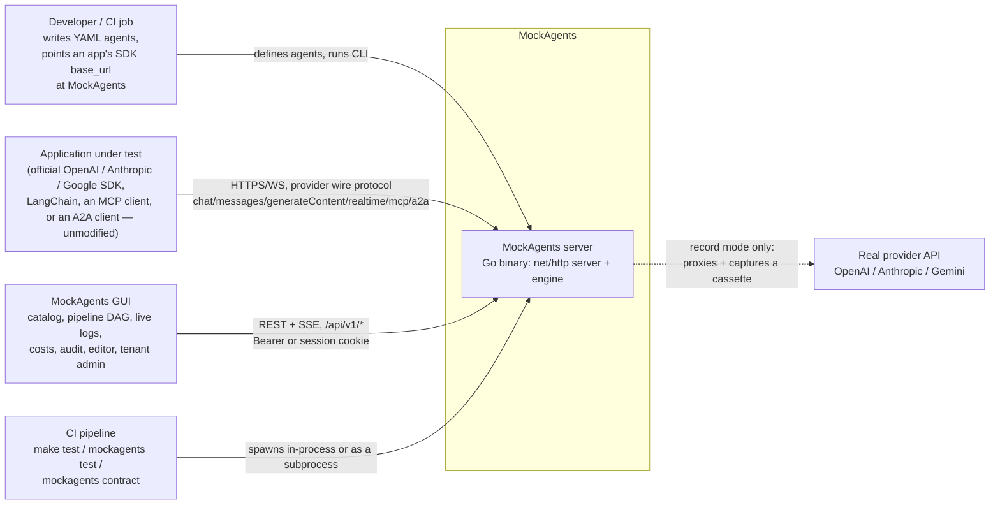
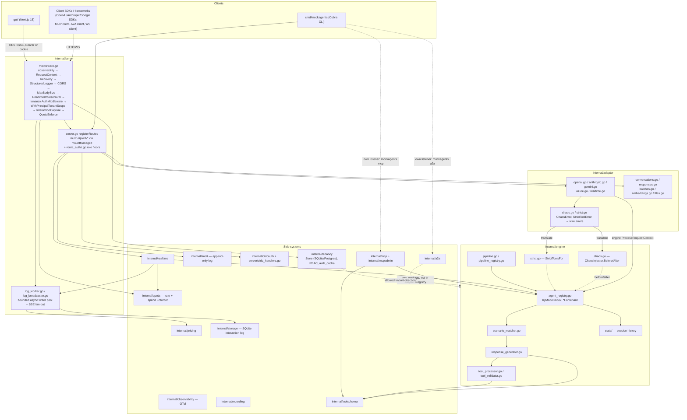
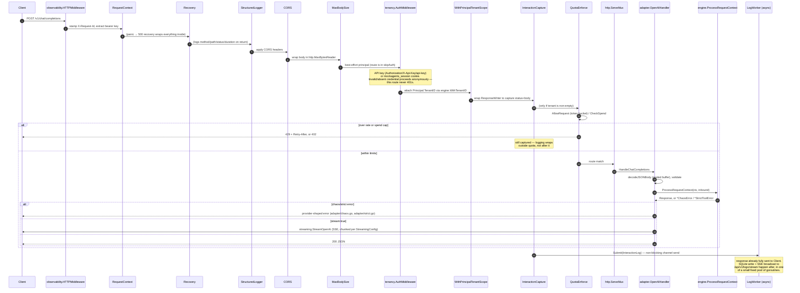
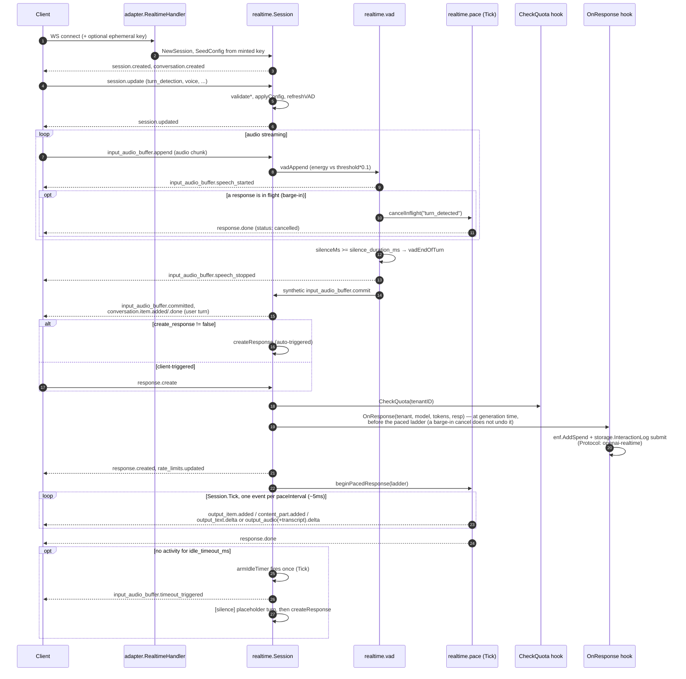
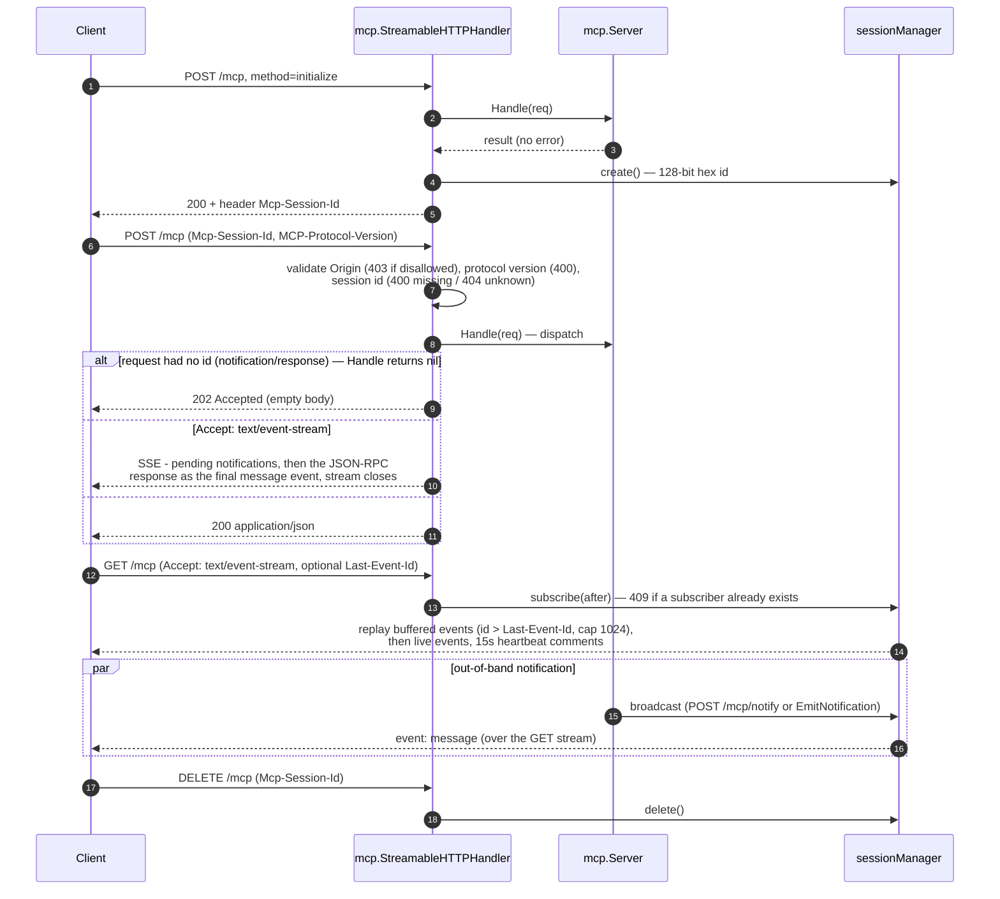
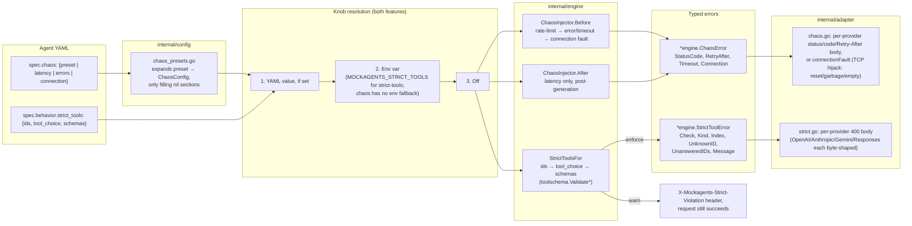
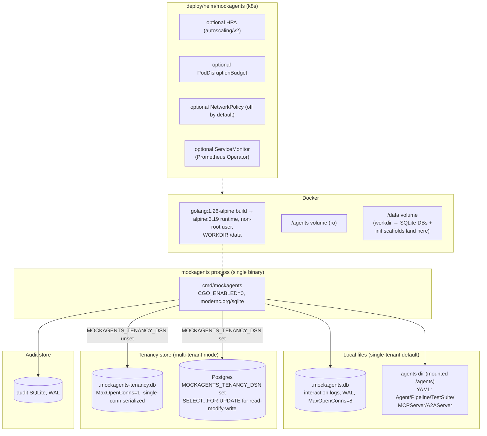

# Architecture

A map of the MockAgents codebase for contributors. For *using* the tool, see
the [README](README.md) and the [docs site](site/docs/index.md).

MockAgents is a Go server that impersonates several LLM-provider wire
protocols — OpenAI Chat Completions, Responses, Conversations, Embeddings,
Moderations, Files, Batches; Anthropic Messages (+ Batches); Gemini
`generateContent`; OpenAI Realtime over WebSocket; MCP (Streamable HTTP +
stdio); and A2A — in front of one protocol-neutral **engine** that matches a
request to a scenario declared in YAML and returns a canned response,
simulated tool call, or SSE stream. No network call ever reaches a real
provider unless you're using record/replay against one on purpose.

This document has two parts: a set of diagrams (System Context → Containers →
two full request sequences → a cross-cutting fault-injection view → a
deployment view), and a narrative that explains the seams between packages.
Every diagram and every claim below was checked against the code (most
recently on `main` @ `aa049a8`, 2026-07-15 — adding record modes/importers/
redaction, hallucination + semantic-error fixtures, vision matching,
Anthropic depth, the MCP loopback-bind default, the vitest/npx packages, and
the `/data` workdir + `MOCKAGENTS_DATA_DIR` state handling); where the
codebase disagreed with an earlier version of this document, that's called
out explicitly instead of silently fixed, in the
[Corrections](#corrections-from-the-previous-version-of-this-document)
section at the end.

## Contents

- [System context](#system-context)
- [Containers and components](#containers-and-components)
- [Packages (`internal/`)](#packages-internal)
- [How a request becomes a response](#how-a-request-becomes-a-response)
- [Request-flow sequence: POST /v1/chat/completions](#request-flow-sequence-post-v1chatcompletions)
- [Realtime: WebSocket session with server VAD](#realtime-websocket-session-with-server-vad)
- [MCP: Streamable HTTP transport](#mcp-streamable-http-transport)
- [Cross-cutting: chaos and strict-tools](#cross-cutting-chaos-and-strict-tools)
- [Data and deployment view](#data-and-deployment-view)
- [Design rules (keep these intact)](#design-rules-keep-these-intact)
- [Adding a provider adapter](#adding-a-provider-adapter)
- [Testing](#testing)
- [Where to look first](#where-to-look-first)
- [Corrections from the previous version of this document](#corrections-from-the-previous-version-of-this-document)

## System context

Replay mode never contacts `realProvider` — a recorded cassette answers
instead.

The point of MockAgents is that `sdkApp` never knows it isn't talking to a
real provider: base URL and API key are the only things that change. The GUI,
CI runner, and record/replay proxy are auxiliary consumers of the same
server.

## Containers and components

**Import-direction constraints** (enforced by convention + code review — a
reverse import would be caught by the compiler as an import cycle, but there
is no linter rule; see [Design rules](#design-rules-keep-these-intact)):

- `tenancy` may import `engine`; `engine` never imports `tenancy`. The engine
  reads/writes the tenant id through `engine.WithTenantID` /
  `engine.TenantIDFromContext` (`internal/engine/reqmeta.go`) so it stays
  agnostic of how a caller authenticated.
- `audit.Recorder` takes a principal-extraction **function**
  (`principalToActor` in `internal/server/server.go`) instead of importing
  `tenancy` directly, for the same reason.
- `engine` never imports a wire-format package — `internal/adapter/*` and
  `internal/streaming/*` are the only packages that know what OpenAI/
  Anthropic/Gemini JSON looks like. `engine.Response` / `engine.InboundRequest`
  are the neutral boundary type.
- `internal/a2a` and `internal/mcp` are **not** registered through
  `adapter.DefaultRegistry` — they mount their own routes directly in
  `cmd/mockagents` (A2A) or `internal/server` (MCP isn't wired into the main
  HTTP server at all; it's its own listener started by `mockagents mcp`).

## Packages (`internal/`)

| Package | Role |
|---|---|
| `adapter/` | Wire-format translators. `openai.go`, `anthropic.go`, `gemini.go`, `azure.go` convert provider JSON ↔ engine types; `conversations.go`/`responses.go`/`responses_stream.go` mock the OpenAI Conversations + Responses APIs (see below); `batches.go`/`anthropic_batches.go` mock async batch endpoints; `embeddings.go`, `moderations.go`, `files.go`, `structured_output.go` cover the smaller surfaces; `realtime.go` bridges a WebSocket connection into `internal/realtime`. `registry.go` is the extension seam (`Adapter` interface + `DefaultRegistry`). `strict.go`/`chaos.go` translate `engine.StrictToolError`/`engine.ChaosError` into each provider's wire error shape. `hallucination.go` stamps `X-Mockagents-Hallucination: <type>` when the matched scenario is a planted-hallucination fixture (the fixture itself is generated in `engine/response_generator.go`). **Vision inputs** are parsed on the OpenAI (`image_url`, incl. `data:` URLs) and Anthropic (base64/url image parts) paths — image presence drives the `has_image` scenario rule and the `X-Mockagents-Image-Count` response header. **Anthropic depth**: `POST /v1/messages/count_tokens` (engine-free), prompt-cache usage accounting (`cache_creation`/`cache_read` driven by `cache_control`), and extended-thinking blocks. `token.go` counts tokens; `decode.go` pools buffers for request decoding. |
| `engine/` | The core, provider-agnostic. `engine.go`'s `ProcessRequestContext` orchestrates: chaos pre-check → strict-tools request validation → scenario match/generate/tool-loop inside a session turn → strict tool_choice forcing → tool processing → chaos post-latency (see [walkthrough](#how-a-request-becomes-a-response)). `agent_registry.go` looks up an agent (by-model index + `*ForTenant` visibility). `scenario_matcher.go` picks a scenario, `response_generator.go` produces content (template expansion via a pooled buffer). `tool_processor.go` handles simulated tool calls; `tool_validator.go` is now a thin alias into `internal/toolschema`. `chaos.go` is the fault-injection seam. `strict.go` is the strict-tools seam (id/tool_choice/schema validation). `pipeline.go`/`pipeline_registry.go` run a `kind: Pipeline` document (sequential/parallel/graph topology over multiple agents) as a distinct concept from a single `Agent`. `reqmeta.go` carries `RequestMeta` + tenant id on the context. Session state lives in `state/` (history slice pre-sized to cap=16). |
| `toolschema/` | JSON-Schema-subset validator (`validator.go`) used to check simulated tool-call arguments against a tool's declared `inputSchema`, plus a stricter OpenAI-structured-outputs-subset checker (`strict_subset.go`) used when an agent opts into `strict: true` function schemas. Consumed by `engine/strict.go`, by the engine's tool path through the `engine/tool_validator.go` alias, and by `internal/mcp` for `tools/call` argument validation. |
| `server/` | `net/http` server, middleware, and route handlers for the LLM + management APIs. `route_authz.go` is the single role-floor table + `mountManaged` chokepoint for every `/api/v1` route — it panics at startup if a route has no floor entry. `log_worker.go`/`log_broadcaster.go` own async logging + SSE fan-out. `quota_middleware.go` enforces per-tenant rate/spend limits. `realtime_wiring.go` wires quota + logging hooks into the Realtime adapter (which never passes through the HTTP middleware chain — see the [Realtime section](#realtime-websocket-session-with-server-vad)). `oidc_handlers.go` serves `/auth/login`, `/auth/callback`, `/auth/logout`. `conformance_test.go` is the cross-adapter integration test suite. |
| `tenancy/` | Multi-tenant store + bcrypt API keys + RBAC middleware. `Store` is an interface with two impls: `SQLiteStore` (default; single connection, so read-modify-write is serialized by SQLite itself) and `PostgresStore` (`postgres_store.go`; uses `SELECT ... FOR UPDATE` inside a transaction for the same read-modify-write operations, e.g. key rotation/role change), selected at startup by `MOCKAGENTS_TENANCY_DSN` (unset = SQLite `.mockagents-tenancy.db`). The store also holds SSO users + sessions (`identity_sqlite.go`/`identity_postgres.go`). `middleware.go`'s `AuthMiddleware` is dual-auth: it resolves an API key (`Authorization`/`X-Api-Key`/Azure `api-key`) OR a session cookie (`mockagents_session`) to the same `Principal{TenantID, KeyID, Role}`; a bearer value prefixed `mas_` is treated as a forwarded session token. `auth_cache.go` is a hash-keyed bounded TTL cache that skips bcrypt on repeat resolutions. RBAC roles are ordered `viewer < editor < admin < platform`; `Role.IsAssignableViaAPI()` excludes `platform`, so a per-tenant admin cannot self-escalate — platform keys are minted only by the bootstrap path in `cmd/mockagents`. |
| `audit/` | Append-only audit log, SQLite-backed with WAL. Twelve event kinds (`internal/audit/types.go`): `tenant.created`, `tenant.deleted`, `api_key.created`, `api_key.deleted`, `api_key.role_changed`, `api_key.rotated`, `agent.reloaded`, `agent.created`, `agent.updated`, `agent.deleted`, `pipeline.saved`, `auth.denied`. `Recorder` takes a principal-extraction function so it never imports `tenancy`. |
| `quota/` | Per-tenant rate + monthly-spend enforcement. `Enforcer.AllowRequest` is a token bucket (429 + `Retry-After` on empty); `CheckSpend` compares accrued spend against a monthly cap (402 on exceed). Spend is accrued through a `spendHook` wired in `server.New` (estimates cost from the response body via `pricing.ExtractUsage`/`Table.Estimate`, then `Enforcer.AddSpend`). The `tenant_spend` ledger is a shared row in the tenancy store (atomic upsert + `RETURNING` in both SQLite and Postgres impls) so the cap is accurate across replicas; the enforcer keeps a 5-second TTL cache of the shared total to avoid a store round trip per request. |
| `oidcauth/` | OIDC relying-party seam for SSO login. `Authenticator` interface (`AuthCodeURL` with PKCE S256, `Exchange` → verified `Claims`) wraps `coreos/go-oidc` so `server/oidc_handlers.go` is unit-testable with a fake provider. Domain → tenant mapping via `MOCKAGENTS_OIDC_DOMAIN_MAP`; JIT-provisioned users get `MOCKAGENTS_OIDC_DEFAULT_ROLE` (validated to viewer/editor/admin — `platform` is rejected here too). |
| `pricing/` | Per-model cost table + usage extractor. `MOCKAGENTS_PRICING` env var loads YAML overrides. Used by `costs_handler.go`, `log_handlers.go`, and the quota spend hook. |
| `mcp/` | JSON-RPC 2.0 dispatch for `kind: MCPServer` documents, with three transports: Streamable HTTP (`streamable.go` — session-scoped, POST dispatch in JSON or SSE mode, one resumable GET stream per session), stdio (`stdio.go` — line-delimited frames, 10 MiB cap, no non-protocol stdout), and a bidirectional server-initiated channel (`bidirectional.go` + `sse.go` — `GET /mcp/events` streams server→client requests/notifications, `POST /mcp/response` delivers client replies, `Server.SendRequest`/`Sample`/`ListRoots` are the in-process primitives; `POST /mcp/sample` and `POST /mcp/roots` are test/admin triggers for these). See the [MCP sequence](#mcp-streamable-http-transport). |
| `mcpadmin/` | A separate concern from `mcp`'s bidirectional/sampling surface: it re-exposes the agent management write API (create/get/put/delete/validate/list agents) as MCP tools registered onto an `*mcp.Server`, so an MCP client (e.g. an LLM coding agent) can manage MockAgents' own agent catalog. Wired in `cmd/mockagents/mcp.go`. |
| `realtime/` | Server-side state machine for the OpenAI Realtime mock: `session.go` (event handling, config validation), `vad.go` (server voice-activity detection — an energy-threshold detector, not a real acoustic model), `pace.go` (deadline-based event pacing + barge-in cancellation + idle-timeout). See the [Realtime sequence](#realtime-websocket-session-with-server-vad). |
| `a2a/` | Mocks the A2A (Agent-to-Agent) protocol for `kind: A2AServer` documents: agent-card discovery, a JSON-RPC surface (`message/send`, `message/stream`, `tasks/get`, `tasks/cancel`), and task lifecycle. `message/stream` is real SSE. Its own package, mounted by `cmd/mockagents a2a`, not part of `adapter.DefaultRegistry`. |
| `recording/` | Cassette format + record/replay handlers, including SSE streams (`Proxy.serveStreaming` / `Replay.serveStreaming`). Grew a full VCR-style feature set: **record modes** (`mode.go` — `none` replay-only default, `new_episodes` record-on-miss, `once`, `all` re-record/passthrough, via `--record-mode`); **configurable request matching** (`matcher.go` — `--match-ignore` drops volatile fields from the match key) with **structured miss diagnostics** (`diagnostics.go` — a replay 404 explains *which* field failed to match instead of a bare miss); **secret redaction before write** (`redact.go` — auth headers/keys masked in the cassette, not post-hoc); **sequenced playback** (repeat requests step through recorded responses in order); and **importers** for foreign formats (`import_vcr.go` vcrpy YAML, `import_openai.go` OpenAI stored-completions JSONL — surfaced as `mockagents import vcr\|openai-stored-completions`). |
| `streaming/` | SSE chunking used when a chat/messages request sets `stream: true`. `pacing.go`'s `streamPacer` supports two modes: a deterministic fixed-seed model (TTFT + tokens-per-sec + jitter) and, when an agent sets `ttft_p50_ms`/`itl_p50_ms`, a per-stream-seeded lognormal "load-target" sampler. Also applies mid-stream fault injection (`truncateAfter`, `malformed`). This is a distinct mechanism from Realtime's `internal/realtime/pace.go`, which is a flat constant-interval drain, not this TTFT/ITL model — wiring the two together is a known, code-documented follow-on, not yet done. |
| `storage/` | SQLite interaction logging (`modernc.org/sqlite`, pure-Go, no cgo). WAL + `synchronous=NORMAL` + `MaxOpenConns=8` for parallel readers/writers (deliberately different from the tenancy store's `MaxOpenConns=1`, which relies on single-connection serialization instead of row locks). Default DB file `.mockagents.db` in the working directory; `MOCKAGENTS_DATA_DIR` relocates it (and the audit + tenancy DBs) to any writable directory — the escape hatch for read-only workdirs, resolved by `dataPath` in `cmd/mockagents/start.go`. An unwritable path degrades to a WARN (with the path and a hint; SQLite misreports `SQLITE_CANTOPEN` as `out of memory (14)`) — never a crash. `MOCKAGENTS_LOG_BODIES`=`full`\|`sanitized`\|`none` controls response-body capture; `MOCKAGENTS_LOG_MAX_ROWS`=N bounds the table via a background pruner. |
| `config/` | YAML/JSON loader + validator. `LoadAllDocuments` (`loader.go`) splits a directory's files by top-level `kind` into five buckets: `Agent` (default when `kind` is empty), `Pipeline`, `TestSuite`, `MCPServer`, `A2AServer`; an unrecognized kind is a load error. `chaos_presets.go` expands a named `chaos.preset` into a `ChaosConfig`, filling only the sections the author left nil (`server-down`, `rate-limited`, `access-denied`, `unauthorized`, `flaky`, `slow`, `connection-reset`). The schema lives at `schema/mockagents-v1-agent.json`. |
| `cli/` | Shared CLI helpers: `scaffold.go` powers `mockagents init` templates, `color.go` handles terminal output. |
| `build/` | Test-only package whose `build_test.go` compiles `./cmd/mockagents` to guard against a broken main package. |
| `observability/` | OpenTelemetry tracer wiring. `IsEnabled()` lets hot-path callers skip span-attribute construction when no exporter is configured. |
| `runner/` | `TestSuite` executor for `mockagents test`, with JUnit XML output (`junit.go`). |
| `contract/` | Contract extraction + diffing for `mockagents contract` — classifies changes as breaking/additive/info. |
| `types/` | Domain types shared across packages (`AgentDefinition`, `PipelineDefinition`, `MCPServerDefinition`, `A2AServerDefinition`, `TestSuiteDefinition`, `ChaosConfig`, etc.). `Metadata.TenantID` is the multi-tenancy ownership marker. Changes here ripple widely. |

Outside `internal/`: `cmd/mockagents/` (Cobra CLI — `start`, `init`,
`validate`, `test`, `add`/`rm`, `logs`, `record`, `replay`,
`import vcr|openai-stored-completions`, `contract`, `mcp`, `a2a`), `gui/`
(Next.js console), `sdk/{python,typescript,go,vitest,npx}/`, `deploy/` (Helm
chart + GitHub/GitLab CI templates + `deploy/actions/` composite GitHub
Actions with source-path builds and an end-to-end self-test workflow,
`.github/workflows/actions-selftest.yml`), `site/` (MkDocs).

The three SDKs (`sdk/python`, `sdk/typescript`, `sdk/go/mockagents`) are plain
HTTP/WS clients with no special coupling to the Go internals, except the Go
SDK's `NewInProcessClient`, which loads agents and boots an `engine.Engine` +
`httptest.Server` inline so Go test suites can skip the subprocess. Two
auxiliary npm packages ride alongside: `@mockagents/vitest` (`sdk/vitest` — a
Vitest test-runner helper that boots/points at a mock per suite) and the
`mockagents` npx launcher (`sdk/npx` — downloads the platform binary so
`npx mockagents start` works with no install).

## How a request becomes a response

This is the real call order inside `engine.Engine.ProcessRequestContext`
(`internal/engine/engine.go`), which every protocol adapter calls after
translating its wire request into an `engine.InboundRequest`:

1. Start a tracing span if `observability.IsEnabled()`.
2. Resolve the agent for the caller's tenant (`engine.TenantIDFromContext` →
   name lookup → model lookup → single-agent fallback for anonymous
   callers). Unresolvable → `ErrAgentNotFound`.
3. Cheap `ctx.Err()` bail-out before doing any real work.
4. **Chaos pre-check** (`ChaosInjector.Before`): rate-limit check, then
   HTTP-error/timeout injection, then a connection-layer fault (TCP reset/
   garbage/early-close), in that order. Any of these can return early with a
   `*ChaosError` — this runs *before* matching so a 429/503 is cheap and
   never pays for scenario matching or generation.
5. Extract the latest user message; an empty-message guard returns
   `ErrEmptyMessage` (tolerant of a turn that's purely a tool result).
6. **Strict-tools request validation** (`StrictToolsFor(agent)`, three
   independent dimensions, each resolved YAML `spec.behavior.strict_tools` >
   env `MOCKAGENTS_STRICT_TOOLS` > off): round-trip tool-call-id validation,
   then `tool_choice` name validation, then per-function strict JSON-schema
   validation (via `internal/toolschema`). In enforce mode, a violation
   returns a `*StrictToolError` immediately; in warn mode it's collected and
   the request proceeds.
7. The session (`state.Store.GetOrCreate`, keyed by a scoped session id) runs
   the turn: scenario match (`scenario_matcher.go`, with a built-in
   `_fallback` scenario if nothing matches) → generate content
   (`response_generator.go`) → tool-loop convergence guard (drops an
   identical tool call re-issued after its result, which is what makes the
   simulated agent loop actually terminate) → `tool_choice: "none"`
   suppression → strict tool_choice forcing (synthesizing/capping tool
   calls) → tool call resolution (`tool_processor.go`, using
   `internal/toolschema` for argument validation).
8. Any collected strict-tools warnings are attached to the response.
9. **Chaos post-latency** (`ChaosInjector.After`): sleeps for the configured
   latency distribution (fixed/uniform/normal, capped at 60s, cancellable via
   `ctx.Done()`) — only *after* all real work, including tool processing, is
   done.

The adapter then translates `engine.Response` (or a `*ChaosError`/
`*StrictToolError`) back to the wire shape, decides JSON vs SSE from
`req.Stream`, and — outside all of that — the server's `InteractionCapture`
middleware asynchronously logs the interaction (see the sequence below).

## Request-flow sequence: POST /v1/chat/completions

Two things worth calling out because they contradict a plausible-sounding
assumption:

- **Management routes are gated differently than LLM routes.** `/api/v1/*`
  routes go through `mountManaged` (`route_authz.go`), which requires a valid
  credential (no `skipAuth` entry) and then a per-route role floor. The LLM
  routes (`/v1/chat/completions`, `/v1/messages`, `/v1/realtime`, etc., the
  exact list is `skipAuth` in `server.go`) are intentionally open even in
  multi-tenant mode — the middleware still resolves a principal if a valid
  credential is present (so tenant-scoped agent resolution and quota still
  work), but it never rejects the request for lacking one, because these
  routes carry the caller's own (ignored) provider API key.
- **Middleware order is auth → tenant-scope → capture → quota**, not
  "auth → quota → logging → capture" — capture wraps *outside* quota
  deliberately, so a request rejected by quota (429/402) is still logged.

## Realtime: WebSocket session with server VAD

Notes verified in code, not assumed from the API docs:

- The VAD is a **synchronous energy-threshold detector**
  (`internal/realtime/vad.go`), not a real acoustic model: `speech := energy
  > 0 && energy >= threshold * 0.1`. Defaults are `threshold 0.5`,
  `prefix_padding_ms 300`, `silence_duration_ms 500`,
  `create_response`/`interrupt_response true`. `semantic_vad`'s `eagerness`
  is approximated by mapping to a fixed silence window (high=2000ms,
  low=8000ms, auto/medium=4000ms) — there is no semantic model behind it.
- **Barge-in** and **client-initiated cancel** both funnel through the same
  `cancelInflight`, with a different reason string (`"turn_detected"` vs
  `"client_cancelled"`) that changes what happens to a queued
  auto-response.
- **Pacing here is a flat constant-interval queue drain**
  (`realtime/pace.go`, `NextDeadline`/`Tick`), *not* the TTFT/ITL lognormal
  model in `internal/streaming/pacing.go`. The code comment in `pace.go`
  itself flags wiring the two together as a follow-on — treat that as an
  open architectural gap, not a hidden feature.
- **Ephemeral keys are cosmetic.** `POST /v1/realtime/client_secrets` (GA)
  and `/v1/realtime/sessions` (legacy) mint an `ek_...` key and validate the
  session payload shape, but the WebSocket itself never actually requires a
  valid key to connect — any client can open the socket. This matches
  MockAgents' general philosophy (simulate the wire shape, don't gate the
  mock behind real security), but it's worth knowing if you're testing
  auth-failure handling in a client.
- Quota and logging integrate through **hooks on the adapter**
  (`RealtimeHandler.CheckQuota`/`OnResponse`, wired in
  `server/realtime_wiring.go`), not through the HTTP middleware chain — a
  long-lived WebSocket never passes back through `InteractionCapture` or
  `QuotaEnforce` per-message the way a normal request does.

## MCP: Streamable HTTP transport

Bidirectional (server → client) requests are a **separate mechanism** from
the notification stream above: `mcp.Server.SendRequest`/`Sample`/`ListRoots`
(`internal/mcp/bidirectional.go`) mint a numeric id, enqueue an outbound
message to the session's single SSE subscriber via `GET /mcp/events`
(`sse.go`), and block until `POST /mcp/response` delivers a matching reply or
the request times out. `POST /mcp/sample` and `POST /mcp/roots` are
test/admin triggers for this same mechanism (`X-MCP-Timeout-Ms`, default 5s)
— **they are unrelated to the `internal/mcpadmin` package**, which instead
exposes MockAgents' own agent-management CRUD as MCP tools. stdio
(`internal/mcp/stdio.go`) is line-delimited JSON-RPC over stdin/stdout with a
10 MiB frame cap; by construction it writes nothing but JSON-RPC
response/notification frames to stdout.

JSON-RPC error codes in use: `-32700` (parse error — malformed body or
oversized stdio frame), `-32600` (invalid request — wrong `jsonrpc` version,
or a batch array, which the 2025-06-18 spec revision removed), `-32601`
(method not found — includes `sampling/createMessage`/`roots/list` sent
*to* the mock, since those are server-initiated only), `-32602` (invalid
params — bad shape, unknown tool name, unknown pagination cursor, missing
required prompt argument), `-32603` (internal error from a registered tool
handler), and the MCP-specific `-32002` (resource not found).

Operational notes: `mockagents mcp` (HTTP) **binds `127.0.0.1` by default**
per the MCP spec's DNS-rebinding guidance — pass `--bind 0.0.0.0` to expose
it (required inside a container whose port is mapped out). The `initialize`
handshake echoes a supported requested `protocolVersion` rather than always
answering the newest revision, so older clients negotiate cleanly. An MCP
conformance suite runs in CI (`.github/workflows/mcp-conformance.yml`, with
a README badge), and `tools/call` arguments are validated against each
tool's `inputSchema` by default — violations return an `isError: true`
execution result with path-qualified feedback, not a `-32602`.

## Cross-cutting: chaos and strict-tools

Chaos presets (`server-down`, `rate-limited`, `access-denied`,
`unauthorized`, `flaky`, `slow`, `connection-reset`) only fill `ChaosConfig`
fields the author left `nil`, so an explicit override in the YAML always
wins over the preset's defaults. `flaky` is the interesting one: it uses
`FailFirst: N` to fail deterministically for the first N requests to a given
agent and then recover — useful for testing retry logic without randomness.
Strict-tools has three independently-togglable dimensions (round-trip tool
IDs, `tool_choice` enforcement, and per-function JSON-schema strictness);
each can be forced to `off` in YAML even when the top-level knob is on.

### Failure fixtures: hallucination + semantic error modes

Distinct from chaos (transport/HTTP-level faults), two fixture families plant
**well-formed but wrong** responses — the failures a real client mishandles
*after* a 200:

- **Hallucination fixtures** — a scenario response can declare a
  hallucination type (fabricated fact/citation, ungrounded, bad tool result);
  the content is generated deterministically in
  `engine/response_generator.go` and every adapter advertises it via the
  `X-Mockagents-Hallucination: <type>` header (`adapter/hallucination.go`), so
  a test can assert its guardrails caught something a real model won't
  produce on demand.
- **Semantic error modes** (`examples/semantic-errors-agent.yaml`) — cookbook
  scenarios for `finish_reason: length` truncation, assistant refusals
  (OpenAI `message.refusal`), and tool calls with deliberately malformed JSON
  `arguments` — exercising parsers and fallbacks, not HTTP retry paths.

## Data and deployment view

Single-tenant mode (the default) needs no external services: agent YAML is
read from disk, interaction logs go to `.mockagents.db`. Multi-tenant mode
(`MOCKAGENTS_MULTI_TENANT=1`) adds the tenancy store — SQLite by default, or
Postgres when `MOCKAGENTS_TENANCY_DSN` is set — plus, optionally, an audit
store and a quota enforcer backed by the same tenancy store's `tenant_spend`
table. Nothing here requires cgo; the Dockerfile's `CGO_ENABLED=0` build and
the pure-Go SQLite driver are what make the Alpine multi-stage image and
cross-compilation in `goreleaser` simple.

All three SQLite files resolve relative to the working directory —
`WORKDIR /data` in the runtime image places them (and `mockagents init`
scaffolds) inside the `/data` volume, so state survives container restarts.
`MOCKAGENTS_DATA_DIR=<dir>` relocates them anywhere writable; if the
resolved path is unwritable the server degrades to WARN-and-continue (no
interaction/audit logging) rather than failing startup.

## Design rules (keep these intact)

- **No cgo.** SQLite is `modernc.org/sqlite` so cross-compilation and
  goreleaser stay simple. (Side effect: `go test -race` is unavailable on
  all platforms.)
- **Import direction.** `tenancy` may import `engine`, never the reverse. The
  engine reads the tenant id from the context (`engine.WithTenantID` /
  `TenantIDFromContext`) instead of importing `tenancy`. The `audit` recorder
  receives a principal-extraction *function* from the server for the same
  reason. This keeps the engine cycle-free and provider/tenant-agnostic.
- **One authorization chokepoint.** Every `/api/v1` management route goes
  through `server.mountManaged`, which applies the floor from
  `managementRouteFloors` (`route_authz.go`) and **panics on a route with no
  entry** — an ungated route can't slip in. The table is snapshot-tested
  (`route_authz_test.go`); changing a floor must be mirrored in
  [`docs/guides/multi-tenant.md`](docs/guides/multi-tenant.md).
- **The LLM/engine surface is intentionally open**, even in multi-tenant
  mode (`skipAuth` in `server.go`) — see the [request-flow notes](#request-flow-sequence-post-v1chatcompletions).
  Don't assume adding a route here means adding it to `managementRouteFloors`
  too; those are two different gates for two different kinds of route.
- **The agent YAML schema is authoritative** in
  `schema/mockagents-v1-agent.json`. Run `make validate` after touching
  config/types.
- **Hot path is benchmarked.** `docs/benchmarks/latest.{json,md}` is checked
  in; rerun `make bench-report` for perf-affecting changes and don't regress
  it.

## Adding a provider adapter

The adapter registry makes this self-contained — no edits to the server's
route wiring. To add provider `foo` (see `gemini.go` as the template):

1. **`internal/adapter/foo.go`** — implement the `Adapter` interface
   (`Name() string`, `Routes() []Route`) and a handler that decodes the wire
   request → `engine.InboundRequest`, calls `Engine.ProcessRequestContext`,
   and formats `engine.Response` back to the wire shape (incl. tool calls +
   errors). Stamp `meta.Protocol` early.
2. **`internal/streaming/foo.go`** — a `StreamFoo` function for the SSE path.
3. **Register** the handler in `adapter.DefaultRegistry` (`registry.go`).
4. **Schema + validator** — add the protocol string to the `protocol` enum in
   `schema/mockagents-v1-agent.json` and to `validProtocols` in
   `internal/config/validator.go`.
5. **Example + test** — add `examples/foo-agent.yaml` and
   `internal/adapter/foo_test.go`; update the `registry_test.go` order/route
   assertions. Run `make validate` + `go test ./internal/adapter/...`.

## Testing

- `make test`. Note: `go test -race` needs cgo, which this project
  deliberately does not use (pure-Go SQLite), so the race detector is
  unavailable on **all** platforms — see Design rules above.
- Cross-adapter integration: `internal/server/conformance_test.go`.
- Scenario-match semantics: `internal/engine/scenario_matcher_test.go`.
- Store conformance runs against Postgres when `MOCKAGENTS_TEST_PG_DSN` is
  set.
- SDKs: `make test-python` / `make test-typescript`.

## Where to look first

- A new wire field isn't returned → the relevant `adapter/*.go`.
- A scenario matches the wrong response → `engine/scenario_matcher.go` +
  tests.
- A `{{ template }}` expression → `engine/response_generator.go`.
- A 401/403 on a management route → `server/route_authz.go`.
- A 401/403 that shouldn't have happened on an LLM route → check `skipAuth`
  in `server.go` first; that route may be intentionally open.
- Strict-tools rejecting or warning unexpectedly → `engine/strict.go` +
  `internal/toolschema`.
- A chaos-configured agent not faulting/faulting too much →
  `engine/chaos.go` + `config/chaos_presets.go`.
- A Realtime session not committing a turn or not pacing right →
  `internal/realtime/vad.go` / `pace.go`.
- An MCP client stuck on session negotiation → `internal/mcp/streamable.go`.
- A replay 404 you didn't expect → `internal/recording/diagnostics.go` (the
  miss explains which field failed the match) + `matcher.go` (`--match-ignore`).
- A cassette captured a secret → `internal/recording/redact.go` (redaction is
  applied at write time).
- Logging silently off / DBs in the wrong place → `dataPath` in
  `cmd/mockagents/start.go` (`MOCKAGENTS_DATA_DIR`) and `WORKDIR /data` in the
  Dockerfile.
- A hallucination fixture missing its header → `adapter/hallucination.go`;
  wrong fixture content → `engine/response_generator.go`.
- A new CLI command → `cmd/mockagents/`.

## Corrections from the previous version of this document

The previous `ARCHITECTURE.md` was accurate about the core request flow but
had drifted in a few places as the codebase grew. Corrected here:

- **`X-Mockagents-Tenant` header is not honored anywhere in the request
  path.** It was documented (here and in a code comment in
  `internal/engine/reqmeta.go`) as an opt-in way for a caller to select a
  tenant, but no adapter or middleware reads it — tenant scope comes
  exclusively from the authenticated `Principal` set by
  `tenancy.AuthMiddleware`. This is confirmed by an explicit regression test,
  `TestServer_TenantHeaderCannotSelectTenantAgent`
  (`internal/server/server_test.go`), which asserts the header has no
  effect. Treat any mention of this header elsewhere as describing intent,
  not current behavior.
- **The audit log has twelve event kinds, not nine.** `agent.created`,
  `agent.updated`, and `agent.deleted` (added alongside the agent write API)
  were missing from the previous count.
- **`internal/mcpadmin` was undocumented entirely.** It's not a wrapper
  around MCP's bidirectional/sampling surface (a reasonable guess from the
  name) — it's a separate package that exposes MockAgents' own agent CRUD as
  MCP tools.
- **The OpenAI Conversations and Responses APIs were undocumented.** They
  live in `internal/adapter/conversations.go` and
  `internal/adapter/responses.go`/`responses_stream.go`, share the in-memory
  (not SQLite-backed) per-tenant conversation store — and Responses
  additionally keeps its own response-id store (keyed by response id only)
  for `previous_response_id` chaining. Both are distinct from the stateless
  Chat Completions path.
- **Realtime's response pacing is not the same mechanism as
  `streaming/pacing.go`'s TTFT/ITL model** — it's a flat constant interval,
  and the code itself flags unifying the two as an open follow-on, not a
  hidden feature already wired up.
- **Chaos presets number seven, not six** (`connection-reset` in addition to
  `server-down`, `rate-limited`, `access-denied`, `unauthorized`, `flaky`,
  `slow`).
