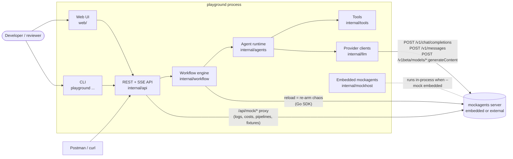
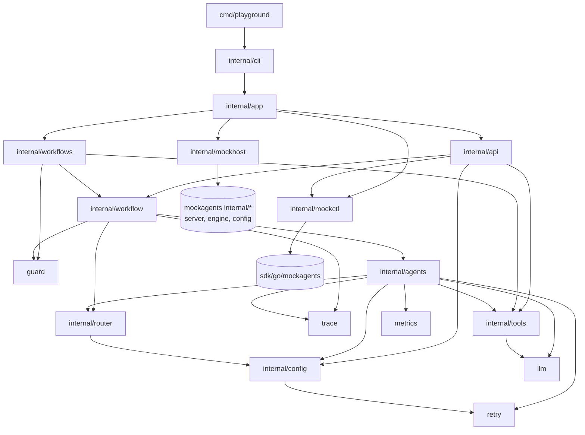
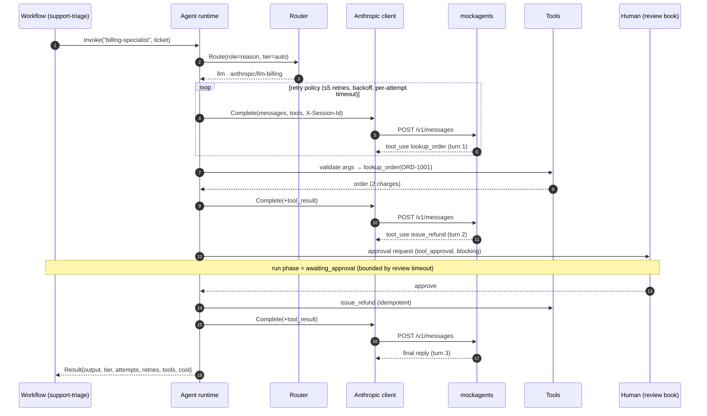

# Architecture

The Agent Playground is one Go binary with three faces: an HTTP API, a web UI and a CLI. Its model
traffic goes to **mockagents** over the real provider wire formats. The design rule: **nothing above
`internal/llm` knows it is talking to a mock.** Change the base URL and keys and the same code calls
OpenAI, Anthropic and Google.

- [System context](#system-context)
- [Package layers](#package-layers)
- [Run lifecycle (state machine)](#run-lifecycle)
- [One agent call, end to end](#one-agent-call)
- [Human review](#human-review)
- [The no-stuck guarantee](#the-no-stuck-guarantee)
- [Observability](#observability)
- [How the mock fits in](#how-the-mock-fits-in)
- [Design decisions](#design-decisions)

## System context



ASCII version:

```
 Browser UI ─┐                       ┌─────────────── playground ───────────────┐
 CLI ────────┼─► REST/SSE API ─► Workflow engine ─► Agent runtime ─► LLM clients ─┼─► mockagents
 Postman ────┘   (internal/api)   (runs, steps,      (route, retry,   (OpenAI,     │   /v1/chat/completions
                                   reviews, watchdog)  fallback, tools) Anthropic,  │   /v1/messages
                                                                        Gemini)     │   /v1beta/...:generateContent
                 /api/mock/* proxy ─────────────────────────────────────────────────┼─► /api/v1/logs, costs,
                                                                                    │   pipelines, agents
                                                       └────────────────────────────┘
```

## Package layers

Imports only point downward. Nothing in `llm`, `retry`, `tools`, `guard`, `trace` or `router` knows
about workflows or HTTP.



| Package | Responsibility |
|---|---|
| `llm` | Wire-format clients for OpenAI Chat Completions, Anthropic Messages and Gemini generateContent (standard library only). SSE parsing with stream-integrity checks. Typed errors (`APIError`, `TransportError`, `StreamError`) and `Classify` (retryable? why? Retry-After?). |
| `retry` | `Policy` (0-5 retries, backoff, multiplier, jitter) with validation. `Do` honours Retry-After, cancellation and the deadline budget. |
| `router` | Picks the tier (SLM/LLM) and model for a call; `Escalate` for SLM → LLM. |
| `tools` | Tool interface, registry, JSON-schema argument validation, four tools. |
| `guard` | Deterministic grounding check, tolerant JSON extraction, prompt-line sanitizing. |
| `trace` | Context-propagated span tree per run. |
| `agents` | The agent runtime: one `Invoke` = route → retry → fallback chain → tool loop → continuation → cost. |
| `workflow` | Engine: run store, steps, review book, watchdog, cancellation, persistence, the `Exec` helper API. |
| `workflows` | The four workflow programs plus single-agent invoke. |
| `config` | Config model, validation (field-level errors), atomic versioned live store. |
| `api` | HTTP handlers, SSE, OpenAPI serving, mock proxy, UI. |
| `mockhost` / `mockctl` | Embedded mockagents server; management-API client (Go SDK). |
| `app` / `cli` | Wiring and lifecycle; CLI and `verify`. |

## Run lifecycle

Every workflow execution, including a single `POST /api/agents/{name}/invoke`, is a **run**. A run has
exactly three statuses. `phase` is informational and says what an in-progress run is doing.

```mermaid
stateDiagram-v2
    [*] --> in_progress: POST /api/workflows/{name}/runs<br/>(input + options validated first; 400 on error)
    state in_progress {
        [*] --> starting
        starting --> running
        running --> awaiting_review: blocking output gate
        awaiting_review --> running: approve / revise
        running --> awaiting_approval: side-effecting tool
        awaiting_approval --> running: approve / reject
    }
    in_progress --> completed: workflow returns output
    in_progress --> failed: error · reject · review timeout ·<br/>deadline · watchdog · cancel · panic ·<br/>shutdown · restart (interrupted)
    completed --> [*]
    failed --> [*]
```



Failed runs carry a machine-readable `error.code`: `agent_failed`, `guard_failed`, `review_rejected`,
`review_timeout`, `deadline_exceeded`, `watchdog_stalled`, `cancelled`, `panic`, `interrupted`,
`step_failed`, `drill_failed` or `shutdown`, plus the `step` where it happened.

## One agent call

`agents.Runtime.Invoke` is where most patterns live. Example: the billing specialist resolving a
duplicate charge, with a human approving the refund.



Inside `complete()` the runtime walks the agent's **fallback chain** (`primary → fallback[0] → …`).
Each model gets its own retry loop. A broken SSE stream downgrades the next attempt to non-streaming.
A `finish_reason: length` answer triggers a continuation request. Malformed tool arguments are never
executed; the model gets a structured error and can correct itself.

## Human review

Three review kinds share one store (`workflow.ReviewBook`):

| Kind | Blocking | Created for | Actions |
|---|---|---|---|
| `output_audit` | no | **every** AI output (`Exec.Invoke`) | approve, flag (any time, even after the run) |
| `output_gate` | yes | a workflow's final output (`Exec.ReviewLoop`) | approve, reject, revise (while revisions remain) |
| `tool_approval` | yes | a side-effecting tool call (`issue_refund`) | approve, reject |

Blocking waits are bounded by `review.timeout_ms` (always shorter than the run timeout, enforced by
validation) and by the run deadline. `on_timeout: fail` ends the run with `review_timeout`;
`on_timeout: approve` approves by policy. An unanswered tool approval declines the tool (fail safe)
and lets the agent finish its reply. `review_mode: auto` approves every gate by policy and records it
as `auto_approved`, which is how CI and `verify` run.

## The no-stuck guarantee

| Mechanism | Bounds | Code |
|---|---|---|
| Run deadline (`run_timeout_ms`) | the whole run | `context.WithDeadline` in `Engine.Start` |
| Per-attempt timeout | one HTTP attempt | `llm.WithAttemptTimeout` |
| Retry cap (≤5) + deadline budget | retries never sleep past the deadline | `retry.Do` (`ErrBudgetExceeded`) |
| `max_tool_turns` | agent tool loops | `agents.invoke` (`ErrToolLoop`) |
| Tool timeout (10 s) | one tool | `agents.runTool` |
| Review timeout + policy | human waits | `Exec.waitDecision` |
| Panic recovery | bugs in workflow code | `Engine.execute` |
| Watchdog | deadline + grace; no heartbeat for `watchdog_stall_ms` while not waiting on a human | `Engine.CheckStale` |
| First-writer-wins finish | races between workflow, cancel and watchdog | `Store.finish` |
| Finish side effects | cancels the context, closes open spans, expires pending gates | `Engine.finish` |
| Shutdown | in-flight runs → `failed/shutdown` | `Engine.Shutdown` |
| Restart recovery | persisted `in_progress` → `failed/interrupted` | `Store.loadState` |

Dedicated tests cover the deadline, watchdog (stall, deadline, human-wait exemption), review timeout,
cancel, panic, first-writer-wins, shutdown and restart-recovery rows (`internal/workflow/engine_test.go`,
`internal/workflows/workflows_test.go`), plus the retry cap, budget and cancellation rows
(`internal/retry/retry_test.go`). The tool-loop cap and the tool timeout are enforced in code but
have no dedicated test.

## Observability

- **Trace.** Each run has a span tree (`workflow → step → agent → route | llm → attempt | tool | guard |
  review`) with attributes: tier, model, HTTP status, error class, Retry-After, finish reason, tool
  outcome, reviewer and cost. Read it at `GET /api/runs/{id}/trace`, in the UI waterfall, or with
  `playground trace <id>`. Span kinds map one-to-one onto OpenTelemetry spans if you want to export them.
- **Live events.** `GET /api/runs/{id}/events` (SSE run snapshots) and streaming invoke (agent events:
  `route`, `delta`, `retry`, `fallback`, `reset`, `tool_call`, `continuation`, review events, `done`).
- **Metrics.** `GET /metrics` (Prometheus text): runs started/finished by status and code, LLM calls by
  tier, attempts, retries by reason, fallbacks, escalations, tool executions, review decisions,
  watchdog kills, guard violations, tokens and cost.
- **Logs.** Structured `slog` (`--log-level debug` adds per-request logs).
- **The mock's view.** Every `X-Session-Id` starts with the run id, so `GET /api/mock/logs?session_prefix=<run_id>`
  returns that run's exact mockagents traffic: which scenario matched each request, plus token counts
  and cost (priced by `config/mock-pricing.yaml`).

## How the mock fits in

| mockagents feature | Used for |
|---|---|
| Scenario matching (`content_regex` with named captures, `content_contains`, `turn_number`) | Topic-, ticket- and question-keyed answers; multi-turn tool loops via a stable `X-Session-Id` |
| Tool calls, `raw_arguments` | Researcher / specialist tool loops; malformed-argument drill |
| `finish_reason: length`, `hallucination:` metadata | Continuation drill; planted hallucination (`X-Mockagents-Hallucination`) |
| Chaos: `fail_first`, presets (`rate-limited`, `server-down`), latency, `connection.mode: reset` | Resilience drill |
| Streaming physics (`ttft_ms`, `tokens_per_sec`), `truncate_after_chunks` | Chat streaming; broken-stream drill |
| Three protocols (OpenAI, Anthropic, Gemini) | Provider-diverse agents, cross-model arbitration |
| Management API: reload, agents, logs, costs, pipelines, write API, validate | Re-arming faults; the Mock tab; per-run correlation |
| `kind: Pipeline` / `kind: TestSuite` | Native pipeline comparison; fixture contract tests |
| Pricing overrides (`MOCKAGENTS_PRICING`) | Cost rollup per model alias |

**Model names select fixtures.** mockagents routes a request to the agent whose `model` matches. That
is why each playground agent has its own model alias (`slm-summarizer`, `llm-arbiter`, …) rather than
all LLM-tier agents sharing `gpt-4o`. Against real providers you would set the aliases to real model
ids and keep the same routing code.

## Design decisions

- **A Go app inside the mockagents module.** No new dependencies (the standard library plus modules
  already in `go.mod`). The mock can be embedded in-process for a one-command start, and the tests run
  in the repo's CI. Only `internal/mockhost` and one fixture test import mockagents internals; the
  application logic talks HTTP.
- **Workflows as Go programs, not a DSL.** Each workflow reads top to bottom. Cross-cutting concerns
  (steps, audit, review, stats, tracing, overrides) live in `workflow.Exec`, so the programs stay short.
- **Status vs phase.** A three-value status keeps the state machine trivially safe. `phase` carries
  the detail UIs need ("waiting for you").
- **Fail closed.** An unparseable verifier verdict is not a pass. An unanswered tool approval declines
  the tool. With no approver configured, side-effecting tools are declined. Unknown config fields and
  request fields are rejected.
- **The guard runs before the judge.** Deterministic checks are cheap and cannot hallucinate. The LLM
  judge gets their findings as input instead of reasoning from scratch.
