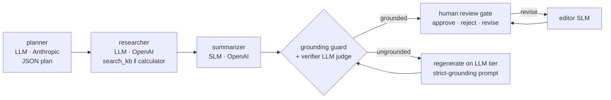
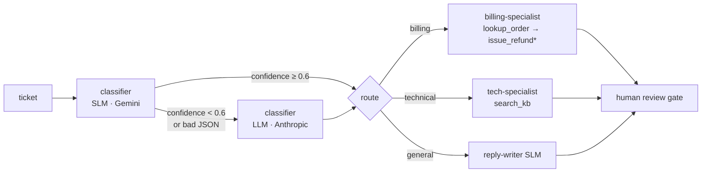
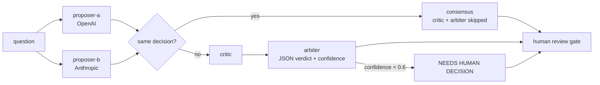

# Workflows

Four workflows plus a utility (`agent`, single-agent invoke). Each is a Go program in
[`internal/workflows`](../internal/workflows) written against `workflow.Exec`. `GET /api/workflows`
returns each workflow's input JSON Schema and runnable examples. The outputs quoted below are real
outputs against the bundled fixtures.

- [research-brief](#research-brief): orchestrator-worker, tools, SLM summary, hallucination guard
- [support-triage](#support-triage): router, SLM-first escalation, approval-gated tool
- [decision-review](#decision-review): multi-agent arbitration
- [resilience-drill](#resilience-drill): fault injection and recovery
- [Common options](#common-options)

## research-brief



**Input:** `topic` (required, ≤120 chars), `audience`, `simulate_hallucination` (boolean).
**Examples:** `retry-strategies`, `slm-routing`, `catch-a-hallucination`.

| Step | What happens |
|---|---|
| plan | The planner returns a JSON plan. If it isn't usable JSON, the step notes it and uses a default plan (graceful degradation). |
| research | The researcher's turn 1 calls `search_kb` and `calculator` **in parallel**. The runtime validates the arguments, runs the tools concurrently and returns the results. Turn 2 returns findings with `[KB-nnn]` citations. Tool outputs become the **evidence**. |
| summarize | Routed to the **SLM tier** (role `summarize`). With `simulate_hallucination`, the prompt carries a fault toggle and the mockagents fixture returns a planted fabrication, flagged by the `X-Mockagents-Hallucination` response header (recorded as a note; the guard never reads it). |
| grounding guard | Deterministic: every figure and every citation in the summary must appear in the evidence, and at least one citation is required. |
| verify (LLM judge) | The verifier gets the guard's flags (`Guard flags: none` or `unsupported figures …`) and returns a JSON verdict. An unparseable verdict fails closed. |
| regenerate | If the guard or the judge rejects the summary, it is regenerated with a strict-grounding prompt, **escalated to the LLM tier** (`router.escalate_on_guard_failure`), and checked again. This happens at most `workflows.max_grounding_regenerations` times; after that the run fails with `guard_failed`. |
| human review | A blocking gate on the summary. Revise sends it to the editor and back to the gate (up to `max_revisions`). |

Real outcome with `simulate_hallucination: true`:

```
summarize            [slm openai/slm-summarizer]
  - mock fixture metadata: X-Mockagents-Hallucination=fabricated_fact (ground truth for testing; the guard does not read it)
grounding guard
  - violation: unsupported figures 97, 100, 2024; citations KB-999
verify (LLM judge)   -> {"verdict": "ungrounded", "confidence": 0.91, ...}
regenerate summary #1 (strict grounding)   [llm anthropic/llm-summarizer] escalated
grounding guard      -> grounded
verify (LLM judge)   -> {"verdict": "grounded", "confidence": 0.93}
```

Final summary: *"Retry transient failures (429, 503, connection resets) with exponential backoff that
starts at 200 ms and reaches 3200 ms by the fifth retry; cap retries at 5, apply 20% jitter, honour
Retry-After, and fall back to a backup model once retries run out [KB-101][KB-102]."*

## support-triage



\* `issue_refund` is side-effecting: the run enters `awaiting_approval` until a human decides.

**Input:** `ticket` (required, ≤2000 chars), `customer`.
**Examples:** `duplicate-charge`, `app-crash`, `ambiguous`, `general`.

| Path | Outcome |
|---|---|
| duplicate-charge | SLM: billing 0.94 → billing specialist → `lookup_order` → **approval** → `issue_refund` (idempotent per order) → reply *"…I have refunded 49.99 USD…"* |
| declined refund | The tool returns `declined`, and the runtime adds a user turn ("The issue_refund action was declined by a human reviewer…") so the model writes a different reply: *"…a billing specialist will review the refund with you personally…"* |
| ambiguous | SLM: billing **0.48** < 0.6 → **escalated** → LLM: technical 0.86 ("The crash blocks the customer…") → tech specialist |
| general | SLM: general 0.72 → SLM reply writer. **Zero LLM-tier calls.** |

## decision-review



**Input:** `question` (required, ≤300 chars), `context`.
**Examples:** `consensus`, `arbitrated`, `needs-human`.

| Question | Proposals | Result |
|---|---|---|
| "Which database … for storage?" | A: adopt-sqlite 0.82 · B: adopt-sqlite 0.79 | **consensus**, confidence 0.805. Critic and arbiter are recorded as *skipped*, saving two LLM calls. |
| "Should we rewrite the legacy billing module…?" | A: proceed 0.71 · B: defer 0.77 | critic → arbiter: **defer**, chosen B, confidence 0.78 |
| "Should we launch the new pricing page on Monday?" | A: ship-now 0.58 · B: delay 0.61 | arbiter: **staged-rollout**, confidence 0.48 → gate titled **[NEEDS HUMAN DECISION]** |

Why this reduces hallucination risk: two independent models on different providers must agree, or
their disagreement is made explicit, critiqued and judged. A low-confidence verdict is never
auto-trusted.

## resilience-drill

Each case invokes one fault-injection agent and checks the observed recovery against the expected one.
The run completes only if every case behaved as designed (`drill_failed` otherwise). Stateful faults
(`fail_first` counters) are **re-armed** at the start by reloading those fixtures through the mockagents
management API, so the drill is repeatable.

| Case | Injected by mockagents | Expected recovery | Real observation |
|---|---|---|---|
| flaky | `errors.fail_first: 2`, 503 | retry with backoff, no fallback | recovered after 2 retries |
| rate-limited | `chaos.preset: rate-limited` (429 + Retry-After) | honour Retry-After, exhaust, fall back | 2 retries honouring Retry-After, then fallback to `slm-backup` |
| timeout | 2.5 s latency vs 800 ms attempt timeout | attempt timeout, then fallback | 2 attempts timed out, fallback to `slm-backup` |
| connection-reset | `connection: {mode: reset, fail_first: 1}` | transport error is retryable | recovered after 1 retry |
| truncated | `finish_reason: length` | continuation request | 1 continuation, final `finish_reason=stop` |
| bad-tool-args | `raw_arguments: '{"order_id": "ORD-1001"'` | reject without executing, model self-corrects | tool outcomes: invalid_arguments → ok |
| stream-cut | `streaming.truncate_after_chunks: 3` | detect the missing finish frame, retry without streaming | stream downgrade after 2 attempts |
| outage | `chaos.preset: server-down` (no fallback) | fail cleanly after max_retries; the drill continues | failed cleanly after 3 attempts (http_503) |

**Input:** `cases` (subset), `fail_hard` (boolean: let the outage fail the whole run).
With `{"cases":["outage"],"fail_hard":true}` the run ends `failed` / `agent_failed`. That is the
terminal failure state, reached deterministically.

## Common options

Every launch (`POST /api/workflows/{name}/runs`) accepts `options`:

| Option | Effect |
|---|---|
| `review_mode` | `manual` (default from config) or `auto` (gates approved by policy, recorded as `auto_approved`) |
| `review_timeout_ms` | Override the human-wait bound for this run |
| `run_timeout_ms` | Override the run deadline |
| `retry` | A retry policy applied to every agent in this run (max_retries 0-5, validated) |
| `tiers` | Pin agents to a tier for this run, e.g. `{"summarizer":"llm"}` |
| `stream` | Ask streaming-capable agents to stream (deltas are forwarded to SSE clients) |

## Adding a workflow

See [ONBOARDING.md](ONBOARDING.md#add-a-workflow).
