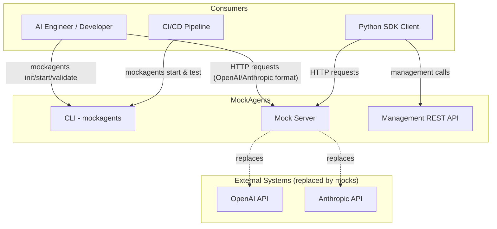
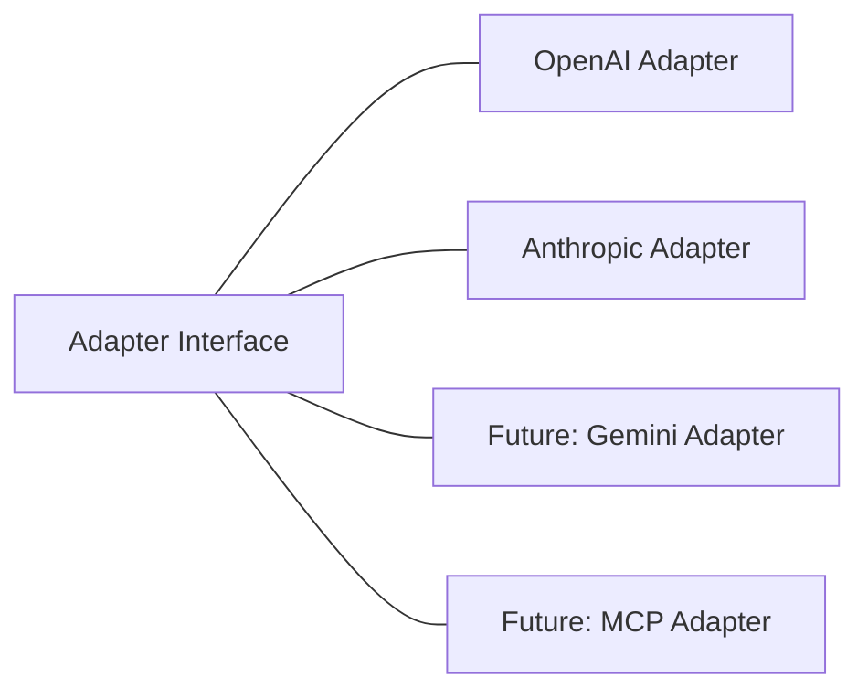
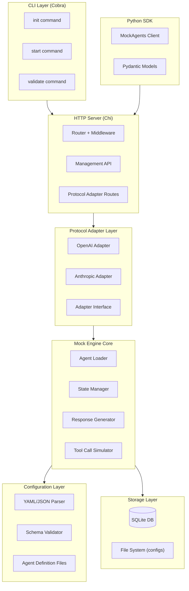
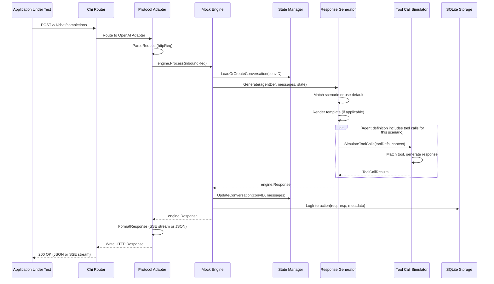
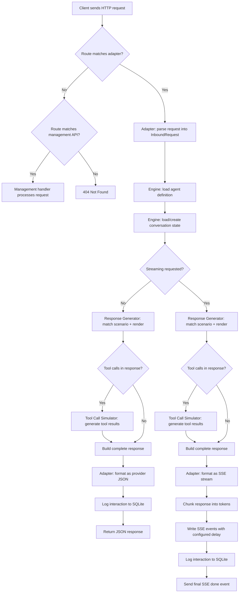
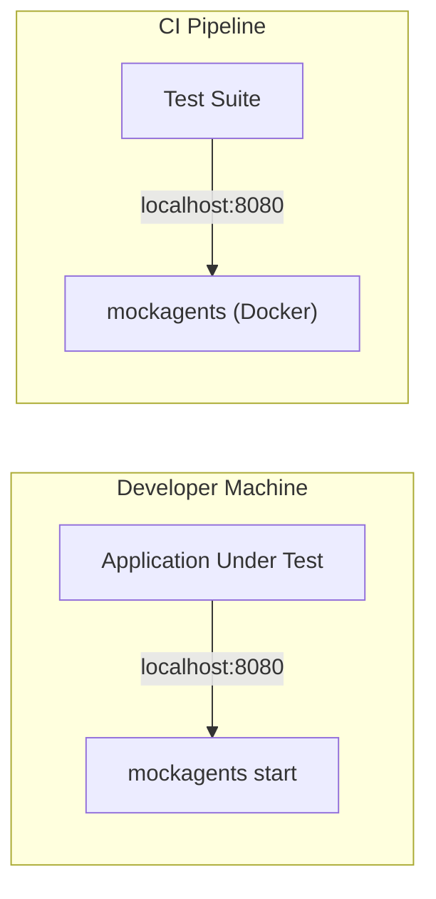

# MockAgents -- High-Level Design Document

> **Implementation status (updated 2026-06-04):** this HLD captures the
> original design intent. Code reality has moved ahead across every
> phase — see [PROGRESS.md](./PROGRESS.md) for the live map of slices,
> file paths, and test coverage, and
> [architecture-diagrams.md](./architecture-diagrams.md) /
> [sequence-diagrams.md](./sequence-diagrams.md) for the current
> diagrams. Two notable divergences from the prose and diagrams below:
> the HTTP layer is the standard-library **`net/http` ServeMux**, not
> Chi; and scope now spans Phases 1–4 (multi-tenant control plane, MCP,
> three SDKs, web console) rather than the single-agent CLI MVP.
> Sections that describe components not yet shipped are flagged
> implicitly by their absence in PROGRESS.md §2.

| Field        | Value                                                      |
|--------------|------------------------------------------------------------|
| **Version**  | 1.0                                                        |
| **Date**     | 2026-04-07                                                 |
| **Status**   | Draft                                                      |
| **Authors**  | MockAgents Core Team                                       |
| **Scope**    | MVP (Phase 1) -- Single-agent mocking with CLI and SDK     |

---

## Table of Contents

1. [System Overview](#1-system-overview)
2. [Architecture Style](#2-architecture-style)
3. [Component Overview](#3-component-overview)
4. [Component Interaction](#4-component-interaction)
5. [Technology Stack](#5-technology-stack)
6. [Data Flow](#6-data-flow)
7. [Deployment Architecture](#7-deployment-architecture)
8. [Security Considerations](#8-security-considerations)
9. [Cross-Cutting Concerns](#9-cross-cutting-concerns)
10. [Decisions and Trade-offs](#10-decisions-and-trade-offs)

---

## 1. System Overview

### 1.1 Purpose

MockAgents is an open-source platform for simulating, testing, and validating AI agent integrations. It enables developers to spin up realistic mock agents -- complete with configurable behaviors, tool responses, and streaming -- so teams can test their agent integrations without calling real LLMs, burning tokens, or relying on unpredictable third-party services.

### 1.2 MVP Scope

The MVP delivers:

- A **mock engine** that loads YAML/JSON agent definitions and generates deterministic responses
- **Protocol adapters** for OpenAI Chat Completions and Anthropic Messages APIs
- **Tool-call simulation** with configurable responses, error injection, and schema validation
- **Streaming response simulation** with configurable chunk size and timing
- **Static and template-based response generation**
- A **CLI** (`mockagents init`, `start`, `validate`) for project scaffolding, server startup, and config validation
- A **Python SDK** for programmatic interaction from test suites
- A **REST management API** for runtime inspection and control
- **SQLite-backed interaction logging** for debugging and replay

### 1.3 Context Diagram

The following diagram shows MockAgents in the context of its users and surrounding systems.



Applications under test point their LLM client configuration (base URL) at the MockAgents server instead of the real provider. MockAgents responds with deterministic, configurable behavior that matches the real provider's wire protocol.

---

## 2. Architecture Style

### 2.1 Modular Monolith

MockAgents MVP is built as a **modular monolith** in Go. All components run in a single OS process and communicate via in-process function calls. There is no message bus, no RPC, and no microservice boundary in the MVP.

This approach gives us:

- **Single binary distribution** -- one artifact to build, ship, and run
- **Minimal operational complexity** -- no service discovery, no network partitioning concerns
- **Low latency** -- no serialization overhead between components
- **Simple debugging** -- single process, single log stream, standard Go profiling

### 2.2 Plugin-Based Adapter Model

Protocol adapters are implemented behind a well-defined Go interface (`Adapter`). Each adapter translates between a specific LLM provider's wire format and the mock engine's internal request/response model. Adding a new provider (e.g., Google Gemini) means implementing a new adapter without modifying the engine.



The adapter interface is deliberately narrow: parse inbound request, call engine, format outbound response. This keeps adapters thin and testable.

---

## 3. Component Overview



### 3.1 Mock Engine Core

The mock engine is the heart of MockAgents. It is a pure Go package with no HTTP or CLI dependencies, making it independently testable.

| Sub-component        | Responsibility                                                                                       |
|-----------------------|------------------------------------------------------------------------------------------------------|
| **Agent Loader**      | Reads and deserializes agent definition files (YAML/JSON) into in-memory structs. Watches for file changes in development mode. |
| **State Manager**     | Maintains per-conversation state: message history, turn counter, variable bindings. State is held in memory with optional SQLite persistence. |
| **Response Generator**| Selects and renders the appropriate response for a given request. Supports static responses (literal strings) and template-based responses (Go `text/template` with custom functions for date offsets, random values, etc.). |
| **Tool Call Simulator**| Matches incoming tool-call requests against the tool registry in the agent definition. Returns configured responses, injects errors, or validates schemas based on the definition's rules. |

### 3.2 Protocol Adapter Layer

Each adapter implements a common Go interface:

```go
type Adapter interface {
    // Name returns the adapter identifier (e.g., "openai", "anthropic").
    Name() string

    // RegisterRoutes mounts the adapter's HTTP endpoints on the router.
    RegisterRoutes(r chi.Router, engine *engine.Engine)

    // ParseRequest converts a provider-specific HTTP request into the
    // engine's internal InboundRequest model.
    ParseRequest(r *http.Request) (*engine.InboundRequest, error)

    // FormatResponse converts the engine's internal Response into the
    // provider-specific wire format and writes it to the ResponseWriter.
    FormatResponse(w http.ResponseWriter, resp *engine.Response, stream bool) error
}
```

| Adapter               | Endpoints Served                         | Key Behaviors                                                  |
|------------------------|------------------------------------------|----------------------------------------------------------------|
| **OpenAI Adapter**     | `POST /v1/chat/completions`              | Function calling (`tools` / `tool_choice`), streaming via SSE (`text/event-stream`), usage token counts, model name passthrough |
| **Anthropic Adapter**  | `POST /v1/messages`                      | Tool use blocks, `anthropic-version` header validation, streaming via SSE, stop reason mapping |

### 3.3 HTTP Server

The HTTP server is built on the **Chi** router. It serves two distinct groups of endpoints:

1. **Protocol adapter endpoints** -- these mimic real LLM provider APIs and are what applications under test call. Mounted by each adapter via `RegisterRoutes`.
2. **Management API endpoints** -- prefixed with `/_mock/`, these are used by operators and the Python SDK to inspect and control the running server.

Management API surface (MVP):

| Method   | Path                            | Description                                     |
|----------|---------------------------------|-------------------------------------------------|
| `GET`    | `/_mock/health`                 | Health check                                    |
| `GET`    | `/_mock/agents`                 | List loaded agents                              |
| `GET`    | `/_mock/agents/:name`           | Get agent details                               |
| `POST`   | `/_mock/agents/:name/reset`     | Reset agent state (clear conversation history)  |
| `GET`    | `/_mock/logs`                   | Query interaction logs                          |
| `GET`    | `/_mock/logs/:id`               | Get a specific interaction log entry            |

**Middleware stack** (applied in order):

1. Request ID injection (`X-Request-Id`)
2. Structured logging (method, path, status, duration)
3. Panic recovery
4. CORS (permissive for local development)
5. Request body size limiting

### 3.4 CLI Layer

Built with **Cobra**, the CLI is the primary user entry point for the MVP.

| Command                | Behavior                                                                                  |
|------------------------|-------------------------------------------------------------------------------------------|
| `mockagents init`      | Scaffolds a new project directory with a sample agent definition, a `.mockagents.yaml` project config, and a `README.md`. |
| `mockagents start`     | Loads agent definitions, starts the HTTP server on a configurable port (default `8080`), and begins accepting requests. Supports `--port`, `--agents-dir`, and `--log-level` flags. |
| `mockagents validate`  | Parses and validates all agent definition files in the project. Reports errors with file path, line number, and description. Exits with code 0 on success, 1 on failure (CI-friendly). |

### 3.5 Python SDK

The Python SDK is a standalone package (`mockagents`) published to PyPI. It wraps both the management REST API and the protocol endpoints.

| Module                  | Responsibility                                                             |
|-------------------------|----------------------------------------------------------------------------|
| `mockagents.client`     | `MockAgentClient` class: connect to a running server, list agents, reset state, query logs. Built on `httpx`. |
| `mockagents.server`     | `MockAgentServer` context manager: start/stop a `mockagents` subprocess from Python test code. |
| `mockagents.models`     | Pydantic v2 models for agent definitions, log entries, and API responses.  |
| `mockagents.assertions` | `expect()` helper with fluent assertions: `to_have_tool_call()`, `to_have_response_containing()`, `to_have_status()`. |

### 3.6 Configuration Layer

Agent definitions use YAML (primary) or JSON. The configuration layer:

1. **Parses** files using `gopkg.in/yaml.v3` (with JSON fallback via `encoding/json`)
2. **Validates** against a Go struct schema with struct tags for required fields, enums, and ranges
3. **Resolves** template expressions and default values
4. **Reports** validation errors with file path and field path (e.g., `agents/support.yaml: spec.tools[0].responses[1].match: required field missing`)

Project-level configuration lives in `.mockagents.yaml`:

```yaml
version: "1"
server:
  port: 8080
  host: "127.0.0.1"
agents_dir: "./agents"
storage:
  driver: sqlite
  path: "./.mockagents/data.db"
logging:
  level: info
  format: text  # text | json
```

### 3.7 Storage Layer

| Store             | Technology              | Purpose                                               |
|-------------------|-------------------------|-------------------------------------------------------|
| **Interaction logs** | SQLite (`modernc.org/sqlite`) | Every request/response pair is logged with timestamp, agent name, request body, response body, latency, and tool calls invoked. Used for debugging, the management API `/logs` endpoints, and future record-and-playback. |
| **Agent definitions** | File system (YAML/JSON) | Source of truth for agent behavior. Loaded at startup, optionally watched for live reload. |
| **Conversation state** | In-memory (Go maps)   | Per-conversation message history and variable bindings. Lost on server restart in MVP. |

SQLite is accessed via `modernc.org/sqlite`, a **pure Go** SQLite implementation. This means no CGo, no C compiler dependency, and the mock server remains a single statically-linked binary.

---

## 4. Component Interaction

All MVP communication is **in-process function calls**. There is no network boundary between components.



Key design rule: **the mock engine has no knowledge of HTTP, SSE, or any wire protocol**. It operates on internal Go structs. All protocol-specific logic lives in the adapter layer.

---

## 5. Technology Stack

| Layer                | Technology                         | Version   | Rationale                                                         |
|----------------------|------------------------------------|-----------|-------------------------------------------------------------------|
| Language             | Go                                 | 1.26+     | Single binary, excellent concurrency, fast compile times, strong stdlib |
| HTTP router          | `go-chi/chi/v5`                    | 5.x       | Lightweight, idiomatic, middleware-friendly, stdlib-compatible     |
| CLI framework        | `spf13/cobra`                      | 1.8+      | De facto standard for Go CLIs, flag parsing, help generation      |
| YAML parsing         | `gopkg.in/yaml.v3`                 | 3.x       | Full YAML 1.2 support, struct tags, error positions               |
| SQLite               | `modernc.org/sqlite`               | latest    | Pure Go -- no CGo, no C toolchain, single binary stays intact     |
| Logging              | `log/slog` (stdlib)                | Go 1.26   | Structured logging in stdlib, JSON and text handlers              |
| Template engine      | `text/template` (stdlib)           | Go 1.26   | Built-in, safe for non-HTML output, custom function support       |
| Testing              | `testing` + `testify`              | latest    | Standard Go testing with assertion helpers                        |
| Python SDK           | Python 3.10+                       | --        | Matches the AI/ML community's primary language                    |
| Python HTTP client   | `httpx`                            | 0.27+     | Async support, streaming, modern API                              |
| Python models        | `pydantic` v2                      | 2.x       | Validation, serialization, IDE autocompletion                     |

---

## 6. Data Flow

### 6.1 Request Lifecycle



### 6.2 Streaming Detail

For streaming responses, the adapter:

1. Sets `Content-Type: text/event-stream` and flushes headers
2. Splits the rendered response content into chunks of `chunk_size` tokens
3. For each chunk, writes an SSE `data:` line containing a provider-formatted delta object
4. Waits `chunk_delay_ms` between chunks (configurable per agent)
5. Sends the final `data: [DONE]` marker (OpenAI) or `event: message_stop` (Anthropic)
6. Logs the complete interaction after the stream finishes

---

## 7. Deployment Architecture

### 7.1 Single Binary

The primary distribution is a statically-linked Go binary. No runtime dependencies, no VM, no interpreter.

```
mockagents              # Linux amd64
mockagents-darwin-arm64 # macOS Apple Silicon
mockagents.exe          # Windows amd64
```

Built with:
```bash
CGO_ENABLED=0 go build -ldflags="-s -w" -o mockagents ./cmd/mockagents
```

### 7.2 Docker Container

```dockerfile
FROM golang:1.26-alpine AS builder
WORKDIR /src
COPY . .
RUN CGO_ENABLED=0 go build -ldflags="-s -w" -o /mockagents ./cmd/mockagents

FROM alpine:3.19
RUN apk add --no-cache ca-certificates
COPY --from=builder /mockagents /usr/local/bin/mockagents
EXPOSE 8080
ENTRYPOINT ["mockagents", "start"]
```

Typical usage in CI:

```yaml
# GitHub Actions example
services:
  mockagents:
    image: ghcr.io/mockagents/mockagents:latest
    ports:
      - 8080:8080
    volumes:
      - ./agents:/agents
    env:
      MOCKAGENTS_AGENTS_DIR: /agents
```

### 7.3 Deployment Topology (MVP)



The MVP is strictly **single-node**. The server binds to one port and runs one process. Horizontal scaling and Kubernetes deployment are deferred to Phase 4.

---

## 8. Security Considerations

### 8.1 MVP Posture: Local-First, No Auth

The MVP is designed for **local development and CI environments**. It is not intended to be exposed to the public internet.

| Concern              | MVP Approach                                                               | Future Consideration                |
|----------------------|----------------------------------------------------------------------------|-------------------------------------|
| Authentication       | None. Server binds to `127.0.0.1` by default.                             | API key auth, OAuth2 for cloud tier |
| Authorization        | None. All endpoints are open.                                              | RBAC for management API             |
| TLS                  | Not supported. Plain HTTP only.                                            | TLS termination, self-signed certs  |
| Input validation     | Request body size limits. Agent definition schema validation.              | Rate limiting, request sanitization |
| Data at rest         | SQLite file on local disk, unencrypted.                                    | Encrypted SQLite, secrets vault     |
| Supply chain         | Go module checksums (`go.sum`), Dependabot for Python SDK.                 | SBOM generation, binary signing     |

### 8.2 Binding Address

By default, `mockagents start` binds to `127.0.0.1:8080` (loopback only). Binding to `0.0.0.0` requires an explicit `--host 0.0.0.0` flag, and the CLI prints a warning when this is used.

---

## 9. Cross-Cutting Concerns

### 9.1 Logging

All logging uses Go's `log/slog` (structured logging in the standard library).

- **Default level:** `INFO`
- **Configurable via:** `--log-level` flag or `logging.level` in `.mockagents.yaml`
- **Output formats:** `text` (human-readable, colored for TTY) and `json` (machine-parseable for CI)
- **Standard fields:** `timestamp`, `level`, `msg`, `request_id`, `agent`, `adapter`, `duration_ms`

Example log line (text format):
```
2026-04-07T14:23:01.456Z INFO  request completed  request_id=abc123 agent=customer-support adapter=openai method=POST path=/v1/chat/completions status=200 duration_ms=12
```

### 9.2 Configuration Management

Configuration is resolved in the following precedence order (highest wins):

1. CLI flags (`--port 9090`)
2. Environment variables (`MOCKAGENTS_PORT=9090`)
3. Project config file (`.mockagents.yaml`)
4. Built-in defaults

Environment variable names follow the pattern `MOCKAGENTS_<SECTION>_<KEY>` with dots replaced by underscores (e.g., `server.port` becomes `MOCKAGENTS_SERVER_PORT`).

### 9.3 Error Handling

The codebase follows Go's explicit error handling conventions:

- **Engine errors** are typed (e.g., `ErrAgentNotFound`, `ErrScenarioNoMatch`, `ErrToolNotDefined`) to allow adapters to map them to appropriate HTTP status codes.
- **Adapter errors** map engine errors to provider-specific error response formats. For example, the OpenAI adapter returns `{"error": {"message": "...", "type": "...", "code": "..."}}`.
- **CLI errors** are printed to stderr with a non-zero exit code. Structured error details are shown in verbose mode (`--log-level debug`).
- **Panics** are caught by the recovery middleware and logged as `ERROR` with a stack trace. The server continues running.

### 9.4 Graceful Shutdown

`mockagents start` listens for `SIGINT` and `SIGTERM`. On signal:

1. Stop accepting new connections
2. Wait up to 15 seconds for in-flight requests to complete
3. Flush pending SQLite writes
4. Exit with code 0

---

## 10. Decisions and Trade-offs

### 10.1 Why Go over Rust

| Factor                   | Go                                         | Rust                                          | Decision Driver                              |
|--------------------------|--------------------------------------------|-----------------------------------------------|----------------------------------------------|
| Time to MVP              | Faster. Simpler type system, garbage collection, large stdlib. | Slower. Borrow checker learning curve, more boilerplate. | **Primary factor.** Phase 1 target is 12 weeks. |
| Single binary            | Yes (`CGO_ENABLED=0`)                      | Yes                                           | Both satisfy this requirement.               |
| Concurrency              | Goroutines + channels. Trivially easy.     | `tokio` async. Powerful but more complex.     | Go's concurrency model is simpler to reason about. |
| HTTP ecosystem           | Chi, Gin, stdlib `net/http` -- all mature. | Axum, Actix -- mature but smaller ecosystem.  | Go has more middleware and tooling available. |
| AI/ML ecosystem fit      | Weaker. But MockAgents is infra, not ML.   | Weaker. Same argument applies.                | Neither language is used for the AI layer itself. |
| Contributor accessibility| Very high. Go is easier to learn.          | Moderate. Steeper learning curve.             | Open-source project benefits from lower barrier. |
| Performance              | Adequate for a mock server (not CPU-bound).| Superior raw performance.                     | Mock server is I/O bound; Go is sufficient.  |

**Verdict:** Go delivers a working product faster with lower contributor friction. Rust's performance advantages are not needed for a mock server that generates canned responses.

### 10.2 Why SQLite over PostgreSQL

| Factor                  | SQLite                                      | PostgreSQL                                  |
|-------------------------|---------------------------------------------|---------------------------------------------|
| Zero-config setup       | Yes. Single file, embedded.                 | No. Requires a running server.              |
| Single binary           | Yes (with `modernc.org/sqlite`).            | No. External dependency.                    |
| CI-friendliness         | Excellent. No `services:` block needed.     | Requires Docker or hosted instance.         |
| Concurrent writes       | Limited (WAL mode helps).                   | Excellent.                                  |
| Multi-node              | Not supported.                              | Fully supported.                            |

**Verdict:** SQLite is the right choice for a local-first, single-binary tool. PostgreSQL can be introduced in Phase 4 for the cloud/enterprise tier when multi-node and concurrent write performance matter.

### 10.3 Why CLI-Only for MVP (No GUI)

| Factor                    | CLI-Only MVP                                | GUI in MVP                                  |
|---------------------------|---------------------------------------------|---------------------------------------------|
| Development effort        | Low. Cobra CLI is a few hundred lines.      | High. Full React app, API design, auth.     |
| Target user (Phase 1)     | AI Engineers writing tests in code.         | Full-stack devs, less technical users.      |
| CI/CD compatibility       | Native. CLIs run everywhere.                | Irrelevant in CI.                           |
| Time to market            | Fast.                                       | Adds 4-6 weeks minimum.                    |

**Verdict:** The Phase 1 persona (AI Engineers) lives in the terminal and writes tests in Python. A GUI adds significant scope without serving the primary MVP user. The management REST API is designed so that a GUI can be layered on later without engine changes.

### 10.4 Why Chi over Gin

Chi was selected over Gin for the HTTP router because:

- Chi is fully compatible with `net/http` -- handlers are standard `http.HandlerFunc`, middleware is standard `func(http.Handler) http.Handler`. This means any stdlib-compatible middleware works without wrappers.
- Chi has no global state or framework-specific context types.
- Chi's middleware composition model is cleaner for mounting adapter routes under different path prefixes.
- Gin's marginal performance advantage is irrelevant for a mock server.

### 10.5 Summary of Key Constraints

| Constraint                              | Rationale                                              |
|-----------------------------------------|--------------------------------------------------------|
| Single process, single binary           | Simplicity, portability, zero-config                   |
| In-process communication only           | No need for a message bus at MVP scale                 |
| No authentication in MVP                | Local-first tool; auth adds complexity without value   |
| File-based agent definitions            | Git-friendly, human-readable, no database required     |
| Conversation state in memory only       | Simplicity; persistence deferred to post-MVP           |
| Pure Go dependencies (no CGo)           | Cross-compilation, single binary, no C toolchain       |

---

*This document covers the MVP (Phase 1) architecture. Subsequent phases will introduce multi-agent orchestration, chaos engineering, MCP support, a GUI dashboard, and cloud deployment -- each requiring an HLD addendum.*
