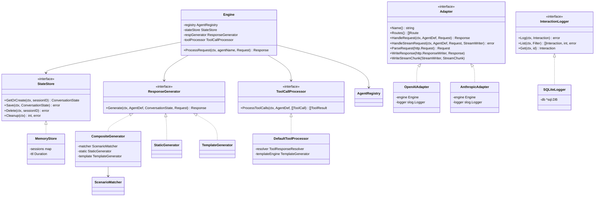
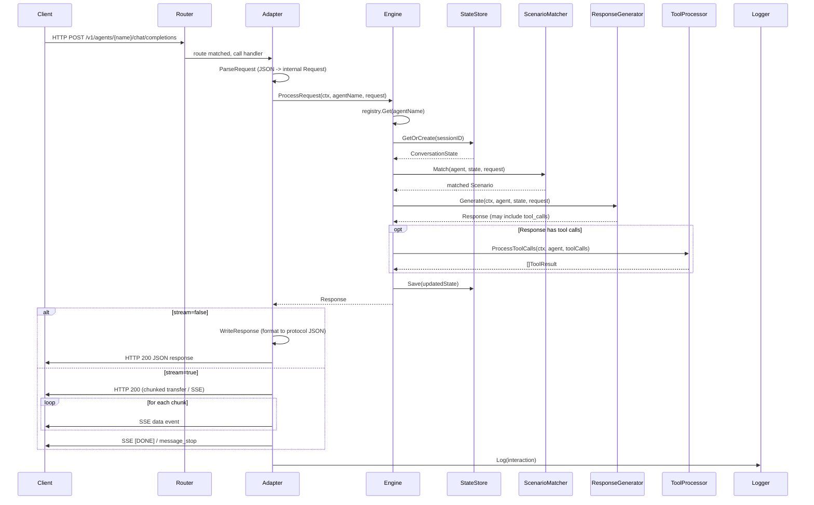
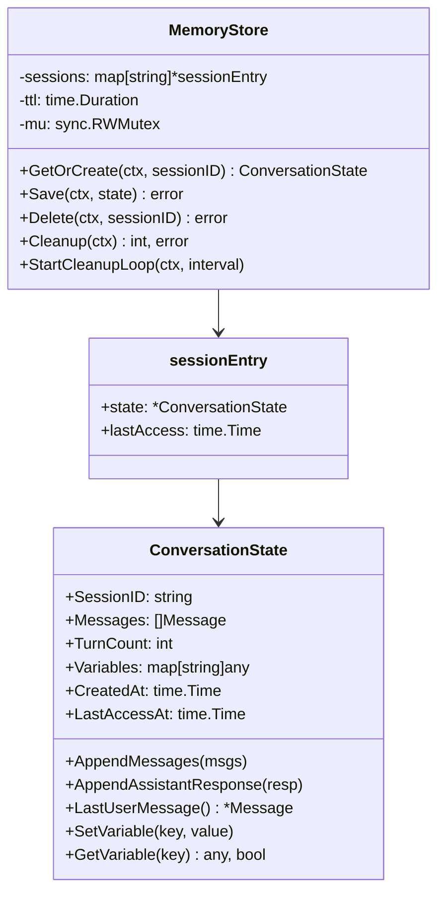
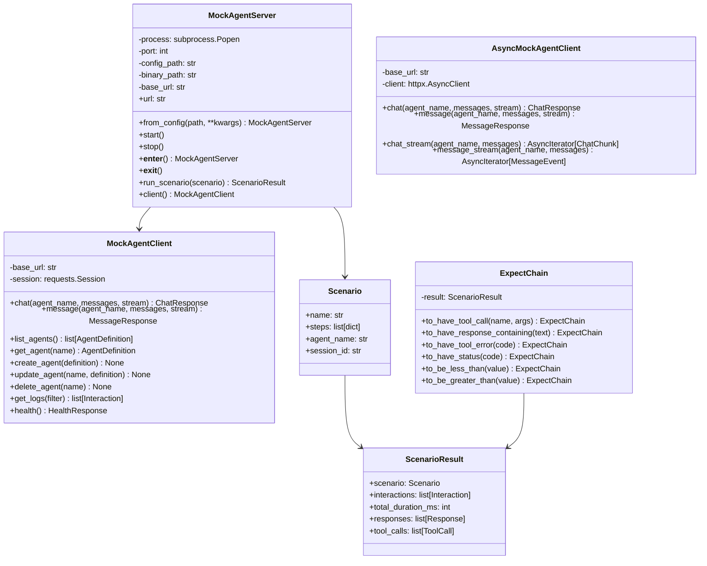

# MockAgents - Low-Level Design Document

**Version:** 1.0
**Date:** April 7, 2026
**Status:** Draft
**Author:** MockAgents Core Team
**Scope:** MVP (Phase 1) - Core Mock Engine, OpenAI/Anthropic Adapters, Tool-Call Simulation, Streaming, CLI, Python SDK

---

## Table of Contents

1. [Document Info](#1-document-info)
2. [Module Decomposition](#2-module-decomposition)
3. [Key Interfaces & Structs](#3-key-interfaces--structs)
4. [Agent Definition Schema](#4-agent-definition-schema)
5. [Request Processing Pipeline](#5-request-processing-pipeline)
6. [Streaming Implementation](#6-streaming-implementation)
7. [Template Engine](#7-template-engine)
8. [State Management](#8-state-management)
9. [Error Handling](#9-error-handling)
10. [Python SDK Design](#10-python-sdk-design)

---

## 1. Document Info

| Field            | Value                                                                 |
|------------------|-----------------------------------------------------------------------|
| Project          | MockAgents                                                            |
| Document Type    | Low-Level Design (LLD)                                                |
| Version          | 1.0                                                                   |
| Date             | 2026-04-07                                                            |
| Scope            | MVP / Phase 1                                                         |
| Language         | Go 1.22+                                                              |
| Build System     | Go modules (monorepo)                                                 |
| Database         | SQLite (via `modernc.org/sqlite` - pure Go, no CGO)                   |
| Config Format    | YAML / JSON agent definitions                                         |
| Target Platforms | Linux (amd64/arm64), macOS (amd64/arm64), Windows (amd64)            |

### 1.1 References

| Document                     | Location                              |
|------------------------------|---------------------------------------|
| Product Plan                 | `mock-agents-product-plan.md`         |
| OpenAI Chat Completions API  | https://platform.openai.com/docs/api-reference/chat |
| Anthropic Messages API       | https://docs.anthropic.com/en/docs/api-reference     |

### 1.2 Monorepo Structure

```
mock-agents/
├── cmd/
│   └── mockagents/          # CLI entry point
│       └── main.go
├── internal/
│   ├── adapter/             # Adapter interface + registry
│   │   ├── openai/          # OpenAI Chat Completions adapter
│   │   └── anthropic/       # Anthropic Messages adapter
│   ├── config/              # Config loading, validation
│   ├── engine/              # Core mock engine
│   │   ├── response/        # Response generators
│   │   ├── state/           # Conversation state management
│   │   └── tools/           # Tool call simulation
│   ├── server/              # HTTP server, router, middleware
│   │   └── handlers/        # Management API handlers
│   ├── storage/             # SQLite interaction logging
│   └── types/               # Shared domain types
├── pkg/
│   └── sdk/                 # Go client SDK (optional)
├── sdk/
│   └── python/              # Python SDK package
│       ├── mockagents/
│       │   ├── __init__.py
│       │   ├── client.py
│       │   ├── server.py
│       │   ├── scenario.py
│       │   └── assertions.py
│       ├── pyproject.toml
│       └── tests/
├── docs/
├── examples/
├── go.mod
├── go.sum
└── Makefile
```

---

## 2. Module Decomposition

### 2.1 `cmd/mockagents/` - CLI Entry Point

The CLI is built with [Cobra](https://github.com/spf13/cobra) and serves as the single binary entry point for all MockAgents operations.

**Files:**

| File            | Purpose                                      |
|-----------------|----------------------------------------------|
| `main.go`       | Cobra root command, version info, global flags |
| `start.go`      | `mockagents start` - starts the HTTP server  |
| `init.go`       | `mockagents init` - scaffolds a new project  |
| `validate.go`   | `mockagents validate` - validates agent YAML  |

**Responsibilities:**
- Parse global flags: `--config`, `--port`, `--log-level`, `--agents-dir`
- Initialize logger (structured JSON via `slog`)
- Bootstrap the dependency graph (config -> storage -> engine -> adapters -> server)
- Manage graceful shutdown via `os.Signal` and `context.Context`

```go
// cmd/mockagents/main.go
package main

import (
    "os"
    "github.com/spf13/cobra"
)

var rootCmd = &cobra.Command{
    Use:   "mockagents",
    Short: "MockAgents - Simulate, test, and validate AI agent integrations",
}

func main() {
    rootCmd.PersistentFlags().StringP("config", "c", "", "path to config file")
    rootCmd.PersistentFlags().IntP("port", "p", 8080, "server port")
    rootCmd.PersistentFlags().String("log-level", "info", "log level (debug, info, warn, error)")
    rootCmd.PersistentFlags().String("agents-dir", "./agents", "directory containing agent definitions")

    rootCmd.AddCommand(startCmd)
    rootCmd.AddCommand(initCmd)
    rootCmd.AddCommand(validateCmd)

    if err := rootCmd.Execute(); err != nil {
        os.Exit(1)
    }
}
```

**Start command flow:**
1. Load global config from file or flags
2. Initialize SQLite storage
3. Load all agent definitions from `--agents-dir`
4. Register adapters (OpenAI, Anthropic)
5. Build HTTP server with routes
6. Listen and serve; block until SIGINT/SIGTERM

---

### 2.2 `internal/engine/` - Core Mock Engine

The engine is the central orchestrator. It receives parsed requests from adapters and produces responses.

**Files:**

| File                  | Purpose                                               |
|-----------------------|-------------------------------------------------------|
| `engine.go`           | `Engine` struct, top-level `ProcessRequest` method     |
| `agent_loader.go`     | Loads and hot-reloads agent definitions from disk      |
| `agent_registry.go`   | In-memory registry of loaded `AgentDefinition` objects |
| `request_processor.go`| Pipeline orchestration: match -> generate -> tools -> respond |

**`Engine` struct:**

```go
// internal/engine/engine.go
package engine

type Engine struct {
    registry      *AgentRegistry
    stateStore    state.StateStore
    respGenerator response.ResponseGenerator
    toolProcessor tools.ToolCallProcessor
    logger        *slog.Logger
}

func NewEngine(
    registry *AgentRegistry,
    store state.StateStore,
    gen response.ResponseGenerator,
    tp tools.ToolCallProcessor,
    logger *slog.Logger,
) *Engine {
    return &Engine{
        registry:      registry,
        stateStore:    store,
        respGenerator: gen,
        toolProcessor: tp,
        logger:        logger,
    }
}

func (e *Engine) ProcessRequest(ctx context.Context, agentName string, req *types.Request) (*types.Response, error) {
    // 1. Look up agent definition
    agent, err := e.registry.Get(agentName)
    if err != nil {
        return nil, types.NewAgentNotFoundError(agentName)
    }

    // 2. Retrieve or create conversation state
    convState, err := e.stateStore.GetOrCreate(ctx, req.SessionID)
    if err != nil {
        return nil, fmt.Errorf("state retrieval failed: %w", err)
    }

    // 3. Append incoming messages to state
    convState.AppendMessages(req.Messages)

    // 4. Generate response (includes scenario matching)
    resp, err := e.respGenerator.Generate(ctx, agent, convState, req)
    if err != nil {
        return nil, fmt.Errorf("response generation failed: %w", err)
    }

    // 5. If response includes tool calls, resolve tool responses
    if len(resp.ToolCalls) > 0 {
        toolResults, err := e.toolProcessor.ProcessToolCalls(ctx, agent, resp.ToolCalls)
        if err != nil {
            return nil, fmt.Errorf("tool processing failed: %w", err)
        }
        resp.ToolResults = toolResults
    }

    // 6. Update conversation state
    convState.AppendAssistantResponse(resp)
    e.stateStore.Save(ctx, convState)

    return resp, nil
}
```

**`AgentLoader`:**

```go
// internal/engine/agent_loader.go
package engine

type AgentLoader struct {
    agentsDir string
    validator *config.Validator
    logger    *slog.Logger
}

// LoadAll reads all .yaml/.yml/.json files from agentsDir,
// parses them into AgentDefinition structs, validates them,
// and returns a slice.
func (l *AgentLoader) LoadAll() ([]*types.AgentDefinition, error) { ... }

// LoadFile loads a single agent definition file.
func (l *AgentLoader) LoadFile(path string) (*types.AgentDefinition, error) { ... }

// Watch starts an fsnotify watcher on agentsDir and calls onChange
// when files are created/modified/deleted.
func (l *AgentLoader) Watch(ctx context.Context, onChange func(defs []*types.AgentDefinition)) error { ... }
```

**`AgentRegistry`:**

```go
// internal/engine/agent_registry.go
package engine

type AgentRegistry struct {
    mu     sync.RWMutex
    agents map[string]*types.AgentDefinition // keyed by metadata.name
}

func (r *AgentRegistry) Register(def *types.AgentDefinition) error { ... }
func (r *AgentRegistry) Get(name string) (*types.AgentDefinition, error) { ... }
func (r *AgentRegistry) List() []*types.AgentDefinition { ... }
func (r *AgentRegistry) Remove(name string) { ... }
func (r *AgentRegistry) ReplaceAll(defs []*types.AgentDefinition) { ... }
```

---

### 2.3 `internal/engine/state/` - Conversation State Management

Manages per-session conversation state in memory with TTL-based expiration.

**Files:**

| File              | Purpose                                         |
|-------------------|-------------------------------------------------|
| `store.go`        | `StateStore` interface definition                |
| `memory_store.go` | In-memory implementation with TTL cleanup        |
| `session.go`      | `ConversationState` struct and methods           |

```go
// internal/engine/state/store.go
package state

type StateStore interface {
    // GetOrCreate retrieves an existing session or creates a new one.
    GetOrCreate(ctx context.Context, sessionID string) (*ConversationState, error)

    // Save persists the updated conversation state.
    Save(ctx context.Context, state *ConversationState) error

    // Delete removes a session.
    Delete(ctx context.Context, sessionID string) error

    // Cleanup removes all sessions older than their TTL.
    Cleanup(ctx context.Context) (int, error)
}
```

```go
// internal/engine/state/memory_store.go
package state

type MemoryStore struct {
    mu       sync.RWMutex
    sessions map[string]*sessionEntry
    ttl      time.Duration
    logger   *slog.Logger
}

type sessionEntry struct {
    state      *ConversationState
    lastAccess time.Time
}

func NewMemoryStore(ttl time.Duration, logger *slog.Logger) *MemoryStore { ... }

// StartCleanupLoop runs a goroutine that periodically evicts expired sessions.
func (m *MemoryStore) StartCleanupLoop(ctx context.Context, interval time.Duration) { ... }
```

```go
// internal/engine/state/session.go
package state

type ConversationState struct {
    SessionID    string
    Messages     []types.Message
    TurnCount    int
    Variables    map[string]any   // user-defined variables for templates
    CreatedAt    time.Time
    LastAccessAt time.Time
}

func (cs *ConversationState) AppendMessages(msgs []types.Message) { ... }
func (cs *ConversationState) AppendAssistantResponse(resp *types.Response) { ... }
func (cs *ConversationState) LastUserMessage() *types.Message { ... }
func (cs *ConversationState) SetVariable(key string, value any) { ... }
func (cs *ConversationState) GetVariable(key string) (any, bool) { ... }
```

---

### 2.4 `internal/engine/response/` - Response Generators

Contains the response generation pipeline: scenario matching followed by content generation.

**Files:**

| File                    | Purpose                                          |
|-------------------------|--------------------------------------------------|
| `generator.go`          | `ResponseGenerator` interface                    |
| `static_generator.go`   | Returns fixed string responses                   |
| `template_generator.go` | Renders Go templates with custom functions        |
| `scenario_matcher.go`   | Evaluates match rules to select a scenario        |
| `composite_generator.go`| Orchestrates matcher + generator pipeline         |

```go
// internal/engine/response/generator.go
package response

type ResponseGenerator interface {
    Generate(
        ctx context.Context,
        agent *types.AgentDefinition,
        state *state.ConversationState,
        req *types.Request,
    ) (*types.Response, error)
}
```

**`ScenarioMatcher`:**

```go
// internal/engine/response/scenario_matcher.go
package response

type ScenarioMatcher struct {
    logger *slog.Logger
}

// Match evaluates all scenarios in order and returns the first match.
// If no scenario matches, returns the "default" scenario.
// If no default exists, returns an error.
func (sm *ScenarioMatcher) Match(
    agent *types.AgentDefinition,
    state *state.ConversationState,
    req *types.Request,
) (*types.Scenario, error) { ... }

// evaluateRule checks a single MatchRule against the request/state.
func (sm *ScenarioMatcher) evaluateRule(
    rule *types.MatchRule,
    state *state.ConversationState,
    req *types.Request,
) bool { ... }
```

**Match evaluation order:**
1. Iterate `agent.Spec.Behavior.Scenarios` in definition order
2. For each scenario, evaluate its `match` rules (all rules must pass - AND logic)
3. Return the first scenario where all rules match
4. If none match, look for a scenario named `"default"` or one with no `match` block
5. If no default found, return `ErrNoMatchingScenario`

**`CompositeGenerator`** (the main generator used by the engine):

```go
// internal/engine/response/composite_generator.go
package response

type CompositeGenerator struct {
    matcher   *ScenarioMatcher
    static    *StaticGenerator
    template  *TemplateGenerator
    logger    *slog.Logger
}

func (cg *CompositeGenerator) Generate(
    ctx context.Context,
    agent *types.AgentDefinition,
    convState *state.ConversationState,
    req *types.Request,
) (*types.Response, error) {
    // 1. Find matching scenario
    scenario, err := cg.matcher.Match(agent, convState, req)
    if err != nil {
        return nil, err
    }

    // 2. Check if content contains template syntax {{ }}
    content := scenario.Response.Content
    if cg.template.IsTemplate(content) {
        content, err = cg.template.Render(content, convState, req)
        if err != nil {
            return nil, fmt.Errorf("template render error: %w", err)
        }
    }

    // 3. Build response
    resp := &types.Response{
        Content:   content,
        Model:     agent.Spec.Model,
        ToolCalls: scenario.Response.ToolCalls,
        Metadata:  scenario.Response.Metadata,
        StopReason: "end_turn",
    }

    return resp, nil
}
```

---

### 2.5 `internal/engine/tools/` - Tool Call Simulation

Handles tool registry, tool call processing, and tool response resolution.

**Files:**

| File                      | Purpose                                        |
|---------------------------|------------------------------------------------|
| `processor.go`            | `ToolCallProcessor` interface and implementation |
| `registry.go`             | `ToolRegistry` - indexes tools by name          |
| `resolver.go`             | `ToolResponseResolver` - matches tool call args to defined responses |

```go
// internal/engine/tools/processor.go
package tools

type ToolCallProcessor interface {
    // ProcessToolCalls resolves each tool call against the agent's
    // tool definitions and returns the results.
    ProcessToolCalls(
        ctx context.Context,
        agent *types.AgentDefinition,
        toolCalls []types.ToolCall,
    ) ([]types.ToolResult, error)
}
```

```go
// internal/engine/tools/registry.go
package tools

type ToolRegistry struct {
    tools map[string]*types.ToolDefinition // keyed by tool name
}

func NewToolRegistry(agent *types.AgentDefinition) *ToolRegistry {
    r := &ToolRegistry{tools: make(map[string]*types.ToolDefinition)}
    for i := range agent.Spec.Tools {
        r.tools[agent.Spec.Tools[i].Name] = &agent.Spec.Tools[i]
    }
    return r
}

func (r *ToolRegistry) Get(name string) (*types.ToolDefinition, error) { ... }
func (r *ToolRegistry) List() []*types.ToolDefinition { ... }
```

```go
// internal/engine/tools/resolver.go
package tools

type ToolResponseResolver struct {
    templateEngine *response.TemplateGenerator
    logger         *slog.Logger
}

// Resolve matches the tool call arguments against the tool's response
// definitions and returns the matching response or error.
func (r *ToolResponseResolver) Resolve(
    ctx context.Context,
    tool *types.ToolDefinition,
    call types.ToolCall,
) (*types.ToolResult, error) {
    args := call.Arguments

    // Iterate through tool response definitions
    for _, respDef := range tool.Responses {
        if respDef.IsDefault {
            continue // check defaults last
        }
        if r.matchArgs(respDef.Match, args) {
            return r.buildResult(call.ID, tool.Name, respDef)
        }
    }

    // Fall back to default
    for _, respDef := range tool.Responses {
        if respDef.IsDefault {
            return r.buildResult(call.ID, tool.Name, respDef)
        }
    }

    return nil, fmt.Errorf("no matching response for tool %q with args %v", tool.Name, args)
}

// matchArgs checks if all key-value pairs in match are present in args.
func (r *ToolResponseResolver) matchArgs(match map[string]any, args map[string]any) bool {
    for k, v := range match {
        if args[k] != v {
            return false
        }
    }
    return true
}
```

---

### 2.6 `internal/adapter/` - Adapter Interface & Registry

Defines the contract that all protocol adapters must implement and provides a registry for discovering adapters.

**Files:**

| File            | Purpose                                       |
|-----------------|-----------------------------------------------|
| `adapter.go`    | `Adapter` interface definition                 |
| `registry.go`   | `AdapterRegistry` for registering adapters     |
| `route.go`      | `Route` type definition                        |

```go
// internal/adapter/adapter.go
package adapter

type Adapter interface {
    // Name returns the adapter's unique identifier (e.g., "openai", "anthropic").
    Name() string

    // Routes returns the HTTP routes this adapter handles.
    // These are mounted on the server router.
    Routes() []Route

    // HandleRequest processes an incoming HTTP request, translates it
    // to the internal request type, delegates to the engine, and writes
    // the protocol-specific response.
    HandleRequest(ctx context.Context, agent *types.AgentDefinition, req *types.Request) (*types.Response, error)

    // HandleStreamRequest is the streaming variant. It writes chunks
    // to the provided StreamWriter.
    HandleStreamRequest(ctx context.Context, agent *types.AgentDefinition, req *types.Request, w StreamWriter) error

    // ParseRequest extracts a protocol-specific HTTP request body into
    // the internal Request type.
    ParseRequest(r *http.Request) (*types.Request, error)

    // WriteResponse serializes the internal Response into the protocol-
    // specific HTTP response format.
    WriteResponse(w http.ResponseWriter, resp *types.Response) error

    // WriteStreamChunk writes a single chunk in the protocol-specific
    // streaming format.
    WriteStreamChunk(w StreamWriter, chunk *types.StreamChunk) error
}
```

```go
// internal/adapter/route.go
package adapter

type Route struct {
    Method  string // "POST", "GET", etc.
    Pattern string // e.g., "/v1/chat/completions"
    Handler http.HandlerFunc
}
```

```go
// internal/adapter/registry.go
package adapter

type AdapterRegistry struct {
    mu       sync.RWMutex
    adapters map[string]Adapter
}

func NewAdapterRegistry() *AdapterRegistry { ... }
func (r *AdapterRegistry) Register(a Adapter) error { ... }
func (r *AdapterRegistry) Get(name string) (Adapter, error) { ... }
func (r *AdapterRegistry) All() []Adapter { ... }
func (r *AdapterRegistry) AllRoutes() []Route { ... }
```

```go
// internal/adapter/stream.go
package adapter

type StreamWriter interface {
    // WriteChunk sends a single chunk to the client.
    WriteChunk(data []byte) error
    // Flush ensures all buffered data is sent.
    Flush() error
    // Close sends the terminal event and closes the stream.
    Close() error
}

// SSEWriter implements StreamWriter for Server-Sent Events.
type SSEWriter struct {
    w       http.ResponseWriter
    flusher http.Flusher
}
```

---

### 2.7 `internal/adapter/openai/` - OpenAI Chat Completions Adapter

Implements the OpenAI Chat Completions API (`POST /v1/chat/completions`) including function calling and streaming.

**Files:**

| File              | Purpose                                                |
|-------------------|--------------------------------------------------------|
| `adapter.go`      | `OpenAIAdapter` struct, implements `adapter.Adapter`   |
| `request.go`      | OpenAI request parsing (JSON -> internal `Request`)    |
| `response.go`     | Internal `Response` -> OpenAI JSON response format     |
| `streaming.go`    | SSE streaming: `data: {...}\n\n` chunk format          |
| `types.go`        | OpenAI-specific request/response structs               |
| `function_call.go`| Function calling / tool_calls translation              |

**OpenAI-specific types:**

```go
// internal/adapter/openai/types.go
package openai

// --- Request Types ---

type ChatCompletionRequest struct {
    Model       string          `json:"model"`
    Messages    []ChatMessage   `json:"messages"`
    Tools       []ToolDef       `json:"tools,omitempty"`
    ToolChoice  any             `json:"tool_choice,omitempty"` // "auto", "none", or object
    Stream      bool            `json:"stream,omitempty"`
    MaxTokens   *int            `json:"max_tokens,omitempty"`
    Temperature *float64        `json:"temperature,omitempty"`
    N           int             `json:"n,omitempty"`
}

type ChatMessage struct {
    Role       string     `json:"role"` // "system", "user", "assistant", "tool"
    Content    any        `json:"content"` // string or []ContentPart
    Name       string     `json:"name,omitempty"`
    ToolCalls  []ToolCall `json:"tool_calls,omitempty"`
    ToolCallID string     `json:"tool_call_id,omitempty"`
}

type ToolCall struct {
    ID       string       `json:"id"`
    Type     string       `json:"type"` // "function"
    Function FunctionCall `json:"function"`
}

type FunctionCall struct {
    Name      string `json:"name"`
    Arguments string `json:"arguments"` // JSON-encoded string
}

type ToolDef struct {
    Type     string       `json:"type"` // "function"
    Function FunctionDef  `json:"function"`
}

type FunctionDef struct {
    Name        string         `json:"name"`
    Description string         `json:"description"`
    Parameters  map[string]any `json:"parameters"`
}

// --- Response Types ---

type ChatCompletionResponse struct {
    ID      string   `json:"id"`
    Object  string   `json:"object"` // "chat.completion"
    Created int64    `json:"created"`
    Model   string   `json:"model"`
    Choices []Choice `json:"choices"`
    Usage   Usage    `json:"usage"`
}

type Choice struct {
    Index        int         `json:"index"`
    Message      ChatMessage `json:"message"`
    FinishReason string      `json:"finish_reason"` // "stop", "tool_calls", "length"
}

type Usage struct {
    PromptTokens     int `json:"prompt_tokens"`
    CompletionTokens int `json:"completion_tokens"`
    TotalTokens      int `json:"total_tokens"`
}

// --- Streaming Types ---

type ChatCompletionChunk struct {
    ID      string        `json:"id"`
    Object  string        `json:"object"` // "chat.completion.chunk"
    Created int64         `json:"created"`
    Model   string        `json:"model"`
    Choices []ChunkChoice `json:"choices"`
}

type ChunkChoice struct {
    Index        int          `json:"index"`
    Delta        ChatDelta    `json:"delta"`
    FinishReason *string      `json:"finish_reason"`
}

type ChatDelta struct {
    Role      string     `json:"role,omitempty"`
    Content   string     `json:"content,omitempty"`
    ToolCalls []ToolCall `json:"tool_calls,omitempty"`
}
```

**Request mapping (OpenAI -> internal):**

```go
// internal/adapter/openai/request.go
package openai

func (a *OpenAIAdapter) ParseRequest(r *http.Request) (*types.Request, error) {
    var oaiReq ChatCompletionRequest
    if err := json.NewDecoder(r.Body).Decode(&oaiReq); err != nil {
        return nil, types.NewBadRequestError("invalid JSON: " + err.Error())
    }

    // Extract agent name from URL path: /v1/agents/{name}/chat/completions
    agentName := chi.URLParam(r, "agentName")

    // Map OpenAI messages to internal messages
    messages := make([]types.Message, 0, len(oaiReq.Messages))
    for _, msg := range oaiReq.Messages {
        messages = append(messages, types.Message{
            Role:       types.Role(msg.Role),
            Content:    fmt.Sprintf("%v", msg.Content),
            ToolCallID: msg.ToolCallID,
        })
    }

    return &types.Request{
        AgentName: agentName,
        SessionID: r.Header.Get("X-Session-ID"), // optional
        Messages:  messages,
        Stream:    oaiReq.Stream,
        Model:     oaiReq.Model,
        RawBody:   oaiReq, // preserve for pass-through fields
    }, nil
}
```

**Route definition:**

```go
// internal/adapter/openai/adapter.go
package openai

func (a *OpenAIAdapter) Name() string { return "openai" }

func (a *OpenAIAdapter) Routes() []adapter.Route {
    return []adapter.Route{
        {
            Method:  "POST",
            Pattern: "/v1/agents/{agentName}/chat/completions",
            Handler: a.handleChatCompletions,
        },
        {
            Method:  "GET",
            Pattern: "/v1/agents/{agentName}/models",
            Handler: a.handleListModels,
        },
    }
}
```

---

### 2.8 `internal/adapter/anthropic/` - Anthropic Messages Adapter

Implements the Anthropic Messages API (`POST /v1/messages`) including `tool_use` content blocks and streaming events.

**Files:**

| File              | Purpose                                                   |
|-------------------|-----------------------------------------------------------|
| `adapter.go`      | `AnthropicAdapter` struct, implements `adapter.Adapter`   |
| `request.go`      | Anthropic request parsing                                  |
| `response.go`     | Internal `Response` -> Anthropic JSON                      |
| `streaming.go`    | SSE streaming with Anthropic event types                   |
| `types.go`        | Anthropic-specific request/response structs                |
| `tool_use.go`     | `tool_use` / `tool_result` block translation               |

**Anthropic-specific types:**

```go
// internal/adapter/anthropic/types.go
package anthropic

// --- Request Types ---

type MessagesRequest struct {
    Model       string          `json:"model"`
    MaxTokens   int             `json:"max_tokens"`
    System      any             `json:"system,omitempty"` // string or []SystemBlock
    Messages    []MessageParam  `json:"messages"`
    Tools       []ToolDef       `json:"tools,omitempty"`
    Stream      bool            `json:"stream,omitempty"`
    Temperature *float64        `json:"temperature,omitempty"`
}

type MessageParam struct {
    Role    string         `json:"role"` // "user" or "assistant"
    Content any            `json:"content"` // string or []ContentBlock
}

type ContentBlock struct {
    Type      string         `json:"type"` // "text", "tool_use", "tool_result"
    Text      string         `json:"text,omitempty"`
    ID        string         `json:"id,omitempty"`        // for tool_use
    Name      string         `json:"name,omitempty"`      // for tool_use
    Input     map[string]any `json:"input,omitempty"`     // for tool_use
    ToolUseID string         `json:"tool_use_id,omitempty"` // for tool_result
    Content   any            `json:"content,omitempty"`   // for tool_result
    IsError   bool           `json:"is_error,omitempty"`  // for tool_result
}

type ToolDef struct {
    Name        string         `json:"name"`
    Description string         `json:"description"`
    InputSchema map[string]any `json:"input_schema"`
}

// --- Response Types ---

type MessagesResponse struct {
    ID           string         `json:"id"`
    Type         string         `json:"type"` // "message"
    Role         string         `json:"role"` // "assistant"
    Content      []ContentBlock `json:"content"`
    Model        string         `json:"model"`
    StopReason   string         `json:"stop_reason"` // "end_turn", "tool_use", "max_tokens"
    StopSequence *string        `json:"stop_sequence"`
    Usage        Usage          `json:"usage"`
}

type Usage struct {
    InputTokens  int `json:"input_tokens"`
    OutputTokens int `json:"output_tokens"`
}

// --- Streaming Event Types ---

type StreamEvent struct {
    Type    string `json:"type"`
    Message *MessagesResponse `json:"message,omitempty"`
    Index   *int              `json:"index,omitempty"`
    ContentBlock *ContentBlock `json:"content_block,omitempty"`
    Delta   *DeltaBlock       `json:"delta,omitempty"`
    Usage   *Usage            `json:"usage,omitempty"`
}

type DeltaBlock struct {
    Type       string  `json:"type"` // "text_delta", "input_json_delta"
    Text       string  `json:"text,omitempty"`
    PartialJSON string `json:"partial_json,omitempty"`
    StopReason string  `json:"stop_reason,omitempty"`
}
```

**Route definition:**

```go
func (a *AnthropicAdapter) Name() string { return "anthropic" }

func (a *AnthropicAdapter) Routes() []adapter.Route {
    return []adapter.Route{
        {
            Method:  "POST",
            Pattern: "/v1/agents/{agentName}/messages",
            Handler: a.handleMessages,
        },
    }
}
```

---

### 2.9 `internal/server/` - HTTP Server Setup

Configures the HTTP server, router, and middleware stack.

**Files:**

| File             | Purpose                                          |
|------------------|--------------------------------------------------|
| `server.go`      | `Server` struct, `ListenAndServe`, `Shutdown`     |
| `router.go`      | Route registration from adapters + management API |
| `middleware.go`   | Logging, CORS, request ID, recovery middleware    |

```go
// internal/server/server.go
package server

type Server struct {
    httpServer      *http.Server
    router          chi.Router
    engine          *engine.Engine
    adapterRegistry *adapter.AdapterRegistry
    logger          *slog.Logger
}

type ServerConfig struct {
    Port            int
    ReadTimeout     time.Duration // default: 30s
    WriteTimeout    time.Duration // default: 60s (long for streaming)
    IdleTimeout     time.Duration // default: 120s
    CORSAllowAll    bool          // default: true for MVP
}

func NewServer(cfg ServerConfig, engine *engine.Engine, adapters *adapter.AdapterRegistry, logger *slog.Logger) *Server { ... }

func (s *Server) ListenAndServe() error { ... }
func (s *Server) Shutdown(ctx context.Context) error { ... }
```

**Router setup:**

```go
// internal/server/router.go
package server

func (s *Server) buildRouter() chi.Router {
    r := chi.NewRouter()

    // Global middleware
    r.Use(middleware.RequestID)
    r.Use(middleware.RealIP)
    r.Use(s.loggingMiddleware)
    r.Use(s.corsMiddleware)
    r.Use(s.recoveryMiddleware)

    // Health check
    r.Get("/health", handlers.HealthCheck)

    // Management API
    r.Route("/api/v1", func(r chi.Router) {
        r.Get("/agents", handlers.ListAgents(s.engine))
        r.Get("/agents/{name}", handlers.GetAgent(s.engine))
        r.Post("/agents", handlers.CreateAgent(s.engine))
        r.Put("/agents/{name}", handlers.UpdateAgent(s.engine))
        r.Delete("/agents/{name}", handlers.DeleteAgent(s.engine))
        r.Get("/logs", handlers.ListInteractions(s.engine))
        r.Get("/logs/{id}", handlers.GetInteraction(s.engine))
    })

    // Adapter routes (protocol-specific)
    for _, a := range s.adapterRegistry.All() {
        for _, route := range a.Routes() {
            r.Method(route.Method, route.Pattern, route.Handler)
        }
    }

    return r
}
```

**Middleware:**

```go
// internal/server/middleware.go
package server

// loggingMiddleware logs each request with method, path, status, duration.
func (s *Server) loggingMiddleware(next http.Handler) http.Handler {
    return http.HandlerFunc(func(w http.ResponseWriter, r *http.Request) {
        start := time.Now()
        ww := middleware.NewWrapResponseWriter(w, r.ProtoMajor)
        next.ServeHTTP(ww, r)
        s.logger.Info("request",
            "method", r.Method,
            "path", r.URL.Path,
            "status", ww.Status(),
            "duration_ms", time.Since(start).Milliseconds(),
            "request_id", middleware.GetReqID(r.Context()),
        )
    })
}

// corsMiddleware allows all origins for MVP.
func (s *Server) corsMiddleware(next http.Handler) http.Handler { ... }

// recoveryMiddleware catches panics and returns 500.
func (s *Server) recoveryMiddleware(next http.Handler) http.Handler { ... }
```

---

### 2.10 `internal/server/handlers/` - Management API Handlers

REST handlers for CRUD operations on agents and interaction log querying.

**Files:**

| File             | Purpose                             |
|------------------|-------------------------------------|
| `agents.go`      | Agent CRUD: list, get, create, update, delete |
| `logs.go`        | Interaction log listing and detail   |
| `health.go`      | Health check endpoint                |

```go
// internal/server/handlers/health.go
package handlers

func HealthCheck(w http.ResponseWriter, r *http.Request) {
    w.Header().Set("Content-Type", "application/json")
    json.NewEncoder(w).Encode(map[string]string{
        "status": "ok",
        "version": version.Version,
    })
}
```

**Management API endpoints:**

| Method   | Path                  | Description                        |
|----------|-----------------------|------------------------------------|
| `GET`    | `/health`             | Health check                       |
| `GET`    | `/api/v1/agents`      | List all loaded agents             |
| `GET`    | `/api/v1/agents/{name}` | Get agent definition by name     |
| `POST`   | `/api/v1/agents`      | Create (hot-load) a new agent      |
| `PUT`    | `/api/v1/agents/{name}` | Update an existing agent          |
| `DELETE` | `/api/v1/agents/{name}` | Remove an agent                   |
| `GET`    | `/api/v1/logs`        | List interaction logs (paginated)  |
| `GET`    | `/api/v1/logs/{id}`   | Get a single interaction log       |

---

### 2.11 `internal/config/` - Config Loading & Validation

Handles loading YAML/JSON configuration files and validating agent definitions against the schema.

**Files:**

| File              | Purpose                                        |
|-------------------|------------------------------------------------|
| `config.go`       | Global server config struct and loading         |
| `loader.go`       | YAML/JSON file loading helpers                  |
| `validator.go`    | JSON Schema-based agent definition validation   |
| `schema.go`       | Embedded JSON Schema for agent definitions      |

```go
// internal/config/config.go
package config

type Config struct {
    Server    ServerConfig    `yaml:"server"`
    Storage   StorageConfig   `yaml:"storage"`
    AgentsDir string          `yaml:"agentsDir"`
    LogLevel  string          `yaml:"logLevel"`
}

type ServerConfig struct {
    Port         int           `yaml:"port" default:"8080"`
    ReadTimeout  time.Duration `yaml:"readTimeout" default:"30s"`
    WriteTimeout time.Duration `yaml:"writeTimeout" default:"60s"`
}

type StorageConfig struct {
    Type     string `yaml:"type" default:"sqlite"`      // "sqlite" or "memory"
    DSN      string `yaml:"dsn" default:"mockagents.db"` // SQLite file path
}
```

```go
// internal/config/validator.go
package config

type Validator struct {
    schema *jsonschema.Schema // compiled JSON Schema
}

func NewValidator() (*Validator, error) {
    // Load embedded JSON Schema for agent definitions
    schema, err := jsonschema.CompileString("agent.schema.json", agentSchemaJSON)
    if err != nil {
        return nil, fmt.Errorf("failed to compile schema: %w", err)
    }
    return &Validator{schema: schema}, nil
}

// Validate checks an AgentDefinition against the JSON Schema.
// Returns a slice of validation errors (empty if valid).
func (v *Validator) Validate(def *types.AgentDefinition) []ValidationError { ... }

type ValidationError struct {
    Path    string `json:"path"`    // JSON pointer to the invalid field
    Message string `json:"message"` // human-readable error
}
```

---

### 2.12 `internal/storage/` - SQLite Interaction Logging

Logs all mock interactions (requests + responses) to SQLite for debugging and analysis.

**Files:**

| File               | Purpose                                    |
|--------------------|--------------------------------------------|
| `logger.go`        | `InteractionLogger` interface              |
| `sqlite.go`        | SQLite implementation                       |
| `models.go`        | Database model structs                      |
| `migrations.go`    | Schema migration (embedded SQL)             |

```go
// internal/storage/logger.go
package storage

type InteractionLogger interface {
    // Log records a complete request/response interaction.
    Log(ctx context.Context, interaction *Interaction) error

    // List returns interactions matching the filter, with pagination.
    List(ctx context.Context, filter InteractionFilter) ([]Interaction, int, error)

    // Get returns a single interaction by ID.
    Get(ctx context.Context, id string) (*Interaction, error)
}
```

```go
// internal/storage/models.go
package storage

type Interaction struct {
    ID           string         `json:"id" db:"id"`
    AgentName    string         `json:"agent_name" db:"agent_name"`
    SessionID    string         `json:"session_id" db:"session_id"`
    Protocol     string         `json:"protocol" db:"protocol"` // "openai", "anthropic"
    RequestBody  json.RawMessage `json:"request_body" db:"request_body"`
    ResponseBody json.RawMessage `json:"response_body" db:"response_body"`
    StatusCode   int            `json:"status_code" db:"status_code"`
    DurationMS   int64          `json:"duration_ms" db:"duration_ms"`
    ScenarioName string         `json:"scenario_name" db:"scenario_name"`
    CreatedAt    time.Time      `json:"created_at" db:"created_at"`
}

type InteractionFilter struct {
    AgentName  string
    SessionID  string
    Protocol   string
    Limit      int // default 50
    Offset     int
}
```

**SQLite schema (embedded migration):**

```sql
-- internal/storage/migrations/001_initial.sql
CREATE TABLE IF NOT EXISTS interactions (
    id           TEXT PRIMARY KEY,
    agent_name   TEXT NOT NULL,
    session_id   TEXT NOT NULL DEFAULT '',
    protocol     TEXT NOT NULL,
    request_body TEXT NOT NULL, -- JSON
    response_body TEXT NOT NULL, -- JSON
    status_code  INTEGER NOT NULL DEFAULT 200,
    duration_ms  INTEGER NOT NULL DEFAULT 0,
    scenario_name TEXT NOT NULL DEFAULT '',
    created_at   DATETIME NOT NULL DEFAULT CURRENT_TIMESTAMP
);

CREATE INDEX IF NOT EXISTS idx_interactions_agent ON interactions(agent_name);
CREATE INDEX IF NOT EXISTS idx_interactions_session ON interactions(session_id);
CREATE INDEX IF NOT EXISTS idx_interactions_created ON interactions(created_at);
```

---

### 2.13 `internal/types/` - Shared Domain Types

Canonical internal types used across all modules. These are the protocol-agnostic representations.

**Files:**

| File               | Purpose                              |
|--------------------|--------------------------------------|
| `agent.go`         | AgentDefinition, ToolDefinition, Scenario, etc. |
| `request.go`       | Internal Request type                 |
| `response.go`      | Internal Response type                |
| `message.go`       | Message, Role types                   |
| `errors.go`        | Domain error types                    |

Detailed struct definitions are in [Section 3](#3-key-interfaces--structs).

---

### 2.14 `pkg/sdk/` - Go Client SDK

An optional Go client library for programmatic interaction with a running MockAgents server.

**Files:**

| File           | Purpose                         |
|----------------|---------------------------------|
| `client.go`    | `Client` struct with HTTP methods |
| `agents.go`    | Agent management methods         |
| `options.go`   | Functional options pattern        |

```go
// pkg/sdk/client.go
package sdk

type Client struct {
    baseURL    string
    httpClient *http.Client
}

func NewClient(baseURL string, opts ...Option) *Client { ... }

func (c *Client) ListAgents(ctx context.Context) ([]*types.AgentDefinition, error) { ... }
func (c *Client) GetAgent(ctx context.Context, name string) (*types.AgentDefinition, error) { ... }
func (c *Client) CreateAgent(ctx context.Context, def *types.AgentDefinition) error { ... }
func (c *Client) SendMessage(ctx context.Context, agentName string, req *ChatRequest) (*ChatResponse, error) { ... }
```

---

### 2.15 `sdk/python/` - Python SDK Package

Detailed design in [Section 10](#10-python-sdk-design).

---

## 3. Key Interfaces & Structs

### 3.1 Class Diagram



### 3.2 Core Interfaces

```go
// --- Adapter Interface ---
// See section 2.6 for full definition

// --- ResponseGenerator Interface ---
type ResponseGenerator interface {
    Generate(
        ctx context.Context,
        agent *types.AgentDefinition,
        state *state.ConversationState,
        req *types.Request,
    ) (*types.Response, error)
}

// --- ToolCallProcessor Interface ---
type ToolCallProcessor interface {
    ProcessToolCalls(
        ctx context.Context,
        agent *types.AgentDefinition,
        toolCalls []types.ToolCall,
    ) ([]types.ToolResult, error)
}

// --- StateStore Interface ---
type StateStore interface {
    GetOrCreate(ctx context.Context, sessionID string) (*ConversationState, error)
    Save(ctx context.Context, state *ConversationState) error
    Delete(ctx context.Context, sessionID string) error
    Cleanup(ctx context.Context) (int, error)
}

// --- InteractionLogger Interface ---
type InteractionLogger interface {
    Log(ctx context.Context, interaction *Interaction) error
    List(ctx context.Context, filter InteractionFilter) ([]Interaction, int, error)
    Get(ctx context.Context, id string) (*Interaction, error)
}
```

### 3.3 Core Structs

```go
// internal/types/agent.go
package types

// AgentDefinition is the top-level struct representing a parsed agent YAML file.
type AgentDefinition struct {
    APIVersion string         `yaml:"apiVersion" json:"apiVersion"` // "mockagents/v1"
    Kind       string         `yaml:"kind" json:"kind"`             // "Agent"
    Metadata   AgentMetadata  `yaml:"metadata" json:"metadata"`
    Spec       AgentSpec      `yaml:"spec" json:"spec"`
}

type AgentMetadata struct {
    Name        string   `yaml:"name" json:"name"`
    Description string   `yaml:"description" json:"description"`
    Tags        []string `yaml:"tags" json:"tags"`
}

type AgentSpec struct {
    Protocol     string           `yaml:"protocol" json:"protocol"` // "openai-chat-completions", "anthropic-messages"
    Model        string           `yaml:"model" json:"model"`
    SystemPrompt string           `yaml:"systemPrompt" json:"systemPrompt"`
    Tools        []ToolDefinition `yaml:"tools" json:"tools"`
    Behavior     AgentBehavior    `yaml:"behavior" json:"behavior"`
}

type AgentBehavior struct {
    Scenarios []Scenario      `yaml:"scenarios" json:"scenarios"`
    Chaos     *ChaosConfig    `yaml:"chaos,omitempty" json:"chaos,omitempty"`
    Streaming *StreamConfig   `yaml:"streaming,omitempty" json:"streaming,omitempty"`
}

// ToolDefinition defines a tool the mock agent can "call".
type ToolDefinition struct {
    Name        string                `yaml:"name" json:"name"`
    Description string                `yaml:"description" json:"description"`
    Parameters  map[string]any        `yaml:"parameters" json:"parameters"` // JSON Schema
    Responses   []ToolResponseDef     `yaml:"responses" json:"responses"`
}

type ToolResponseDef struct {
    Match     map[string]any `yaml:"match,omitempty" json:"match,omitempty"`
    Response  map[string]any `yaml:"response,omitempty" json:"response,omitempty"`
    Error     *ToolError     `yaml:"error,omitempty" json:"error,omitempty"`
    IsDefault bool           `yaml:"default,omitempty" json:"default,omitempty"`
}

type ToolError struct {
    Code    string `yaml:"code" json:"code"`
    Message string `yaml:"message" json:"message"`
}

// Scenario represents a single behavior scenario with match rules and a response template.
type Scenario struct {
    Name     string         `yaml:"name" json:"name"`
    Match    *MatchRule     `yaml:"match,omitempty" json:"match,omitempty"`
    Response ScenarioResponse `yaml:"response" json:"response"`
}

type ScenarioResponse struct {
    Content   string            `yaml:"content" json:"content"`
    ToolCalls []ToolCallDef     `yaml:"tool_calls,omitempty" json:"tool_calls,omitempty"`
    Metadata  map[string]any    `yaml:"metadata,omitempty" json:"metadata,omitempty"`
}

type ToolCallDef struct {
    Name      string         `yaml:"name" json:"name"`
    Arguments map[string]any `yaml:"arguments" json:"arguments"`
}

// MatchRule defines conditions for a scenario to match.
type MatchRule struct {
    ContentContains string         `yaml:"content_contains,omitempty" json:"content_contains,omitempty"`
    ContentRegex    string         `yaml:"content_regex,omitempty" json:"content_regex,omitempty"`
    ContentExact    string         `yaml:"content_exact,omitempty" json:"content_exact,omitempty"`
    TurnNumber      *int           `yaml:"turn_number,omitempty" json:"turn_number,omitempty"`
    HasToolResult   string         `yaml:"has_tool_result,omitempty" json:"has_tool_result,omitempty"` // tool name
    Headers         map[string]string `yaml:"headers,omitempty" json:"headers,omitempty"`
    Variables       map[string]any `yaml:"variables,omitempty" json:"variables,omitempty"`
}

// ChaosConfig defines fault injection parameters.
type ChaosConfig struct {
    Latency *LatencyConfig `yaml:"latency,omitempty" json:"latency,omitempty"`
    Errors  *ErrorConfig   `yaml:"errors,omitempty" json:"errors,omitempty"`
}

type LatencyConfig struct {
    Enabled      bool    `yaml:"enabled" json:"enabled"`
    Distribution string  `yaml:"distribution" json:"distribution"` // "fixed", "normal", "uniform"
    MeanMS       int     `yaml:"mean_ms" json:"mean_ms"`
    StdDevMS     int     `yaml:"stddev_ms" json:"stddev_ms"`
    MinMS        int     `yaml:"min_ms" json:"min_ms"`
    MaxMS        int     `yaml:"max_ms" json:"max_ms"`
}

type ErrorConfig struct {
    Enabled bool     `yaml:"enabled" json:"enabled"`
    Rate    float64  `yaml:"rate" json:"rate"`       // 0.0 - 1.0
    Types   []int    `yaml:"types" json:"types"`     // HTTP status codes
}

type StreamConfig struct {
    Enabled      bool `yaml:"enabled" json:"enabled"`
    ChunkSize    int  `yaml:"chunk_size" json:"chunk_size"`         // tokens per chunk
    ChunkDelayMS int  `yaml:"chunk_delay_ms" json:"chunk_delay_ms"` // ms between chunks
}
```

```go
// internal/types/request.go
package types

type Request struct {
    AgentName string
    SessionID string
    Messages  []Message
    Stream    bool
    Model     string
    Headers   map[string]string
    RawBody   any // original protocol-specific request for pass-through
}
```

```go
// internal/types/response.go
package types

type Response struct {
    Content    string
    Model      string
    ToolCalls  []ToolCall
    ToolResults []ToolResult
    StopReason string // "end_turn", "tool_use", "max_tokens"
    Metadata   map[string]any
    Usage      UsageStats
}

type ToolCall struct {
    ID        string         // unique ID for this call (e.g., "call_abc123")
    Name      string
    Arguments map[string]any
}

type ToolResult struct {
    ToolCallID string
    ToolName   string
    Content    any  // typically map[string]any or string
    IsError    bool
}

type UsageStats struct {
    InputTokens  int
    OutputTokens int
}

// StreamChunk represents a single piece of a streaming response.
type StreamChunk struct {
    Type       StreamChunkType
    Content    string     // for text deltas
    ToolCall   *ToolCall  // for tool call deltas
    StopReason string     // for the final chunk
    IsFirst    bool       // first chunk in stream
    IsLast     bool       // last chunk in stream
}

type StreamChunkType int

const (
    ChunkTypeText StreamChunkType = iota
    ChunkTypeToolCall
    ChunkTypeStop
)
```

```go
// internal/types/message.go
package types

type Role string

const (
    RoleSystem    Role = "system"
    RoleUser      Role = "user"
    RoleAssistant Role = "assistant"
    RoleTool      Role = "tool"
)

type Message struct {
    Role       Role
    Content    string
    ToolCallID string // for tool result messages
    ToolCalls  []ToolCall // for assistant messages that include tool calls
}
```

---

## 4. Agent Definition Schema

### 4.1 Full YAML Schema Reference

Below is the complete agent definition schema with all fields, types, defaults, and validation rules.

```yaml
# Required. Must be "mockagents/v1".
apiVersion: mockagents/v1

# Required. Must be "Agent".
kind: Agent

# Required. Agent metadata.
metadata:
  # Required. Unique name, used as identifier in URLs.
  # Pattern: ^[a-z0-9][a-z0-9-]*[a-z0-9]$
  # Min length: 3, Max length: 63
  name: string

  # Optional. Human-readable description.
  # Max length: 500
  description: string

  # Optional. Tags for categorization and filtering.
  # Each tag: ^[a-z0-9-]+$, max 20 tags.
  tags:
    - string

# Required. Agent specification.
spec:
  # Required. Protocol adapter to use.
  # Enum: "openai-chat-completions", "anthropic-messages"
  protocol: string

  # Required. Model name reported in responses.
  # Examples: "gpt-4o", "claude-sonnet-4-20250514"
  model: string

  # Optional. System prompt text (informational, included in context).
  # Max length: 10000
  systemPrompt: string

  # Optional. List of tools this agent can invoke.
  tools:
    - # Required. Tool name.
      # Pattern: ^[a-zA-Z_][a-zA-Z0-9_]*$
      # Max length: 64
      name: string

      # Required. Tool description.
      # Max length: 500
      description: string

      # Required. JSON Schema defining the tool's input parameters.
      parameters:
        type: object
        properties: { ... }
        required: [...]

      # Required. List of response definitions (evaluated in order).
      responses:
        - # Optional. Match conditions (omit for default).
          # All specified fields must match (AND logic).
          match:
            field_name: expected_value

          # One of response or error is required (unless default).
          # Response payload returned when match succeeds.
          response:
            key: value  # arbitrary JSON object

          # Error payload returned when match succeeds.
          error:
            code: string    # Required. Error code.
            message: string # Required. Error message.

          # Set to true for the default/fallback response.
          # At most one default per tool.
          default: boolean  # default: false

  # Required. Behavior configuration.
  behavior:
    # Required. At least one scenario. Evaluated in order.
    scenarios:
      - # Required. Unique name within this agent.
        # Pattern: ^[a-z0-9][a-z0-9-]*$
        name: string

        # Optional. Match conditions. Omit for default scenario.
        match:
          # Optional. Substring match against last user message content.
          content_contains: string

          # Optional. Regex match against last user message content.
          # Must be valid Go regexp syntax.
          content_regex: string

          # Optional. Exact match against last user message content.
          content_exact: string

          # Optional. Match on the conversation turn number (1-indexed).
          turn_number: integer  # min: 1

          # Optional. Match if the request contains a tool result
          # for the named tool.
          has_tool_result: string

          # Optional. Match on request headers.
          headers:
            header_name: expected_value

          # Optional. Match on session variables.
          variables:
            var_name: expected_value

        # Required. Response to return when matched.
        response:
          # Required. Text content. Supports Go template syntax.
          # Max length: 100000
          content: string

          # Optional. Tool calls the agent should make.
          tool_calls:
            - name: string       # Must reference a defined tool.
              arguments:
                key: value       # Must conform to the tool's parameter schema.

          # Optional. Arbitrary metadata included in response.
          metadata:
            key: any_value

    # Optional. Chaos/fault injection configuration.
    chaos:
      latency:
        enabled: boolean          # default: false
        distribution: string      # "fixed" | "normal" | "uniform", default: "fixed"
        mean_ms: integer          # default: 0. Used for "fixed" and "normal".
        stddev_ms: integer        # default: 0. Used for "normal".
        min_ms: integer           # default: 0. Used for "uniform".
        max_ms: integer           # default: 0. Used for "uniform".
      errors:
        enabled: boolean          # default: false
        rate: number              # 0.0-1.0, default: 0.0
        types:                    # HTTP status codes to randomly return
          - integer               # e.g., 429, 500, 503

    # Optional. Streaming configuration.
    streaming:
      enabled: boolean            # default: true
      chunk_size: integer         # tokens per chunk, default: 4, min: 1
      chunk_delay_ms: integer     # milliseconds between chunks, default: 50, min: 0
```

### 4.2 Validation Rules

| Rule                                                        | Error Code             |
|-------------------------------------------------------------|------------------------|
| `apiVersion` must equal `"mockagents/v1"`                   | `INVALID_API_VERSION`  |
| `kind` must equal `"Agent"`                                 | `INVALID_KIND`         |
| `metadata.name` must match `^[a-z0-9][a-z0-9-]*[a-z0-9]$` | `INVALID_AGENT_NAME`   |
| `spec.protocol` must be a supported enum value              | `INVALID_PROTOCOL`     |
| `spec.model` is required and non-empty                      | `MISSING_MODEL`        |
| Each tool name must be unique within the agent              | `DUPLICATE_TOOL_NAME`  |
| Each tool must have at least one response definition        | `MISSING_TOOL_RESPONSE`|
| At most one `default: true` response per tool               | `MULTIPLE_DEFAULTS`    |
| Each scenario name must be unique within the agent          | `DUPLICATE_SCENARIO`   |
| At least one scenario must be defined                       | `NO_SCENARIOS`         |
| `content_regex` must be valid Go regexp                     | `INVALID_REGEX`        |
| Tool calls in scenarios must reference defined tools        | `UNDEFINED_TOOL_REF`   |
| `chaos.errors.rate` must be between 0.0 and 1.0            | `INVALID_ERROR_RATE`   |
| `streaming.chunk_size` must be >= 1                         | `INVALID_CHUNK_SIZE`   |

---

## 5. Request Processing Pipeline

### 5.1 Flow Diagram



### 5.2 Step-by-Step Narrative

**Step a: HTTP request hits protocol adapter route.**
The HTTP router (`chi`) matches the incoming request URL (e.g., `POST /v1/agents/customer-support-agent/chat/completions`) to the registered adapter route. The agent name is extracted from the URL path parameter `{agentName}`.

**Step b: Adapter parses protocol-specific request.**
The matched adapter's handler calls `ParseRequest()`, which deserializes the protocol-specific JSON body into the internal `types.Request` struct. The `stream` flag is extracted here. A session ID is read from the `X-Session-ID` header; if absent, a new UUID is generated.

**Step c: Engine loads agent definition and retrieves/creates state.**
`Engine.ProcessRequest()` looks up the `AgentDefinition` from `AgentRegistry` by name. It then calls `StateStore.GetOrCreate()` with the session ID, which either returns an existing `ConversationState` or creates a fresh one.

**Step d: ScenarioMatcher finds matching scenario.**
The `ScenarioMatcher` iterates through `agent.Spec.Behavior.Scenarios` in definition order. For each scenario, it evaluates the `MatchRule`:

- `content_contains`: case-insensitive substring check on the last user message
- `content_regex`: Go `regexp.MatchString` on the last user message
- `content_exact`: exact string equality on the last user message
- `turn_number`: compares `ConversationState.TurnCount + 1`
- `has_tool_result`: checks if any message in the request has `Role == "tool"` and matches the tool name
- `headers`: checks request headers
- `variables`: checks session variables

All specified fields in a `MatchRule` must pass (AND logic). The first matching scenario wins.

**Step e: ResponseGenerator produces response.**
The `CompositeGenerator` takes the matched scenario and:
1. If the content contains `{{ }}` template syntax, renders it via `TemplateGenerator`
2. Otherwise, uses the content as-is (`StaticGenerator` path)
3. Builds a `types.Response` with content, model name, tool calls, and metadata

**Step f: Tool call processing.**
If the response includes `ToolCalls`, the engine delegates to `ToolCallProcessor.ProcessToolCalls()`. For each tool call:
1. Look up the tool in the agent's `ToolDefinition` list
2. `ToolResponseResolver.Resolve()` matches the call arguments against the tool's response definitions
3. If a match with `error` is found, return a `ToolResult` with `IsError=true`
4. If a match with `response` is found, template-render the response and return it
5. If no match, fall back to `default`; if no default, return an error

**Step g: Adapter translates internal Response to protocol format.**
The adapter's `WriteResponse()` method converts the internal `types.Response` to the protocol-specific JSON structure (OpenAI `ChatCompletionResponse` or Anthropic `MessagesResponse`), including generating unique IDs (`chatcmpl-xxx`, `msg_xxx`), computing fake usage stats (based on word count heuristics), and setting the correct `finish_reason`/`stop_reason`.

**Step h: Streaming.**
If `stream=true`, the adapter instead uses `WriteStreamChunk()` in a loop. The response content is split into chunks according to `StreamConfig.ChunkSize`. Each chunk is sent as an SSE event with `StreamConfig.ChunkDelayMS` delay between chunks. Protocol-specific framing is applied (see [Section 6](#6-streaming-implementation)).

**Step i: Interaction logging.**
After the response is fully sent, the adapter calls `InteractionLogger.Log()` with the complete request/response pair, timing information, and the matched scenario name. This happens asynchronously (fire-and-forget goroutine) to avoid adding latency to the response.

---

## 6. Streaming Implementation

### 6.1 Overview

Both OpenAI and Anthropic support Server-Sent Events (SSE) for streaming responses, but with different event structures. The streaming implementation consists of:

1. **Content chunking**: Split the response content into token-sized pieces
2. **Timing simulation**: Apply configurable delays between chunks
3. **Protocol framing**: Wrap chunks in the correct SSE format

### 6.2 Content Chunker

```go
// internal/engine/response/chunker.go
package response

type Chunker struct {
    chunkSize int // number of "tokens" (words) per chunk
}

// Chunk splits content into pieces of approximately chunkSize tokens.
// Tokens are approximated as whitespace-separated words.
func (c *Chunker) Chunk(content string) []string {
    words := strings.Fields(content)
    var chunks []string
    for i := 0; i < len(words); i += c.chunkSize {
        end := i + c.chunkSize
        if end > len(words) {
            end = len(words)
        }
        chunk := strings.Join(words[i:end], " ")
        // Preserve trailing space for non-final chunks
        if end < len(words) {
            chunk += " "
        }
        chunks = append(chunks, chunk)
    }
    return chunks
}
```

### 6.3 OpenAI Streaming Format

OpenAI uses `data: {json}\n\n` lines with a final `data: [DONE]\n\n`.

```
data: {"id":"chatcmpl-abc123","object":"chat.completion.chunk","created":1677858242,"model":"gpt-4o","choices":[{"index":0,"delta":{"role":"assistant"},"finish_reason":null}]}

data: {"id":"chatcmpl-abc123","object":"chat.completion.chunk","created":1677858242,"model":"gpt-4o","choices":[{"index":0,"delta":{"content":"Hello"},"finish_reason":null}]}

data: {"id":"chatcmpl-abc123","object":"chat.completion.chunk","created":1677858242,"model":"gpt-4o","choices":[{"index":0,"delta":{"content":" there!"},"finish_reason":null}]}

data: {"id":"chatcmpl-abc123","object":"chat.completion.chunk","created":1677858242,"model":"gpt-4o","choices":[{"index":0,"delta":{},"finish_reason":"stop"}]}

data: [DONE]
```

```go
// internal/adapter/openai/streaming.go
package openai

func (a *OpenAIAdapter) streamResponse(
    ctx context.Context,
    w http.ResponseWriter,
    resp *types.Response,
    streamCfg *types.StreamConfig,
) error {
    flusher, ok := w.(http.Flusher)
    if !ok {
        return errors.New("streaming not supported")
    }

    w.Header().Set("Content-Type", "text/event-stream")
    w.Header().Set("Cache-Control", "no-cache")
    w.Header().Set("Connection", "keep-alive")
    w.WriteHeader(http.StatusOK)

    completionID := generateCompletionID() // "chatcmpl-" + random
    created := time.Now().Unix()

    // 1. Send initial chunk with role
    a.writeSSE(w, ChatCompletionChunk{
        ID:      completionID,
        Object:  "chat.completion.chunk",
        Created: created,
        Model:   resp.Model,
        Choices: []ChunkChoice{{
            Index: 0,
            Delta: ChatDelta{Role: "assistant"},
        }},
    })
    flusher.Flush()

    // 2. Send content chunks
    chunker := response.Chunker{ChunkSize: streamCfg.ChunkSize}
    chunks := chunker.Chunk(resp.Content)

    for _, chunk := range chunks {
        select {
        case <-ctx.Done():
            return ctx.Err()
        default:
        }

        time.Sleep(time.Duration(streamCfg.ChunkDelayMS) * time.Millisecond)

        a.writeSSE(w, ChatCompletionChunk{
            ID:      completionID,
            Object:  "chat.completion.chunk",
            Created: created,
            Model:   resp.Model,
            Choices: []ChunkChoice{{
                Index: 0,
                Delta: ChatDelta{Content: chunk},
            }},
        })
        flusher.Flush()
    }

    // 3. Send tool call chunks (if any)
    for i, tc := range resp.ToolCalls {
        a.writeSSE(w, ChatCompletionChunk{
            ID:      completionID,
            Object:  "chat.completion.chunk",
            Created: created,
            Model:   resp.Model,
            Choices: []ChunkChoice{{
                Index: 0,
                Delta: ChatDelta{
                    ToolCalls: []ToolCall{{
                        Index:    i,
                        ID:       tc.ID,
                        Type:     "function",
                        Function: FunctionCall{
                            Name:      tc.Name,
                            Arguments: marshalJSON(tc.Arguments),
                        },
                    }},
                },
            }},
        })
        flusher.Flush()
    }

    // 4. Send finish chunk
    finishReason := "stop"
    if len(resp.ToolCalls) > 0 {
        finishReason = "tool_calls"
    }
    a.writeSSE(w, ChatCompletionChunk{
        ID:      completionID,
        Object:  "chat.completion.chunk",
        Created: created,
        Model:   resp.Model,
        Choices: []ChunkChoice{{
            Index:        0,
            Delta:        ChatDelta{},
            FinishReason: &finishReason,
        }},
    })
    flusher.Flush()

    // 5. Send [DONE]
    fmt.Fprintf(w, "data: [DONE]\n\n")
    flusher.Flush()

    return nil
}

func (a *OpenAIAdapter) writeSSE(w http.ResponseWriter, v any) {
    data, _ := json.Marshal(v)
    fmt.Fprintf(w, "data: %s\n\n", data)
}
```

### 6.4 Anthropic Streaming Format

Anthropic uses named event types: `message_start`, `content_block_start`, `content_block_delta`, `content_block_stop`, `message_delta`, `message_stop`.

```
event: message_start
data: {"type":"message_start","message":{"id":"msg_abc123","type":"message","role":"assistant","content":[],"model":"claude-sonnet-4-20250514","stop_reason":null,"usage":{"input_tokens":25,"output_tokens":1}}}

event: content_block_start
data: {"type":"content_block_start","index":0,"content_block":{"type":"text","text":""}}

event: content_block_delta
data: {"type":"content_block_delta","index":0,"delta":{"type":"text_delta","text":"Hello"}}

event: content_block_delta
data: {"type":"content_block_delta","index":0,"delta":{"type":"text_delta","text":" there!"}}

event: content_block_stop
data: {"type":"content_block_stop","index":0}

event: message_delta
data: {"type":"message_delta","delta":{"stop_reason":"end_turn"},"usage":{"output_tokens":15}}

event: message_stop
data: {"type":"message_stop"}
```

```go
// internal/adapter/anthropic/streaming.go
package anthropic

func (a *AnthropicAdapter) streamResponse(
    ctx context.Context,
    w http.ResponseWriter,
    resp *types.Response,
    streamCfg *types.StreamConfig,
) error {
    flusher, ok := w.(http.Flusher)
    if !ok {
        return errors.New("streaming not supported")
    }

    w.Header().Set("Content-Type", "text/event-stream")
    w.Header().Set("Cache-Control", "no-cache")
    w.Header().Set("Connection", "keep-alive")
    w.WriteHeader(http.StatusOK)

    messageID := generateMessageID() // "msg_" + random

    // 1. message_start
    a.writeEvent(w, "message_start", map[string]any{
        "type": "message_start",
        "message": MessagesResponse{
            ID:       messageID,
            Type:     "message",
            Role:     "assistant",
            Content:  []ContentBlock{},
            Model:    resp.Model,
            Usage:    Usage{InputTokens: resp.Usage.InputTokens, OutputTokens: 1},
        },
    })
    flusher.Flush()

    blockIndex := 0

    // 2. Stream text content
    if resp.Content != "" {
        // content_block_start
        a.writeEvent(w, "content_block_start", map[string]any{
            "type":          "content_block_start",
            "index":         blockIndex,
            "content_block": ContentBlock{Type: "text", Text: ""},
        })
        flusher.Flush()

        // content_block_delta (chunked)
        chunker := response.Chunker{ChunkSize: streamCfg.ChunkSize}
        chunks := chunker.Chunk(resp.Content)

        for _, chunk := range chunks {
            select {
            case <-ctx.Done():
                return ctx.Err()
            default:
            }

            time.Sleep(time.Duration(streamCfg.ChunkDelayMS) * time.Millisecond)

            a.writeEvent(w, "content_block_delta", map[string]any{
                "type":  "content_block_delta",
                "index": blockIndex,
                "delta": DeltaBlock{Type: "text_delta", Text: chunk},
            })
            flusher.Flush()
        }

        // content_block_stop
        a.writeEvent(w, "content_block_stop", map[string]any{
            "type":  "content_block_stop",
            "index": blockIndex,
        })
        flusher.Flush()
        blockIndex++
    }

    // 3. Stream tool_use blocks
    for _, tc := range resp.ToolCalls {
        // content_block_start (tool_use)
        a.writeEvent(w, "content_block_start", map[string]any{
            "type":  "content_block_start",
            "index": blockIndex,
            "content_block": ContentBlock{
                Type:  "tool_use",
                ID:    tc.ID,
                Name:  tc.Name,
                Input: map[string]any{},
            },
        })
        flusher.Flush()

        // content_block_delta (input_json_delta)
        inputJSON, _ := json.Marshal(tc.Arguments)
        a.writeEvent(w, "content_block_delta", map[string]any{
            "type":  "content_block_delta",
            "index": blockIndex,
            "delta": DeltaBlock{
                Type:        "input_json_delta",
                PartialJSON: string(inputJSON),
            },
        })
        flusher.Flush()

        // content_block_stop
        a.writeEvent(w, "content_block_stop", map[string]any{
            "type":  "content_block_stop",
            "index": blockIndex,
        })
        flusher.Flush()
        blockIndex++
    }

    // 4. message_delta
    stopReason := "end_turn"
    if len(resp.ToolCalls) > 0 {
        stopReason = "tool_use"
    }
    a.writeEvent(w, "message_delta", map[string]any{
        "type":  "message_delta",
        "delta": map[string]string{"stop_reason": stopReason},
        "usage": Usage{OutputTokens: resp.Usage.OutputTokens},
    })
    flusher.Flush()

    // 5. message_stop
    a.writeEvent(w, "message_stop", map[string]any{
        "type": "message_stop",
    })
    flusher.Flush()

    return nil
}

func (a *AnthropicAdapter) writeEvent(w http.ResponseWriter, event string, data any) {
    jsonData, _ := json.Marshal(data)
    fmt.Fprintf(w, "event: %s\ndata: %s\n\n", event, jsonData)
}
```

---

## 7. Template Engine

### 7.1 Overview

MockAgents uses Go's `text/template` package extended with custom functions for generating dynamic response content. Template expressions are enclosed in `{{ }}` within scenario response content and tool response values.

### 7.2 Custom Template Functions

| Function                        | Description                                    | Example                                     | Output                     |
|---------------------------------|------------------------------------------------|---------------------------------------------|----------------------------|
| `date_offset <n> <unit>`        | Current date/time offset by n units            | `{{ date_offset 3 "days" }}`                | `2026-04-10`               |
| `date_format <layout>`          | Current date in Go time layout                 | `{{ date_format "2006-01-02T15:04:05Z" }}`  | `2026-04-07T14:30:00Z`     |
| `random_int <min> <max>`        | Random integer in [min, max]                   | `{{ random_int 10000 99999 }}`              | `47283`                    |
| `random_float <min> <max>`      | Random float in [min, max)                     | `{{ random_float 0.0 1.0 }}`               | `0.7321`                   |
| `uuid`                          | Generate a UUID v4                             | `{{ uuid }}`                                | `a1b2c3d4-...`             |
| `random_string <length>`        | Random alphanumeric string                     | `{{ random_string 10 }}`                    | `aB3kQ9mXpL`              |
| `random_choice <a> <b> ...`     | Pick a random item from arguments              | `{{ random_choice "yes" "no" "maybe" }}`    | `maybe`                    |
| `upper <str>`                   | Uppercase                                      | `{{ upper "hello" }}`                       | `HELLO`                    |
| `lower <str>`                   | Lowercase                                      | `{{ lower "HELLO" }}`                       | `hello`                    |
| `json <value>`                  | JSON-encode a value                            | `{{ json .Request.Messages }}`              | `[{"role":"user",...}]`    |
| `last_user_message`             | Content of the last user message               | `{{ last_user_message }}`                   | `What is the weather?`     |
| `var <key>`                     | Get session variable                           | `{{ var "user_name" }}`                     | `Alice`                    |
| `set_var <key> <value>`         | Set session variable (returns empty string)    | `{{ set_var "count" 1 }}`                   | (empty)                    |
| `turn_number`                   | Current conversation turn count                | `{{ turn_number }}`                         | `3`                        |
| `timestamp`                     | Current Unix timestamp                         | `{{ timestamp }}`                           | `1712505600`               |
| `fake_name`                     | Random person name                             | `{{ fake_name }}`                           | `Jane Smith`               |
| `fake_email`                    | Random email address                           | `{{ fake_email }}`                          | `jane.smith@example.com`   |

### 7.3 Template Context

The template is executed with the following context data:

```go
// internal/engine/response/template_generator.go
package response

type TemplateContext struct {
    Request  *types.Request
    State    *state.ConversationState
    Agent    *types.AgentDefinition
    Env      map[string]string // environment variables (filtered)
}
```

### 7.4 Implementation

```go
// internal/engine/response/template_generator.go
package response

type TemplateGenerator struct {
    funcMap template.FuncMap
    rng     *rand.Rand
    mu      sync.Mutex // protect rng
}

func NewTemplateGenerator() *TemplateGenerator {
    rng := rand.New(rand.NewSource(time.Now().UnixNano()))
    tg := &TemplateGenerator{rng: rng}
    tg.funcMap = template.FuncMap{
        "date_offset":      tg.dateOffset,
        "date_format":      tg.dateFormat,
        "random_int":       tg.randomInt,
        "random_float":     tg.randomFloat,
        "uuid":             tg.genUUID,
        "random_string":    tg.randomString,
        "random_choice":    tg.randomChoice,
        "upper":            strings.ToUpper,
        "lower":            strings.ToLower,
        "json":             tg.jsonEncode,
        "last_user_message": nil, // set per-render
        "var":               nil, // set per-render
        "set_var":           nil, // set per-render
        "turn_number":       nil, // set per-render
        "timestamp":         tg.timestamp,
        "fake_name":         tg.fakeName,
        "fake_email":        tg.fakeEmail,
    }
    return tg
}

// IsTemplate returns true if the string contains Go template syntax.
func (tg *TemplateGenerator) IsTemplate(s string) bool {
    return strings.Contains(s, "{{")
}

// Render parses and executes the template string with the given context.
func (tg *TemplateGenerator) Render(
    tmplStr string,
    convState *state.ConversationState,
    req *types.Request,
) (string, error) {
    // Create per-render function map with closures over state
    funcMap := maps.Clone(tg.funcMap)
    funcMap["last_user_message"] = func() string {
        if msg := convState.LastUserMessage(); msg != nil {
            return msg.Content
        }
        return ""
    }
    funcMap["var"] = func(key string) any {
        v, _ := convState.GetVariable(key)
        return v
    }
    funcMap["set_var"] = func(key string, value any) string {
        convState.SetVariable(key, value)
        return ""
    }
    funcMap["turn_number"] = func() int {
        return convState.TurnCount
    }

    tmpl, err := template.New("response").Funcs(funcMap).Parse(tmplStr)
    if err != nil {
        return "", fmt.Errorf("template parse error: %w", err)
    }

    ctx := TemplateContext{
        Request: req,
        State:   convState,
    }

    var buf bytes.Buffer
    if err := tmpl.Execute(&buf, ctx); err != nil {
        return "", fmt.Errorf("template execution error: %w", err)
    }

    return buf.String(), nil
}

func (tg *TemplateGenerator) dateOffset(n int, unit string) string {
    now := time.Now()
    switch unit {
    case "days":
        return now.AddDate(0, 0, n).Format("2006-01-02")
    case "hours":
        return now.Add(time.Duration(n) * time.Hour).Format(time.RFC3339)
    case "minutes":
        return now.Add(time.Duration(n) * time.Minute).Format(time.RFC3339)
    default:
        return now.Format("2006-01-02")
    }
}
```

---

## 8. State Management

### 8.1 Architecture

State is managed entirely in-memory for MVP. Each conversation session is identified by a `sessionID` string provided via the `X-Session-ID` request header. If no session ID is provided, the engine generates a new UUID.



### 8.2 Session Lifecycle

1. **Creation**: When `GetOrCreate` is called with a new session ID, a fresh `ConversationState` is created with empty messages, `TurnCount=0`, and `CreatedAt=now`.

2. **Access**: Each call to `GetOrCreate` with an existing session ID updates `lastAccess` on the `sessionEntry` and returns the stored `ConversationState`.

3. **Update**: After the engine produces a response, it appends the assistant message to state and calls `Save()`, which updates the `lastAccess` timestamp.

4. **Expiration**: The `StartCleanupLoop` goroutine runs every `cleanupInterval` (default: 60s). It scans all sessions and removes those where `time.Since(lastAccess) > ttl`.

### 8.3 Configuration Defaults

| Parameter          | Default | Description                                    |
|--------------------|---------|------------------------------------------------|
| `ttl`              | 30m     | Session expires after 30 minutes of inactivity |
| `cleanupInterval`  | 60s     | How often the cleanup goroutine runs           |

### 8.4 Session ID Resolution

```
Priority order:
1. X-Session-ID header (explicit)
2. OpenAI: derived from a stable hash of the first message (optional, off by default)
3. Auto-generated UUID v4 (new session per request if no header)
```

---

## 9. Error Handling

### 9.1 Domain Error Types

```go
// internal/types/errors.go
package types

type ErrorCode string

const (
    ErrCodeAgentNotFound      ErrorCode = "AGENT_NOT_FOUND"
    ErrCodeBadRequest         ErrorCode = "BAD_REQUEST"
    ErrCodeNoMatchingScenario ErrorCode = "NO_MATCHING_SCENARIO"
    ErrCodeToolNotFound       ErrorCode = "TOOL_NOT_FOUND"
    ErrCodeToolNoMatch        ErrorCode = "TOOL_NO_MATCHING_RESPONSE"
    ErrCodeTemplateError      ErrorCode = "TEMPLATE_ERROR"
    ErrCodeValidationFailed   ErrorCode = "VALIDATION_FAILED"
    ErrCodeInternal           ErrorCode = "INTERNAL_ERROR"
)

type MockAgentsError struct {
    Code       ErrorCode `json:"code"`
    Message    string    `json:"message"`
    StatusCode int       `json:"-"` // HTTP status code
    Details    any       `json:"details,omitempty"`
}

func (e *MockAgentsError) Error() string {
    return fmt.Sprintf("%s: %s", e.Code, e.Message)
}

func NewAgentNotFoundError(name string) *MockAgentsError {
    return &MockAgentsError{
        Code:       ErrCodeAgentNotFound,
        Message:    fmt.Sprintf("agent %q not found", name),
        StatusCode: http.StatusNotFound,
    }
}

func NewBadRequestError(msg string) *MockAgentsError {
    return &MockAgentsError{
        Code:       ErrCodeBadRequest,
        Message:    msg,
        StatusCode: http.StatusBadRequest,
    }
}

func NewNoMatchingScenarioError(agentName string) *MockAgentsError {
    return &MockAgentsError{
        Code:       ErrCodeNoMatchingScenario,
        Message:    fmt.Sprintf("no scenario matched for agent %q", agentName),
        StatusCode: http.StatusInternalServerError,
    }
}
```

### 9.2 Error Mapping to Protocol-Specific Responses

Each adapter translates `MockAgentsError` into the error format expected by clients of that protocol.

**OpenAI error format:**

```json
{
    "error": {
        "message": "agent \"foo\" not found",
        "type": "invalid_request_error",
        "param": null,
        "code": "AGENT_NOT_FOUND"
    }
}
```

```go
// internal/adapter/openai/errors.go
package openai

var errorTypeMapping = map[types.ErrorCode]string{
    types.ErrCodeAgentNotFound:      "invalid_request_error",
    types.ErrCodeBadRequest:         "invalid_request_error",
    types.ErrCodeNoMatchingScenario: "server_error",
    types.ErrCodeToolNotFound:       "invalid_request_error",
    types.ErrCodeInternal:           "server_error",
}

func (a *OpenAIAdapter) WriteError(w http.ResponseWriter, err *types.MockAgentsError) {
    w.Header().Set("Content-Type", "application/json")
    w.WriteHeader(err.StatusCode)
    json.NewEncoder(w).Encode(map[string]any{
        "error": map[string]any{
            "message": err.Message,
            "type":    errorTypeMapping[err.Code],
            "param":   nil,
            "code":    string(err.Code),
        },
    })
}
```

**Anthropic error format:**

```json
{
    "type": "error",
    "error": {
        "type": "not_found_error",
        "message": "agent \"foo\" not found"
    }
}
```

```go
// internal/adapter/anthropic/errors.go
package anthropic

var errorTypeMapping = map[types.ErrorCode]string{
    types.ErrCodeAgentNotFound:      "not_found_error",
    types.ErrCodeBadRequest:         "invalid_request_error",
    types.ErrCodeNoMatchingScenario: "api_error",
    types.ErrCodeToolNotFound:       "invalid_request_error",
    types.ErrCodeInternal:           "api_error",
}

func (a *AnthropicAdapter) WriteError(w http.ResponseWriter, err *types.MockAgentsError) {
    w.Header().Set("Content-Type", "application/json")
    w.WriteHeader(err.StatusCode)
    json.NewEncoder(w).Encode(map[string]any{
        "type": "error",
        "error": map[string]any{
            "type":    errorTypeMapping[err.Code],
            "message": err.Message,
        },
    })
}
```

### 9.3 Chaos Error Injection

When `chaos.errors.enabled=true`, the adapter middleware intercepts requests _before_ engine processing and, with probability `chaos.errors.rate`, returns a random error from `chaos.errors.types`:

```go
// internal/engine/chaos.go
package engine

func (e *Engine) maybeChaosError(agent *types.AgentDefinition) *types.MockAgentsError {
    if agent.Spec.Behavior.Chaos == nil || !agent.Spec.Behavior.Chaos.Errors.Enabled {
        return nil
    }
    cfg := agent.Spec.Behavior.Chaos.Errors
    if rand.Float64() > cfg.Rate {
        return nil
    }
    statusCode := cfg.Types[rand.Intn(len(cfg.Types))]
    return &types.MockAgentsError{
        Code:       ErrCodeInternal,
        Message:    fmt.Sprintf("chaos: simulated %d error", statusCode),
        StatusCode: statusCode,
    }
}
```

---

## 10. Python SDK Design

### 10.1 Package Structure

```
sdk/python/
├── mockagents/
│   ├── __init__.py          # Public API exports
│   ├── client.py            # MockAgentClient - HTTP client wrapper
│   ├── server.py            # MockAgentServer - subprocess manager
│   ├── scenario.py          # Scenario class
│   ├── assertions.py        # expect() and assertion helpers
│   ├── types.py             # Pydantic models
│   └── _async.py            # Async variants using httpx
├── pyproject.toml
├── README.md
└── tests/
    ├── test_client.py
    ├── test_server.py
    └── test_assertions.py
```

### 10.2 Class Diagram



### 10.3 Key Class Implementations

**`MockAgentServer`** - Context manager that starts/stops the Go binary as a subprocess:

```python
# sdk/python/mockagents/server.py
import subprocess
import time
import shutil
import socket
from pathlib import Path
from typing import Optional
from .client import MockAgentClient
from .scenario import Scenario, ScenarioResult


class MockAgentServer:
    """Manages a MockAgents server process for testing."""

    def __init__(
        self,
        config_path: Optional[str] = None,
        agents_dir: str = "./agents",
        port: int = 0,  # 0 = auto-select free port
        binary_path: Optional[str] = None,
        chaos: Optional[dict] = None,
        log_level: str = "warn",
    ):
        self.config_path = config_path
        self.agents_dir = agents_dir
        self.port = port or self._find_free_port()
        self.binary_path = binary_path or self._find_binary()
        self.chaos = chaos
        self.log_level = log_level
        self._process: Optional[subprocess.Popen] = None
        self._client: Optional[MockAgentClient] = None

    @classmethod
    def from_config(cls, config_path: str, **kwargs) -> "MockAgentServer":
        """Create a server from an agent config file or directory."""
        return cls(config_path=config_path, **kwargs)

    @property
    def url(self) -> str:
        return f"http://localhost:{self.port}"

    def client(self) -> MockAgentClient:
        if self._client is None:
            self._client = MockAgentClient(base_url=self.url)
        return self._client

    def start(self) -> None:
        """Start the MockAgents server subprocess."""
        cmd = [
            self.binary_path, "start",
            "--port", str(self.port),
            "--log-level", self.log_level,
        ]
        if self.config_path:
            cmd.extend(["--agents-dir", str(Path(self.config_path).parent)])
        if self.chaos:
            # Pass chaos overrides as JSON env var
            import json
            env = {"MOCKAGENTS_CHAOS_OVERRIDE": json.dumps(self.chaos)}
        else:
            env = None

        self._process = subprocess.Popen(
            cmd,
            stdout=subprocess.PIPE,
            stderr=subprocess.PIPE,
            env={**dict(__import__("os").environ), **(env or {})},
        )
        self._wait_for_ready(timeout=10.0)

    def stop(self) -> None:
        """Stop the server subprocess."""
        if self._process:
            self._process.terminate()
            self._process.wait(timeout=5)
            self._process = None
        self._client = None

    def __enter__(self) -> "MockAgentServer":
        self.start()
        return self

    def __exit__(self, *args) -> None:
        self.stop()

    def run_scenario(self, scenario: Scenario) -> ScenarioResult:
        """Execute a test scenario against the running server."""
        client = self.client()
        interactions = []

        for step in scenario.steps:
            resp = client.chat(
                agent_name=scenario.agent_name,
                messages=[step] if isinstance(step, dict) else step,
                session_id=scenario.session_id,
            )
            interactions.append(resp)

        return ScenarioResult(
            scenario=scenario,
            interactions=interactions,
        )

    def _find_free_port(self) -> int:
        with socket.socket(socket.AF_INET, socket.SOCK_STREAM) as s:
            s.bind(("", 0))
            return s.getsockname()[1]

    def _find_binary(self) -> str:
        path = shutil.which("mockagents")
        if path:
            return path
        raise FileNotFoundError(
            "mockagents binary not found in PATH. "
            "Install it or pass binary_path explicitly."
        )

    def _wait_for_ready(self, timeout: float) -> None:
        """Poll the health endpoint until the server is ready."""
        import requests
        deadline = time.monotonic() + timeout
        while time.monotonic() < deadline:
            try:
                r = requests.get(f"{self.url}/health", timeout=1)
                if r.status_code == 200:
                    return
            except requests.ConnectionError:
                pass
            time.sleep(0.1)
        raise TimeoutError(
            f"MockAgents server did not start within {timeout}s"
        )
```

**`MockAgentClient`** - HTTP client wrapper:

```python
# sdk/python/mockagents/client.py
import requests
from typing import Optional
from .types import ChatResponse, AgentDefinition, Interaction


class MockAgentClient:
    """HTTP client for interacting with a MockAgents server."""

    def __init__(self, base_url: str = "http://localhost:8080"):
        self.base_url = base_url.rstrip("/")
        self._session = requests.Session()

    def chat(
        self,
        agent_name: str,
        messages: list[dict],
        stream: bool = False,
        session_id: Optional[str] = None,
        model: str = "gpt-4o",
    ) -> ChatResponse:
        """Send a chat completion request (OpenAI format)."""
        headers = {}
        if session_id:
            headers["X-Session-ID"] = session_id

        resp = self._session.post(
            f"{self.base_url}/v1/agents/{agent_name}/chat/completions",
            json={
                "model": model,
                "messages": messages,
                "stream": stream,
            },
            headers=headers,
            stream=stream,
        )
        resp.raise_for_status()

        if stream:
            return self._parse_stream(resp)
        return ChatResponse.from_dict(resp.json())

    def message(
        self,
        agent_name: str,
        messages: list[dict],
        stream: bool = False,
        session_id: Optional[str] = None,
        model: str = "claude-sonnet-4-20250514",
        max_tokens: int = 1024,
    ) -> dict:
        """Send a messages request (Anthropic format)."""
        headers = {}
        if session_id:
            headers["X-Session-ID"] = session_id

        resp = self._session.post(
            f"{self.base_url}/v1/agents/{agent_name}/messages",
            json={
                "model": model,
                "max_tokens": max_tokens,
                "messages": messages,
                "stream": stream,
            },
            headers=headers,
            stream=stream,
        )
        resp.raise_for_status()
        return resp.json()

    def list_agents(self) -> list[AgentDefinition]:
        resp = self._session.get(f"{self.base_url}/api/v1/agents")
        resp.raise_for_status()
        return [AgentDefinition.from_dict(a) for a in resp.json()]

    def get_agent(self, name: str) -> AgentDefinition:
        resp = self._session.get(f"{self.base_url}/api/v1/agents/{name}")
        resp.raise_for_status()
        return AgentDefinition.from_dict(resp.json())

    def create_agent(self, definition: dict) -> None:
        resp = self._session.post(
            f"{self.base_url}/api/v1/agents",
            json=definition,
        )
        resp.raise_for_status()

    def delete_agent(self, name: str) -> None:
        resp = self._session.delete(f"{self.base_url}/api/v1/agents/{name}")
        resp.raise_for_status()

    def get_logs(
        self,
        agent_name: Optional[str] = None,
        session_id: Optional[str] = None,
        limit: int = 50,
        offset: int = 0,
    ) -> list[Interaction]:
        params = {"limit": limit, "offset": offset}
        if agent_name:
            params["agent_name"] = agent_name
        if session_id:
            params["session_id"] = session_id
        resp = self._session.get(
            f"{self.base_url}/api/v1/logs",
            params=params,
        )
        resp.raise_for_status()
        return [Interaction.from_dict(i) for i in resp.json()]

    def health(self) -> dict:
        resp = self._session.get(f"{self.base_url}/health")
        resp.raise_for_status()
        return resp.json()
```

**`Scenario` and `ScenarioResult`:**

```python
# sdk/python/mockagents/scenario.py
from dataclasses import dataclass, field
from typing import Optional
import uuid


@dataclass
class Scenario:
    """Defines a test scenario as a sequence of conversation steps."""
    name: str
    steps: list[dict]
    agent_name: str = ""
    session_id: str = field(default_factory=lambda: str(uuid.uuid4()))
    protocol: str = "openai"  # "openai" or "anthropic"


@dataclass
class ScenarioResult:
    """Result of executing a scenario."""
    scenario: Scenario
    interactions: list  # list of response objects

    @property
    def responses(self) -> list:
        return self.interactions

    @property
    def tool_calls(self) -> list:
        calls = []
        for interaction in self.interactions:
            if hasattr(interaction, "tool_calls"):
                calls.extend(interaction.tool_calls)
        return calls

    @property
    def latency_ms(self) -> int:
        return sum(
            getattr(i, "duration_ms", 0) for i in self.interactions
        )
```

**`expect()` assertion helpers:**

```python
# sdk/python/mockagents/assertions.py
from .scenario import ScenarioResult


def expect(result_or_value):
    """Entry point for fluent assertions."""
    if isinstance(result_or_value, ScenarioResult):
        return ScenarioResultExpect(result_or_value)
    return ValueExpect(result_or_value)


class ScenarioResultExpect:
    """Fluent assertions on ScenarioResult."""

    def __init__(self, result: ScenarioResult):
        self._result = result

    def to_have_tool_call(
        self, tool_name: str, arguments: dict | None = None
    ) -> "ScenarioResultExpect":
        """Assert that the result contains a tool call with the given name."""
        found = False
        for tc in self._result.tool_calls:
            if tc.get("name") == tool_name or getattr(tc, "name", None) == tool_name:
                if arguments is None:
                    found = True
                    break
                tc_args = tc.get("arguments", {}) if isinstance(tc, dict) else getattr(tc, "arguments", {})
                if all(tc_args.get(k) == v for k, v in arguments.items()):
                    found = True
                    break
        if not found:
            args_str = f" with arguments {arguments}" if arguments else ""
            raise AssertionError(
                f"Expected tool call '{tool_name}'{args_str}, "
                f"but got: {self._result.tool_calls}"
            )
        return self

    def to_have_response_containing(self, text: str) -> "ScenarioResultExpect":
        """Assert that any response contains the given text."""
        for resp in self._result.responses:
            content = resp.get("content", "") if isinstance(resp, dict) else getattr(resp, "content", "")
            if text in str(content):
                return self
        raise AssertionError(
            f"Expected response containing '{text}', "
            f"but none of the {len(self._result.responses)} responses contained it."
        )

    def to_have_tool_error(self, code: str) -> "ScenarioResultExpect":
        """Assert that the result contains a tool error with the given code."""
        for resp in self._result.responses:
            tool_results = (
                resp.get("tool_results", []) if isinstance(resp, dict)
                else getattr(resp, "tool_results", [])
            )
            for tr in tool_results:
                is_error = tr.get("is_error", False) if isinstance(tr, dict) else getattr(tr, "is_error", False)
                error_code = tr.get("code", "") if isinstance(tr, dict) else getattr(tr, "code", "")
                if is_error and error_code == code:
                    return self
        raise AssertionError(
            f"Expected tool error with code '{code}', but none found."
        )

    def to_have_status(self, status_code: int) -> "ScenarioResultExpect":
        """Assert that any interaction has the given HTTP status code."""
        for resp in self._result.responses:
            sc = resp.get("status_code") if isinstance(resp, dict) else getattr(resp, "status_code", None)
            if sc == status_code:
                return self
        raise AssertionError(f"Expected status code {status_code}")


class ValueExpect:
    """Fluent assertions on raw values (e.g., latency_ms)."""

    def __init__(self, value):
        self._value = value

    def to_be_less_than(self, n) -> "ValueExpect":
        if not self._value < n:
            raise AssertionError(
                f"Expected {self._value} to be less than {n}"
            )
        return self

    def to_be_greater_than(self, n) -> "ValueExpect":
        if not self._value > n:
            raise AssertionError(
                f"Expected {self._value} to be greater than {n}"
            )
        return self

    def to_equal(self, expected) -> "ValueExpect":
        if self._value != expected:
            raise AssertionError(
                f"Expected {self._value} to equal {expected}"
            )
        return self
```

**Async support:**

```python
# sdk/python/mockagents/_async.py
import httpx
from typing import AsyncIterator


class AsyncMockAgentClient:
    """Async HTTP client using httpx for MockAgents server."""

    def __init__(self, base_url: str = "http://localhost:8080"):
        self.base_url = base_url.rstrip("/")
        self._client = httpx.AsyncClient()

    async def close(self):
        await self._client.aclose()

    async def __aenter__(self):
        return self

    async def __aexit__(self, *args):
        await self.close()

    async def chat(
        self,
        agent_name: str,
        messages: list[dict],
        session_id: str | None = None,
        model: str = "gpt-4o",
    ) -> dict:
        headers = {}
        if session_id:
            headers["X-Session-ID"] = session_id

        resp = await self._client.post(
            f"{self.base_url}/v1/agents/{agent_name}/chat/completions",
            json={"model": model, "messages": messages, "stream": False},
            headers=headers,
        )
        resp.raise_for_status()
        return resp.json()

    async def chat_stream(
        self,
        agent_name: str,
        messages: list[dict],
        session_id: str | None = None,
        model: str = "gpt-4o",
    ) -> AsyncIterator[dict]:
        """Stream chat completions, yielding parsed SSE chunks."""
        headers = {}
        if session_id:
            headers["X-Session-ID"] = session_id

        async with self._client.stream(
            "POST",
            f"{self.base_url}/v1/agents/{agent_name}/chat/completions",
            json={"model": model, "messages": messages, "stream": True},
            headers=headers,
        ) as resp:
            resp.raise_for_status()
            async for line in resp.aiter_lines():
                if line.startswith("data: "):
                    data = line[6:]
                    if data == "[DONE]":
                        return
                    import json
                    yield json.loads(data)

    async def message_stream(
        self,
        agent_name: str,
        messages: list[dict],
        session_id: str | None = None,
        model: str = "claude-sonnet-4-20250514",
        max_tokens: int = 1024,
    ) -> AsyncIterator[dict]:
        """Stream Anthropic messages, yielding parsed SSE events."""
        headers = {}
        if session_id:
            headers["X-Session-ID"] = session_id

        async with self._client.stream(
            "POST",
            f"{self.base_url}/v1/agents/{agent_name}/messages",
            json={
                "model": model,
                "max_tokens": max_tokens,
                "messages": messages,
                "stream": True,
            },
            headers=headers,
        ) as resp:
            resp.raise_for_status()
            event_type = None
            async for line in resp.aiter_lines():
                if line.startswith("event: "):
                    event_type = line[7:]
                elif line.startswith("data: "):
                    import json
                    data = json.loads(line[6:])
                    data["_event"] = event_type
                    yield data
                    if event_type == "message_stop":
                        return
```

### 10.4 Python SDK Public API (`__init__.py`)

```python
# sdk/python/mockagents/__init__.py
from .server import MockAgentServer
from .client import MockAgentClient
from .scenario import Scenario, ScenarioResult
from .assertions import expect
from ._async import AsyncMockAgentClient

__all__ = [
    "MockAgentServer",
    "MockAgentClient",
    "AsyncMockAgentClient",
    "Scenario",
    "ScenarioResult",
    "expect",
]
```

### 10.5 `pyproject.toml`

```toml
[project]
name = "mockagents"
version = "0.1.0"
description = "Python SDK for MockAgents - simulate, test, and validate AI agent integrations"
requires-python = ">=3.10"
license = "Apache-2.0"
dependencies = [
    "requests>=2.28",
    "pydantic>=2.0",
]

[project.optional-dependencies]
async = ["httpx>=0.24"]
dev = [
    "pytest>=7.0",
    "pytest-asyncio>=0.21",
    "httpx>=0.24",
]
```

---

*End of Low-Level Design Document*
