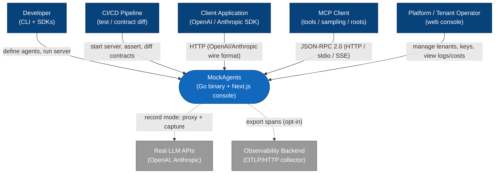
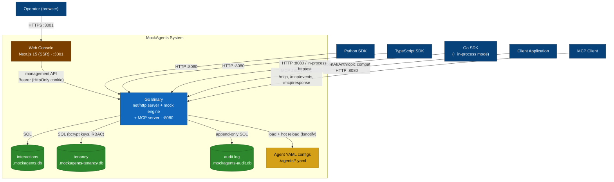
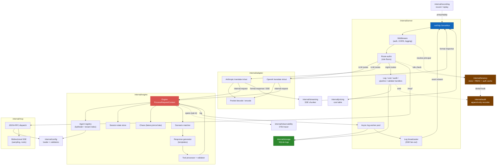
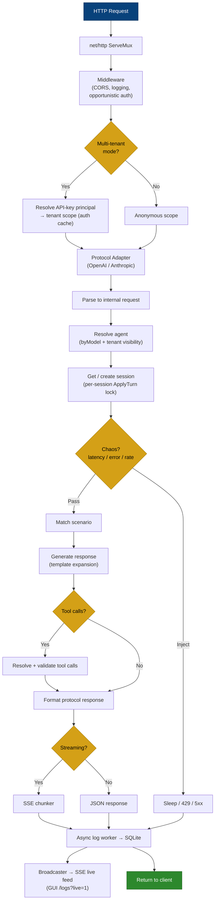
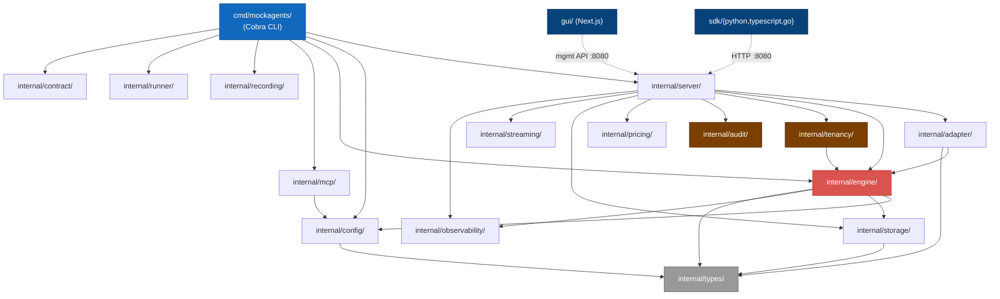
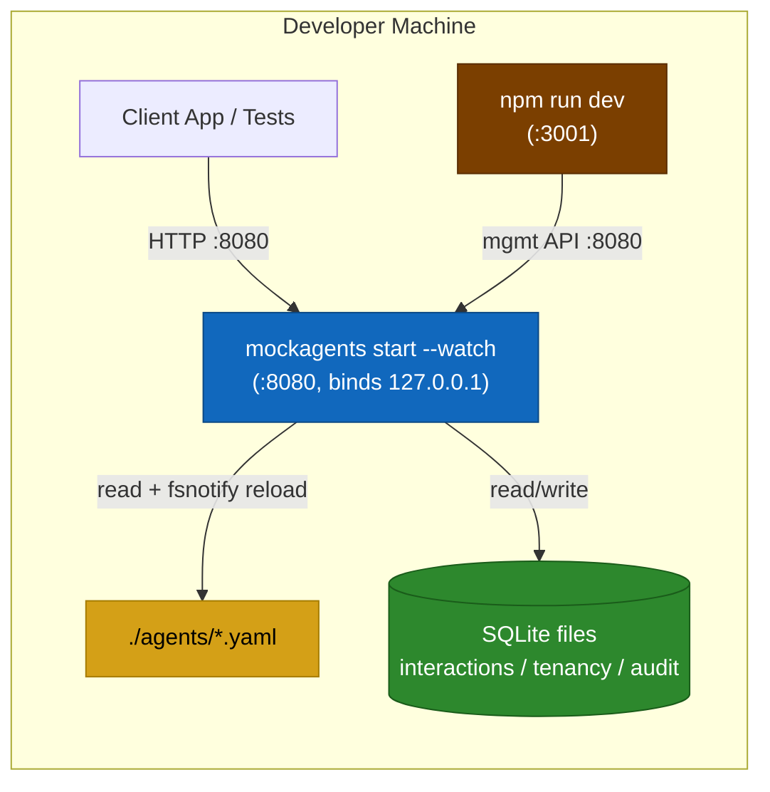
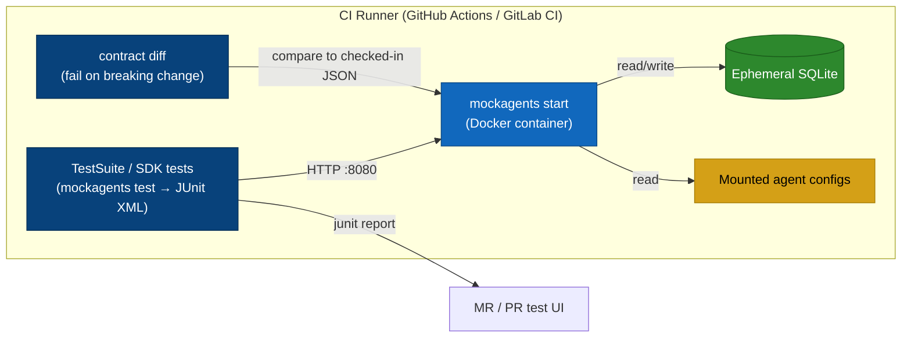
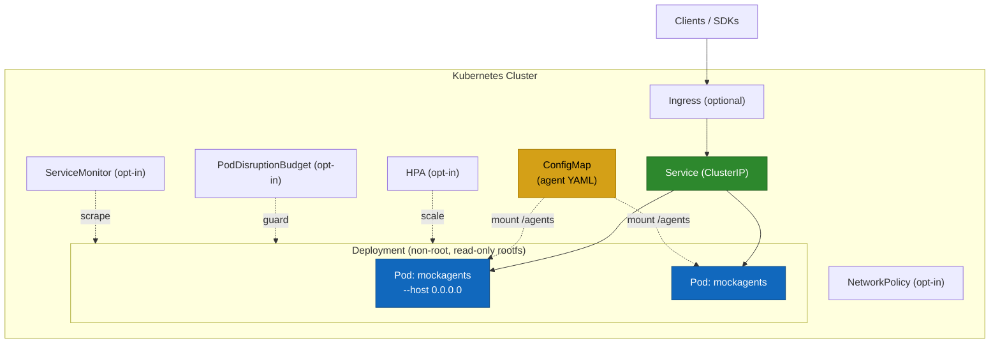
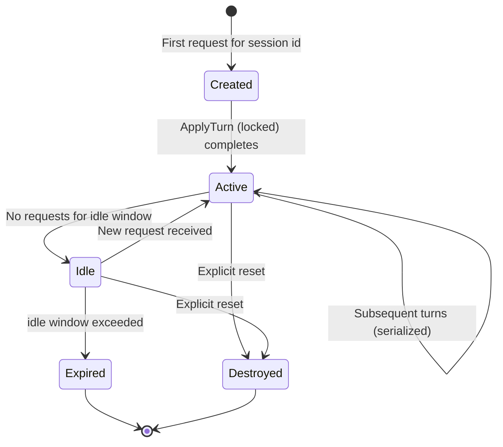

# MockAgents Architecture Diagrams

Mermaid architecture diagrams for MockAgents — a Go-based mock server that is a
drop-in replacement for the OpenAI and Anthropic APIs, with a mock MCP server, a
multi-tenant control plane, three language SDKs, and a Next.js web console.

The system ships as a **single static Go binary** (pure-Go SQLite, no cgo) plus
an optional Next.js console. The diagrams below reflect the current
implementation; the package layout maps 1:1 to `internal/*`. See
[`architecture.md`](architecture.md) for prose and
[`sequence-diagrams.md`](sequence-diagrams.md) for per-flow sequences.

---

## 1. System Context Diagram (C4 Level 1)

MockAgents in the context of its external actors and systems.



---

## 2. Container Diagram (C4 Level 2)

The deployable units and how they communicate. The Go binary serves both the
LLM-compatible endpoints and the management API; the console is a separate
Next.js process that talks to the binary over HTTP.



---

## 3. Component Diagram (C4 Level 3)

Internal Go packages (`internal/*`) and the request data flow. Request path:
**HTTP → middleware → adapter → engine → response generator → adapter → HTTP
(optionally SSE)**.



---

## 4. Request Processing Pipeline

How an incoming LLM-compatible request is processed end-to-end, including the
multi-tenant and live-feed paths.



---

## 5. Package / Module Diagram

Go package structure and dependency direction. Two conventions are enforced:
**`tenancy` may import `engine`, never the reverse** (the engine uses
`engine.WithTenantID` / `TenantIDFromContext`), and **`audit` does not import
`tenancy`** (the server injects a principal-extraction function).



---

## 6. Deployment Diagrams

### 6a. Local Development



### 6b. CI/CD Pipeline



### 6c. Kubernetes (Helm chart)



---

## 7. Data Flow Diagram

How the primary data categories — agent definitions, requests, responses,
interaction logs, tenancy/auth, audit events, costs, and the live feed — move
through the system.

```mermaid
flowchart LR
    yamlfiles["Agent YAML"]
    client["Client App"]
    operator["Operator (console)"]
    engine["Mock Engine"]
    tenancy["Tenancy<br/>(auth + RBAC)"]
    state["Session State"]
    interactions[("Interactions DB")]
    auditdb[("Audit DB")]
    pricing["Pricing table"]
    feed["SSE Live Feed"]

    yamlfiles -->|"1. load + hot reload"| engine
    operator -->|"2. Bearer key"| tenancy
    tenancy -->|"3. tenant scope"| engine
    client -->|"4. LLM request"| engine
    engine -->|"5. read/update"| state
    engine -->|"6. mock response"| client
    engine -->|"7. write log (+ tenant_id)"| interactions
    interactions -->|"8. stream new rows"| feed
    feed -->|"9. live tail"| operator
    interactions -->|"10. aggregate"| pricing
    pricing -->|"11. cost_usd"| operator
    tenancy -. mutations + auth.denied .-> auditdb
    auditdb -->|"12. query"| operator

    style engine fill:#d9534f,stroke:#c12e2a,color:#fff
    style interactions fill:#2d882d,stroke:#1a5c1a,color:#fff
    style auditdb fill:#2d882d,stroke:#1a5c1a,color:#fff
    style tenancy fill:#7b3f00,stroke:#5a2d00,color:#fff
    style yamlfiles fill:#d4a017,stroke:#a67c00,color:#000
    style state fill:#5bc0de,stroke:#31b0d5,color:#000
```

---

## 8. State Diagram — Conversation Session Lifecycle

Sessions are keyed by id, pre-size their history slice, and serialize same-id
turns under a per-session `ApplyTurn` critical section so concurrent requests
cannot interleave append / match / generate / append.



---

## 9. Evolution Roadmap Diagram

What has landed (Phases 1–4, internal milestones v0.1 → v0.3) and what remains.

```mermaid
flowchart LR
    subgraph p1["Phase 1 — Foundation (done)"]
        direction TB
        a1["Go core + net/http"]
        a2["OpenAI + Anthropic adapters"]
        a3["Static + template responses"]
        a4["SQLite logs · CLI"]
    end

    subgraph p2["Phase 2 — Testing & Multi-Agent (done)"]
        direction TB
        b1["TestSuite runner + JUnit"]
        b2["Pipelines (seq/par/graph)"]
        b3["Record & replay"]
        b4["Python/TS/Go SDKs"]
    end

    subgraph p3["Phase 3 — Resilience & MCP (done)"]
        direction TB
        c1["Chaos engine"]
        c2["MCP v0.1–v0.3<br/>(HTTP/stdio/SSE duplex)"]
        c3["Streaming cassettes"]
    end

    subgraph p4["Phase 4 — Enterprise & Scale (v0.3)"]
        direction TB
        d1["Contracts + OTel"]
        d2["Multi-tenant RBAC<br/>(+ platform role)"]
        d3["Costs · audit · Helm"]
        d4["Web console + live feed"]
    end

    subgraph next["Deferred / Next"]
        direction TB
        e1["Postgres tenancy store"]
        e2["SSO / OAuth · billing"]
        e3["Per-tenant name isolation"]
        e4["Pipeline workflow editor<br/>(drag-to-rewire)"]
    end

    p1 --> p2 --> p3 --> p4 --> next

    style p1 fill:#2d882d,stroke:#1a5c1a,color:#fff
    style p2 fill:#2d882d,stroke:#1a5c1a,color:#fff
    style p3 fill:#2d882d,stroke:#1a5c1a,color:#fff
    style p4 fill:#1168bd,stroke:#0b4884,color:#fff
    style next fill:#d9534f,stroke:#c12e2a,color:#fff
```


