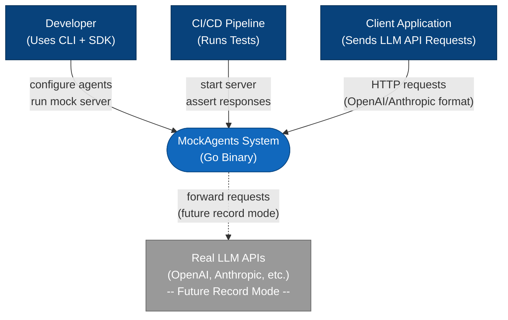
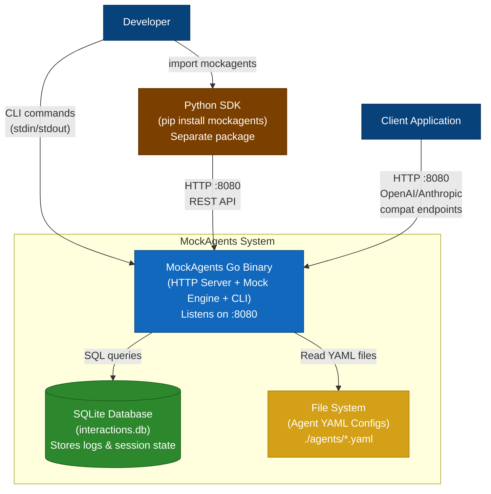
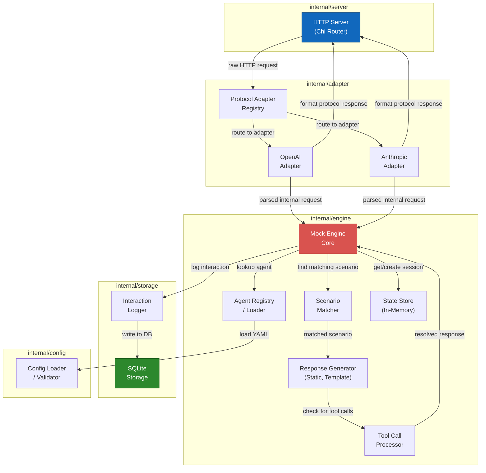
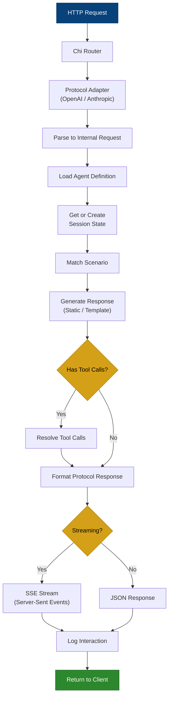
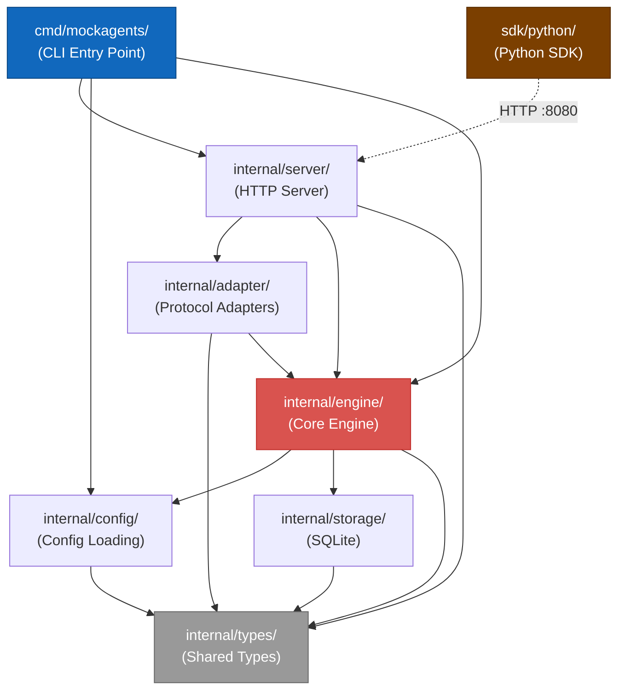
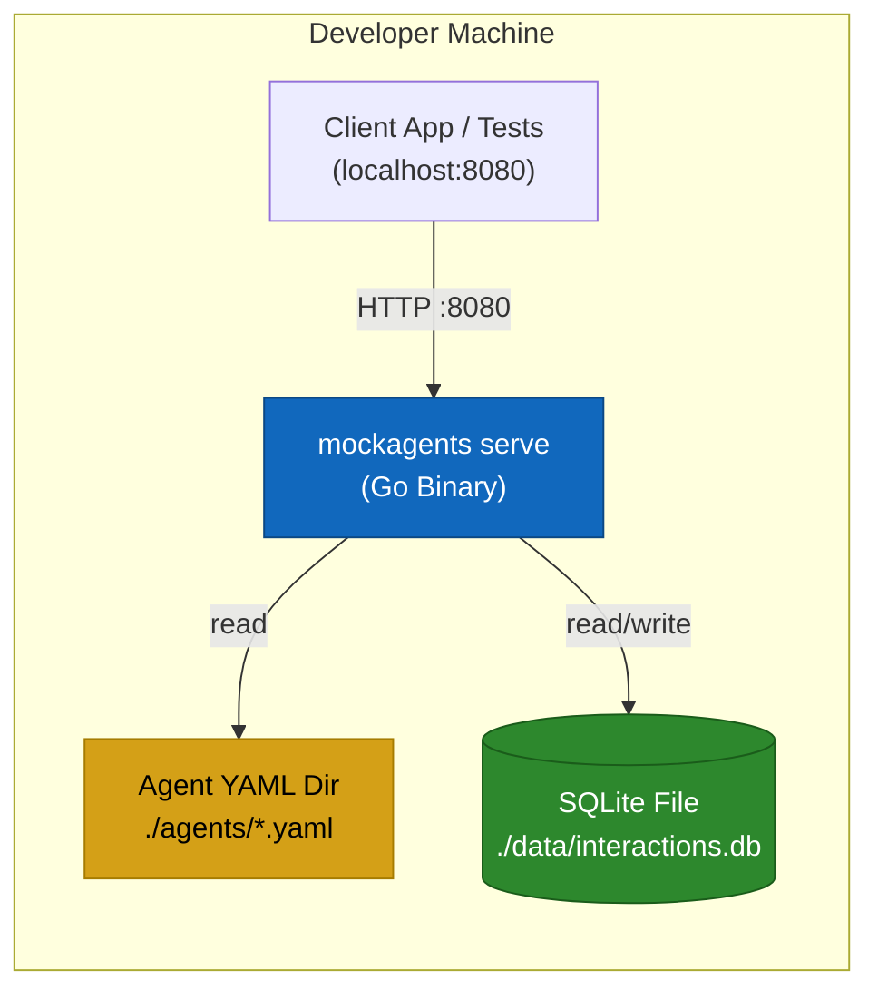
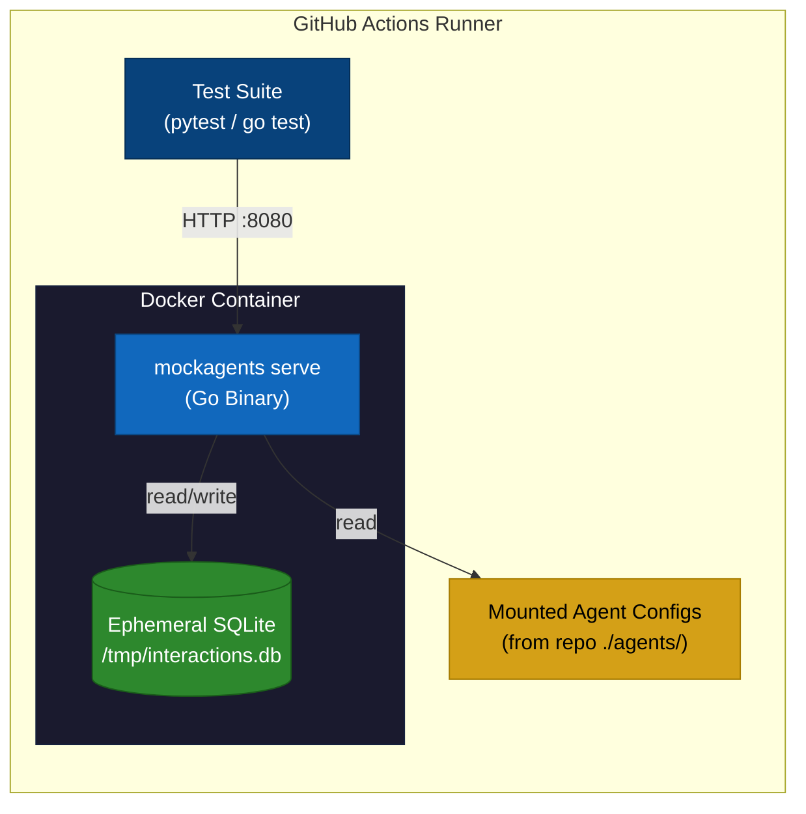
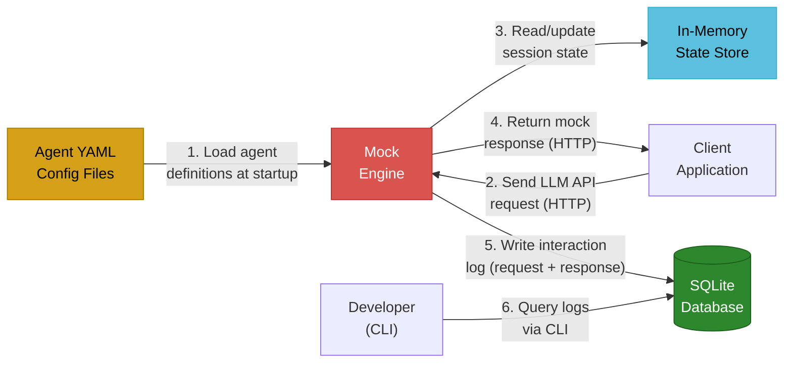
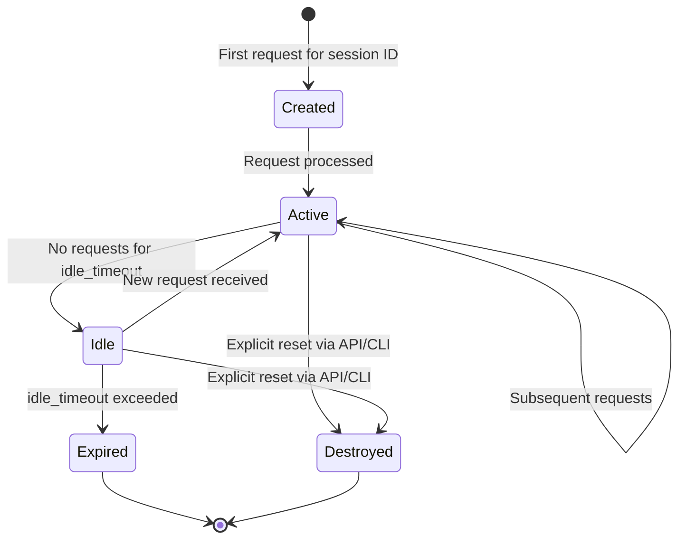

# MockAgents Architecture Diagrams

This document contains Mermaid-based architecture diagrams for MockAgents, a platform for mocking AI agent integrations. MockAgents uses a Go core engine, monorepo layout, SQLite storage, and ships as a CLI-only MVP.

---

## 1. System Context Diagram (C4 Level 1)

Shows MockAgents in the context of its external actors and systems.

---

## 2. Container Diagram (C4 Level 2)

Shows the high-level containers that make up MockAgents and how they communicate.

---

## 3. Component Diagram (C4 Level 3)

Shows the internal Go packages and how data flows between them.

---

## 4. Request Processing Pipeline

Step-by-step flow of how an incoming HTTP request is processed and a response is returned.

---

## 5. Package / Module Diagram

Shows the Go module structure and dependency relationships between packages.

---

## 6. Deployment Diagrams

### 6a. Local Development

How a developer runs MockAgents on their own machine during development or manual testing.

### 6b. CI/CD Pipeline

How MockAgents runs inside a continuous integration environment.

---

## 7. Data Flow Diagram

Shows how the four primary categories of data -- agent definitions, requests, responses, and logs -- move through the system.

---

## 8. State Diagram -- Conversation Session Lifecycle

Shows the states a conversation session goes through from creation to expiration.

---

## 9. Evolution Roadmap Diagram

Shows how the MockAgents architecture is planned to evolve across phases.

```mermaid
flowchart LR
    subgraph mvp["MVP (Phase 1)"]
        direction TB
        m1["Go Monolith"]
        m2["CLI Interface"]
        m3["SQLite Storage"]
        m4["OpenAI + Anthropic\nAdapters"]
        m5["Static + Template\nResponses"]
    end

    subgraph phase2["Phase 2"]
        direction TB
        p2a["Built-in Test Runner"]
        p2b["Multi-Agent\nOrchestration"]
        p2c["Python SDK"]
        p2d["Scenario Sequencing"]
    end

    subgraph phase3["Phase 3"]
        direction TB
        p3a["Chaos Engine\n(Latency, Errors)"]
        p3b["MCP Protocol\nSupport"]
        p3c["Internal\nMessage Bus"]
        p3d["Record & Replay\nMode"]
    end

    subgraph phase4["Phase 4"]
        direction TB
        p4a["PostgreSQL\nOption"]
        p4b["Kubernetes\nDeployment"]
        p4c["Web GUI\nDashboard"]
        p4d["Cloud-Hosted\nService"]
    end

    mvp -->|"+ testing\n+ multi-agent"| phase2
    phase2 -->|"+ chaos\n+ MCP"| phase3
    phase3 -->|"+ scale\n+ GUI"| phase4

    style mvp fill:#2d882d,stroke:#1a5c1a,color:#fff
    style phase2 fill:#1168bd,stroke:#0b4884,color:#fff
    style phase3 fill:#d4a017,stroke:#a67c00,color:#000
    style phase4 fill:#d9534f,stroke:#c12e2a,color:#fff
```

