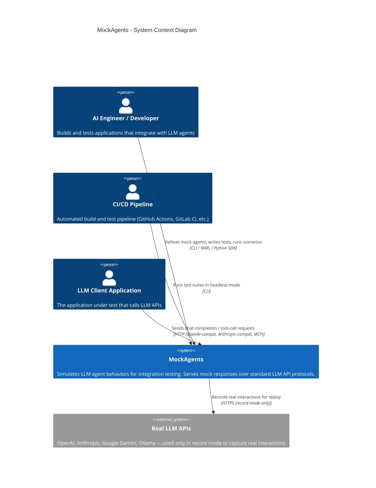
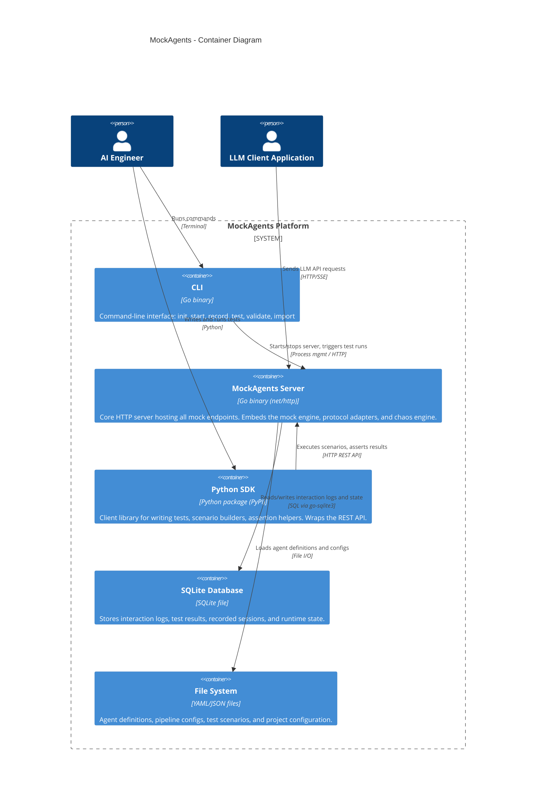
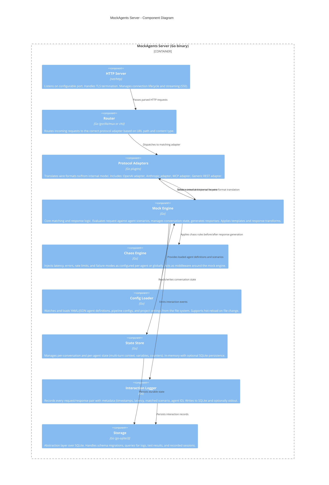
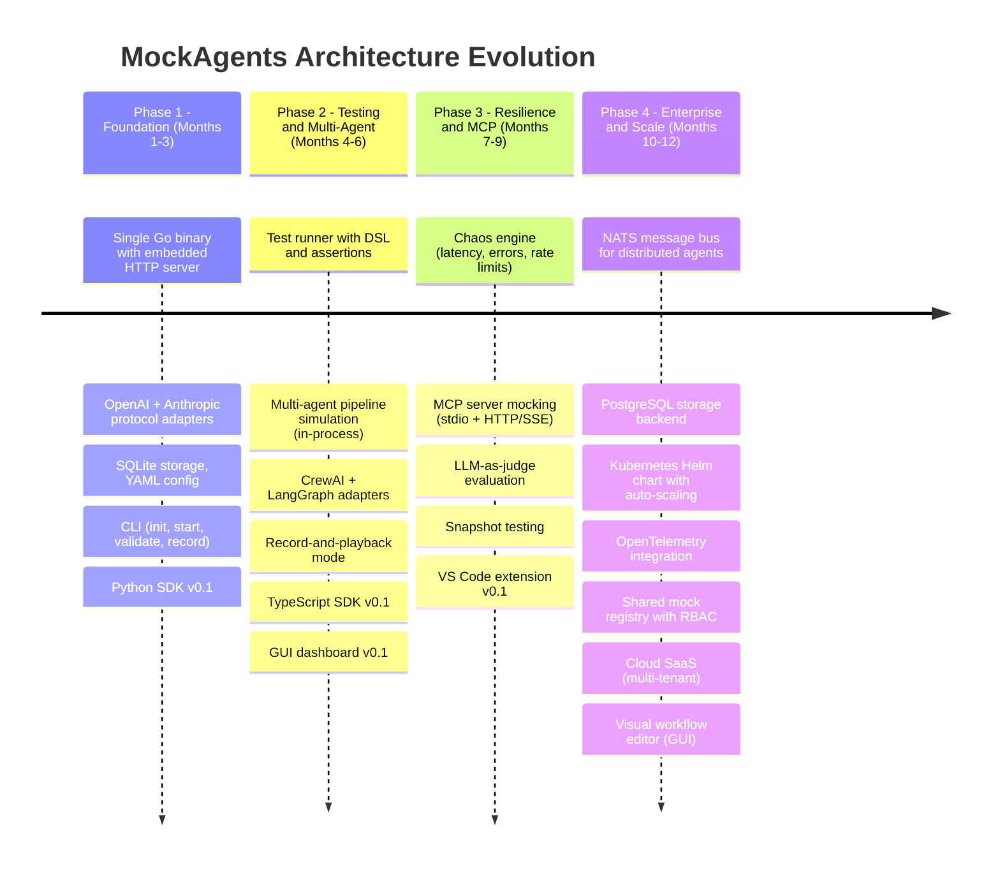
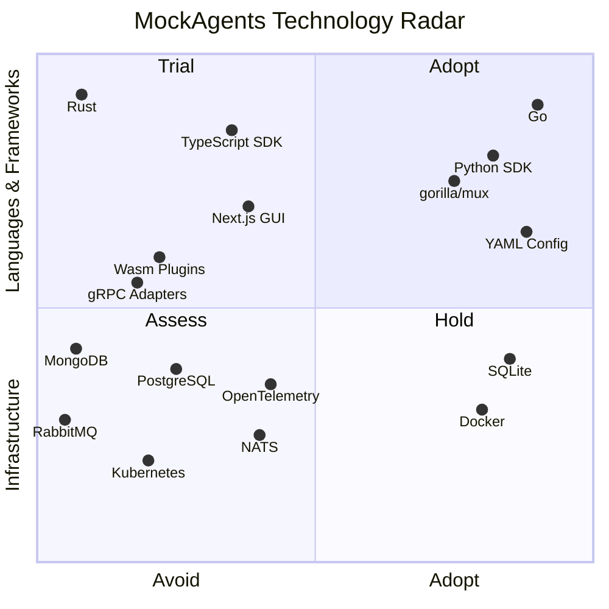

# MockAgents --- Architecture Document

> **Implementation status (2026-04-13):** this architecture document
> describes the target design. The current code layout —
> `internal/{adapter,engine,server,streaming,storage,config,cli,types,contract,observability,mcp,recording,runner,tenancy}`,
> `cmd/mockagents/`, `sdk/{python,typescript,go}/`, `gui/`, and
> `deploy/helm/mockagents/` — is documented in [PROGRESS.md](./PROGRESS.md).
> Treat PROGRESS.md as the source of truth for which components
> actually exist and how they interconnect today.

**A Platform for Simulating, Testing, and Validating AI Agent Integrations**

| Field            | Value                                                        |
| ---------------- | ------------------------------------------------------------ |
| Version          | 1.0                                                          |
| Date             | April 7, 2026                                                |
| Status           | Draft                                                        |
| Authors          | MockAgents Core Team                                         |
| Reviewers        | ---                                                          |
| Related Docs     | [Product Plan](../mock-agents-product-plan.md)               |
| Repository       | `github.com/mockagents/mockagents` (monorepo)                |

---

## Table of Contents

1. [Architecture Vision](#1-architecture-vision)
2. [C4 Model](#2-c4-model)
   - [Context Diagram](#21-context-diagram)
   - [Container Diagram](#22-container-diagram)
   - [Component Diagram](#23-component-diagram)
3. [Architecture Decision Records](#3-architecture-decision-records)
4. [Quality Attributes](#4-quality-attributes)
5. [Evolution Path](#5-evolution-path)
6. [Technology Radar](#6-technology-radar)

---

## 1. Architecture Vision

MockAgents exists to give AI Engineers the same confidence in their agent integrations that WireMock and Mockoon give to traditional API developers. Every architectural choice is evaluated against five guiding principles.

### 1.1 Plugin-First

The system is built around extension points, not special cases. Every protocol (OpenAI, Anthropic, MCP) is implemented as an adapter plugin that conforms to a common interface. No protocol gets hard-coded privileges in the core engine. Third-party developers can add support for new LLM APIs or agent frameworks without modifying core code.

### 1.2 Protocol-Agnostic Core

The mock engine operates on an internal, protocol-neutral representation of agent interactions. It has no knowledge of OpenAI's `function_calling` field or Anthropic's `tool_use` block. Protocol adapters translate between wire formats and the core model. This means the engine's matching logic, state machine, chaos injection, and response generation work identically regardless of which LLM API is being mocked.

### 1.3 Local-First

The default deployment is a single binary running on a developer's laptop. No cloud account, no Docker, no database server. Everything stores to the local file system and an embedded SQLite database. Network access is only required if the developer explicitly enables record mode against a real LLM API.

### 1.4 Zero-Config Defaults

Running `mockagents start` with a single YAML agent definition file should work with no additional configuration. Sensible defaults are provided for every setting: port, storage path, log level, timeout, and streaming chunk size. Configuration is progressive --- you only need to specify what you want to change.

### 1.5 Progressive Complexity

A beginner can define a static mock agent in 10 lines of YAML. An advanced user can build a multi-agent graph pipeline with chaos injection, custom evaluators, and CI/CD integration. The architecture supports this spectrum by layering capabilities: static responses, then templates, then scenarios, then state machines, then multi-agent orchestration.

---

## 2. C4 Model

### 2.1 Context Diagram

The system context shows MockAgents and the actors and external systems it interacts with.



### 2.2 Container Diagram

The container diagram shows the major deployable/runnable pieces of the system.



### 2.3 Component Diagram

The component diagram zooms into the MockAgents Server container to show its internal architecture.



---

## 3. Architecture Decision Records

### ADR-001: Go over Rust for Core Engine

| Field        | Value        |
| ------------ | ------------ |
| **Status**   | Accepted     |
| **Date**     | 2026-04-07   |

**Context**

The product plan initially recommended Rust for the core engine, citing performance and single-binary distribution. However, the primary audience is AI Engineers, many of whom are familiar with Go but not Rust. The project needs a large contributor base quickly to build protocol adapters. Build times, cross-compilation simplicity, and onboarding friction are critical factors for an open-source project targeting rapid community growth.

**Decision**

Use Go as the language for the core engine, CLI, and all server-side components.

**Consequences**

- Positive: Go has a gentler learning curve, attracting more contributors. Cross-compilation to Linux, macOS, and Windows is trivial with `GOOS`/`GOARCH`. The standard library's `net/http` is production-grade with excellent streaming support. Goroutines provide lightweight concurrency for handling many simultaneous mock connections.
- Positive: Single-binary distribution is preserved --- Go compiles to a static binary just like Rust.
- Positive: CGo interop with SQLite (via `go-sqlite3`) is well-established.
- Negative: Go is slower than Rust for CPU-bound work, but mock agent serving is I/O-bound, so this is not a practical concern for the MVP.
- Negative: Go's type system is less expressive than Rust's, requiring more discipline around error handling and interface design.

---

### ADR-002: Monorepo Structure

| Field        | Value        |
| ------------ | ------------ |
| **Status**   | Accepted     |
| **Date**     | 2026-04-07   |

**Context**

MockAgents consists of multiple deliverables: the Go server, CLI, Python SDK, TypeScript SDK (future), documentation, CI/CD plugins, and protocol adapter plugins. These components share types, schemas, and test fixtures. The team is small and needs to iterate quickly across boundaries.

**Decision**

Use a single monorepo for all components with the following top-level structure:

```
mockagents/
  cmd/                  # Go CLI and server entry points
  internal/             # Go internal packages (engine, adapters, storage)
  pkg/                  # Go public packages (shared types, test helpers)
  sdk/
    python/             # Python SDK (PyPI package)
    typescript/         # TypeScript SDK (npm package, future)
  adapters/             # Protocol adapter plugins
  configs/              # Example agent definitions and templates
  tests/                # Integration and end-to-end tests
  docs/                 # Documentation
  .github/              # CI/CD workflows
  go.mod
  go.sum
```

**Consequences**

- Positive: Atomic commits across server and SDK ensure API changes and client updates ship together.
- Positive: Shared CI pipeline validates cross-component compatibility on every PR.
- Positive: Single issue tracker and PR workflow reduces coordination overhead.
- Negative: Repository size will grow over time, but tooling like sparse checkout and Go module boundaries mitigate this.
- Negative: Language-specific tooling (Go, Python, TypeScript) must coexist, requiring slightly more complex CI configuration.

---

### ADR-003: SQLite for Local Storage

| Field        | Value        |
| ------------ | ------------ |
| **Status**   | Accepted     |
| **Date**     | 2026-04-07   |

**Context**

MockAgents needs persistent storage for interaction logs, test results, recorded sessions, and runtime state. The local-first principle requires zero external dependencies. Developers should not need to install or configure a database server.

**Decision**

Use SQLite as the sole database for the MVP. The database file is stored alongside the project in a `.mockagents/` directory. Access is through the `go-sqlite3` CGo driver with WAL mode enabled for concurrent reads.

**Consequences**

- Positive: Zero configuration --- the database is created automatically on first run.
- Positive: The entire test history is a single file that can be committed, shared, or deleted.
- Positive: SQLite's performance is more than sufficient for local development workloads (thousands of interactions per second).
- Positive: WAL mode allows the server to write logs while the CLI reads test results concurrently.
- Negative: SQLite does not support multi-node deployments. This is acceptable for the MVP but will require migration to PostgreSQL for the cloud/enterprise tier (see Evolution Path).
- Negative: CGo dependency adds cross-compilation complexity. Mitigated by using pre-built binaries and Docker for distribution.

---

### ADR-004: Protocol Adapter Plugin Architecture

| Field        | Value        |
| ------------ | ------------ |
| **Status**   | Accepted     |
| **Date**     | 2026-04-07   |

**Context**

MockAgents must support multiple LLM API protocols (OpenAI, Anthropic, MCP, Gemini, Ollama) and agent frameworks (CrewAI, LangGraph, AutoGen). Each protocol has a distinct wire format, authentication scheme, and streaming behavior. New protocols and frameworks emerge frequently.

**Decision**

Define a Go `Adapter` interface that all protocol adapters must implement:

```go
type Adapter interface {
    // Name returns the adapter's unique identifier (e.g., "openai", "anthropic").
    Name() string
    // Routes returns the HTTP routes this adapter handles.
    Routes() []Route
    // ParseRequest converts an incoming HTTP request into an internal AgentRequest.
    ParseRequest(r *http.Request) (*AgentRequest, error)
    // FormatResponse converts an internal AgentResponse into an HTTP response.
    FormatResponse(w http.ResponseWriter, resp *AgentResponse) error
    // FormatStreamChunk writes a single streaming chunk in the adapter's wire format.
    FormatStreamChunk(w http.ResponseWriter, chunk *StreamChunk) error
}
```

Adapters are registered at startup. The router inspects incoming requests and dispatches to the matching adapter. For the MVP, adapters are compiled into the binary. Post-MVP, a Go plugin or gRPC sidecar model will allow external adapters.

**Consequences**

- Positive: Adding a new protocol requires only implementing the `Adapter` interface --- no changes to the core engine.
- Positive: Each adapter is independently testable with its own fixture data.
- Positive: The core engine remains protocol-agnostic, reducing coupling and bug surface.
- Negative: The Go `plugin` package has platform limitations (Linux only, no Windows support). Post-MVP will evaluate gRPC-based out-of-process adapters or Wasm plugins as alternatives.
- Negative: Compiled-in adapters mean adding a new protocol requires rebuilding the binary for MVP. Acceptable for the initial release.

---

### ADR-005: In-Process Architecture (No Message Bus for MVP)

| Field        | Value        |
| ------------ | ------------ |
| **Status**   | Accepted     |
| **Date**     | 2026-04-07   |

**Context**

The product plan envisions inter-agent communication via message passing for multi-agent pipeline simulation. A message bus (NATS, RabbitMQ) would add infrastructure complexity. The MVP targets single-developer local usage where all agents run in a single process.

**Decision**

For the MVP, all components (mock engine, adapters, chaos engine, state store) run in-process within a single Go binary. Multi-agent pipelines are simulated by the mock engine invoking agents sequentially or concurrently via goroutines and Go channels --- no external message bus.

**Consequences**

- Positive: Zero infrastructure dependencies --- the entire platform is one binary and one SQLite file.
- Positive: Dramatically simpler debugging and profiling (single process, single log stream).
- Positive: Lower latency for multi-agent simulation since there is no network hop between agents.
- Positive: Faster development velocity --- no need to design message schemas or handle bus connectivity failures.
- Negative: Cannot distribute agent simulation across multiple machines. Acceptable for local testing workloads.
- Negative: A single process limits throughput for large-scale load testing. The evolution path (Phase 4) introduces NATS for distributed execution.

---

### ADR-006: YAML-First Configuration

| Field        | Value        |
| ------------ | ------------ |
| **Status**   | Accepted     |
| **Date**     | 2026-04-07   |

**Context**

Agent definitions, pipeline configurations, and test scenarios need a human-readable, version-control-friendly format. The AI engineering community is familiar with YAML from Kubernetes manifests, Docker Compose files, and GitHub Actions workflows.

**Decision**

YAML is the primary configuration format. JSON is supported as an alternative (since valid JSON is valid YAML). All configuration examples, documentation, and templates use YAML. The config loader accepts both `.yaml` and `.json` extensions.

Agent definition files follow a Kubernetes-inspired structure with `apiVersion`, `kind`, `metadata`, and `spec` fields for familiarity and future extensibility.

**Consequences**

- Positive: YAML is widely known in the target audience. The Kubernetes-inspired structure is immediately recognizable.
- Positive: YAML supports comments, which are essential for documenting agent behaviors and test rationale.
- Positive: YAML files diff cleanly in Git, supporting the version-control-friendly design goal.
- Positive: JSON compatibility means programmatic generation of config files is straightforward.
- Negative: YAML has well-known pitfalls (indentation sensitivity, implicit type coercion of values like `no` to boolean). Mitigated by providing a JSON Schema for validation and the `mockagents validate` command.
- Negative: Large agent definitions can become verbose. Mitigated by supporting `$ref` includes and agent template inheritance.

---

### ADR-007: Python SDK as First-Class Citizen

| Field        | Value        |
| ------------ | ------------ |
| **Status**   | Accepted     |
| **Date**     | 2026-04-07   |

**Context**

The AI engineering ecosystem is predominantly Python. LangChain, CrewAI, AutoGen, LlamaIndex, and the official OpenAI/Anthropic client libraries are all Python-first. The majority of MockAgents users will write tests in Python using pytest.

**Decision**

The Python SDK is the first and most fully-featured client library. It is developed in the monorepo under `sdk/python/` and published to PyPI as `mockagents`. The SDK provides:

- A `MockAgentServer` context manager for starting/stopping the Go server from Python tests.
- Scenario builders with a fluent API.
- An assertion library (`expect()`) integrated with pytest.
- Typed models for agent definitions, generated from the Go types via code generation.

The SDK communicates with the server over HTTP (localhost). It does not embed the Go engine --- it manages the server as a subprocess.

**Consequences**

- Positive: Python developers can `pip install mockagents` and start writing tests immediately.
- Positive: Integration with pytest means MockAgents fits naturally into existing test suites.
- Positive: The SDK managing the server as a subprocess means Python tests are self-contained --- no manual server startup required.
- Negative: The subprocess model adds startup latency (~200ms to launch the Go binary). Acceptable for integration tests.
- Negative: Python SDK development requires maintaining parity with server API changes. Mitigated by code generation from shared schemas.
- Negative: TypeScript and Go SDKs are deferred, which may slow adoption among non-Python teams. Mitigated by the language-agnostic REST API.

---

## 4. Quality Attributes

### 4.1 Performance

| Concern                  | Approach                                                                                                 |
| ------------------------ | -------------------------------------------------------------------------------------------------------- |
| Request latency          | Go's `net/http` with goroutine-per-request model. Target: < 5ms p99 for static mock responses.           |
| Streaming throughput     | Chunked transfer encoding with configurable chunk size and timing. Backpressure handled via Go channels.  |
| Concurrent connections   | Goroutines scale to tens of thousands of simultaneous connections with minimal memory overhead.            |
| Startup time             | Single binary, no JVM or interpreter warmup. Target: < 500ms from `mockagents start` to first request.   |
| Database I/O             | SQLite WAL mode allows concurrent reads. Write-ahead logging batches interaction log writes.              |

### 4.2 Extensibility

| Concern                  | Approach                                                                                                 |
| ------------------------ | -------------------------------------------------------------------------------------------------------- |
| New protocols            | Implement the `Adapter` interface. No core changes required.                                              |
| Custom response logic    | Template functions are extensible. Post-MVP: Wasm or gRPC plugin model for custom generators.             |
| Custom evaluators        | Python SDK supports user-defined evaluator functions registered via decorator.                             |
| Storage backends         | The `Storage` interface abstracts SQLite. PostgreSQL adapter planned for Phase 4.                         |
| Chaos rules              | Chaos engine accepts rule objects. Users define custom fault injection via configuration.                  |

### 4.3 Testability

| Concern                  | Approach                                                                                                 |
| ------------------------ | -------------------------------------------------------------------------------------------------------- |
| Unit testing adapters    | Each adapter has its own test suite with captured request/response fixtures.                               |
| Integration testing      | The `tests/` directory contains end-to-end scenarios run against the compiled binary.                     |
| SDK testing              | Python SDK tests start the server as a subprocess and run real HTTP scenarios.                             |
| CI reliability           | All tests are deterministic (no external API calls). SQLite databases are created fresh per test.          |
| Dogfooding               | MockAgents tests its own protocol adapters using its own mock engine.                                     |

### 4.4 Developer Experience

| Concern                  | Approach                                                                                                 |
| ------------------------ | -------------------------------------------------------------------------------------------------------- |
| Time to first mock       | `mockagents init` scaffolds a working project. `mockagents start` serves it. Target: under 2 minutes.     |
| Error messages           | Config validation produces line-number-specific YAML error messages with fix suggestions.                 |
| Hot reload               | File watcher reloads agent definitions on save. No server restart required.                               |
| Documentation            | Every CLI command has `--help`. Agent definition schema is self-documenting via JSON Schema.               |
| Debugging                | `--verbose` flag logs every matching decision. Interaction logs are queryable via CLI.                    |

### 4.5 Portability

| Concern                  | Approach                                                                                                 |
| ------------------------ | -------------------------------------------------------------------------------------------------------- |
| Operating systems        | Go cross-compiles to Linux, macOS (arm64 + amd64), and Windows. CI builds and tests on all three.        |
| Containers               | Official Docker image based on `scratch` or `alpine`. Multi-arch (amd64, arm64).                         |
| CI/CD environments       | Single binary with no runtime dependencies. Works in any CI runner with filesystem access.                |
| Air-gapped environments  | No network required for core functionality. All dependencies are compiled into the binary.                |

---

## 5. Evolution Path

The architecture is designed to evolve across four phases without requiring rewrites. Each phase adds capabilities by extending interfaces, not by replacing implementations.



### Phase 1 to Phase 2: Adding the Test Runner

- The test runner is a new top-level component alongside the mock engine. It reuses the same `Adapter` interfaces to send requests and validate responses.
- Multi-agent pipelines are orchestrated in-process using goroutines and Go channels. The `Pipeline` config type is a DAG of agent references with conditional edges.
- The GUI dashboard is a separate container (Next.js) that communicates with the server via the REST API. The server gains new API endpoints for agent catalog, interaction history, and live traffic.

### Phase 2 to Phase 3: Adding Chaos and MCP

- The chaos engine is implemented as middleware that wraps the mock engine. It intercepts responses and applies latency, error injection, or rate limiting based on per-agent chaos configuration.
- MCP support adds a new adapter that handles both stdio and HTTP/SSE transports. The stdio adapter spawns as a subprocess, and the HTTP/SSE adapter runs within the existing HTTP server.
- The VS Code extension uses the Language Server Protocol (LSP) backed by the `mockagents validate` command for real-time YAML schema validation.

### Phase 3 to Phase 4: Scaling Out

- **NATS message bus**: The in-process Go channel communication is abstracted behind a `MessageBus` interface. Phase 4 adds a NATS implementation alongside the existing in-memory implementation. Multi-agent pipelines can now span multiple processes or machines.
- **PostgreSQL**: The `Storage` interface gains a PostgreSQL implementation. A migration tool converts SQLite data to PostgreSQL for teams upgrading.
- **Kubernetes**: The Helm chart deploys the server as a Deployment with a HorizontalPodAutoscaler. The NATS bus and PostgreSQL run as separate pods (or use managed services).
- **OpenTelemetry**: The interaction logger emits traces and metrics in OTEL format. A new `--otel-endpoint` flag configures the collector destination.
- **RBAC and multi-tenancy**: The server adds an authentication middleware layer. Agent definitions are scoped to organizations. The shared mock registry is a new API backed by PostgreSQL.

---

## 6. Technology Radar

The technology radar categorizes technologies by their current status in the MockAgents project.



### Adopt (Use in production now)

| Technology       | Rationale                                                                                        |
| ---------------- | ------------------------------------------------------------------------------------------------ |
| **Go**           | Core language for server, CLI, and adapters. Strong concurrency, single-binary output, large community. |
| **SQLite**       | Embedded local storage. Zero-config, single-file, sufficient performance for development workloads. |
| **YAML**         | Primary configuration format. Familiar to target audience, Git-friendly, supports comments.       |
| **Python SDK**   | First-class client library. Matches the dominant language of the AI engineering ecosystem.         |
| **Docker**       | Container distribution for CI/CD and team environments. Standard practice.                        |
| **gorilla/mux** (or chi) | HTTP router for the Go server. Mature, well-tested, supports middleware chaining.          |

### Trial (Actively evaluating for near-term adoption)

| Technology         | Rationale                                                                                      |
| ------------------ | ---------------------------------------------------------------------------------------------- |
| **NATS**           | Lightweight message bus for Phase 4 distributed multi-agent simulation. Evaluating vs. in-process channels. |
| **Next.js**        | GUI dashboard framework. Evaluating for Phase 2 dashboard.                                     |
| **TypeScript SDK** | Second SDK. Planned for Phase 2 to reach full-stack developers.                                |
| **OpenTelemetry**  | Observability standard. Planned for Phase 4 but evaluating early integration.                  |

### Assess (Investigating, no commitment yet)

| Technology         | Rationale                                                                                      |
| ------------------ | ---------------------------------------------------------------------------------------------- |
| **Wasm plugins**   | Alternative to Go's `plugin` package for cross-platform adapter extensibility.                 |
| **PostgreSQL**     | Required for cloud/multi-tenant deployment in Phase 4. Assessing migration path from SQLite.   |
| **Kubernetes**     | Helm chart deployment for scale testing and enterprise. Assessing complexity vs. Docker Compose. |
| **gRPC adapters**  | Out-of-process adapter model for third-party protocol plugins. Assessing performance overhead.  |

### Hold (Not using, decided against for now)

| Technology      | Rationale                                                                                         |
| --------------- | ------------------------------------------------------------------------------------------------- |
| **Rust**        | Considered for core engine (ADR-001). Rejected in favor of Go for contributor accessibility and faster iteration. |
| **RabbitMQ**    | Heavier than NATS for the inter-agent messaging use case. NATS preferred for its simplicity.      |
| **MongoDB**     | Document store considered for interaction logs. SQLite (and later PostgreSQL) provide sufficient querying with simpler operations. |

---

*Document generated for the MockAgents project --- April 2026*
