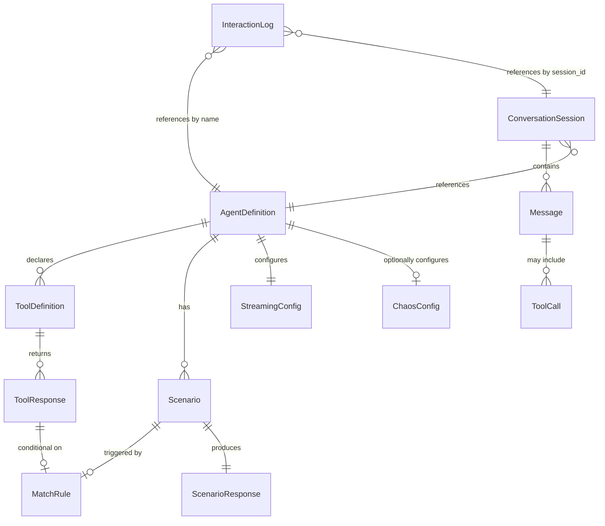

# MockAgents Data Models

| | |
|---|---|
| **Version** | 0.1.0 |
| **Date** | 2026-04-07 |
| **Status** | Draft -- MVP |
| **Audience** | Contributors, architects, integration developers |

---

## 1. Overview

MockAgents uses two storage layers:

| Layer | Technology | Contents | Lifetime |
|---|---|---|---|
| **In-memory** | Go maps / structs | Agent registry (loaded from YAML), conversation session state | Process lifetime |
| **Persistent** | SQLite (`interactions.db`) | Interaction logs (every request/response pair) | Survives restarts |

Agent definitions live on disk as YAML files and are loaded into memory at startup. Conversation sessions are ephemeral and expire after a configurable TTL. Interaction logs are written to SQLite for debugging, replay, and analytics via the CLI.

---

## 2. Domain Model

The entity-relationship diagram below shows how the core domain objects relate to one another.



**Key relationships:**

- An `AgentDefinition` declares zero or more `ToolDefinition`s and `Scenario`s.
- Each `ToolDefinition` has one or more `ToolResponse` rules (including a default).
- Each `Scenario` has an optional `MatchRule` and exactly one `ScenarioResponse`.
- A `ConversationSession` holds an ordered list of `Message`s and is bound to one agent.
- An `InteractionLog` row records a single HTTP request/response exchange, referencing the agent and session by name/ID.

---

## 3. Agent Definition Model

Agent definitions are authored as YAML files and deserialized into Go structs at startup. The canonical schema is defined below field by field.

### 3.1 Top-Level Structure

```yaml
apiVersion: mockagents/v1          # Required. Schema version.
kind: Agent                        # Required. Must be "Agent".
metadata:                          # Required. Identity and labels.
  name: string                     # Required. Unique identifier, kebab-case (e.g., "customer-support-agent").
  description: string              # Optional. Human-readable description.
  tags: [string]                   # Optional. Freeform labels for filtering and grouping.
spec:                              # Required. Agent behavior specification.
  protocol: string                 # Required. Enum: "openai-chat-completions" | "anthropic-messages".
  model: string                    # Required. Model name reported in responses (e.g., "gpt-4o").
  systemPrompt: string             # Optional. System prompt stored for context (not executed).
  tools: [ToolDefinition]          # Optional. Tools this agent can call.
  behavior:                        # Required. Response behavior configuration.
    scenarios: [Scenario]          # Required. Ordered list; first match wins.
    chaos: ChaosConfig             # Optional. Fault injection (out of scope for MVP).
    streaming: StreamingConfig     # Optional. Streaming response settings.
```

### 3.2 ToolDefinition

```yaml
name: string                       # Required. Tool function name (e.g., "lookup_order").
description: string                # Optional. Describes what the tool does.
parameters:                        # Required. JSON Schema object describing input parameters.
  type: object
  properties: { ... }
  required: [string]
responses: [ToolResponse]          # Required. Ordered list of response rules.
```

### 3.3 ToolResponse

Each entry defines a conditional or default response for a tool invocation.

```yaml
# Conditional response:
match:                             # Optional. If present, this rule applies only when input matches.
  <param_name>: <expected_value>   # Exact match on one or more input parameters.
response:                          # One of `response` or `error` is required.
  <key>: <value>                   # Arbitrary JSON object returned as tool output.
error:                             # Alternative to `response`.
  code: string                     # Error code (e.g., "NOT_FOUND").
  message: string                  # Human-readable error message.

# Default response (no match block):
default: true                      # Marks this as the fallback rule.
response:
  <key>: <value>
```

### 3.4 MatchRule

Used by both `ToolResponse` and `Scenario` to decide when a rule applies.

| Field | Type | Context | Description |
|---|---|---|---|
| `<param>: <value>` | map\[string\]any | ToolResponse | Exact match on tool input parameter(s). |
| `content_contains` | string | Scenario | Substring match against the latest user message content. |
| `content_regex` | string | Scenario | Regex match against the latest user message content. |
| `turn_number` | int | Scenario | Matches on the Nth user turn in the session (1-indexed). |

For MVP, scenario matching evaluates rules top-to-bottom; the first match wins. A scenario with no `match` block acts as the default.

### 3.5 Scenario

```yaml
name: string                       # Required. Identifier for this scenario (kebab-case).
match:                             # Optional. Conditions that trigger this scenario.
  content_contains: string         # Substring match on user message.
  content_regex: string            # Regex match on user message.
  turn_number: int                 # Match on conversation turn number.
response:                          # Required. The response to produce.
  content: string                  # Required. Text content of the assistant response.
  tool_calls: [ToolCallSpec]       # Optional. Tool calls the assistant makes.
  metadata: map[string]any         # Optional. Arbitrary metadata (e.g., handoff signals).
```

### 3.6 StreamingConfig

```yaml
enabled: bool                      # Default: false. Whether to support streaming for this agent.
chunk_size: int                    # Default: 4. Number of tokens per SSE chunk.
chunk_delay_ms: int                # Default: 50. Milliseconds between chunks.
```

### 3.7 ChaosConfig (Stub -- Out of Scope for MVP)

Defined here for schema completeness; not implemented in MVP.

```yaml
latency:
  enabled: bool                    # Default: false.
  distribution: string             # Enum: "fixed" | "normal" | "uniform".
  mean_ms: int                     # Mean latency in milliseconds.
  stddev_ms: int                   # Standard deviation (for "normal" distribution).
  min_ms: int                      # Minimum (for "uniform" distribution).
  max_ms: int                      # Maximum (for "uniform" distribution).
errors:
  enabled: bool                    # Default: false.
  rate: float                      # Fraction of requests that return errors (0.0 - 1.0).
  types: [string]                  # Error types to inject (e.g., "500", "503", "timeout").
```

---

## 4. Conversation State Model (In-Memory)

Conversation sessions are held entirely in memory and are not persisted to SQLite. They expire after a configurable TTL.

### 4.1 ConversationSession

| Field | Type | Description |
|---|---|---|
| `id` | string (UUID v4) | Unique session identifier, generated on first request or provided by caller via header. |
| `agent_name` | string | Name of the agent this session is bound to. |
| `messages` | \[\]Message | Ordered conversation history. |
| `created_at` | time.Time | Timestamp when the session was created. |
| `last_active` | time.Time | Timestamp of the most recent request in this session. |
| `ttl` | time.Duration | Time-to-live after last activity. Default: 30 minutes. |
| `metadata` | map\[string\]any | Arbitrary key-value pairs for session-level state (e.g., handoff flags). |

### 4.2 Message

| Field | Type | Description |
|---|---|---|
| `role` | string | One of: `"user"`, `"assistant"`, `"tool"`, `"system"`. |
| `content` | string | Text content of the message. |
| `tool_calls` | \[\]ToolCall | Tool calls made by the assistant (present when role is `"assistant"`). |
| `tool_call_id` | string | Identifies which tool call this message is a response to (present when role is `"tool"`). |

### 4.3 ToolCall

| Field | Type | Description |
|---|---|---|
| `id` | string | Unique identifier for this tool call (e.g., `"call_abc123"`). |
| `function_name` | string | Name of the tool function being called. |
| `arguments` | string (JSON) | JSON-encoded arguments passed to the tool. |

---

## 5. SQLite Schema

The SQLite database stores interaction logs only (MVP). Agent definitions and session state are not persisted to SQLite.

### 5.1 Interaction Logs Table

```sql
CREATE TABLE interaction_logs (
    id              INTEGER PRIMARY KEY AUTOINCREMENT,
    timestamp       TEXT    NOT NULL DEFAULT (datetime('now')),
    agent_name      TEXT    NOT NULL,
    session_id      TEXT    NOT NULL,
    protocol        TEXT    NOT NULL,
    request_method  TEXT    NOT NULL,
    request_path    TEXT    NOT NULL,
    request_body    TEXT,                                       -- JSON
    response_status INTEGER NOT NULL,
    response_body   TEXT,                                       -- JSON (or summary for large responses)
    latency_ms      INTEGER NOT NULL,
    tool_calls_count INTEGER DEFAULT 0,
    streaming       BOOLEAN DEFAULT FALSE,
    error           TEXT,                                       -- error message if any
    created_at      TEXT    NOT NULL DEFAULT (datetime('now'))
);

CREATE INDEX idx_logs_agent     ON interaction_logs(agent_name);
CREATE INDEX idx_logs_session   ON interaction_logs(session_id);
CREATE INDEX idx_logs_timestamp ON interaction_logs(timestamp);
```

### 5.2 Column Reference

| Column | Type | Nullable | Description |
|---|---|---|---|
| `id` | INTEGER | No | Auto-incrementing primary key. |
| `timestamp` | TEXT (ISO 8601) | No | When the interaction occurred. |
| `agent_name` | TEXT | No | Name of the agent that handled the request. |
| `session_id` | TEXT | No | UUID of the conversation session. |
| `protocol` | TEXT | No | Protocol used (`"openai-chat-completions"` or `"anthropic-messages"`). |
| `request_method` | TEXT | No | HTTP method (always `"POST"` for LLM APIs). |
| `request_path` | TEXT | No | Request path (e.g., `"/v1/chat/completions"`). |
| `request_body` | TEXT | Yes | Full JSON request body (may be truncated for very large payloads). |
| `response_status` | INTEGER | No | HTTP response status code. |
| `response_body` | TEXT | Yes | Full JSON response body or summary. |
| `latency_ms` | INTEGER | No | Time from request receipt to response completion, in milliseconds. |
| `tool_calls_count` | INTEGER | No | Number of tool calls in the response (0 if none). |
| `streaming` | BOOLEAN | No | Whether the response was streamed via SSE. |
| `error` | TEXT | Yes | Error message if the request failed. |
| `created_at` | TEXT (ISO 8601) | No | Row insertion timestamp. |

---

## 6. Go Type Definitions

All types live in `internal/types/`. JSON tags are used for wire serialization; YAML tags are used for config file deserialization.

### 6.1 Agent Definition Types

```go
// AgentDefinition is the top-level structure deserialized from an agent YAML file.
type AgentDefinition struct {
    APIVersion string        `yaml:"apiVersion" json:"apiVersion"`
    Kind       string        `yaml:"kind"       json:"kind"`
    Metadata   AgentMetadata `yaml:"metadata"   json:"metadata"`
    Spec       AgentSpec     `yaml:"spec"       json:"spec"`
}

type AgentMetadata struct {
    Name        string   `yaml:"name"        json:"name"`
    Description string   `yaml:"description" json:"description,omitempty"`
    Tags        []string `yaml:"tags"        json:"tags,omitempty"`
}

type AgentSpec struct {
    Protocol     string           `yaml:"protocol"     json:"protocol"`
    Model        string           `yaml:"model"        json:"model"`
    SystemPrompt string           `yaml:"systemPrompt" json:"systemPrompt,omitempty"`
    Tools        []ToolDefinition `yaml:"tools"        json:"tools,omitempty"`
    Behavior     BehaviorConfig   `yaml:"behavior"     json:"behavior"`
}

type BehaviorConfig struct {
    Scenarios []Scenario      `yaml:"scenarios" json:"scenarios"`
    Chaos     *ChaosConfig    `yaml:"chaos"     json:"chaos,omitempty"`
    Streaming StreamingConfig `yaml:"streaming" json:"streaming"`
}
```

### 6.2 Tool Types

```go
type ToolDefinition struct {
    Name        string             `yaml:"name"        json:"name"`
    Description string             `yaml:"description" json:"description,omitempty"`
    Parameters  map[string]any     `yaml:"parameters"  json:"parameters"`
    Responses   []ToolResponseRule `yaml:"responses"   json:"responses"`
}

type ToolResponseRule struct {
    Match    map[string]any `yaml:"match"    json:"match,omitempty"`
    Default  bool           `yaml:"default"  json:"default,omitempty"`
    Response map[string]any `yaml:"response" json:"response,omitempty"`
    Error    *ToolError     `yaml:"error"    json:"error,omitempty"`
}

type ToolError struct {
    Code    string `yaml:"code"    json:"code"`
    Message string `yaml:"message" json:"message"`
}
```

### 6.3 Scenario Types

```go
type Scenario struct {
    Name     string           `yaml:"name"     json:"name"`
    Match    *MatchCondition  `yaml:"match"    json:"match,omitempty"`
    Response ScenarioResponse `yaml:"response" json:"response"`
}

type MatchCondition struct {
    ContentContains string `yaml:"content_contains" json:"content_contains,omitempty"`
    ContentRegex    string `yaml:"content_regex"    json:"content_regex,omitempty"`
    TurnNumber      int    `yaml:"turn_number"      json:"turn_number,omitempty"`
}

type ScenarioResponse struct {
    Content   string           `yaml:"content"    json:"content"`
    ToolCalls []ToolCallSpec   `yaml:"tool_calls" json:"tool_calls,omitempty"`
    Metadata  map[string]any   `yaml:"metadata"   json:"metadata,omitempty"`
}

type ToolCallSpec struct {
    Name      string         `yaml:"name"      json:"name"`
    Arguments map[string]any `yaml:"arguments" json:"arguments"`
}
```

### 6.4 Streaming and Chaos Config Types

```go
type StreamingConfig struct {
    Enabled      bool `yaml:"enabled"        json:"enabled"`
    ChunkSize    int  `yaml:"chunk_size"     json:"chunk_size"`
    ChunkDelayMs int  `yaml:"chunk_delay_ms" json:"chunk_delay_ms"`
}

// ChaosConfig is defined for schema completeness but not implemented in MVP.
type ChaosConfig struct {
    Latency ChaosLatencyConfig `yaml:"latency" json:"latency"`
    Errors  ChaosErrorConfig   `yaml:"errors"  json:"errors"`
}

type ChaosLatencyConfig struct {
    Enabled      bool    `yaml:"enabled"      json:"enabled"`
    Distribution string  `yaml:"distribution" json:"distribution"`
    MeanMs       int     `yaml:"mean_ms"      json:"mean_ms,omitempty"`
    StddevMs     int     `yaml:"stddev_ms"    json:"stddev_ms,omitempty"`
    MinMs        int     `yaml:"min_ms"       json:"min_ms,omitempty"`
    MaxMs        int     `yaml:"max_ms"       json:"max_ms,omitempty"`
}

type ChaosErrorConfig struct {
    Enabled bool     `yaml:"enabled" json:"enabled"`
    Rate    float64  `yaml:"rate"    json:"rate"`
    Types   []string `yaml:"types"   json:"types,omitempty"`
}
```

### 6.5 Conversation State Types

```go
type ConversationSession struct {
    ID         string         `json:"id"`
    AgentName  string         `json:"agent_name"`
    Messages   []Message      `json:"messages"`
    CreatedAt  time.Time      `json:"created_at"`
    LastActive time.Time      `json:"last_active"`
    TTL        time.Duration  `json:"ttl"`
    Metadata   map[string]any `json:"metadata,omitempty"`
}

type Message struct {
    Role       string     `json:"role"`
    Content    string     `json:"content"`
    ToolCalls  []ToolCall `json:"tool_calls,omitempty"`
    ToolCallID string     `json:"tool_call_id,omitempty"`
}

type ToolCall struct {
    ID           string `json:"id"`
    FunctionName string `json:"function_name"`
    Arguments    string `json:"arguments"` // JSON-encoded string
}
```

### 6.6 Interaction Log Type

```go
type InteractionLog struct {
    ID             int64  `json:"id"              db:"id"`
    Timestamp      string `json:"timestamp"       db:"timestamp"`
    AgentName      string `json:"agent_name"      db:"agent_name"`
    SessionID      string `json:"session_id"      db:"session_id"`
    Protocol       string `json:"protocol"        db:"protocol"`
    RequestMethod  string `json:"request_method"  db:"request_method"`
    RequestPath    string `json:"request_path"    db:"request_path"`
    RequestBody    string `json:"request_body"    db:"request_body"`
    ResponseStatus int    `json:"response_status" db:"response_status"`
    ResponseBody   string `json:"response_body"   db:"response_body"`
    LatencyMs      int    `json:"latency_ms"      db:"latency_ms"`
    ToolCallsCount int    `json:"tool_calls_count" db:"tool_calls_count"`
    Streaming      bool   `json:"streaming"       db:"streaming"`
    Error          string `json:"error,omitempty" db:"error"`
    CreatedAt      string `json:"created_at"      db:"created_at"`
}
```

### 6.7 Internal Request/Response Types (Engine Interface)

These types form the boundary between protocol adapters and the mock engine. Adapters translate wire-format requests into `EngineRequest` and translate `EngineResponse` back into wire format.

```go
// EngineRequest is the protocol-agnostic representation of an incoming LLM API request.
type EngineRequest struct {
    AgentName  string    `json:"agent_name"`
    SessionID  string    `json:"session_id"`
    Messages   []Message `json:"messages"`
    Stream     bool      `json:"stream"`
    RawBody    []byte    `json:"-"` // Original request body for logging
}

// EngineResponse is the protocol-agnostic representation of the mock engine's output.
type EngineResponse struct {
    Content    string     `json:"content"`
    ToolCalls  []ToolCall `json:"tool_calls,omitempty"`
    Model      string     `json:"model"`
    FinishReason string   `json:"finish_reason"` // "stop" or "tool_calls"
    Usage      Usage      `json:"usage"`
    Metadata   map[string]any `json:"metadata,omitempty"`
}

type Usage struct {
    PromptTokens     int `json:"prompt_tokens"`
    CompletionTokens int `json:"completion_tokens"`
    TotalTokens      int `json:"total_tokens"`
}
```

---

## 7. Protocol Mapping Tables

### 7.1 Request Mapping (Wire Format to Internal)

| Internal Field (`EngineRequest`) | OpenAI Field | Anthropic Field |
|---|---|---|
| `AgentName` | Derived from URL path (`/v1/agents/{name}/chat/completions`) | Derived from URL path (`/v1/agents/{name}/messages`) |
| `SessionID` | Header: `X-Session-ID` (or auto-generated) | Header: `X-Session-ID` (or auto-generated) |
| `Messages` | `messages[]` | `messages[]` (system prompt extracted from `system` field) |
| `Messages[].Role` | `messages[].role` | `messages[].role` (Anthropic uses `"user"` / `"assistant"`) |
| `Messages[].Content` | `messages[].content` | `messages[].content` (may be string or content block array) |
| `Messages[].ToolCalls` | `messages[].tool_calls[]` | `messages[].content[]` where `type == "tool_use"` |
| `Messages[].ToolCallID` | `messages[].tool_call_id` | `messages[].content[]` where `type == "tool_result"` `.tool_use_id` |
| `Stream` | `stream` (bool) | `stream` (bool) |

### 7.2 Response Mapping (Internal to Wire Format)

| Internal Field (`EngineResponse`) | OpenAI Field | Anthropic Field |
|---|---|---|
| `Content` | `choices[0].message.content` | `content[0].text` (type: `"text"`) |
| `ToolCalls` | `choices[0].message.tool_calls[]` with `{id, type:"function", function:{name, arguments}}` | `content[]` entries with `type: "tool_use"` and `{id, name, input}` |
| `ToolCalls[].ID` | `tool_calls[].id` | `content[].id` |
| `ToolCalls[].FunctionName` | `tool_calls[].function.name` | `content[].name` |
| `ToolCalls[].Arguments` | `tool_calls[].function.arguments` (JSON string) | `content[].input` (JSON object) |
| `Model` | `model` | `model` |
| `FinishReason` | `choices[0].finish_reason` (`"stop"` / `"tool_calls"`) | `stop_reason` (`"end_turn"` / `"tool_use"`) |
| `Usage.PromptTokens` | `usage.prompt_tokens` | `usage.input_tokens` |
| `Usage.CompletionTokens` | `usage.completion_tokens` | `usage.output_tokens` |

### 7.3 Streaming Format Mapping

| Aspect | OpenAI SSE | Anthropic SSE |
|---|---|---|
| Content type | `text/event-stream` | `text/event-stream` |
| Chunk wrapper | `data: {"choices":[{"delta":{...}}]}` | `event: content_block_delta` + `data: {"delta":{"type":"text_delta","text":"..."}}` |
| Start signal | First chunk with `role: "assistant"` | `event: message_start` + `event: content_block_start` |
| End signal | `data: [DONE]` | `event: message_stop` |
| Tool call streaming | Chunks with `delta.tool_calls[].function.arguments` | `event: content_block_start` with `type: "tool_use"` then `input_json_delta` |

---

## 8. Validation Rules

### 8.1 Agent Definition Validation

| Field | Rule | Error |
|---|---|---|
| `apiVersion` | Required; must equal `"mockagents/v1"` | `invalid apiVersion: must be "mockagents/v1"` |
| `kind` | Required; must equal `"Agent"` | `invalid kind: must be "Agent"` |
| `metadata.name` | Required; must match `^[a-z0-9]+(-[a-z0-9]+)*$` (kebab-case); max 63 chars | `invalid name: must be kebab-case, max 63 characters` |
| `metadata.name` | Must be unique across all loaded agent definitions | `duplicate agent name: "{name}"` |
| `spec.protocol` | Required; must be one of: `"openai-chat-completions"`, `"anthropic-messages"` | `invalid protocol: must be one of [openai-chat-completions, anthropic-messages]` |
| `spec.model` | Required; non-empty string | `model is required` |
| `spec.behavior.scenarios` | Required; at least one scenario must be defined | `at least one scenario is required` |
| `spec.behavior.scenarios` | Exactly one scenario should have no `match` block (the default) | `exactly one default scenario (no match block) is required` |
| `spec.behavior.scenarios[].name` | Required; unique within the agent | `duplicate scenario name: "{name}"` |

### 8.2 Tool Definition Validation

| Field | Rule | Error |
|---|---|---|
| `tools[].name` | Required; must match `^[a-z_][a-z0-9_]*$`; max 64 chars | `invalid tool name: must be snake_case, max 64 characters` |
| `tools[].name` | Must be unique within the agent | `duplicate tool name: "{name}"` |
| `tools[].parameters` | Required; must be a valid JSON Schema with `type: "object"` | `tool parameters must be a JSON Schema object` |
| `tools[].responses` | Required; at least one response rule | `at least one tool response rule is required` |
| `tools[].responses` | Exactly one rule should be the default (`default: true` or no `match`) | `exactly one default tool response is required` |

### 8.3 Cross-Field Validations

| Rule | Description |
|---|---|
| Tool call references | If a scenario response includes `tool_calls`, each `tool_calls[].name` must refer to a tool defined in `spec.tools`. |
| Match condition mutual exclusivity | Within a single `MatchCondition`, `content_contains` and `content_regex` should not both be set (pick one). |
| Streaming + protocol | Streaming is supported for both protocols; no cross-field constraint in MVP. |

### 8.4 Interaction Log Validation (Write-Time)

| Field | Rule |
|---|---|
| `agent_name` | Non-empty string |
| `session_id` | Valid UUID v4 format |
| `protocol` | One of `"openai-chat-completions"`, `"anthropic-messages"` |
| `request_method` | Valid HTTP method |
| `response_status` | Valid HTTP status code (100-599) |
| `latency_ms` | Non-negative integer |

---

## 9. Migration Strategy

### 9.1 Approach

SQLite schema changes are managed through **embedded SQL migration files** using Go's `embed` package. Migrations are sequential, forward-only, and applied automatically at startup.

### 9.2 File Layout

```
internal/storage/migrations/
    001_create_interaction_logs.sql
    002_add_scenario_name_column.sql
    003_create_session_snapshots.sql
    ...
```

### 9.3 Migration Tracking Table

```sql
CREATE TABLE IF NOT EXISTS schema_migrations (
    version  INTEGER PRIMARY KEY,
    filename TEXT    NOT NULL,
    applied_at TEXT  NOT NULL DEFAULT (datetime('now'))
);
```

### 9.4 Migration Rules

1. **Sequential numbering.** Files are named `NNN_<description>.sql` with zero-padded three-digit sequence numbers.
2. **Forward-only.** There are no down migrations. Rollback is handled by restoring from backup (SQLite file copy).
3. **Idempotent guard.** Each migration is wrapped in a transaction. The engine checks `schema_migrations` before applying.
4. **Startup application.** On startup, the engine scans the migrations directory, compares against `schema_migrations`, and applies any unapplied migrations in order.
5. **Embedded in binary.** Migration SQL files are embedded into the Go binary via `//go:embed migrations/*.sql` so the binary is self-contained.
6. **No ALTER TABLE for column removal.** SQLite does not support `DROP COLUMN` in older versions. To remove a column, create a new table, copy data, and rename. However, prefer adding columns and leaving old ones in place.

### 9.5 Example Migration

```sql
-- 001_create_interaction_logs.sql
-- Creates the initial interaction_logs table.

CREATE TABLE IF NOT EXISTS interaction_logs (
    id              INTEGER PRIMARY KEY AUTOINCREMENT,
    timestamp       TEXT    NOT NULL DEFAULT (datetime('now')),
    agent_name      TEXT    NOT NULL,
    session_id      TEXT    NOT NULL,
    protocol        TEXT    NOT NULL,
    request_method  TEXT    NOT NULL,
    request_path    TEXT    NOT NULL,
    request_body    TEXT,
    response_status INTEGER NOT NULL,
    response_body   TEXT,
    latency_ms      INTEGER NOT NULL,
    tool_calls_count INTEGER DEFAULT 0,
    streaming       BOOLEAN DEFAULT FALSE,
    error           TEXT,
    created_at      TEXT    NOT NULL DEFAULT (datetime('now'))
);

CREATE INDEX IF NOT EXISTS idx_logs_agent     ON interaction_logs(agent_name);
CREATE INDEX IF NOT EXISTS idx_logs_session   ON interaction_logs(session_id);
CREATE INDEX IF NOT EXISTS idx_logs_timestamp ON interaction_logs(timestamp);
```
