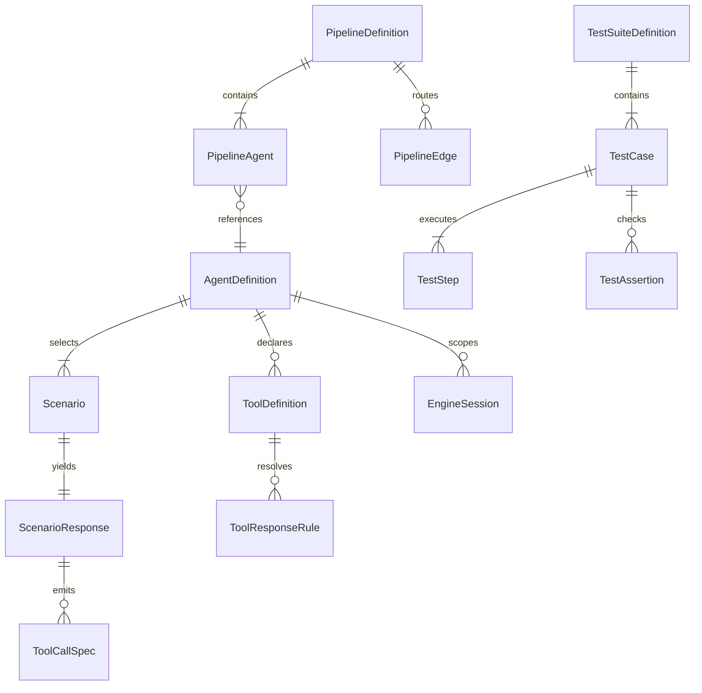

# Data models and persistence

The [field dictionary](reference/model-fields.md) lists named tagged Go structs, field types, and exact JSON/YAML tags, including authoring definitions, provider requests/responses, management records, protocol events, and Go SDK models. This guide supplies the relationships, validation, and persistence semantics that tags alone cannot express. Inline request structs and dynamic JSON maps remain visible in the route's linked handler source.

## Authoring documents

All definition kinds use the `apiVersion`, `kind`, `metadata`, `spec` envelope. `apiVersion` is `mockagents/v1`. Common metadata contains `name`, `description`, `tags`, and optional `tenant_id`; that field is not a client authorization selector. Names for agents use lowercase kebab-case and at most 63 characters. Validation is performed by the relevant Go validator, not automatically by JSON decoding.

| Kind | Principal children / relationships | Constraint source |
| --- | --- | --- |
| `Agent` | `AgentSpec` → protocol/model/systemPrompt, tools, behavior → scenarios/streaming/chaos/strict_tools | [Agent schema](../../schema/mockagents-v1-agent.json), [validator](../../internal/config/validator.go) |
| `Pipeline` | Nodes with unique IDs reference loaded agents; graph edges reference node IDs | [Pipeline schema](../../schema/mockagents-v1-pipeline.json), [validator](../../internal/config/pipeline_validator.go) |
| `TestSuite` | Exactly one agent/pipeline target; cases → steps and typed assertions | [Suite schema](../../schema/mockagents-v1-testsuite.json), [validator](../../internal/config/testsuite_validator.go) |
| `MCPServer` | Server info/capabilities; tools/resources/prompts/completions and faults | [MCP schema](../../schema/mockagents-v1-mcpserver.json), [validator](../../internal/config/mcpserver_validator.go) |
| `A2AServer` | Card/capabilities/skills, matched responses, faults | [A2A schema](../../schema/mockagents-v1-a2aserver.json), [validator](../../internal/config/a2aserver_validator.go) |
| `VectorCollection` | Dimension, metric, points with IDs/vectors/metadata, partial-result faults | [Vector schema](../../schema/mockagents-v1-vectorcollection.json), [validator](../../internal/config/vector_validator.go) |
| `SearchService` | Provider, named query scenarios with answer/results, service faults | [Search schema](../../schema/mockagents-v1-searchservice.json), [validator](../../internal/config/search_validator.go) |

Tool names use the supported lowercase snake-case pattern. The Go validator checks names, references, regex validity, protocols, chaos bounds, and selected streaming/strict-tool constraints. Match rules cannot combine content_contains and content_regex. turn_number must be at least 1 in both Go validation and JSON Schema, matching the normal first turn. Tool error_rate must be finite and within 0–1. Multiple tool default rules remain intentionally valid: the last default is used if no specific rule matches. Schema validation does not replace runtime semantic or cross-document checks.

Cross-document validation checks pipeline agent references, suite targets/node IDs, duplicate agent names, duplicate scoped vector names, and duplicate search providers in [cross_document_validator.go](../../internal/config/cross_document_validator.go). The single-document HTTP validation endpoint does not run that cross-document pass. A schema or field dictionary does not replace these relationship checks.

## Runtime graph

The relationships above are application references, not SQL foreign keys. An engine `InboundRequest` contains normalized messages, model/agent identity, session, streaming and tool-choice information. `Response` contains content, tool calls/results, scenario, model, metadata, refusal/finish overrides and strict warnings. Adapters transform this neutral object; it is not itself the provider response schema.

## Durable relational records

| Store/table | Fields and constraints | Lifetime / ownership |
| --- | --- | --- |
| Interaction SQLite `interaction_logs` | Autoincrement ID; timestamp; tenant, agent, session, protocol; HTTP fields; body strings; latency ms; tool count; scenario/error/chaos/truncation/source | Local diagnostic history; retention pruning configurable; source `http` or `pipeline` |
| Audit SQLite `audit_events` | Event ID/time/kind, actor name/tenant/key/role/IP, target, details | Local control-plane audit; actor fields come from callback/context |
| Tenancy `tenants` | ID primary key, unique name, created time | Owns credentials/users/quotas/spend |
| `api_keys` | ID, tenant FK with cascade, name/prefix/bcrypt hash, role, created/last-used, credential version | Plaintext only returned when issued/rotated; never a stored retrievable key |
| `users` | ID, unique email, tenant FK with cascade, role, created time | OIDC JIT identity |
| `sessions` | Token hash primary key, user FK with cascade, tenant/role snapshot, created/expiry | Revocable login session; distinct from engine conversation |
| `tenant_quotas` | Tenant primary/FK, rate_per_sec, rate_burst, monthly_spend_usd | Persistent override settings |
| `tenant_spend` | Composite `(tenant_id, month)` primary key and accumulated USD | Shared atomic ledger when backend wired; month is UTC |

SQL definitions and migrations are in [storage/sqlite.go](../../internal/storage/sqlite.go), [audit/store.go](../../internal/audit/store.go), [tenancy/store.go](../../internal/tenancy/store.go), and [tenancy/postgres_store.go](../../internal/tenancy/postgres_store.go). Interaction indexes cover agent/session/time and tenant+ID; tenancy indexes support key prefix and tenant/user lookup. Existing databases receive additive compatibility migrations during open. Do not assume restoring one SQLite file restores all three stores.

Postgres substitutes the tenancy implementation. It shares credentials, users/login sessions, quota settings and spend, not engine sessions, catalog mutations, provider resource memory, interaction/audit logs, or rate buckets. Credential mutation policy executes at the store boundary as well as the handler boundary; version-checked authentication caching must remain coherent with rotations/deletions.

## In-memory and cassette models

| Model | Contents | Restart / scope |
| --- | --- | --- |
| Engine session | Messages, turn count, variables, access/TTL, history bound | Tenant+agent+session; lost on restart |
| Provider Conversations | Conversation items referenced by `conversation` | Process-local, tenant-keyed access |
| Provider Responses history | Prior messages referenced by `previous_response_id` | Process-local FIFO, 1,024 IDs total; lookup requires the matching tenant; `store: false` skips standalone retention |
| Files/Batches | Upload bytes/metadata, request/output files, job result state | Shared within adapter registry; process-local |
| Vector store | Collection config, point IDs, vectors, metadata, fault settings | Provider profiles use common store, with scoped collection names |
| MCP session/notifications | Transport lifecycle and pending events | Standalone listener memory |
| A2A Task | ID/contextId, status, history, artifacts | Bounded standalone task store; terminal TTL |
| Recording Interaction | Request method/path/hash/body/headers, response status/body/headers or stream events | JSONL disk cassette and in-memory hash index |

Cassettes store ordinary valid JSON bodies directly; non-JSON UTF-8 is represented as text, and binary as base64 with explicit encoding fields. `StreamEvent.delay_ms` is an offset from response start. Request matching hashes method, URL path and canonicalized body; query strings are not part of the default hash. Repeated identical requests consume recorded entries in order, then repeat the last. A replay cursor belongs to the Replay instance, not a client conversation.

Cassette appends serialize disk writes. An incomplete final line can be skipped at load, with a later rewrite needed before appending; malformed interior records still fail. Hashing occurs before recording redaction, preserving exact request lookup. Relaxed matching against redacted stored bodies may have different trade-offs; test the intended ignored-field/redaction combination.

## Serialization and validation rules

`omitempty` omits zero values; it is not a required-field validator. Pointers distinguish absent from explicit zero/false: examples include `turn_number`, `chunk_delay_ms`, strict-tool dimensions, and chaos rates. Startup and agent-write paths apply defaults; direct `ValidateBytes` reports on the document as supplied and does not itself call `ApplyDefaults`. JSON bodies usually decode via Go structs; unknown-field rejection is endpoint-specific. Conditional agent edits opt into strict field checking; the legacy unconditional path remains compatible. Pipeline run explicitly rejects unknown fields and extra JSON objects; pipeline PUT instead unmarshals a struct and can discard unknown fields.

[Responses history](../../internal/adapter/responses.go) and [Conversations](../../internal/adapter/conversations.go) use separate tenant-scoped stores. Standalone retention follows store (default true); Conversation item storage has an independent lifecycle. Unknown/foreign response IDs return 404, with no wildcard lookup for anonymous callers. Regression tests cover both anonymous and named owners, streaming retention, concurrent eviction, and authenticated HTTP requests.

`time.Time` JSON is a timestamp string; `time.Duration` without a custom marshaler is integer nanoseconds. Management interaction rows use explicitly named milliseconds instead. `ToolCallSpec.ArgumentsJSON` returns raw authored arguments when present, otherwise a JSON object string; empty structured arguments become `{}`. Anthropic/Gemini use object arguments. MCP embedded resources have a custom nested wire shape. A2A card serving fills defaults and normalizes required arrays. Fields tagged `json:"-"` (such as principal internals) are not serialized.

On model changes, review the schema, validator, defaulting, OpenAPI, Python/TypeScript/Go SDK models, GUI client, fixtures, and these catalogs together. See [testing](testing.md) for drift checks and their limits.
