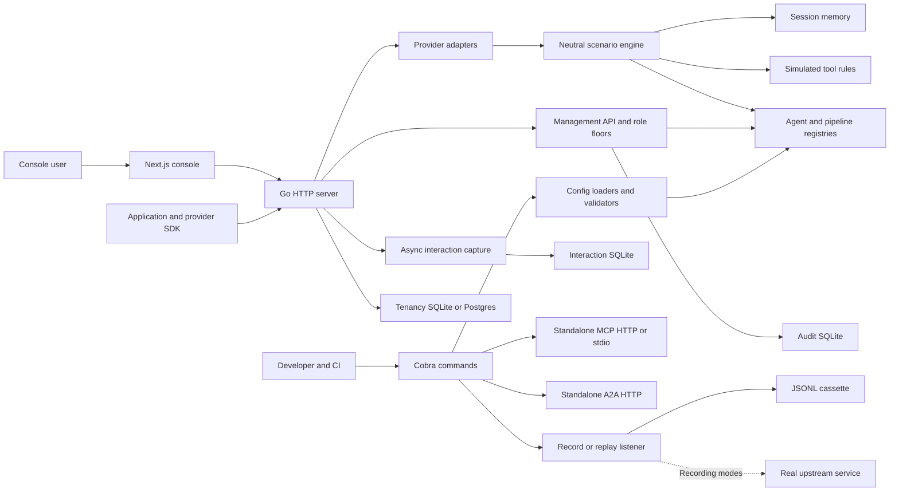
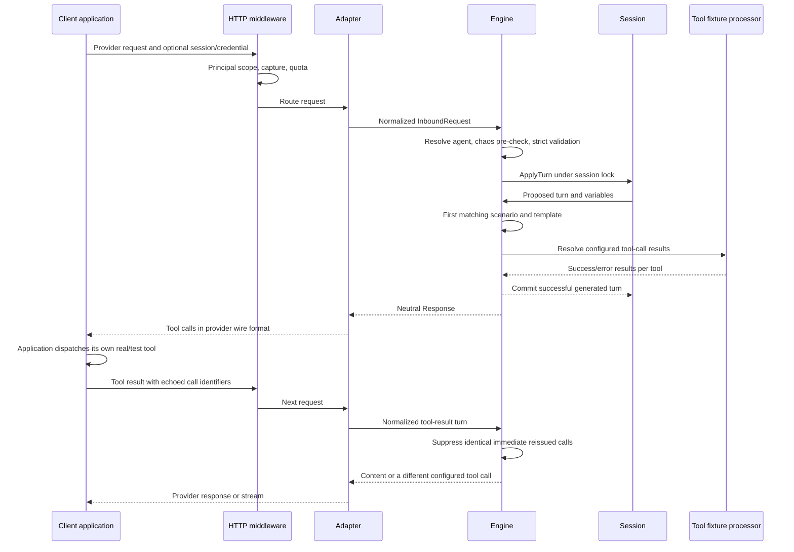
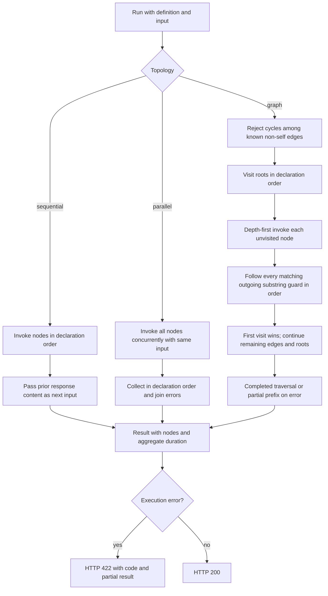
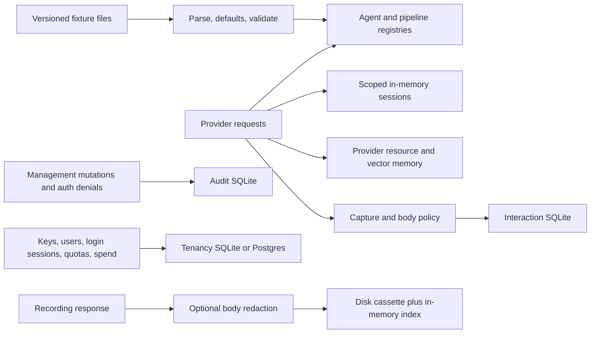
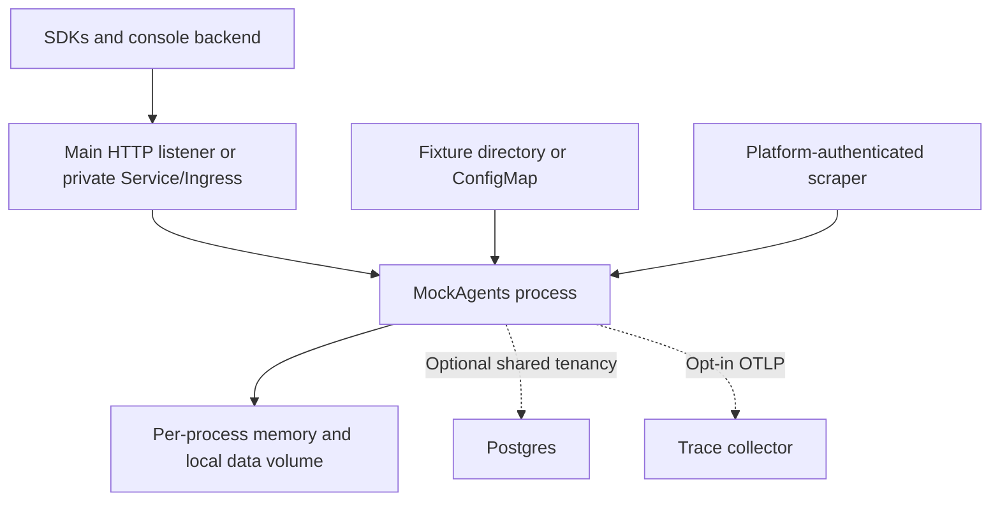

# System diagrams

These Mermaid diagrams describe implemented paths at the handoff baseline. Optional arrows represent conditional wiring, not separate distributed services inside the Go binary.

## System context and components



## Provider request and tool-call round trip



The mock's simulated `ToolResults` support engine/suite evidence. They do not execute the application's external function or imply every provider wire returns that internal field.

## Pipeline decision flow



For a diamond graph, a visited target runs once with the first traversed input; there is no fan-in join. The config validator rejects self-edges even though low-level executor cycle accounting excludes them.

## Configuration edit and persistence

```mermaid
sequenceDiagram
  participant UI as Console/editor
  participant H as Managed handler
  participant V as Config validator
  participant F as Fixture filesystem
  participant R as Registry
  UI->>H: GET definition
  H-->>UI: Definition and ETag/revision metadata
  UI->>H: PUT definition with If-Match
  H->>H: Authenticate, authorize, resolve ownership
  H->>V: Parse and validate fields/references
  V-->>H: Diagnostics or valid definition
  H->>H: Lock and check current revision
  alt Invalid or stale
    H-->>UI: 4xx with diagnostics; draft remains client-side
  else Valid and current
    H->>F: Persist through temporary file and rename
    H->>R: Register live definition
    H-->>UI: Receipt / new revision
  end
```

Agent writes can be runtime-only when no agents directory is configured; the receipt reports `persisted`. Pipeline updates require an existing pipeline and `If-Match`. Exact agent and pipeline response bodies differ.

## Data ownership



## Deployment boundary



Adding replicas duplicates memory state and local logs. Postgres shares tenancy records and spend; it does not share all runtime state. The Helm acknowledgment guard documents that limitation.
