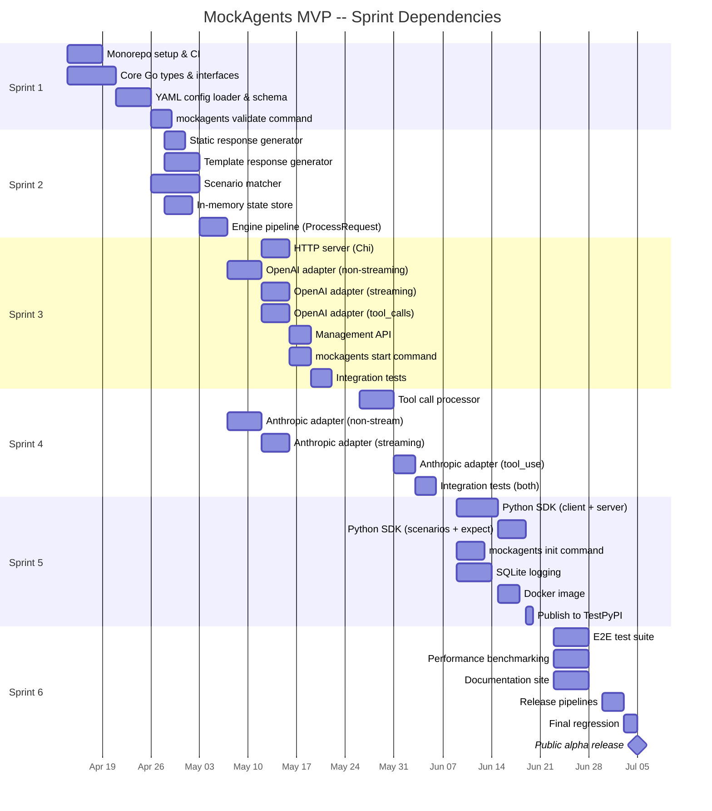

# MockAgents -- Implementation Plan

> **Implementation status (2026-04-13):** the 12-week MVP plan below
> is historical. Phase 1 shipped with 44/46 stories done (two carry-over
> partials) and Phase 2/3/4 v0.1 slices have since landed (pipelines,
> chaos, MCP, contracts, OTel, TS/Go SDKs, GUI, Helm, multi-tenant auth).
> See [PROGRESS.md](./PROGRESS.md) for the authoritative status. This
> plan is kept as-is for historical context.

**Version:** 1.0
**Date:** April 7, 2026
**Status:** Draft
**Author:** Engineering Team
**Related:** [Product Plan](../mock-agents-product-plan.md)

---

## 1. Document Info

| Field              | Value                                                              |
| ------------------ | ------------------------------------------------------------------ |
| Project            | MockAgents                                                         |
| Document type      | Implementation Plan                                                |
| Scope              | MVP (Phase 1) detailed sprints + Phase 2-4 high-level roadmap      |
| Audience           | Engineering team, team leads, project stakeholders                  |
| Approval required  | Engineering Lead, Product Owner                                     |
| Revision history   | v1.0 -- 2026-04-07 -- Initial draft                               |

---

## 2. Overview

### 2.1 Scope

This plan covers the implementation of MockAgents Phase 1 (MVP) in full sprint-level detail, plus a high-level quarterly roadmap for Phases 2-4. The MVP delivers:

- **Go core engine** -- mock agent runtime with YAML-based agent definitions
- **OpenAI Chat Completions adapter** -- full mock including function calling and streaming
- **Anthropic Messages adapter** -- full mock including tool use and streaming
- **Tool-call simulation** -- match-based resolution, default responses, error injection
- **Response generators** -- static responses and Go template-based responses
- **CLI tool** (`mockagents`) -- `init`, `start`, `validate` commands
- **Python SDK** (v0.1) -- client, subprocess server manager, assertion helpers
- **SQLite interaction logging** -- request/response audit trail
- **Docker image** -- multi-stage build for CI/CD use

### 2.2 Team

| Role                    | Count | Responsibilities                                                  |
| ----------------------- | ----- | ----------------------------------------------------------------- |
| Backend Engineer        | 3     | Go core engine, adapters, HTTP server, CLI, tool-call simulation  |
| SDK / DevEx Engineer    | 1     | Python SDK, documentation, Docker, CI/CD, developer experience    |

### 2.3 Timeline

- **Duration:** 12 weeks (6 two-week sprints)
- **Start date:** Week of April 14, 2026
- **Target alpha release:** Week of July 7, 2026
- **Methodology:** 2-week sprints, daily standups, sprint demos every other Friday
- **Source control:** Monorepo on GitHub (`mockagents/mockagents`)
- **Branch strategy:** `main` (protected) + feature branches + PR reviews

### 2.4 Key Technical Decisions

| Decision              | Choice                | Rationale                                                        |
| --------------------- | --------------------- | ---------------------------------------------------------------- |
| Core language          | Go                    | Single-binary distribution, strong concurrency, fast compilation |
| HTTP router            | Chi                   | Lightweight, idiomatic Go, middleware support                    |
| Config format          | YAML + JSON Schema    | Human-readable, Git-friendly, validatable                        |
| Database (MVP)         | SQLite                | Zero-config, embedded, sufficient for local/CI use               |
| Template engine        | Go `text/template`    | Built-in, no dependencies, custom functions supported            |
| Repo structure         | Monorepo              | Unified versioning, simpler CI, shared types                     |
| Python SDK packaging   | Poetry                | Modern dependency management, build system                       |
| CLI framework          | Cobra                 | De facto Go CLI standard, subcommands, help generation           |

---

## 3. Phase 1: MVP (Weeks 1-12)

### Sprint 1 (Weeks 1-2): Project Bootstrap and Core Types

**Goal:** Establish the monorepo, define all foundational Go types, and ship the `mockagents validate` command.

#### Tasks

| ID    | Task                                            | Owner           | Est.  | Details |
| ----- | ----------------------------------------------- | --------------- | ----- | ------- |
| S1-01 | Initialize Go module (`go mod init`)            | Backend 1       | 0.5d  | Module path: `github.com/mockagents/mockagents` |
| S1-02 | Monorepo directory structure                    | Backend 1       | 0.5d  | See directory layout below |
| S1-03 | Makefile with build/test/lint targets           | Backend 1       | 0.5d  | Targets: `build`, `test`, `lint`, `fmt`, `generate` |
| S1-04 | GitHub Actions CI pipeline                      | SDK/DevEx       | 1d    | Go test, lint (golangci-lint), Python lint, build verification |
| S1-05 | Pre-commit hooks (gofmt, golangci-lint)         | SDK/DevEx       | 0.5d  | Enforced via CI, optional local install |
| S1-06 | Define `AgentDefinition` Go struct              | Backend 2       | 1d    | Covers metadata, spec, tools, scenarios, behavior, chaos, streaming |
| S1-07 | Define `Adapter` interface                      | Backend 2       | 0.5d  | `HandleRequest(ctx, rawReq) -> rawResp`, `Protocol() string` |
| S1-08 | Define `ResponseGenerator` interface            | Backend 2       | 0.5d  | `Generate(ctx, ScenarioMatch, State) -> AgentResponse` |
| S1-09 | Define `ScenarioMatcher` interface              | Backend 3       | 0.5d  | `Match(request, scenarios) -> ScenarioMatch` |
| S1-10 | Define `ToolProcessor` interface                | Backend 3       | 0.5d  | `ProcessToolCall(call, toolDef) -> ToolResult` |
| S1-11 | Define `StateStore` interface                   | Backend 3       | 0.5d  | `Get/Set/Delete` for conversation state, keyed by conversation ID |
| S1-12 | JSON Schema for agent definition YAML           | Backend 2       | 1d    | Covers all fields in `mockagents/v1` `Agent` kind |
| S1-13 | YAML config loader with schema validation       | Backend 3       | 1.5d  | Parse YAML, validate against JSON Schema, return typed struct |
| S1-14 | Unit tests for config parsing                   | Backend 3       | 1d    | Valid configs, missing fields, invalid types, edge cases |
| S1-15 | `mockagents validate` CLI command               | Backend 1       | 1d    | Load file(s), validate, print errors with line numbers |
| S1-16 | Cobra CLI scaffolding (root + validate)         | Backend 1       | 0.5d  | Version flag, help text, global flags (--verbose, --config) |
| S1-17 | Python SDK project scaffold (Poetry)            | SDK/DevEx       | 1d    | `pyproject.toml`, package structure, dev dependencies |
| S1-18 | Example agent definition files                  | SDK/DevEx       | 0.5d  | `examples/` directory with customer-support agent from product plan |

**Monorepo directory layout:**

```
mockagents/
  cmd/
    mockagents/          # CLI entrypoint
      main.go
  internal/
    config/              # YAML loader, schema validation
    engine/              # Mock engine core
    adapter/             # Protocol adapters
      openai/
      anthropic/
    generator/           # Response generators (static, template)
    matcher/             # Scenario matching
    toolcall/            # Tool call processing
    state/               # Conversation state store
    server/              # HTTP server
    logging/             # SQLite interaction logger
  pkg/
    types/               # Public Go types (AgentDefinition, etc.)
  schema/                # JSON Schema files
  sdk/
    python/              # Python SDK (Poetry project)
  examples/              # Example agent definitions
  docker/                # Dockerfile, docker-compose
  docs/                  # Documentation
  Makefile
  go.mod
  go.sum
  .github/
    workflows/
      ci.yml
```

**Deliverable:** `mockagents validate agents/example.yaml` parses and validates an agent definition file, reporting errors with context.

**Acceptance criteria:**
- [ ] `go build ./cmd/mockagents` produces a working binary
- [ ] `mockagents validate` accepts one or more YAML files and validates against schema
- [ ] Invalid YAML produces clear error messages with field paths
- [ ] CI pipeline runs on every PR: Go tests pass, linter clean
- [ ] All core interfaces defined and documented with GoDoc comments

---

### Sprint 2 (Weeks 3-4): Mock Engine Core

**Goal:** Implement the response generation pipeline so the engine can process a request and return a matched response.

#### Tasks

| ID    | Task                                            | Owner           | Est.  | Details |
| ----- | ----------------------------------------------- | --------------- | ----- | ------- |
| S2-01 | Static response generator                       | Backend 1       | 1d    | Returns pre-configured response body verbatim |
| S2-02 | Template response generator                     | Backend 1       | 2d    | Go `text/template` with custom functions: `random_int`, `random_string`, `date_offset`, `uuid`, `now` |
| S2-03 | Template function registry                      | Backend 1       | 0.5d  | Extensible FuncMap, documented in schema |
| S2-04 | Scenario matcher: `content_contains`            | Backend 2       | 0.5d  | Case-insensitive substring match against message content |
| S2-05 | Scenario matcher: `content_regex`               | Backend 2       | 0.5d  | Regex match against message content |
| S2-06 | Scenario matcher: `default` fallback            | Backend 2       | 0.25d | Lowest-priority catch-all scenario |
| S2-07 | Scenario matcher: priority/ordering              | Backend 2       | 0.5d  | Match first in definition order, default always last |
| S2-08 | Scenario matcher: composite match (`and`/`or`)  | Backend 2       | 1d    | Combine multiple match conditions |
| S2-09 | In-memory conversation state store              | Backend 3       | 1d    | Thread-safe map, keyed by conversation ID, TTL-based expiry |
| S2-10 | Engine `ProcessRequest` pipeline                | Backend 3       | 2d    | Load agent -> match scenario -> generate response -> return |
| S2-11 | Engine request/response internal types           | Backend 3       | 0.5d  | `EngineRequest`, `EngineResponse` decoupled from wire format |
| S2-12 | Unit tests: static generator                    | Backend 1       | 0.5d  | |
| S2-13 | Unit tests: template generator                  | Backend 1       | 1d    | All custom functions, edge cases, malformed templates |
| S2-14 | Unit tests: scenario matcher                    | Backend 2       | 1d    | All match types, priority, no-match handling |
| S2-15 | Unit tests: engine pipeline                     | Backend 3       | 1d    | End-to-end through ProcessRequest with mock dependencies |
| S2-16 | Unit tests: state store                         | Backend 3       | 0.5d  | Concurrency safety, TTL expiry |

**Deliverable:** The engine can accept an `EngineRequest`, match it against agent scenarios, and produce an `EngineResponse` using static or template generators.

**Acceptance criteria:**
- [ ] Static generator returns exact configured response
- [ ] Template generator evaluates all custom functions correctly
- [ ] Scenario matcher respects priority ordering and falls back to default
- [ ] State store is safe for concurrent reads/writes
- [ ] Engine pipeline wires everything together and handles errors gracefully
- [ ] Test coverage for engine package is 80% or higher

---

### Sprint 3 (Weeks 5-6): OpenAI Adapter and HTTP Server

**Goal:** Serve OpenAI-compatible mock responses over HTTP, including streaming and function calling.

#### Tasks

| ID    | Task                                            | Owner           | Est.  | Details |
| ----- | ----------------------------------------------- | --------------- | ----- | ------- |
| S3-01 | HTTP server with Chi router                     | Backend 1       | 1d    | Graceful shutdown, configurable port, request ID middleware |
| S3-02 | Middleware: request logging                      | Backend 1       | 0.5d  | Log method, path, duration, status |
| S3-03 | Middleware: CORS                                 | Backend 1       | 0.25d | Permissive defaults for local dev |
| S3-04 | Middleware: API key extraction (optional)        | Backend 1       | 0.25d | Extract from `Authorization: Bearer` header, pass to context |
| S3-05 | OpenAI adapter: request parsing                 | Backend 2       | 1d    | Parse `ChatCompletionRequest` (messages, model, tools, stream flag, temperature) |
| S3-06 | OpenAI adapter: non-streaming response          | Backend 2       | 1.5d  | Build `ChatCompletionResponse` with choices, usage, model, id |
| S3-07 | OpenAI adapter: SSE streaming                   | Backend 2       | 2d    | `text/event-stream`, chunk content into `ChatCompletionChunk` deltas, `[DONE]` sentinel |
| S3-08 | OpenAI adapter: function/tool_calls              | Backend 3       | 1.5d  | Populate `tool_calls` array in assistant message, handle `tool` role responses |
| S3-09 | OpenAI adapter: usage token estimation          | Backend 3       | 0.5d  | Rough estimation: `len(text)/4` for prompt/completion tokens |
| S3-10 | Management API: `GET /api/v1/health`            | Backend 1       | 0.25d | Returns `{"status": "ok", "version": "..."}` |
| S3-11 | Management API: `GET /api/v1/agents`            | Backend 1       | 0.5d  | List loaded agent definitions |
| S3-12 | Management API: `GET /api/v1/agents/:name`      | Backend 1       | 0.5d  | Get single agent definition details |
| S3-13 | Management API: `POST /api/v1/agents/:name/reload` | Backend 1   | 0.5d  | Hot-reload agent definition from disk |
| S3-14 | Agent routing by model name or path             | Backend 3       | 1d    | Route `/v1/chat/completions` to correct agent based on `model` field |
| S3-15 | `mockagents start` CLI command                  | Backend 3       | 1d    | Load agents from directory, start server, print URL, watch for SIGINT |
| S3-16 | Integration tests: non-streaming                | SDK/DevEx       | 1d    | Real HTTP calls with `net/http`, verify response structure |
| S3-17 | Integration tests: streaming                    | SDK/DevEx       | 1d    | Consume SSE stream, verify chunks, verify `[DONE]` |
| S3-18 | Integration tests: tool calls                   | SDK/DevEx       | 1d    | Verify `tool_calls` in response, verify `tool` role handling |

**Deliverable:** `mockagents start --agents ./examples/` starts an HTTP server. OpenAI-compatible clients can call `/v1/chat/completions` and receive mock responses, including streaming and tool calls.

**Acceptance criteria:**
- [ ] OpenAI Python library (`openai.ChatCompletion.create()`) works against the mock server
- [ ] Streaming produces valid SSE with correct `data:` prefixes and `[DONE]`
- [ ] Tool calls appear in the correct OpenAI format in responses
- [ ] Management API returns health status and agent list
- [ ] `mockagents start` loads agents, prints listening address, shuts down cleanly on Ctrl+C
- [ ] Integration tests cover non-streaming, streaming, and tool-call scenarios

---

### Sprint 4 (Weeks 7-8): Tool Call Simulation and Anthropic Adapter

**Goal:** Deliver the tool call processor and a fully working Anthropic Messages adapter.

#### Tasks

| ID    | Task                                            | Owner           | Est.  | Details |
| ----- | ----------------------------------------------- | --------------- | ----- | ------- |
| S4-01 | Tool call processor: match-based resolution     | Backend 1       | 1.5d  | Match tool call arguments against configured `match` blocks |
| S4-02 | Tool call processor: default responses          | Backend 1       | 0.5d  | Return default tool response when no match |
| S4-03 | Tool call processor: error injection            | Backend 1       | 1d    | Return configured error responses, support random failure rate |
| S4-04 | Tool call processor: parallel tool calls        | Backend 1       | 0.5d  | Process multiple tool calls in a single response |
| S4-05 | Anthropic adapter: request parsing              | Backend 2       | 1d    | Parse `MessagesRequest` (messages, model, system, tools, max_tokens, stream) |
| S4-06 | Anthropic adapter: non-streaming response       | Backend 2       | 1.5d  | Build `MessagesResponse` with content blocks (text, tool_use), stop_reason, usage |
| S4-07 | Anthropic adapter: SSE streaming                | Backend 2       | 2d    | Event types: `message_start`, `content_block_start`, `content_block_delta`, `content_block_stop`, `message_delta`, `message_stop` |
| S4-08 | Anthropic adapter: tool_use content blocks      | Backend 3       | 1d    | `tool_use` type with `id`, `name`, `input` in content array |
| S4-09 | Anthropic adapter: tool_result handling         | Backend 3       | 0.5d  | Accept `tool_result` content blocks in user messages |
| S4-10 | Anthropic adapter: model routing                | Backend 3       | 0.5d  | Route to agent based on `model` field in request |
| S4-11 | Adapter registry: auto-detection by path        | Backend 3       | 0.5d  | `/v1/chat/completions` -> OpenAI, `/v1/messages` -> Anthropic |
| S4-12 | Integration tests: Anthropic non-streaming      | SDK/DevEx       | 1d    | |
| S4-13 | Integration tests: Anthropic streaming          | SDK/DevEx       | 1d    | Verify event sequence and content |
| S4-14 | Integration tests: Anthropic tool_use           | SDK/DevEx       | 1d    | Verify tool_use blocks, tool_result round-trip |
| S4-15 | Integration tests: tool call processor          | Backend 1       | 1d    | Match resolution, defaults, error injection |
| S4-16 | Cross-adapter integration test                  | SDK/DevEx       | 0.5d  | Same agent definition works via both OpenAI and Anthropic adapters |

**Deliverable:** Both OpenAI and Anthropic protocols are fully mocked. Tool calls are processed with match-based resolution, defaults, and error injection.

**Acceptance criteria:**
- [ ] Anthropic Python SDK (`anthropic.Anthropic().messages.create()`) works against the mock server
- [ ] Anthropic streaming produces correct event sequence
- [ ] Tool call processor matches arguments and returns configured responses
- [ ] Error injection produces tool errors at configured rate
- [ ] A single agent YAML can serve responses via both `/v1/chat/completions` and `/v1/messages`
- [ ] All integration tests pass for both adapters

---

### Sprint 5 (Weeks 9-10): Python SDK and CLI Polish

**Goal:** Ship the Python SDK, polish the CLI, add SQLite logging, and build the Docker image.

#### Tasks

| ID    | Task                                            | Owner           | Est.  | Details |
| ----- | ----------------------------------------------- | --------------- | ----- | ------- |
| S5-01 | Python SDK: `MockAgentClient`                   | SDK/DevEx       | 2d    | Wraps HTTP calls to mock server, supports both OpenAI and Anthropic modes |
| S5-02 | Python SDK: `MockAgentServer`                   | SDK/DevEx       | 2d    | Subprocess manager: starts/stops `mockagents start`, context manager support (`with` statement) |
| S5-03 | Python SDK: `Scenario` class                    | SDK/DevEx       | 1d    | Define multi-step conversation scenarios |
| S5-04 | Python SDK: `expect()` assertion helpers        | SDK/DevEx       | 1.5d  | `to_have_tool_call`, `to_have_response_containing`, `to_have_tool_error`, `to_be_less_than`, etc. |
| S5-05 | Python SDK: `run_scenario()` method             | SDK/DevEx       | 1d    | Execute scenario steps sequentially, collect results |
| S5-06 | Python SDK: pytest integration                  | SDK/DevEx       | 0.5d  | `@pytest.fixture` for server lifecycle |
| S5-07 | `mockagents init` CLI command                   | Backend 1       | 1.5d  | Scaffold project: create directory, example agent YAML, example test, Makefile |
| S5-08 | `mockagents init` templates                     | Backend 1       | 0.5d  | Embedded Go templates for scaffolded files |
| S5-09 | SQLite interaction logging                      | Backend 2       | 2d    | Log every request/response pair to SQLite: timestamp, agent, protocol, request body, response body, latency, matched scenario |
| S5-10 | SQLite schema and migrations                    | Backend 2       | 0.5d  | `interactions` table, auto-create on first start |
| S5-11 | `mockagents logs` CLI command                   | Backend 2       | 1d    | Query and display logged interactions, filter by agent/time |
| S5-12 | CLI: `--port`, `--host`, `--log-level` flags    | Backend 3       | 0.5d  | Global flags for `start` command |
| S5-13 | CLI: colored output and progress indicators     | Backend 3       | 0.5d  | Use `lipgloss` or `color` package for terminal output |
| S5-14 | Docker multi-stage build                        | Backend 3       | 1d    | Stage 1: Go build. Stage 2: Alpine with binary. Expose port 8080. |
| S5-15 | `docker-compose.yml` for local dev              | Backend 3       | 0.5d  | Mount agent definitions as volume |
| S5-16 | Python SDK tests                                | SDK/DevEx       | 1d    | Unit tests for client, server manager, assertions |
| S5-17 | Publish Python SDK to TestPyPI                  | SDK/DevEx       | 0.5d  | CI job to publish on tag |

**Deliverable:** Python developers can `pip install mockagents`, write test scenarios using `MockAgentServer` and `expect()`, and run them with pytest.

**Acceptance criteria:**
- [ ] `MockAgentServer.from_config("agent.yaml")` starts the Go binary as a subprocess
- [ ] `expect(result).to_have_tool_call("lookup_order", {"order_id": "ORD-12345"})` works
- [ ] `mockagents init my-project` scaffolds a working project
- [ ] SQLite logs are queryable via `mockagents logs`
- [ ] Docker image runs and serves mock responses
- [ ] Python SDK published to TestPyPI and installable

---

### Sprint 6 (Weeks 11-12): Hardening and Release

**Goal:** Harden the system, write documentation, and ship the public alpha.

#### Tasks

| ID    | Task                                            | Owner           | Est.  | Details |
| ----- | ----------------------------------------------- | --------------- | ----- | ------- |
| S6-01 | End-to-end test suite                           | Backend 1       | 2d    | Full scenario: init project, start server, run Python tests, verify logs |
| S6-02 | E2E: OpenAI SDK compatibility test              | Backend 2       | 1d    | Test with `openai` Python package versions 1.x |
| S6-03 | E2E: Anthropic SDK compatibility test           | Backend 2       | 1d    | Test with `anthropic` Python package versions 0.x |
| S6-04 | Performance benchmarking                        | Backend 3       | 1.5d  | Use `wrk` or `hey`, target: 1000 req/s for single-agent non-streaming |
| S6-05 | Performance: identify and fix bottlenecks       | Backend 3       | 1.5d  | Profile with pprof, optimize hot paths |
| S6-06 | Security review                                 | Backend 1       | 0.5d  | Input validation, path traversal checks on agent file loading |
| S6-07 | Error handling audit                            | Backend 1       | 0.5d  | Ensure all errors are wrapped with context, no panics |
| S6-08 | Documentation site setup (MkDocs)               | SDK/DevEx       | 1d    | MkDocs Material theme, deploy to GitHub Pages |
| S6-09 | Quickstart guide                                | SDK/DevEx       | 1d    | 5-minute guide: install, init, start, test |
| S6-10 | API reference docs                              | SDK/DevEx       | 1d    | Document all CLI commands, management API endpoints, YAML schema |
| S6-11 | Python SDK docs                                 | SDK/DevEx       | 0.5d  | Usage examples, API reference |
| S6-12 | Agent definition reference                      | SDK/DevEx       | 0.5d  | Full schema documentation with examples for every field |
| S6-13 | README.md                                       | SDK/DevEx       | 0.5d  | Project overview, badges, install, quickstart, links |
| S6-14 | Example agents directory                        | SDK/DevEx       | 0.5d  | 3-4 example agents: customer support, code assistant, RAG agent, multi-tool |
| S6-15 | CONTRIBUTING.md and LICENSE                     | SDK/DevEx       | 0.25d | Apache 2.0 license, contribution guidelines |
| S6-16 | PyPI publish pipeline                           | SDK/DevEx       | 0.5d  | GitHub Actions: on release tag, publish to PyPI |
| S6-17 | GitHub release pipeline                         | Backend 3       | 0.5d  | GoReleaser: cross-compile binaries, attach to GitHub release |
| S6-18 | Docker Hub publish pipeline                     | Backend 3       | 0.5d  | Push `mockagents/mockagents:latest` and `mockagents/mockagents:v0.1.0` |
| S6-19 | CHANGELOG.md                                    | SDK/DevEx       | 0.25d | Document all MVP features |
| S6-20 | Final regression pass                           | All             | 1d    | Full test suite, manual smoke testing on macOS/Linux/Windows |

**Deliverable:** Public alpha release: GitHub release with binaries, PyPI package, Docker Hub image, documentation site live.

**Acceptance criteria:**
- [ ] All E2E tests pass on Linux, macOS, and Windows
- [ ] Performance target met: 1000 req/s single-agent, non-streaming
- [ ] Documentation site is live with quickstart, API reference, and examples
- [ ] `pip install mockagents` installs from PyPI
- [ ] `docker run mockagents/mockagents` starts and serves responses
- [ ] GitHub release includes binaries for linux/amd64, linux/arm64, darwin/amd64, darwin/arm64, windows/amd64
- [ ] Zero known critical or high-severity bugs

---

## 4. Phase 2-4 Roadmap

### Phase 2: Testing and Multi-Agent (Months 4-6, Weeks 13-24)

**Goal:** Add a test runner, multi-agent simulation, and more framework adapters.

| Quarter Focus Area       | Key Deliverables                                                                 |
| ------------------------ | -------------------------------------------------------------------------------- |
| Test runner              | Test DSL, CLI `mockagents test` command, JUnit XML output, watch mode            |
| CI/CD integration        | GitHub Actions action (`mockagents/setup-mockagents`), GitLab CI template         |
| Multi-agent topologies   | Sequential pipelines, parallel fan-out/fan-in, YAML-based pipeline definitions   |
| Framework adapters       | CrewAI adapter, LangGraph adapter                                                |
| Record and playback      | `mockagents record` proxies to real LLM and captures interactions                |
| TypeScript SDK           | v0.1 -- client, server manager, assertion helpers                                |
| GUI dashboard v0.1       | Agent catalog, interaction explorer (read-only)                                  |

**Milestone:** Public beta release at end of Week 24.

### Phase 3: Resilience and MCP (Months 7-9, Weeks 25-36)

**Goal:** Deliver chaos engineering, MCP support, and advanced evaluation.

| Quarter Focus Area       | Key Deliverables                                                                 |
| ------------------------ | -------------------------------------------------------------------------------- |
| Chaos engine             | Latency injection, error injection, rate limiting, cascading failure simulation  |
| MCP support              | MCP server mocking (stdio + HTTP/SSE), MCP client test harness                   |
| Evaluation               | LLM-as-judge evaluator, BLEU/ROUGE metrics, custom evaluator plugin system       |
| Advanced testing         | Snapshot testing, parameterized tests, coverage metrics                           |
| Framework adapters       | AutoGen adapter, LlamaIndex adapter                                              |
| VS Code extension v0.1   | Schema validation, IntelliSense for YAML, inline test running                    |
| Performance dashboards   | Latency histograms, throughput graphs in GUI                                     |

**Milestone:** v1.0 stable release at end of Week 36.

### Phase 4: Enterprise and Scale (Months 10-12, Weeks 37-48)

**Goal:** Add collaboration, governance, and cloud deployment.

| Quarter Focus Area       | Key Deliverables                                                                 |
| ------------------------ | -------------------------------------------------------------------------------- |
| Collaboration            | Shared mock registry, RBAC, audit logging                                        |
| Contract testing         | Agent contract definitions, verification, breaking change detection               |
| Infrastructure           | Kubernetes Helm chart, horizontal scaling, OpenTelemetry integration              |
| Cost estimation          | Estimate real-world LLM API costs based on mock interaction patterns             |
| Go SDK                   | v0.1 -- for platform teams embedding MockAgents                                  |
| Cloud SaaS beta          | Multi-tenant hosted service, limited availability                                |
| Visual workflow editor   | Drag-and-drop pipeline builder in GUI                                            |
| JetBrains plugin         | IntelliJ-family IDE support                                                      |

**Milestone:** v2.0 release with enterprise features at end of Week 48.

---

## 5. Task Dependencies



**Critical path:** Core types (S1) -> Config loader (S1) -> Engine pipeline (S2) -> OpenAI adapter (S3) -> `mockagents start` (S3) -> Integration tests (S3) -> E2E tests (S6) -> Release.

**Parallel workstreams:**
- Backend 2 can work on Anthropic adapter (Sprint 4) in parallel with Sprint 3's OpenAI integration tests
- SDK/DevEx engineer works on Python SDK (Sprint 5) as soon as `mockagents start` is functional (end of Sprint 3)
- Docker image and SQLite logging are independent of Python SDK work

---

## 6. Risk Register

| ID   | Risk                                              | Sprint(s) | Impact | Likelihood | Mitigation                                                                                    |
| ---- | ------------------------------------------------- | --------- | ------ | ---------- | --------------------------------------------------------------------------------------------- |
| R-01 | OpenAI API schema changes mid-sprint              | S3, S6    | High   | Medium     | Pin to a specific API version (e.g., `2024-01-25`). Monitor OpenAI changelog. Version adapters independently. |
| R-02 | Anthropic API streaming event format underdocumented | S4       | Medium | High       | Reference Anthropic SDK source code as ground truth. Write compatibility tests against real SDK. |
| R-03 | Go template engine insufficient for complex responses | S2      | Medium | Low        | Custom template functions cover most cases. Escape hatch: allow raw Go plugins in Phase 2.     |
| R-04 | SSE streaming edge cases (chunking, backpressure) | S3, S4    | Medium | Medium     | Test with slow clients. Use `httputil.FlushWriter`. Implement write timeouts.                  |
| R-05 | Python subprocess management unreliable on Windows | S5       | Medium | Medium     | Use `subprocess.Popen` with explicit signal handling. Add Windows-specific CI test job.         |
| R-06 | Performance target (1000 req/s) not achievable    | S6        | Medium | Low        | Go is inherently fast for HTTP. Profile early in S6. Drop to 500 req/s target if needed.       |
| R-07 | JSON Schema validation library lacks features     | S1        | Low    | Medium     | Evaluate `gojsonschema` and `jsonschema` Go libraries early. Fall back to custom validation.   |
| R-08 | Monorepo CI becomes slow                          | S3+       | Low    | Medium     | Use path-based CI triggers (only run Go tests when Go files change). Cache Go modules.         |
| R-09 | Scope creep from early user feedback              | S5, S6    | High   | Medium     | Maintain strict MVP scope. Log feature requests in GitHub issues. Defer non-MVP work to Phase 2.|
| R-10 | Team member unavailable (illness, departure)      | Any       | High   | Low        | Cross-train on all components. Document architecture decisions. Pair programming in Sprint 1.   |
| R-11 | SQLite write contention under concurrent requests | S5        | Low    | Medium     | Use WAL mode. Batch writes with a buffered channel. SQLite handles moderate concurrency well.   |
| R-12 | Docker image too large for CI/CD use              | S5        | Low    | Low        | Multi-stage build with Alpine base. Target image size under 30MB.                              |

---

## 7. Definition of Done

### Per Sprint

Every sprint must meet these criteria before being marked complete:

- [ ] All tasks in the sprint are completed and merged to `main`
- [ ] All new code has unit tests with at least 80% line coverage
- [ ] All tests pass in CI on the `main` branch
- [ ] No critical or high-severity bugs open for the sprint's deliverables
- [ ] Code has been peer-reviewed (at least 1 approval per PR)
- [ ] GoDoc comments on all exported types and functions
- [ ] Sprint demo completed with stakeholders
- [ ] Sprint retrospective completed, action items logged

### Sprint-Specific DoD Additions

| Sprint | Additional DoD Criteria                                                                           |
| ------ | ------------------------------------------------------------------------------------------------- |
| S1     | `mockagents validate` runs on a sample YAML file. CI pipeline green on all PRs.                   |
| S2     | Engine processes a request end-to-end using all generator types and matcher types.                 |
| S3     | OpenAI Python SDK can complete a chat request against the mock server (streaming + non-streaming). |
| S4     | Anthropic Python SDK can complete a messages request. Same YAML works for both adapters.           |
| S5     | Python SDK installable from TestPyPI. `from mockagents import MockAgentServer` works.             |
| S6     | All release checklist items completed. Alpha release published.                                    |

### MVP Overall DoD

The MVP is complete when:

- [ ] All 6 sprints meet their per-sprint DoD
- [ ] End-to-end test suite passes on Linux, macOS, and Windows
- [ ] Performance benchmark meets target (1000 req/s single-agent, non-streaming)
- [ ] Documentation site is live with: quickstart, CLI reference, YAML schema reference, Python SDK reference, at least 3 example agents
- [ ] Published artifacts: GitHub release (cross-platform binaries), PyPI package, Docker Hub image
- [ ] README includes: project description, installation instructions, quickstart, badges (CI, PyPI version, license)
- [ ] CHANGELOG documents all features in the alpha release
- [ ] No known critical or high-severity bugs
- [ ] At least 3 complete example agent definitions in `examples/`

---

## 8. Release Checklist

Everything required for the public alpha release (end of Sprint 6):

### Code and Quality

- [ ] All tests pass on CI (unit, integration, E2E)
- [ ] `golangci-lint` reports zero issues
- [ ] Python SDK passes `ruff` and `mypy` checks
- [ ] No `TODO` or `FIXME` comments referencing MVP-blocking work
- [ ] Error messages are user-friendly (no raw stack traces in CLI output)
- [ ] `--help` output is complete and accurate for all CLI commands

### Artifacts

- [ ] GitHub release created with tag `v0.1.0`
- [ ] Cross-compiled binaries attached: `linux/amd64`, `linux/arm64`, `darwin/amd64`, `darwin/arm64`, `windows/amd64`
- [ ] Binaries are signed or include checksums file (`checksums.txt` with SHA-256)
- [ ] Python SDK published to PyPI as `mockagents` version `0.1.0`
- [ ] Docker image pushed to Docker Hub: `mockagents/mockagents:v0.1.0` and `mockagents/mockagents:latest`
- [ ] Docker image size is under 30MB

### Documentation

- [ ] Documentation site deployed to `docs.mockagents.dev` (or GitHub Pages)
- [ ] Quickstart guide tested by someone who did not write it
- [ ] CLI command reference is complete (`init`, `start`, `validate`, `logs`)
- [ ] Agent definition YAML schema reference is complete with examples
- [ ] Python SDK reference with usage examples
- [ ] `README.md` includes: badges, install options (binary, pip, docker), 30-second quickstart, link to docs
- [ ] `CONTRIBUTING.md` covers: dev setup, running tests, PR process, code style
- [ ] `LICENSE` file present (Apache 2.0)
- [ ] `CHANGELOG.md` documents all alpha features

### Distribution

- [ ] `pip install mockagents` works and installs the correct version
- [ ] `docker run mockagents/mockagents --help` works
- [ ] Binary download links in GitHub release are correct and functional
- [ ] GoReleaser configuration produces reproducible builds

### Smoke Tests (Manual)

- [ ] Fresh install on macOS: `brew install mockagents/tap/mockagents` (if Homebrew tap set up) or binary download
- [ ] Fresh install on Ubuntu: binary download, `chmod +x`, run
- [ ] `mockagents init my-project && cd my-project && mockagents start` works
- [ ] Point `openai` Python SDK at mock server, send chat completion request, get valid response
- [ ] Point `anthropic` Python SDK at mock server, send messages request, get valid response
- [ ] Streaming responses render correctly in a terminal-based client
- [ ] `mockagents validate` catches an intentionally invalid YAML file with clear error message

### Communications

- [ ] Release announcement draft prepared (GitHub Discussions, Twitter/X, Reddit r/MachineLearning, Hacker News)
- [ ] GitHub repository description and topics set
- [ ] GitHub repository has social preview image
- [ ] Issue templates created (bug report, feature request)
- [ ] Discussion categories set up (Q&A, Ideas, Show and Tell)
