# MockAgents -- Product Backlog

**Version:** 1.3
**Date:** 2026-04-15 (Phase 4 v0.3 slice landing revision)
**Status:** MVP complete; Phase 2/3/4 v0.1 + v0.2 + v0.3 slices landed
**Author:** MockAgents Product Team
**Authoritative status:** [PROGRESS.md](./PROGRESS.md) — this file now covers backlog structure; live status lives in PROGRESS.md.
**Related:** [PRD](./PRD.md) | [Implementation Plan](./implementation-plan.md)
**Methodology:** 6 two-week sprints, 12-week MVP, 4-person team (3 Backend + 1 SDK/DevEx)

---

## 1. Backlog Overview

### Summary

| Metric               | Count |
| -------------------- | ----- |
| Epics                | 12    |
| User Stories         | 46    |
| Sprint Tasks         | 88    |
| Total Story Points   | 237   |

### Priority Distribution

| Priority | Label       | Stories | Points | Percentage |
| -------- | ----------- | ------- | ------ | ---------- |
| P0       | Must Have   | 26      | 139    | 58.6%      |
| P1       | Should Have | 14      | 72     | 30.4%      |
| P2       | Could Have  | 6       | 26     | 11.0%      |
| **Total**|             | **46**  | **237**| **100%**   |

### Sprint Velocity Targets

| Sprint | Planned Points | Engineers | Points/Engineer |
| ------ | -------------- | --------- | --------------- |
| S1     | 34             | 4         | 8.5             |
| S2     | 40             | 4         | 10.0            |
| S3     | 44             | 4         | 11.0            |
| S4     | 42             | 4         | 10.5            |
| S5     | 42             | 4         | 10.5            |
| S6     | 35             | 4         | 8.75            |

---

## 1A. Implementation Status (as of 2026-04-14)

Snapshot of where the codebase sits against the 46 MVP stories. Derived from the current tree: Go binary at `cmd/mockagents/` (init, start, validate, logs), `internal/{adapter,engine,server,streaming,storage,config,cli,types}`, `sdk/python/mockagents/`, `examples/`, `schema/`, `site/`, `Dockerfile`, `.goreleaser.yml`.

Status labels used below: "Done" = code merged with tests; "Partial" = core path works but an acceptance criterion is still open; "Open" = not yet started.

### Status by Epic

| Epic  | Title                               | Stories | Done | Partial | Open | Notes |
| ----- | ----------------------------------- | ------- | ---- | ------- | ---- | ----- |
| E-001 | Agent Definition & Configuration    | 5       | 5    | 0       | 0    | YAML loader, JSON Schema (`schema/mockagents-v1-agent.json`), validator, protocol enum, tool definitions all landed; `config/validator_test.go` green. |
| E-002 | Mock Server Core                    | 4       | 4    | 0       | 0    | Server start, multi-agent routing, structured logging done. **US-2.3 closed 2026-04-13**: fsnotify watcher at `internal/server/watcher.go`, enabled via `mockagents start --watch`; debounced reload with fallback-on-validation-error. |
| E-003 | Tool Call Simulation                | 5       | 5    | 0       | 0    | `engine/tool_processor.go` + `tool_validator.go` + `tool_integration_test.go` cover match-based stubs, error injection, parallel/multi-step chains, JSON-Schema parameter validation. |
| E-004 | Streaming Responses                 | 3       | 3    | 0       | 0    | `internal/streaming/` with `server_integration_test.go`; OpenAI and Anthropic SSE streaming including tool-call chunking. |
| E-005 | Protocol Adapters (OpenAI+Anthropic)| 5       | 5    | 0       | 0    | `adapter/openai.go`, `adapter/anthropic.go`, `adapter/token.go`; conformance tests in `server/conformance_test.go`. |
| E-006 | CLI Tooling                         | 5       | 5    | 0       | 0    | All four subcommands (`init`, `start`, `validate`, `logs`) under `cmd/mockagents/`; scaffolding in `internal/cli/scaffold.go`; colored output in `internal/cli/color.go`; `.goreleaser.yml` for single-binary. |
| E-007 | Python SDK                          | 5       | 5    | 0       | 0    | `sdk/python/mockagents/` with `server.py`, `client.py`, `scenario.py`, `assertions.py`, `types.py`; `pyproject.toml` + `tests/`; `make test-python` target wired. |
| E-008 | Response Generation Engine          | 4       | 4    | 0       | 0    | `engine/response_generator.go` (templates: `uuid`, `random_int`, `date_offset`, `fake_name`), `scenario_matcher.go` (content_contains, content_regex, default, composite); `_e008_` test suites present. |
| E-009 | Interaction Logging & Storage       | 3       | 3    | 0       | 0    | `internal/storage/` SQLite (modernc.org driver, no cgo); `mockagents logs` CLI with filtering; session tracking; `log_handlers.go` in server. |
| E-010 | Distribution & Packaging            | 3       | 3    | 0       | 0    | `Dockerfile`, `docker-compose.yml`, `.goreleaser.yml`, Python SDK packaged with `pyproject.toml`. Actual PyPI/Docker Hub publish is release-time, not a code gap. |
| E-011 | Documentation & Developer Experience| 3       | 3    | 0       | 0    | MkDocs site under `site/` (getting-started, guides, reference, sdk); 5 example agents in `examples/` with `examples/tests/`; `README.md`, `CHANGELOG.md`, `CONTRIBUTING.md`. |
| E-012 | Quality Assurance & Hardening       | 3       | 3    | 0       | 0    | E2E + SDK compatibility via `conformance_test.go`, `security_test.go`, `cli/integration_test.go`. **US-12.2 closed**: `make bench-report` now publishes a reproducible JSON + Markdown artifact under `docs/benchmarks/` with 12 engine hot-path benchmarks and a 2026-04-14 baseline pprof profile (`tools/benchreport`). |
| **Total** |                                 | **46**  | **46 Done** | **0**       | **0** | |

### Story-level exceptions

None. All Phase 1 MVP stories meet their acceptance criteria per the test suite.

### Functional-requirements status

All P0 functional requirements (FR-001..FR-048 except P2 deferrals) have corresponding code and tests in place. FR-023 (streaming backpressure), FR-030 (structured output / `response_format`), and FR-049 (response metadata) remain P2 deferrals as originally planned -- no change.

### Implementation-phase rollup

| Phase from product plan                               | Status                         | Evidence |
| ----------------------------------------------------- | ------------------------------ | -------- |
| Phase 1 -- Foundation (single-agent OpenAI/Anthropic) | **Complete**                   | Entire E-001..E-011 backlog landed; two P1 carry-overs tracked above. |
| Phase 2 -- Testing & Multi-Agent                      | **v0.1 slices complete**       | Multi-agent pipelines + TestSuite runner, record/replay, CrewAI/LangGraph (Python) adapters. Details in PROGRESS.md §§2.2, 2.4, 2.5. |
| Phase 3 -- Resilience & MCP                           | **v0.1 slices complete**       | Chaos engine (latency/errors/rate-limit), MCP server mocking (HTTP + stdio). Details in PROGRESS.md §§2.3, 2.6. |
| Phase 4 -- Enterprise & Scale                         | **v0.1 slices complete**       | Contract testing, OpenTelemetry, TypeScript SDK, Go SDK, GUI v0.1, Helm chart, multi-tenant auth + RBAC. Details in PROGRESS.md §§2.7–2.13. |

### Phase 2-4 slices landed

Every slice below shipped with tests and, where applicable, a live smoke-test run. See [PROGRESS.md](./PROGRESS.md) for file paths and verification notes. Slices marked **v0.2** were added after the original v0.1 freeze.

| Slice                              | Phase | Flagship files                                                      | Tests |
| ---------------------------------- | ----- | ------------------------------------------------------------------- | ----- |
| Multi-agent pipelines + test runner| 2     | `internal/engine/pipeline.go`, `internal/runner/`, `cmd/mockagents/test.go` | 6 new |
| Record and playback                | 2     | `internal/recording/`, `cmd/mockagents/{record,replay}.go`          | 8 new |
| CrewAI / LangGraph adapters (Py)   | 2     | `sdk/python/mockagents/adapters/`                                   | 11 new|
| Chaos engine                       | 3     | `internal/engine/chaos.go`, expanded `types.ChaosConfig`            | 9 new |
| MCP server mocking (v0.1)          | 3     | `internal/mcp/`, `kind: MCPServer`, `cmd/mockagents/mcp.go`         | 15 new|
| Contract testing                   | 4     | `internal/contract/`, `cmd/mockagents/contract.go`                  | 9 new |
| OpenTelemetry tracing              | 4     | `internal/observability/`, engine + HTTP instrumentation            | 5 new |
| TypeScript SDK (v0.1)              | 4     | `sdk/typescript/`                                                    | 25 new|
| Go SDK                             | 4     | `sdk/go/mockagents/`                                                 | 17 new|
| GUI v0.1 (Next.js 15)              | 4     | `gui/`                                                               | `next build` typecheck + live |
| Helm chart (v0.1)                  | 4     | `deploy/helm/mockagents/`                                            | `helm lint` + template |
| Multi-tenant auth + RBAC           | 4     | `internal/tenancy/`, `cmd/mockagents/start.go` bootstrap             | 11 new|
| CI readiness (hot reload + JUnit)  | 2/MVP | `internal/server/watcher.go`, `internal/runner/junit.go`             | 9 new |
| CI/CD integration templates        | 2     | `deploy/actions/mockagents-test/`, `deploy/ci/gitlab-ci.yml`         | YAML lint |
| Audit logging                      | 4     | `internal/audit/`, `internal/server/audit_handlers.go`               | 14 new|
| Audit extensions (auth.denied + role changes) | 4 | `internal/tenancy/middleware.go` denial hook, `PATCH /api/v1/keys/{id}` | 3 new |
| Cost estimation + log cost annotation | 4 | `internal/pricing/`, `internal/server/costs_handler.go`, `GET /api/v1/costs` | 12 new |
| Streaming cassette capture (record/replay) | 2 | `internal/recording/proxy.go` + `replay.go` SSE tee | 3 new |
| Benchmark report + profiling (US-12.2) | MVP   | `tools/benchreport/`, `docs/benchmarks/`, `make bench-report`       | 0 new (wraps existing 12) |
| **v0.2** Zero-risk micro-optimization slice | perf | session pre-size, tracer NoOp bypass, lazy captures map, template buffer pool, byModel index | hot path -10 to -24 % |
| **v0.2** Bounded log worker pool | perf | `internal/server/log_worker.go` (replaces unbounded goroutine fan-out) | 7 new |
| **v0.2** Auth cache for tenancy Resolve | perf | `internal/tenancy/auth_cache.go` (~36 ms bcrypt → sub-µs cache hit) | 10 new |
| **v0.2** SQLite multi-conn pool | perf | `internal/storage/sqlite.go` + `internal/audit/store.go` (MaxOpenConns 1 → 8 + synchronous=NORMAL) | 3 new |
| **v0.2** captureWriter sync.Pool | perf | `internal/server/log_handlers.go` `captureWriterPool` | 1 new |
| **v0.2** Adapter JSON decode buffer pool | perf | `internal/adapter/decode.go` (-9 % ns/op, -39 % B/op vs `json.NewDecoder`) | 4 new + benchmarks |
| **v0.2** Python SDK streaming parity | SDK | `sdk/python/mockagents/client.py` `message_stream`, `iter_stream`, `StreamChunk` | 14 new |
| **v0.2** GUI v0.2 — costs/audit/log detail/live feed | GUI | `gui/app/{costs,audit,logs/[id],api/logs}/`, `AutoRefreshLogs.tsx` | `next build` clean (8 routes) |
| **v0.2** Helm chart v0.2 — HPA/PDB/NetworkPolicy/ServiceMonitor | infra | `deploy/helm/mockagents/templates/{hpa,pdb,networkpolicy,servicemonitor}.yaml` | `helm lint` + template (10 resources when fully enabled) |
| **v0.2** TypeScript SDK streaming parity | SDK | `sdk/typescript/src/client.ts` `chatStream`, `messageStream`, `iterStream` + `StreamChunk` | 13 new |
| **v0.2** MCP v0.2 — completion, logging, notifications | MCP | `internal/mcp/server.go` `handleCompletionComplete` + `handleLoggingSetLevel` + `EmitNotification`/`DrainNotifications`, `internal/mcp/http.go` `NotifyHandler` | 14 new |
| **v0.2** Tenant-scoped agent isolation | multi-tenancy | `Metadata.TenantID`, `engine.{With,From}TenantID`, registry `*ForTenant` methods, `X-Mockagents-Tenant` header | 8 new |
| **v0.2** Go SDK streaming + in-process engine mode | SDK | `sdk/go/mockagents/streaming.go` `ChatStream`/`MessageStream`/`IterStream`/`StreamChunk`, `sdk/go/mockagents/inprocess.go` `NewInProcessClient` | 17 new |
| **v0.3** GUI admin auth (login + tenants + keys) | GUI | `gui/lib/auth.ts`, `gui/app/login/page.tsx`, `gui/app/admin/tenants/{page.tsx,[id]/page.tsx}`, cookie-backed `fetchJSON` | `next build` clean (11 routes) |
| **v0.3** MCP bidirectional transport (sampling + roots) | MCP | `internal/mcp/bidirectional.go` `Server.SendRequest`/`Sample`/`ListRoots`, `internal/mcp/sse.go` `EventStreamHandler`/`ResponseHandler`/`SendRequestHandler` | 9 new |
| **v0.3** GUI real live feed via SSE | GUI + server | `internal/server/log_broadcaster.go`, `internal/server/log_handlers.go` `StreamLogs`, `gui/app/api/logs/stream/route.ts`, `gui/app/logs/AutoRefreshLogs.tsx` rewrite | 7 new |
| **v0.3** GUI schema-aware config editor | GUI + server | `internal/config/validate_bytes.go`, `internal/server/validate_handler.go`, `gui/app/editor/{page.tsx,YamlEditor.tsx}`, `gui/lib/api.ts` `validateYAML` | 11 new |
| **v0.3** GUI pipeline DAG viewer + mgmt API | GUI + server | `internal/server/pipeline_handlers.go`, `cmd/mockagents/start.go` pipeline registry wiring, `gui/app/pipelines/{page.tsx,[name]/page.tsx,[name]/DAGViewer.tsx}` | 5 new |
| **v0.3** API key rotation | tenancy + GUI | `internal/tenancy/store.go` `RotateAPIKey`, `internal/server/tenancy_handlers.go` `RotateAPIKey`, `internal/audit/types.go` `EventAPIKeyRotated`, `gui/app/admin/tenants/[id]/page.tsx` Rotate button | 5 new |
| **v0.3** Pipeline validator + CLI multi-kind validate | config + CLI | `internal/config/pipeline_validator.go` `ValidatePipeline`, `internal/config/validate_bytes.go` Pipeline branch, `cmd/mockagents/validate.go` LoadAllDocuments | 9 new |
| **v0.3** Python SDK MCP bidirectional helper | SDK | `sdk/python/mockagents/mcp.py` `McpClient`/`McpEvent`/`McpEventStream`, `sdk/python/mockagents/__init__.py` re-exports | 14 new |
| **v0.3** TypeScript SDK MCP bidirectional helper | SDK | `sdk/typescript/src/mcp.ts` `McpClient`/`McpEvent`/`McpEventStream`/`isRequest`/`paramsOf`/`parseMcpFrame`, `sdk/typescript/src/index.ts` re-exports | 15 new |
| **v0.3** Go SDK MCP bidirectional helper | SDK | `sdk/go/mockagents/mcp.go` `McpClient`/`McpEvent`/`McpEventStream`/`JSONRPCEnvelope`/`McpRequestHandler` | 11 new |
| **v0.3** Pipeline graph checks (cycles + unreachable) | config | `internal/config/pipeline_validator.go` `validatePipelineGraph`, `detectPipelineCycle` — 3-color DFS + BFS reachability | 7 new |
| **v0.3** TestSuite + MCPServer rule-based validators | config + CLI | `internal/config/{testsuite_validator,mcpserver_validator}.go`, `internal/config/validate_bytes.go`, `cmd/mockagents/validate.go` | 22 new |
| **v0.3** SSE drop-count signal for slow subscribers | server + GUI | `internal/server/log_broadcaster.go` `LogSubscription.Dropped`, `internal/server/log_handlers.go` `event: dropped` frame, `gui/app/logs/AutoRefreshLogs.tsx` dropped-event listener | 1 new (E2E) + refactored existing drops assertion |
| **v0.3** Pipeline edge polish (when_contains + duplicate edges) | config | `internal/config/pipeline_validator.go` — whitespace-only guard rule, `(from,to,when_contains)` triple dedup | 5 new |
| **v0.3** Cross-document reference checking | config + CLI | `internal/config/cross_document_validator.go` `ValidateDocuments`, `cmd/mockagents/validate.go` second-pass integration | 9 new |
| **v0.3** Self-rotation /me/rotate + /account page | tenancy + GUI + Go SDK | `internal/server/tenancy_handlers.go` `RotateMyAPIKey`, `gui/app/account/page.tsx`, `gui/lib/auth.ts` `rotateSelf`, `sdk/go/mockagents/client.go` `RotateMyAPIKey` | 2 new |
| **v0.3** Aggregate SSE stream metrics endpoint | server | `internal/server/log_broadcaster.go` `Snapshot`/`BroadcasterSnapshot`, `internal/server/log_handlers.go` `StreamMetrics`, `GET /api/v1/logs/stream/metrics` (admin-gated) | 5 new |
| **v0.3** Bulk tenant-key rotation | tenancy + server + GUI | `internal/tenancy/store.go` `BulkRotateTenantKeys`, `internal/server/tenancy_handlers.go` `BulkRotateTenantKeys`, `gui/app/admin/tenants/[id]/page.tsx` Rotate-all button + reveal banner | 6 new |
| **v0.3** Burn-session emergency rotation | tenancy + GUI | `internal/server/tenancy_handlers.go` `BurnMyAPIKey`, `gui/lib/auth.ts` `burnSession`, `gui/app/account/page.tsx` two-click burn flow, `gui/app/login/page.tsx` burned=1 notice | 2 new |
| **v0.3** Selective bulk rotation (?except=self) | tenancy + server + GUI | `Store.BulkRotateTenantKeys` variadic `...excludeKeyIDs`, handler `?except=self` query param, GUI passes `exceptSelf: true` | 2 new |
| **v0.3** Architecture review hardening (AHR-01..03 + 04a) | hardening | `internal/server/server.go` localhost default bind, principal-derived tenant in `internal/{tenancy,server}/middleware.go` + adapters, tenant-scoped `internal/storage/` + `log_handlers`/`costs_handler`, `internal/engine/state/session.go` `ApplyTurn` | server/storage/engine/tenancy tests |
| **v0.3** Multi-pass security review hardening | security | `internal/tenancy/store.go` tenant-scoped key ops + `RolePlatform`, `internal/server/route_authz.go` `mountManaged` chokepoint, live-feed mount/flush/per-tenant isolation fixes, auth fail-closed + cache-flush | server 88→144, tenancy 27→46 |
| **v0.3** Performance handoff + P1 hot-path optimizations | perf | `docs/PERFORMANCE.md`, `internal/engine/agent_registry.go` `byModelTenant`, `internal/observability/tracing.go` wrapper skip, `internal/tenancy/store.go` `last_used` coarsening, `internal/adapter/encode.go` pooled encoder | regression guard per fix (engine/tenancy/adapter/server) |
| **v0.3** GUI console redesign — "MockAgents Console" design system | GUI | `gui/app/globals.css` `--sr-*` tokens + legacy-var alias layer, `gui/app/Shell.tsx` + `layout.tsx` shell/theme, `gui/lib/icons.tsx`, every surface (catalog/detail/logs/costs/audit/pipelines/editor/tenants/account) rebuilt | `tsc --strict` build + live 200 verify |

### Release readiness

Phase 1 MVP alpha has no remaining P1 blockers: both carry-overs (US-2.3 hot reload, US-12.2 performance benchmarks) are closed. Every Phase 2/3/4 v0.1 slice is independently shippable. Phase 4 v0.2 and v0.3 slices have landed (through §2.55) — see PROGRESS.md §1A "Resume Notes" for the active checkpoint and `docs/sprint-backlogs.md` "Active Sprint" for the recommended next slice.

### Architecture Review Hardening Backlog (2026-05-30)

Architect review on 2026-05-30 identified a focused hardening slice
that should precede additional SaaS-tier expansion. This section is
tracked separately from the historical MVP metrics above because the
MVP is already closed; task-level planning lives in
`docs/sprint-backlogs.md` under "Active Hardening Sprint".

| ID | Title | Priority | Points | Rationale |
| -- | ----- | -------- | ------ | --------- |
| AHR-01 | Runtime exposure control | P0 | 3 | PRD requires localhost binding by default, but the server currently listens on all interfaces. |
| AHR-02 | Tenant isolation closure | P0 | 5 | LLM-compatible endpoints must not let unauthenticated callers select tenant scope or enumerate foreign models. |
| AHR-03 | Tenant-scoped observability data | P0 | 8 | Logs, costs, streams, metrics, and deletes need tenant filters before multi-tenant usage is credible. |
| AHR-04 | Session state concurrency | P1 | 5 | Same-session concurrent requests currently mutate shared session objects without an atomic update boundary. |
| AHR-05 | Interaction log fidelity | P1 | 5 | The log schema promises request/session/protocol/scenario/tool metadata that is not fully populated today. |
| AHR-06 | CORS and GUI cookie hardening | P1 | 3 | Multi-tenant deployments need configurable origins and environment-aware secure cookies. |
| AHR-07 | Adapter registration boundary | P2 | 5 | The server still hardwires protocol handlers, which diverges from the plugin-first architecture goal. |
| AHR-08 | Release hygiene and contract checks | P2 | 3 | License metadata, tracked generated artifacts, and API/SDK drift checks need cleanup before release automation. |

#### Recommended Execution Order

1. **P0 security lane:** AHR-01, AHR-02, AHR-03.
2. **P1 correctness and operations lane:** AHR-04, AHR-05, AHR-06.
3. **P2 architecture and release hygiene lane:** AHR-07, AHR-08.

The P0 lane should be completed sequentially because AHR-03 depends
on the principal-derived tenant semantics from AHR-02. AHR-04 and
AHR-06 can run in parallel once the P0 interfaces are clear. AHR-07
should wait until the route/auth behavior is stable so the adapter
abstraction captures the right contract.

**Implementation checkpoint (2026-05-30):** AHR-01 through AHR-03 and
AHR-04a are
landed. The server now binds to `127.0.0.1` by default, container
deployments opt into `0.0.0.0`, tenant scope is derived from resolved
API-key principals instead of `X-Mockagents-Tenant`, `/v1/models` is
tenant-scoped, and interaction logs/cost/live-feed surfaces carry and
filter by tenant id. Same-session engine turns now mutate under a
per-session critical section.

### Active checkpoint (2026-04-14)

Cross-suite test counts at the latest commit:

| Surface                | Tests | Notes                                                         |
| ---------------------- | ----: | ------------------------------------------------------------- |
| Go (`go test ./...`)   |    21 packages | All green, `go vet` clean                              |
| Python SDK (`pytest`)  |    90 | Was 76 at v0.1 freeze (+14 streaming tests in §2.25)         |
| TypeScript SDK (`vitest`) | 38 | Was 25 at v0.1 freeze (+13 streaming tests in §2.28)         |
| Helm chart             |     — | `helm lint` clean; default 6 resources + 4 opt-in v0.2       |

This snapshot is historical (2026-04-14). The PROGRESS.md slice ledger
now runs through **§2.55** (GUI console redesign, 2026-06-04) — the
"Phase 2-4 slices landed" table above is reconciled to match. Open items
in PROGRESS.md §6 (the "Known Gaps" table) drive the next slice; the
recommended order is documented in PROGRESS.md §1A.

---

## 2. Epics

### E-001: Agent Definition & Configuration

| Field            | Value |
| ---------------- | ----- |
| **Epic ID**      | E-001 |
| **Title**        | Agent Definition & Configuration |
| **Description**  | YAML-based declarative agent configuration with schema validation, tool definitions, protocol selection, and system prompt support. |
| **Business Value** | Foundation for all mock behavior; enables version-controlled, human-readable agent specifications that AI Engineers can manage alongside application code. |
| **Sprint Allocation** | Sprint 1 |
| **Stories**      | US-1.1, US-1.2, US-1.3, US-1.4, US-1.5 |
| **Total Points** | 21 |

---

### E-002: Mock Server Core

| Field            | Value |
| ---------------- | ----- |
| **Epic ID**      | E-002 |
| **Title**        | Mock Server Core |
| **Description**  | HTTP server that loads agent definitions, routes requests, serves multiple agents simultaneously, supports hot-reload, and provides structured logging. |
| **Business Value** | Core runtime that enables local and CI-based testing without external dependencies. Single server process reduces resource usage and simplifies configuration. |
| **Sprint Allocation** | Sprint 3 |
| **Stories**      | US-2.1, US-2.2, US-2.3, US-2.4 |
| **Total Points** | 18 |

---

### E-003: Tool Call Simulation

| Field            | Value |
| ---------------- | ----- |
| **Epic ID**      | E-003 |
| **Title**        | Tool Call Simulation |
| **Description**  | Match-based tool call resolution, default responses, error injection, multi-step tool chains, and parameter validation against JSON Schema. |
| **Business Value** | Tool calling is the core differentiator for agent testing. Enables developers to verify their application's tool-handling logic with deterministic, repeatable responses. |
| **Sprint Allocation** | Sprints 2, 4 |
| **Stories**      | US-3.1, US-3.2, US-3.3, US-3.4, US-3.5 |
| **Total Points** | 23 |

---

### E-004: Streaming Responses

| Field            | Value |
| ---------------- | ----- |
| **Epic ID**      | E-004 |
| **Title**        | Streaming Responses |
| **Description**  | SSE-based streaming with configurable chunk size, inter-chunk delay, and incremental tool-call delivery matching real provider behavior. |
| **Business Value** | Most production agent integrations use streaming. Without streaming simulation, developers cannot test their streaming UI/handler code locally. |
| **Sprint Allocation** | Sprints 3, 4 |
| **Stories**      | US-4.1, US-4.2, US-4.3 |
| **Total Points** | 15 |

---

### E-005: Protocol Adapters (OpenAI + Anthropic)

| Field            | Value |
| ---------------- | ----- |
| **Epic ID**      | E-005 |
| **Title**        | Protocol Adapters (OpenAI + Anthropic) |
| **Description**  | Wire-compatible adapters for OpenAI Chat Completions (`/v1/chat/completions`) and Anthropic Messages (`/v1/messages`) APIs, including function calling, tool use, and usage token estimation. |
| **Business Value** | Enables drop-in replacement of real LLM APIs. Developers change only the `base_url` in their existing SDK clients -- zero code changes required. |
| **Sprint Allocation** | Sprints 3, 4 |
| **Stories**      | US-5.1, US-5.2, US-5.3, US-5.4, US-5.5 |
| **Total Points** | 26 |

---

### E-006: CLI Tooling

| Field            | Value |
| ---------------- | ----- |
| **Epic ID**      | E-006 |
| **Title**        | CLI Tooling |
| **Description**  | `mockagents` CLI with `init`, `start`, `validate`, and `logs` subcommands. Cobra-based, colored output, JSON output mode, single-binary distribution. |
| **Business Value** | Primary user interface for the MVP. CLI-first approach matches AI Engineer workflow and enables CI/CD integration without additional tooling. |
| **Sprint Allocation** | Sprints 1, 3, 5 |
| **Stories**      | US-6.1, US-6.2, US-6.3, US-6.4, US-6.5 |
| **Total Points** | 18 |

---

### E-007: Python SDK

| Field            | Value |
| ---------------- | ----- |
| **Epic ID**      | E-007 |
| **Title**        | Python SDK |
| **Description**  | Python package (`mockagents`) with server lifecycle management, config loading, scenario execution, fluent assertion helpers, and pytest integration. |
| **Business Value** | Python is the dominant language in AI engineering. The SDK enables programmatic control and expressive test assertions, making MockAgents a natural fit for existing Python test suites. |
| **Sprint Allocation** | Sprints 1, 5 |
| **Stories**      | US-7.1, US-7.2, US-7.3, US-7.4, US-7.5 |
| **Total Points** | 23 |

---

### E-008: Response Generation Engine

| Field            | Value |
| ---------------- | ----- |
| **Epic ID**      | E-008 |
| **Title**        | Response Generation Engine |
| **Description**  | Static response mapping, Go template expressions with custom functions, regex matching with capture groups, default/fallback responses. |
| **Business Value** | Flexibility in response generation lets developers simulate simple deterministic responses for unit tests and dynamic responses for more complex integration scenarios. |
| **Sprint Allocation** | Sprint 2 |
| **Stories**      | US-8.1, US-8.2, US-8.3, US-8.4 |
| **Total Points** | 16 |

---

### E-009: Interaction Logging & Storage

| Field            | Value |
| ---------------- | ----- |
| **Epic ID**      | E-009 |
| **Title**        | Interaction Logging & Storage |
| **Description**  | SQLite-backed request/response logging with queryable history, session management, and automatic database lifecycle. |
| **Business Value** | Provides an audit trail for debugging test failures. Developers can inspect exactly what was sent and received, reducing debugging time from hours to minutes. |
| **Sprint Allocation** | Sprint 5 |
| **Stories**      | US-9.1, US-9.2, US-9.3 |
| **Total Points** | 13 |

---

### E-010: Distribution & Packaging

| Field            | Value |
| ---------------- | ----- |
| **Epic ID**      | E-010 |
| **Title**        | Distribution & Packaging (Docker, Binaries, PyPI) |
| **Description**  | Docker multi-stage image, cross-platform binary distribution via GoReleaser, PyPI package publishing with platform-specific wheels. |
| **Business Value** | Frictionless installation is critical for adoption. Single binary, `pip install`, and `docker run` cover all primary installation paths for the target audience. |
| **Sprint Allocation** | Sprints 5, 6 |
| **Stories**      | US-10.1, US-10.2, US-10.3 |
| **Total Points** | 11 |

---

### E-011: Documentation & Developer Experience

| Field            | Value |
| ---------------- | ----- |
| **Epic ID**      | E-011 |
| **Title**        | Documentation & Developer Experience |
| **Description**  | MkDocs documentation site, quickstart guide, example agents, CLI reference, YAML schema reference, Python SDK reference. |
| **Business Value** | Documentation is the product's front door. The 5-minute quickstart is the primary success metric. Poor docs kill open-source adoption regardless of code quality. |
| **Sprint Allocation** | Sprint 6 |
| **Stories**      | US-11.1, US-11.2, US-11.3 |
| **Total Points** | 10 |

---

### E-012: Quality Assurance & Hardening

| Field            | Value |
| ---------------- | ----- |
| **Epic ID**      | E-012 |
| **Title**        | Quality Assurance & Hardening |
| **Description**  | End-to-end test suite, performance benchmarking, SDK compatibility testing, security review, error handling audit, and final regression pass. |
| **Business Value** | Credibility for an open-source testing tool depends on its own test quality. Comprehensive E2E tests and performance benchmarks establish trust with early adopters. |
| **Sprint Allocation** | Sprint 6 |
| **Stories**      | US-12.1, US-12.2, US-12.3 |
| **Total Points** | 14 |

---

## 3. User Stories by Epic

---

### Epic 1: Agent Definition & Configuration (E-001)

---

### US-1.1: YAML Agent Definition

**Epic:** E-001 | **Priority:** P0 | **Sprint:** 1 | **Points:** 5

**As an** AI Engineer, **I want** to define a mock agent in a YAML file **so that** my mock configuration is declarative, version-controllable, and human-readable.

**Acceptance Criteria:**
- [ ] AC-1: YAML schema supports `apiVersion`, `kind`, `metadata`, and `spec` top-level fields
- [ ] AC-2: Agent definition is loadable by the mock engine and produces a valid `AgentDefinition` struct
- [ ] AC-3: Invalid YAML produces a clear validation error with field path and line number
- [ ] AC-4: `apiVersion: mockagents/v1` and `kind: Agent` are required fields; missing values produce specific errors
- [ ] AC-5: JSON Schema file for the agent definition is published in the `schema/` directory

**Tasks:**
- [ ] S1-06: Define `AgentDefinition` Go struct (1d, Backend 2)
- [ ] S1-12: JSON Schema for agent definition YAML (1d, Backend 2)
- [ ] S1-13: YAML config loader with schema validation (1.5d, Backend 3)
- [ ] S1-14: Unit tests for config parsing (1d, Backend 3)

**Dependencies:** None (foundational story)
**Functional Requirements:** FR-001, FR-002
**Testing:** Unit tests for parsing/validation, edge cases for malformed YAML

---

### US-1.2: Protocol Selection

**Epic:** E-001 | **Priority:** P0 | **Sprint:** 1 | **Points:** 3

**As an** AI Engineer, **I want** to specify which protocol an agent speaks (OpenAI or Anthropic) **so that** client SDKs can connect without modification.

**Acceptance Criteria:**
- [ ] AC-1: `spec.protocol` accepts `openai-chat-completions` and `anthropic-messages` as valid values
- [ ] AC-2: Protocol determines the wire format of all responses for that agent
- [ ] AC-3: Unsupported protocol values produce a validation error listing valid options

**Tasks:**
- [ ] S1-06: Define `AgentDefinition` Go struct -- protocol field (1d, Backend 2)
- [ ] S1-12: JSON Schema for agent definition YAML -- protocol enum (1d, Backend 2)

**Dependencies:** US-1.1
**Functional Requirements:** FR-003
**Testing:** Unit tests for valid/invalid protocol values

---

### US-1.3: Tool Definitions with Schemas

**Epic:** E-001 | **Priority:** P0 | **Sprint:** 1 | **Points:** 5

**As an** AI Engineer, **I want** to define the tools an agent can call, with input/output schemas, **so that** tool-call simulation is realistic.

**Acceptance Criteria:**
- [ ] AC-1: `spec.tools` accepts an array of tool definitions with `name`, `description`, `parameters` (JSON Schema)
- [ ] AC-2: Each tool can have multiple response mappings with `match` and `default`
- [ ] AC-3: Duplicate tool names within a single agent produce a validation error
- [ ] AC-4: Tool parameter schemas are validated as valid JSON Schema during `validate`

**Tasks:**
- [ ] S1-06: Define `AgentDefinition` Go struct -- tools array (1d, Backend 2)
- [ ] S1-10: Define `ToolProcessor` interface (0.5d, Backend 3)
- [ ] S1-12: JSON Schema for agent definition YAML -- tools section (1d, Backend 2)

**Dependencies:** US-1.1
**Functional Requirements:** FR-006, FR-007
**Testing:** Unit tests for tool definition parsing, duplicate detection, JSON Schema validation

---

### US-1.4: System Prompt and Model Name

**Epic:** E-001 | **Priority:** P1 | **Sprint:** 1 | **Points:** 3

**As an** AI Engineer, **I want** to configure an agent's system prompt and reported model name **so that** my tests match production configuration.

**Acceptance Criteria:**
- [ ] AC-1: `spec.systemPrompt` is stored and included in responses where the protocol supports it
- [ ] AC-2: `spec.model` is returned in the `model` field of API responses
- [ ] AC-3: `spec.model` defaults to `mock-agent` if unset

**Tasks:**
- [ ] S1-06: Define `AgentDefinition` Go struct -- systemPrompt and model fields (1d, Backend 2)

**Dependencies:** US-1.1
**Functional Requirements:** FR-004, FR-005
**Testing:** Unit tests for default model name, system prompt inclusion in responses

---

### US-1.5: Agent Definition Validation

**Epic:** E-001 | **Priority:** P0 | **Sprint:** 1 | **Points:** 5

**As an** AI Engineer, **I want** to validate my agent definition files before starting the server **so that** configuration errors are caught early.

**Acceptance Criteria:**
- [ ] AC-1: `mockagents validate` checks all YAML files in a specified directory
- [ ] AC-2: Reports all errors (does not stop at first error)
- [ ] AC-3: Exit code is 0 on success, 1 on failure
- [ ] AC-4: Errors include file path, line number, and actionable remediation suggestion

**Tasks:**
- [ ] S1-15: `mockagents validate` CLI command (1d, Backend 1)
- [ ] S1-16: Cobra CLI scaffolding -- root + validate (0.5d, Backend 1)
- [ ] S1-14: Unit tests for config parsing (1d, Backend 3)

**Dependencies:** US-1.1, US-1.3
**Functional Requirements:** FR-001, FR-033
**Testing:** Unit tests, integration tests with valid/invalid YAML files

---

### Epic 2: Mock Server Core (E-002)

---

### US-2.1: Single-Command Server Start

**Epic:** E-002 | **Priority:** P0 | **Sprint:** 3 | **Points:** 5

**As an** AI Engineer, **I want** to start a local mock server with a single command **so that** I can begin testing immediately.

**Acceptance Criteria:**
- [ ] AC-1: `mockagents start` launches an HTTP server on a configurable port (default 8080)
- [ ] AC-2: Server loads all agent definitions from the project directory
- [ ] AC-3: Server is ready and accepting requests within 500ms
- [ ] AC-4: Server prints a clear "ready" message with the listening URL
- [ ] AC-5: Server shuts down gracefully on SIGINT/SIGTERM, completing in-flight requests (up to 5s timeout)

**Tasks:**
- [ ] S3-01: HTTP server with Chi router (1d, Backend 1)
- [ ] S3-15: `mockagents start` CLI command (1d, Backend 3)

**Dependencies:** US-1.1, US-8.1 (engine must be able to process requests)
**Functional Requirements:** FR-009, FR-032
**Testing:** Integration tests for server startup/shutdown, latency measurement

---

### US-2.2: Multi-Agent Routing

**Epic:** E-002 | **Priority:** P0 | **Sprint:** 3 | **Points:** 5

**As an** AI Engineer, **I want** the mock server to serve multiple agents simultaneously **so that** I can test multi-agent integrations from a single server.

**Acceptance Criteria:**
- [ ] AC-1: Each agent is routable by model name in the request body
- [ ] AC-2: All agents share the same server process and port
- [ ] AC-3: Requesting a non-existent model returns a 404 with a list of available models

**Tasks:**
- [ ] S3-14: Agent routing by model name or path (1d, Backend 3)
- [ ] S4-11: Adapter registry -- auto-detection by path (0.5d, Backend 3)

**Dependencies:** US-2.1, US-1.2
**Functional Requirements:** FR-010
**Testing:** Integration tests with multiple agents, routing verification

---

### US-2.3: Hot Reload

**Epic:** E-002 | **Priority:** P1 | **Sprint:** 3 | **Points:** 5

**As an** AI Engineer, **I want** to hot-reload agent definitions when files change **so that** I do not have to restart the server during development.

**Acceptance Criteria:**
- [ ] AC-1: File changes are detected within 2 seconds
- [ ] AC-2: Only changed agents are reloaded; other agents continue serving
- [ ] AC-3: In-flight requests are not interrupted by a reload
- [ ] AC-4: Reload errors are logged without crashing the server; previous valid configuration is retained

**Tasks:**
- [ ] S3-13: Management API -- `POST /api/v1/agents/:name/reload` (0.5d, Backend 1)

**Dependencies:** US-2.1
**Functional Requirements:** FR-011
**Testing:** Integration tests for file-change detection, error handling during reload

---

### US-2.4: Structured Request/Response Logging

**Epic:** E-002 | **Priority:** P1 | **Sprint:** 3 | **Points:** 3

**As an** AI Engineer, **I want** structured request/response logging **so that** I can debug failing tests.

**Acceptance Criteria:**
- [ ] AC-1: Logs include timestamp, request path, matched agent, matched scenario, and response summary
- [ ] AC-2: Log level is configurable (debug, info, warn, error)
- [ ] AC-3: Logs can be output to stdout or a file
- [ ] AC-4: Structured JSON format when `--output json` is used

**Tasks:**
- [ ] S3-02: Middleware -- request logging (0.5d, Backend 1)

**Dependencies:** US-2.1
**Functional Requirements:** FR-012, FR-034
**Testing:** Unit tests for log formatting, integration tests for log output

---

### Epic 3: Tool Call Simulation (E-003)

---

### US-3.1: Tool Call Responses

**Epic:** E-003 | **Priority:** P0 | **Sprint:** 3 | **Points:** 5

**As an** AI Engineer, **I want** the mock agent to return tool-call requests in responses **so that** my application's tool-handling logic is exercised.

**Acceptance Criteria:**
- [ ] AC-1: Response includes `tool_calls` array (OpenAI format) or `tool_use` blocks (Anthropic format)
- [ ] AC-2: Tool calls reference tools defined in the agent spec
- [ ] AC-3: Each tool call includes a unique ID, tool name, and arguments

**Tasks:**
- [ ] S3-08: OpenAI adapter -- function/tool_calls (1.5d, Backend 3)
- [ ] S4-08: Anthropic adapter -- tool_use content blocks (1d, Backend 3)

**Dependencies:** US-1.3, US-5.1
**Functional Requirements:** FR-015
**Testing:** Integration tests for both protocol formats

---

### US-3.2: Match-Based Tool Response Stubs

**Epic:** E-003 | **Priority:** P0 | **Sprint:** 4 | **Points:** 5

**As an** AI Engineer, **I want** to define tool response stubs matched by input parameters **so that** different inputs produce different outputs.

**Acceptance Criteria:**
- [ ] AC-1: Tool responses can be matched by exact parameter values
- [ ] AC-2: A `default` response is returned when no match is found
- [ ] AC-3: Match evaluation is deterministic -- first match wins
- [ ] AC-4: Unspecified parameters are ignored during matching

**Tasks:**
- [ ] S4-01: Tool call processor -- match-based resolution (1.5d, Backend 1)
- [ ] S4-02: Tool call processor -- default responses (0.5d, Backend 1)

**Dependencies:** US-3.1, US-1.3
**Functional Requirements:** FR-016
**Testing:** Unit tests for match logic, default fallback, edge cases

---

### US-3.3: Tool Error Simulation

**Epic:** E-003 | **Priority:** P1 | **Sprint:** 4 | **Points:** 5

**As an** AI Engineer, **I want** to simulate tool errors (not-found, timeout, malformed response) **so that** I can test my application's error handling.

**Acceptance Criteria:**
- [ ] AC-1: Tool response mapping supports an `error` field with `code` and `message`
- [ ] AC-2: The error is returned in the protocol-appropriate format
- [ ] AC-3: Configurable random failure rate for chaos-like testing

**Tasks:**
- [ ] S4-03: Tool call processor -- error injection (1d, Backend 1)

**Dependencies:** US-3.2
**Functional Requirements:** FR-008
**Testing:** Unit tests for error formats, integration tests for error propagation

---

### US-3.4: Multi-Step Tool Chains

**Epic:** E-003 | **Priority:** P1 | **Sprint:** 4 | **Points:** 5

**As an** AI Engineer, **I want** to simulate multi-step tool chains (agent calls tool A, then tool B based on A's result) **so that** I can test sequential tool use.

**Acceptance Criteria:**
- [ ] AC-1: Agent scenarios can define an ordered sequence of tool calls
- [ ] AC-2: Each step's response is available to subsequent steps via template variables
- [ ] AC-3: Client submits tool results between steps, and the next step is triggered

**Tasks:**
- [ ] S4-04: Tool call processor -- parallel tool calls (0.5d, Backend 1)
- [ ] S4-09: Anthropic adapter -- tool_result handling (0.5d, Backend 3)

**Dependencies:** US-3.2, US-8.2
**Functional Requirements:** FR-017
**Testing:** Integration tests for multi-step sequences across both protocols

---

### US-3.5: Tool Parameter Validation

**Epic:** E-003 | **Priority:** P1 | **Sprint:** 4 | **Points:** 3

**As an** AI Engineer, **I want** tool-call parameter validation against the defined JSON Schema **so that** I can verify my application sends correct parameters.

**Acceptance Criteria:**
- [ ] AC-1: When validation is enabled, requests with invalid parameters return a 422 with schema validation details
- [ ] AC-2: Validation can be toggled per-tool via a `validate` boolean
- [ ] AC-3: Validation is off by default to avoid breaking existing tests

**Tasks:**
- [ ] S4-15: Integration tests -- tool call processor (1d, Backend 1)

**Dependencies:** US-1.3, US-3.2
**Functional Requirements:** FR-018
**Testing:** Unit tests for schema validation, integration tests for 422 responses

---

### Epic 4: Streaming Responses (E-004)

---

### US-4.1: SSE Token Streaming

**Epic:** E-004 | **Priority:** P0 | **Sprint:** 3 | **Points:** 5

**As an** AI Engineer, **I want** the mock agent to stream responses token-by-token via SSE **so that** I can test my streaming UI/handler code.

**Acceptance Criteria:**
- [ ] AC-1: When `stream: true`, the server responds with `Content-Type: text/event-stream`
- [ ] AC-2: Each SSE event contains a chunk matching the protocol format (OpenAI `delta` / Anthropic `content_block_delta`)
- [ ] AC-3: Stream ends with `data: [DONE]` (OpenAI) or `event: message_stop` (Anthropic)
- [ ] AC-4: First byte is delivered within 10ms

**Tasks:**
- [ ] S3-07: OpenAI adapter -- SSE streaming (2d, Backend 2)
- [ ] S4-07: Anthropic adapter -- SSE streaming (2d, Backend 2)

**Dependencies:** US-2.1, US-5.1, US-5.2
**Functional Requirements:** FR-020
**Testing:** Integration tests consuming SSE streams, verifying chunk format and sentinel

---

### US-4.2: Configurable Chunk Size and Delay

**Epic:** E-004 | **Priority:** P0 | **Sprint:** 3 | **Points:** 5

**As an** AI Engineer, **I want** to configure chunk size and inter-chunk delay **so that** I can simulate realistic streaming timing.

**Acceptance Criteria:**
- [ ] AC-1: `spec.behavior.streaming.chunk_size` controls tokens per SSE event (default: 4)
- [ ] AC-2: `spec.behavior.streaming.chunk_delay_ms` controls pause between events (default: 50ms)
- [ ] AC-3: Both values are configurable per agent in the YAML definition
- [ ] AC-4: Setting `chunk_delay_ms: 0` produces fastest possible streaming

**Tasks:**
- [ ] S3-07: OpenAI adapter -- SSE streaming -- configurable chunking (2d, Backend 2)

**Dependencies:** US-4.1, US-1.1
**Functional Requirements:** FR-021
**Testing:** Integration tests verifying timing within tolerance, chunk size accuracy

---

### US-4.3: Streaming Tool Call Chunks

**Epic:** E-004 | **Priority:** P1 | **Sprint:** 4 | **Points:** 5

**As an** AI Engineer, **I want** to stream tool-call chunks **so that** I can test incremental tool-call parsing.

**Acceptance Criteria:**
- [ ] AC-1: Tool calls are delivered incrementally across multiple SSE events
- [ ] AC-2: OpenAI format: function name in first chunk, arguments split across subsequent chunks
- [ ] AC-3: Anthropic format: `content_block_start` with tool info, then `content_block_delta` with input JSON chunks
- [ ] AC-4: Reassembled tool call matches the complete non-streaming tool call output

**Tasks:**
- [ ] S4-07: Anthropic adapter -- SSE streaming -- tool use streaming (2d, Backend 2)

**Dependencies:** US-4.1, US-3.1
**Functional Requirements:** FR-022
**Testing:** Integration tests that reassemble streamed tool calls and compare with non-streaming

---

### Epic 5: Protocol Adapters (E-005)

---

### US-5.1: OpenAI Chat Completions Endpoint

**Epic:** E-005 | **Priority:** P0 | **Sprint:** 3 | **Points:** 8

**As an** AI Engineer, **I want** the mock server to expose an OpenAI-compatible `/v1/chat/completions` endpoint **so that** I can point the official OpenAI Python/Node SDK at it without code changes.

**Acceptance Criteria:**
- [ ] AC-1: Endpoint accepts the full OpenAI Chat Completions request schema (messages, model, tools, stream, temperature)
- [ ] AC-2: Responses conform to the OpenAI response schema including `id`, `object`, `created`, `model`, `choices`, and `usage`
- [ ] AC-3: The official `openai` Python SDK (v1.x) works with `base_url` pointed at the mock
- [ ] AC-4: Response IDs follow the `chatcmpl-{uuid}` format

**Tasks:**
- [ ] S3-05: OpenAI adapter -- request parsing (1d, Backend 2)
- [ ] S3-06: OpenAI adapter -- non-streaming response (1.5d, Backend 2)
- [ ] S3-16: Integration tests -- non-streaming (1d, SDK/DevEx)

**Dependencies:** US-2.1, US-8.1
**Functional Requirements:** FR-024, FR-029
**Testing:** Integration tests with real `openai` Python SDK, response schema validation

---

### US-5.2: Anthropic Messages Endpoint

**Epic:** E-005 | **Priority:** P0 | **Sprint:** 4 | **Points:** 8

**As an** AI Engineer, **I want** the mock server to expose an Anthropic-compatible `/v1/messages` endpoint **so that** I can point the official Anthropic Python SDK at it.

**Acceptance Criteria:**
- [ ] AC-1: Endpoint accepts the Anthropic Messages API request schema (messages, model, system, tools, max_tokens, stream)
- [ ] AC-2: Responses conform to the Anthropic response schema including `id`, `type`, `role`, `content`, `model`, `stop_reason`, and `usage`
- [ ] AC-3: The official `anthropic` Python SDK (v0.40+) works with `base_url` pointed at the mock
- [ ] AC-4: Response IDs follow the `msg_{uuid}` format

**Tasks:**
- [ ] S4-05: Anthropic adapter -- request parsing (1d, Backend 2)
- [ ] S4-06: Anthropic adapter -- non-streaming response (1.5d, Backend 2)
- [ ] S4-12: Integration tests -- Anthropic non-streaming (1d, SDK/DevEx)

**Dependencies:** US-2.1, US-8.1
**Functional Requirements:** FR-025, FR-029
**Testing:** Integration tests with real `anthropic` Python SDK, response schema validation

---

### US-5.3: OpenAI Function Calling

**Epic:** E-005 | **Priority:** P0 | **Sprint:** 3 | **Points:** 5

**As an** AI Engineer, **I want** OpenAI function-calling fields (`tools`, `tool_choice`) to be correctly handled **so that** my tool-calling tests work end-to-end.

**Acceptance Criteria:**
- [ ] AC-1: Request `tools` array is parsed and validated
- [ ] AC-2: `tool_choice` (`auto`, `none`, `required`, specific function) is respected
- [ ] AC-3: Response `tool_calls` array uses OpenAI schema (`id`, `type`, `function.name`, `function.arguments`)

**Tasks:**
- [ ] S3-08: OpenAI adapter -- function/tool_calls (1.5d, Backend 3)
- [ ] S3-18: Integration tests -- tool calls (1d, SDK/DevEx)

**Dependencies:** US-5.1, US-3.1
**Functional Requirements:** FR-026
**Testing:** Integration tests for all `tool_choice` values, tool call response format

---

### US-5.4: Anthropic Tool Use

**Epic:** E-005 | **Priority:** P0 | **Sprint:** 4 | **Points:** 5

**As an** AI Engineer, **I want** Anthropic tool-use fields (`tools`, `tool_choice`) to be correctly handled **so that** my tool-use tests work end-to-end.

**Acceptance Criteria:**
- [ ] AC-1: Request `tools` array is parsed
- [ ] AC-2: Response `tool_use` content blocks use Anthropic schema (`type`, `id`, `name`, `input`)
- [ ] AC-3: `tool_result` content blocks are accepted in follow-up requests and available for scenario matching

**Tasks:**
- [ ] S4-08: Anthropic adapter -- tool_use content blocks (1d, Backend 3)
- [ ] S4-09: Anthropic adapter -- tool_result handling (0.5d, Backend 3)
- [ ] S4-14: Integration tests -- Anthropic tool_use (1d, SDK/DevEx)

**Dependencies:** US-5.2, US-3.1
**Functional Requirements:** FR-027
**Testing:** Integration tests for tool_use blocks, tool_result round-trip

---

### US-5.5: Usage Token Estimation

**Epic:** E-005 | **Priority:** P2 | **Sprint:** 3 | **Points:** 3 <!--was P1 in PRD, downgraded due to approximation nature-->

**As an** AI Engineer, **I want** the mock to return realistic `usage` fields (prompt tokens, completion tokens) **so that** my token-tracking code can be tested.

**Acceptance Criteria:**
- [ ] AC-1: `usage` object is included in every non-streaming response
- [ ] AC-2: Token counts are approximated from input/output text length (heuristic: word count * 1.3)
- [ ] AC-3: Counts are consistent between streaming and non-streaming modes

**Tasks:**
- [ ] S3-09: OpenAI adapter -- usage token estimation (0.5d, Backend 3)

**Dependencies:** US-5.1, US-5.2
**Functional Requirements:** FR-028
**Testing:** Unit tests for token estimation heuristic, consistency verification

---

### Epic 6: CLI Tooling (E-006)

---

### US-6.1: Project Scaffolding (`init`)

**Epic:** E-006 | **Priority:** P0 | **Sprint:** 5 | **Points:** 5

**As an** AI Engineer, **I want** to run `mockagents init` to scaffold a new project **so that** I have a working starting point.

**Acceptance Criteria:**
- [ ] AC-1: Creates a project directory with a sample agent YAML, a sample test, and a config file
- [ ] AC-2: Includes a README with next steps
- [ ] AC-3: Works in an empty directory
- [ ] AC-4: Does not overwrite existing files without `--force` flag

**Tasks:**
- [ ] S5-07: `mockagents init` CLI command (1.5d, Backend 1)
- [ ] S5-08: `mockagents init` templates (0.5d, Backend 1)

**Dependencies:** US-1.1
**Functional Requirements:** FR-031
**Testing:** Integration tests for scaffolding in empty and non-empty directories

---

### US-6.2: Server Start with Flags

**Epic:** E-006 | **Priority:** P0 | **Sprint:** 3 | **Points:** 3

**As an** AI Engineer, **I want** to run `mockagents start` with flags for port, log level, and config directory **so that** I can customize server behavior.

**Acceptance Criteria:**
- [ ] AC-1: `--port` (default 8080), `--log-level` (default info), `--dir` (default `.`) flags are supported
- [ ] AC-2: Flags can be set via environment variables (`MOCKAGENTS_PORT`, `MOCKAGENTS_LOG_LEVEL`, `MOCKAGENTS_DIR`)
- [ ] AC-3: `--help` documents all flags with descriptions and defaults

**Tasks:**
- [ ] S3-15: `mockagents start` CLI command (1d, Backend 3)
- [ ] S5-12: CLI -- `--port`, `--host`, `--log-level` flags (0.5d, Backend 3)

**Dependencies:** US-2.1
**Functional Requirements:** FR-032
**Testing:** Unit tests for flag parsing, environment variable precedence

---

### US-6.3: Definition Validation Command

**Epic:** E-006 | **Priority:** P0 | **Sprint:** 1 | **Points:** 3

**As an** AI Engineer, **I want** to run `mockagents validate` to check all agent definitions **so that** I catch errors before starting the server.

**Acceptance Criteria:**
- [ ] AC-1: Validates YAML syntax and schema conformance
- [ ] AC-2: Checks that tool parameter schemas are valid JSON Schema
- [ ] AC-3: Reports all errors with file path and line number
- [ ] AC-4: Exits with code 0 on success, 1 on failure

**Tasks:**
- [ ] S1-15: `mockagents validate` CLI command (1d, Backend 1)
- [ ] S1-16: Cobra CLI scaffolding (0.5d, Backend 1)

**Dependencies:** US-1.1
**Functional Requirements:** FR-033
**Testing:** Integration tests with valid/invalid YAML files, exit code verification

---

### US-6.4: Colored Terminal Output

**Epic:** E-006 | **Priority:** P1 | **Sprint:** 5 | **Points:** 3

**As an** AI Engineer, **I want** clear, colored terminal output with progress indicators **so that** the CLI feels polished and professional.

**Acceptance Criteria:**
- [ ] AC-1: Errors are red, warnings are yellow, success is green
- [ ] AC-2: Server startup shows a clear "ready" message with the URL
- [ ] AC-3: `--no-color` flag disables colored output
- [ ] AC-4: `NO_COLOR` environment variable is respected

**Tasks:**
- [ ] S5-13: CLI -- colored output and progress indicators (0.5d, Backend 3)

**Dependencies:** US-2.1
**Functional Requirements:** FR-036
**Testing:** Unit tests for color stripping with `--no-color`, visual verification

---

### US-6.5: Single Binary Distribution

**Epic:** E-006 | **Priority:** P0 | **Sprint:** 6 | **Points:** 5

**As an** AI Engineer, **I want** the CLI to be distributed as a single binary with no runtime dependencies **so that** installation is trivial.

**Acceptance Criteria:**
- [ ] AC-1: Pre-built binaries for linux/amd64, linux/arm64, darwin/amd64, darwin/arm64, windows/amd64
- [ ] AC-2: Installation via single download or `go install`
- [ ] AC-3: No Go runtime, Python, or other dependencies required at runtime
- [ ] AC-4: Binary size is under 30MB

**Tasks:**
- [ ] S6-17: GitHub release pipeline -- GoReleaser (0.5d, Backend 3)

**Dependencies:** None (build/packaging concern)
**Functional Requirements:** FR-037
**Testing:** Binary smoke tests on each target platform

---

### Epic 7: Python SDK (E-007)

---

### US-7.1: Server Lifecycle Management

**Epic:** E-007 | **Priority:** P0 | **Sprint:** 5 | **Points:** 5

**As an** AI Engineer, **I want** to start and stop a mock server from Python **so that** I can use it in pytest fixtures.

**Acceptance Criteria:**
- [ ] AC-1: `MockAgentServer.start()` / `.stop()` lifecycle methods work correctly
- [ ] AC-2: Context manager support: `with MockAgentServer(...) as server`
- [ ] AC-3: Server runs as a subprocess (Go binary), auto-killed on exit
- [ ] AC-4: Port is auto-assigned if not specified (avoids port conflicts in parallel tests)

**Tasks:**
- [ ] S5-02: Python SDK -- `MockAgentServer` (2d, SDK/DevEx)
- [ ] S5-06: Python SDK -- pytest integration (0.5d, SDK/DevEx)

**Dependencies:** US-2.1, US-6.2
**Functional Requirements:** FR-038
**Testing:** Unit tests for lifecycle, integration tests for subprocess management

---

### US-7.2: YAML Config Loading

**Epic:** E-007 | **Priority:** P0 | **Sprint:** 5 | **Points:** 3

**As an** AI Engineer, **I want** to load agent definitions from YAML files via the SDK **so that** my test setup is minimal.

**Acceptance Criteria:**
- [ ] AC-1: `MockAgentServer.from_config("path/to/agent.yaml")` loads and validates the definition
- [ ] AC-2: Multiple agent files can be loaded via a list of paths
- [ ] AC-3: Raises `ConfigError` on invalid YAML with the validation error details

**Tasks:**
- [ ] S5-02: Python SDK -- `MockAgentServer` -- config loading (2d, SDK/DevEx)

**Dependencies:** US-7.1, US-1.5
**Functional Requirements:** FR-039
**Testing:** Unit tests for config loading, error handling for invalid YAML

---

### US-7.3: Fluent Assertion Library

**Epic:** E-007 | **Priority:** P0 | **Sprint:** 5 | **Points:** 5

**As an** AI Engineer, **I want** an assertion library to verify tool calls, response content, and latency **so that** my tests are expressive.

**Acceptance Criteria:**
- [ ] AC-1: `expect(result).to_have_tool_call(name, params)` checks tool call presence and parameter values
- [ ] AC-2: `expect(result).to_have_response_containing(text)` checks response content
- [ ] AC-3: `expect(result.latency_ms).to_be_less_than(n)` checks latency
- [ ] AC-4: Failed assertions raise `AssertionError` with descriptive messages showing expected vs actual

**Tasks:**
- [ ] S5-04: Python SDK -- `expect()` assertion helpers (1.5d, SDK/DevEx)

**Dependencies:** US-7.1
**Functional Requirements:** FR-041
**Testing:** Unit tests for all assertion types, failure message quality

---

### US-7.4: PyPI Distribution

**Epic:** E-007 | **Priority:** P0 | **Sprint:** 5 | **Points:** 5

**As an** AI Engineer, **I want** the SDK to be installable via pip **so that** it integrates with standard Python tooling.

**Acceptance Criteria:**
- [ ] AC-1: Published to PyPI as `mockagents`
- [ ] AC-2: Supports Python 3.10, 3.11, 3.12, 3.13
- [ ] AC-3: Minimal dependencies (requests, pyyaml)
- [ ] AC-4: Platform-specific wheels include the Go binary for supported platforms

**Tasks:**
- [ ] S1-17: Python SDK project scaffold -- Poetry (1d, SDK/DevEx)
- [ ] S5-17: Publish Python SDK to TestPyPI (0.5d, SDK/DevEx)

**Dependencies:** US-7.1, US-6.5
**Functional Requirements:** FR-042
**Testing:** Installation tests on all supported Python versions, import verification

---

### US-7.5: Programmatic Scenario Definition

**Epic:** E-007 | **Priority:** P1 | **Sprint:** 5 | **Points:** 5

**As an** AI Engineer, **I want** to define scenarios programmatically **so that** I can generate test cases dynamically.

**Acceptance Criteria:**
- [ ] AC-1: `Scenario` class accepts a name and a list of message steps
- [ ] AC-2: `server.run_scenario(scenario)` executes the scenario and returns a result object
- [ ] AC-3: Result object provides access to all responses, tool calls, and timing information

**Tasks:**
- [ ] S5-03: Python SDK -- `Scenario` class (1d, SDK/DevEx)
- [ ] S5-05: Python SDK -- `run_scenario()` method (1d, SDK/DevEx)

**Dependencies:** US-7.1
**Functional Requirements:** FR-040
**Testing:** Unit tests for scenario definition, integration tests for execution

---

### Epic 8: Response Generation Engine (E-008)

---

### US-8.1: Static Response Mapping

**Epic:** E-008 | **Priority:** P0 | **Sprint:** 2 | **Points:** 5

**As an** AI Engineer, **I want** to define static responses mapped to input patterns **so that** my tests are fully deterministic.

**Acceptance Criteria:**
- [ ] AC-1: `behavior.scenarios[].match.content_contains` matches substring in user message (case-insensitive)
- [ ] AC-2: Matched scenario's `response.content` is returned verbatim
- [ ] AC-3: First matching scenario wins (definition order)
- [ ] AC-4: Scenarios without a `match` field are never skipped -- they serve as defaults

**Tasks:**
- [ ] S2-01: Static response generator (1d, Backend 1)
- [ ] S2-04: Scenario matcher -- `content_contains` (0.5d, Backend 2)
- [ ] S2-06: Scenario matcher -- `default` fallback (0.25d, Backend 2)
- [ ] S2-07: Scenario matcher -- priority/ordering (0.5d, Backend 2)
- [ ] S2-12: Unit tests -- static generator (0.5d, Backend 1)

**Dependencies:** US-1.1
**Functional Requirements:** FR-044, FR-045
**Testing:** Unit tests for matching, ordering, default fallback

---

### US-8.2: Template Expressions

**Epic:** E-008 | **Priority:** P0 | **Sprint:** 2 | **Points:** 5

**As an** AI Engineer, **I want** to use template expressions in responses **so that** I can generate dynamic but predictable output.

**Acceptance Criteria:**
- [ ] AC-1: Template syntax supports `{{ random_int min max }}`, `{{ date_offset N unit }}`, `{{ uuid }}`, `{{ request.content }}`
- [ ] AC-2: Templates are evaluated at response time
- [ ] AC-3: Custom template functions can be registered via the FuncMap
- [ ] AC-4: Malformed templates produce a 500 response with a descriptive error

**Tasks:**
- [ ] S2-02: Template response generator (2d, Backend 1)
- [ ] S2-03: Template function registry (0.5d, Backend 1)
- [ ] S2-13: Unit tests -- template generator (1d, Backend 1)

**Dependencies:** US-8.1
**Functional Requirements:** FR-047
**Testing:** Unit tests for all built-in functions, error handling for malformed templates

---

### US-8.3: Default Fallback Response

**Epic:** E-008 | **Priority:** P0 | **Sprint:** 2 | **Points:** 3

**As an** AI Engineer, **I want** a default/fallback response when no scenario matches **so that** the server never returns an unexpected error.

**Acceptance Criteria:**
- [ ] AC-1: A scenario with no `match` field acts as the default
- [ ] AC-2: If no default is defined, a built-in fallback returns "Mock response from {agent_name}"
- [ ] AC-3: The fallback response is valid for the agent's protocol (correct JSON structure)

**Tasks:**
- [ ] S2-06: Scenario matcher -- `default` fallback (0.25d, Backend 2)
- [ ] S2-10: Engine `ProcessRequest` pipeline (2d, Backend 3)

**Dependencies:** US-8.1
**Functional Requirements:** FR-048
**Testing:** Unit tests for fallback behavior, protocol-validity checks

---

### US-8.4: Regex Pattern Matching

**Epic:** E-008 | **Priority:** P1 | **Sprint:** 2 | **Points:** 3

**As an** AI Engineer, **I want** to use regex patterns for matching **so that** I can write flexible input matchers.

**Acceptance Criteria:**
- [ ] AC-1: `match.content_regex` accepts a regular expression
- [ ] AC-2: Named capture groups are available as template variables (e.g., `{{ match.group_name }}`)
- [ ] AC-3: Invalid regex produces a validation error at load time, not at request time

**Tasks:**
- [ ] S2-05: Scenario matcher -- `content_regex` (0.5d, Backend 2)
- [ ] S2-08: Scenario matcher -- composite match (`and`/`or`) (1d, Backend 2)
- [ ] S2-14: Unit tests -- scenario matcher (1d, Backend 2)

**Dependencies:** US-8.1
**Functional Requirements:** FR-046
**Testing:** Unit tests for regex matching, capture group extraction, invalid regex handling

---

### Epic 9: Interaction Logging & Storage (E-009)

---

### US-9.1: SQLite Interaction Logging

**Epic:** E-009 | **Priority:** P0 | **Sprint:** 5 | **Points:** 5

**As an** AI Engineer, **I want** all mock server interactions to be logged to SQLite **so that** I have a persistent audit trail for debugging test failures.

**Acceptance Criteria:**
- [ ] AC-1: Every request/response pair is logged with timestamp, agent name, protocol, request body, response body, latency, and matched scenario
- [ ] AC-2: SQLite database is created automatically in the project directory on first server start
- [ ] AC-3: Logging uses WAL mode for concurrent read/write safety
- [ ] AC-4: Database auto-rotates at 100MB to prevent unbounded growth
- [ ] AC-5: Logging does not degrade response latency by more than 1ms (buffered writes)

**Tasks:**
- [ ] S5-09: SQLite interaction logging (2d, Backend 2)
- [ ] S5-10: SQLite schema and migrations (0.5d, Backend 2)

**Dependencies:** US-2.1
**Functional Requirements:** FR-013
**Testing:** Unit tests for schema creation, integration tests for concurrent logging, rotation verification

---

### US-9.2: Log Querying via CLI

**Epic:** E-009 | **Priority:** P1 | **Sprint:** 5 | **Points:** 5

**As an** AI Engineer, **I want** to query and filter logged interactions from the CLI **so that** I can quickly find and inspect relevant requests during debugging.

**Acceptance Criteria:**
- [ ] AC-1: `mockagents logs` displays recent interactions in a human-readable table
- [ ] AC-2: `--agent` flag filters by agent name
- [ ] AC-3: `--since` and `--until` flags filter by time range
- [ ] AC-4: `--output json` produces machine-readable JSON output
- [ ] AC-5: `--limit` controls the number of results (default: 50)

**Tasks:**
- [ ] S5-11: `mockagents logs` CLI command (1d, Backend 2)

**Dependencies:** US-9.1
**Functional Requirements:** FR-012, FR-034
**Testing:** Integration tests for filtering, JSON output format, default limits

---

### US-9.3: Session Management

**Epic:** E-009 | **Priority:** P2 | **Sprint:** 5 | **Points:** 3

**As an** AI Engineer, **I want** interactions to be grouped by session **so that** I can trace a complete conversation flow through the logs.

**Acceptance Criteria:**
- [ ] AC-1: Each server start creates a new session with a unique ID
- [ ] AC-2: All interactions within a server run share the same session ID
- [ ] AC-3: `mockagents logs --session <id>` filters by session
- [ ] AC-4: Session metadata (start time, agent count, port) is stored

**Tasks:**
- [ ] S5-09: SQLite interaction logging -- session tracking (2d, Backend 2)

**Dependencies:** US-9.1
**Functional Requirements:** FR-013
**Testing:** Unit tests for session creation, integration tests for session filtering

---

### Epic 10: Distribution & Packaging (E-010)

---

### US-10.1: Docker Image

**Epic:** E-010 | **Priority:** P1 | **Sprint:** 5 | **Points:** 3

**As an** AI Engineer, **I want** a Docker image for MockAgents **so that** I can use it in CI/CD pipelines without installing binaries.

**Acceptance Criteria:**
- [ ] AC-1: Multi-stage Docker build with Alpine base produces an image under 30MB
- [ ] AC-2: `docker run mockagents/mockagents` starts the server on port 8080
- [ ] AC-3: Agent definitions can be mounted as a volume
- [ ] AC-4: `docker-compose.yml` is provided for local development

**Tasks:**
- [ ] S5-14: Docker multi-stage build (1d, Backend 3)
- [ ] S5-15: `docker-compose.yml` for local dev (0.5d, Backend 3)

**Dependencies:** US-2.1
**Functional Requirements:** FR-009
**Testing:** Image build verification, smoke test for `docker run`

---

### US-10.2: Cross-Platform Binary Distribution

**Epic:** E-010 | **Priority:** P0 | **Sprint:** 6 | **Points:** 5

**As an** AI Engineer, **I want** pre-built binaries for all major platforms **so that** I can download and run MockAgents without a Go toolchain.

**Acceptance Criteria:**
- [ ] AC-1: GoReleaser produces binaries for linux/amd64, linux/arm64, darwin/amd64, darwin/arm64, windows/amd64
- [ ] AC-2: GitHub release includes SHA-256 checksums file
- [ ] AC-3: Binaries are statically linked with no runtime dependencies
- [ ] AC-4: Release is automated via GitHub Actions on tag push

**Tasks:**
- [ ] S6-17: GitHub release pipeline -- GoReleaser (0.5d, Backend 3)

**Dependencies:** US-6.5
**Functional Requirements:** FR-037
**Testing:** Binary execution tests on each platform in CI

---

### US-10.3: PyPI Package Publishing

**Epic:** E-010 | **Priority:** P0 | **Sprint:** 6 | **Points:** 3

**As an** AI Engineer, **I want** to install the Python SDK from PyPI with `pip install mockagents` **so that** setup requires no manual binary management.

**Acceptance Criteria:**
- [ ] AC-1: `pip install mockagents` installs from PyPI on Python 3.10+
- [ ] AC-2: Platform-specific wheels include the Go binary
- [ ] AC-3: Publish pipeline runs automatically on GitHub release tag
- [ ] AC-4: Version matches the Go binary version (`v0.1.0`)

**Tasks:**
- [ ] S6-16: PyPI publish pipeline (0.5d, SDK/DevEx)
- [ ] S5-17: Publish Python SDK to TestPyPI (0.5d, SDK/DevEx)

**Dependencies:** US-7.4, US-10.2
**Functional Requirements:** FR-042
**Testing:** Installation test from PyPI, import and basic functionality verification

---

### Epic 11: Documentation & Developer Experience (E-011)

---

### US-11.1: Documentation Site

**Epic:** E-011 | **Priority:** P0 | **Sprint:** 6 | **Points:** 5

**As an** AI Engineer, **I want** a documentation site with complete API reference **so that** I can learn MockAgents without reading source code.

**Acceptance Criteria:**
- [ ] AC-1: MkDocs Material site deployed to GitHub Pages
- [ ] AC-2: CLI command reference covers `init`, `start`, `validate`, `logs` with all flags
- [ ] AC-3: YAML agent definition schema reference with examples for every field
- [ ] AC-4: Python SDK reference with usage examples for all public classes and methods
- [ ] AC-5: Management API endpoint documentation

**Tasks:**
- [ ] S6-08: Documentation site setup -- MkDocs (1d, SDK/DevEx)
- [ ] S6-10: API reference docs (1d, SDK/DevEx)
- [ ] S6-11: Python SDK docs (0.5d, SDK/DevEx)
- [ ] S6-12: Agent definition reference (0.5d, SDK/DevEx)

**Dependencies:** US-6.1, US-7.1
**Functional Requirements:** FR-033 (documented), FR-038 (documented)
**Testing:** Documentation coverage audit (100% of public surface area)

---

### US-11.2: Quickstart Guide

**Epic:** E-011 | **Priority:** P0 | **Sprint:** 6 | **Points:** 3

**As an** AI Engineer, **I want** a 5-minute quickstart guide **so that** I can get my first mock agent running immediately after installation.

**Acceptance Criteria:**
- [ ] AC-1: Guide covers install, init, start, and first test in under 5 minutes
- [ ] AC-2: Includes copy-pasteable commands that work on macOS, Linux, and Windows
- [ ] AC-3: Shows both OpenAI and Anthropic SDK usage examples
- [ ] AC-4: Tested by someone who did not write it (fresh-eyes validation)

**Tasks:**
- [ ] S6-09: Quickstart guide (1d, SDK/DevEx)

**Dependencies:** US-6.1, US-2.1
**Functional Requirements:** NFR-021
**Testing:** Timed walkthrough by a new user (target: under 5 minutes)

---

### US-11.3: Example Agents

**Epic:** E-011 | **Priority:** P1 | **Sprint:** 6 | **Points:** 2

**As an** AI Engineer, **I want** example agent definitions for common use cases **so that** I can learn patterns by example and quickly adapt them.

**Acceptance Criteria:**
- [ ] AC-1: At least 3 example agents in the `examples/` directory
- [ ] AC-2: Examples cover: customer support agent, code assistant, RAG agent with tools
- [ ] AC-3: Each example includes a matching Python test file
- [ ] AC-4: Examples are referenced in the documentation

**Tasks:**
- [ ] S6-14: Example agents directory (0.5d, SDK/DevEx)
- [ ] S1-18: Example agent definition files (0.5d, SDK/DevEx)

**Dependencies:** US-1.1, US-3.1
**Functional Requirements:** None (developer experience)
**Testing:** Example agent definitions validate successfully, example tests pass

---

### Epic 12: Quality Assurance & Hardening (E-012)

---

### US-12.1: End-to-End Test Suite

**Epic:** E-012 | **Priority:** P0 | **Sprint:** 6 | **Points:** 8

**As an** AI Engineer contributing to MockAgents, **I want** a comprehensive E2E test suite **so that** regressions are caught before release.

**Acceptance Criteria:**
- [ ] AC-1: Full scenario coverage: init project, start server, run Python tests against both protocols, verify logs
- [ ] AC-2: Tests run on Linux, macOS, and Windows in CI
- [ ] AC-3: Tests use the real `openai` and `anthropic` Python SDKs (not mocked HTTP clients)
- [ ] AC-4: E2E tests cover streaming and non-streaming modes
- [ ] AC-5: Test suite completes in under 5 minutes

**Tasks:**
- [ ] S6-01: End-to-end test suite (2d, Backend 1)
- [ ] S6-06: Security review (0.5d, Backend 1)
- [ ] S6-07: Error handling audit (0.5d, Backend 1)
- [ ] S6-20: Final regression pass (1d, All)

**Dependencies:** US-5.1, US-5.2, US-7.1, US-9.1
**Functional Requirements:** All FR-* (comprehensive regression)
**Testing:** E2E, conformance

---

### US-12.2: Performance Benchmarking

**Epic:** E-012 | **Priority:** P1 | **Sprint:** 6 | **Points:** 3

**As an** AI Engineer, **I want** published performance benchmarks **so that** I can trust MockAgents will not slow down my CI pipeline.

**Acceptance Criteria:**
- [x] AC-1: Benchmark suite measures non-streaming latency and throughput across the engine hot path (12 benchmarks in `internal/engine/benchmark_test.go`)
- [x] AC-2: Targets met: static-pipeline p50 ≈ 595 ns/op, all hot paths well inside the < 5 µs envelope documented in `docs/benchmarks/README.md`
- [x] AC-3: Results are reproducible and automated via `make bench-report` (`tools/benchreport` → `docs/benchmarks/latest.{json,md}`)
- [x] AC-4: Baseline pprof bottleneck pass captured in `docs/benchmarks/README.md` "Release 2026-04-14 profile notes" (GC-bound; no action required this release)

**Tasks:**
- [x] S6-04: Performance benchmarking (1.5d, Backend 3)
- [x] S6-05: Performance -- identify and fix bottlenecks (1.5d, Backend 3) — baseline profile archived; no regressions outside envelope

**Dependencies:** US-2.1, US-5.1
**Functional Requirements:** NFR-001, NFR-002, NFR-003, NFR-004
**Testing:** Automated benchmark suite

---

### US-12.3: SDK Compatibility Testing

**Epic:** E-012 | **Priority:** P0 | **Sprint:** 6 | **Points:** 3

**As an** AI Engineer, **I want** MockAgents tested against real OpenAI and Anthropic Python SDKs **so that** I know it will work as a drop-in replacement.

**Acceptance Criteria:**
- [ ] AC-1: Tested against `openai` Python SDK v1.x (latest stable)
- [ ] AC-2: Tested against `anthropic` Python SDK v0.40+ (latest stable)
- [ ] AC-3: Compatibility score >= 95% (measured by conformance test suite)
- [ ] AC-4: Known incompatibilities are documented with workarounds

**Tasks:**
- [ ] S6-02: E2E -- OpenAI SDK compatibility test (1d, Backend 2)
- [ ] S6-03: E2E -- Anthropic SDK compatibility test (1d, Backend 2)

**Dependencies:** US-5.1, US-5.2, US-4.1
**Functional Requirements:** NFR-026, NFR-027
**Testing:** Conformance test suite

---

## 4. Story Point Summary

### Points by Epic

| Epic | Title | S1 | S2 | S3 | S4 | S5 | S6 | Total |
| ---- | ----- | -- | -- | -- | -- | -- | -- | ----- |
| E-001 | Agent Definition & Configuration | 21 | -- | -- | -- | -- | -- | **21** |
| E-002 | Mock Server Core | -- | -- | 18 | -- | -- | -- | **18** |
| E-003 | Tool Call Simulation | -- | -- | 5 | 18 | -- | -- | **23** |
| E-004 | Streaming Responses | -- | -- | 10 | 5 | -- | -- | **15** |
| E-005 | Protocol Adapters | -- | -- | 16 | 13 | -- | -- | **26** | <!--note: US-5.5 counted in S3-->
| E-006 | CLI Tooling | 3 | -- | 3 | -- | 8 | 5 | **18** | <!--note: split across sprints-->
| E-007 | Python SDK | 0 | -- | -- | -- | 23 | -- | **23** | <!--S1-17 scaffold counted under E-007/US-7.4-->
| E-008 | Response Generation Engine | -- | 16 | -- | -- | -- | -- | **16** |
| E-009 | Interaction Logging & Storage | -- | -- | -- | -- | 13 | -- | **13** |
| E-010 | Distribution & Packaging | -- | -- | -- | -- | 3 | 8 | **11** |
| E-011 | Documentation & Developer Experience | -- | -- | -- | -- | -- | 10 | **10** |
| E-012 | Quality Assurance & Hardening | -- | -- | -- | -- | -- | 14 | **14** |
| | | | | | | | | |
| **Total** | | **34** | **40** | **44** | **42** | **42** | **35** | **237** |

### Points by Priority

| Priority | S1 | S2 | S3 | S4 | S5 | S6 | Total |
| -------- | -- | -- | -- | -- | -- | -- | ----- |
| P0       | 21 | 13 | 31 | 18 | 23 | 33 | **139** |
| P1       | 3  | 3  | 8  | 15 | 16 | 2  | **47** |
| P2       | --  | --  | 3  | --  | 3  | --  | **6** |

> Note: Some stories span multiple sprints due to tasks being distributed across sprints. The sprint column for each story indicates its primary sprint.

---

## 5. Sprint Allocation Matrix

| Story | Title | S1 | S2 | S3 | S4 | S5 | S6 | Total |
| ----- | ----- | -- | -- | -- | -- | -- | -- | ----- |
| US-1.1 | YAML Agent Definition | 5 | | | | | | 5 |
| US-1.2 | Protocol Selection | 3 | | | | | | 3 |
| US-1.3 | Tool Definitions | 5 | | | | | | 5 |
| US-1.4 | System Prompt & Model | 3 | | | | | | 3 |
| US-1.5 | Agent Validation | 5 | | | | | | 5 |
| US-8.1 | Static Response Mapping | | 5 | | | | | 5 |
| US-8.2 | Template Expressions | | 5 | | | | | 5 |
| US-8.3 | Default Fallback | | 3 | | | | | 3 |
| US-8.4 | Regex Matching | | 3 | | | | | 3 |
| US-2.1 | Server Start | | | 5 | | | | 5 |
| US-2.2 | Multi-Agent Routing | | | 5 | | | | 5 |
| US-2.3 | Hot Reload | | | 5 | | | | 5 |
| US-2.4 | Structured Logging | | | 3 | | | | 3 |
| US-5.1 | OpenAI Endpoint | | | 8 | | | | 8 |
| US-5.3 | OpenAI Function Calling | | | 5 | | | | 5 |
| US-5.5 | Usage Token Estimation | | | 3 | | | | 3 |
| US-4.1 | SSE Streaming | | | 5 | | | | 5 |
| US-4.2 | Chunk Config | | | 5 | | | | 5 |
| US-6.2 | Start with Flags | | | 3 | | | | 3 |
| US-3.1 | Tool Call Responses | | | | 5 | | | 5 |
| US-3.2 | Match-Based Stubs | | | | 5 | | | 5 |
| US-3.3 | Tool Error Simulation | | | | 5 | | | 5 |
| US-3.4 | Multi-Step Chains | | | | 5 | | | 5 |
| US-3.5 | Parameter Validation | | | | 3 | | | 3 |
| US-5.2 | Anthropic Endpoint | | | | 8 | | | 8 |
| US-5.4 | Anthropic Tool Use | | | | 5 | | | 5 |
| US-4.3 | Streaming Tool Chunks | | | | 5 | | | 5 |
| US-6.3 | Validate Command | 3 | | | | | | 3 |
| US-7.1 | Server Lifecycle | | | | | 5 | | 5 |
| US-7.2 | YAML Config Loading | | | | | 3 | | 3 |
| US-7.3 | Assertion Library | | | | | 5 | | 5 |
| US-7.4 | PyPI Distribution | | | | | 5 | | 5 |
| US-7.5 | Programmatic Scenarios | | | | | 5 | | 5 |
| US-6.1 | Project Scaffolding | | | | | 5 | | 5 |
| US-6.4 | Colored Output | | | | | 3 | | 3 |
| US-9.1 | SQLite Logging | | | | | 5 | | 5 |
| US-9.2 | Log Querying | | | | | 5 | | 5 |
| US-9.3 | Session Management | | | | | 3 | | 3 |
| US-10.1 | Docker Image | | | | | 3 | | 3 |
| US-12.1 | E2E Test Suite | | | | | | 8 | 8 |
| US-12.2 | Performance Benchmarks | | | | | | 3 | 3 |
| US-12.3 | SDK Compatibility | | | | | | 3 | 3 |
| US-6.5 | Single Binary Dist | | | | | | 5 | 5 |
| US-10.2 | Binary Distribution | | | | | | 5 | 5 |
| US-10.3 | PyPI Publishing | | | | | | 3 | 3 |
| US-11.1 | Documentation Site | | | | | | 5 | 5 |
| US-11.2 | Quickstart Guide | | | | | | 3 | 3 |
| US-11.3 | Example Agents | | | | | | 2 | 2 |
| **Sprint Total** | | **34** | **40** | **44** | **42** | **42** | **35** | **237** |
| **Capacity (4 eng x 10pt)** | | 40 | 40 | 40 | 40 | 40 | 40 | 240 |
| **Utilization** | | 85% | 100% | 110% | 105% | 105% | 88% | 99% |

> Sprint 3 and 4 are slightly over capacity. This is acceptable because several tasks in those sprints involve parallel workstreams (OpenAI adapter on Backend 2 while Backend 3 handles routing), and integration test tasks are handled by SDK/DevEx who has lighter load in those sprints.

---

## 6. Dependency Graph

```mermaid
flowchart TD
    subgraph "Sprint 1: Foundation"
        US11["US-1.1: YAML Agent Definition"]
        US12["US-1.2: Protocol Selection"]
        US13["US-1.3: Tool Definitions"]
        US14["US-1.4: System Prompt & Model"]
        US15["US-1.5: Agent Validation"]
        US63["US-6.3: Validate Command"]
    end

    subgraph "Sprint 2: Engine"
        US81["US-8.1: Static Response Mapping"]
        US82["US-8.2: Template Expressions"]
        US83["US-8.3: Default Fallback"]
        US84["US-8.4: Regex Matching"]
    end

    subgraph "Sprint 3: OpenAI + Server"
        US21["US-2.1: Server Start"]
        US22["US-2.2: Multi-Agent Routing"]
        US23["US-2.3: Hot Reload"]
        US24["US-2.4: Structured Logging"]
        US51["US-5.1: OpenAI Endpoint"]
        US53["US-5.3: OpenAI Function Calling"]
        US55["US-5.5: Usage Tokens"]
        US41["US-4.1: SSE Streaming"]
        US42["US-4.2: Chunk Config"]
        US62["US-6.2: Start with Flags"]
        US31["US-3.1: Tool Call Responses"]
    end

    subgraph "Sprint 4: Anthropic + Tools"
        US52["US-5.2: Anthropic Endpoint"]
        US54["US-5.4: Anthropic Tool Use"]
        US32["US-3.2: Match-Based Stubs"]
        US33["US-3.3: Tool Errors"]
        US34["US-3.4: Multi-Step Chains"]
        US35["US-3.5: Parameter Validation"]
        US43["US-4.3: Streaming Tool Chunks"]
    end

    subgraph "Sprint 5: SDK + Polish"
        US71["US-7.1: Server Lifecycle"]
        US72["US-7.2: YAML Config Loading"]
        US73["US-7.3: Assertion Library"]
        US74["US-7.4: PyPI Distribution"]
        US75["US-7.5: Programmatic Scenarios"]
        US61["US-6.1: Project Scaffolding"]
        US64["US-6.4: Colored Output"]
        US91["US-9.1: SQLite Logging"]
        US92["US-9.2: Log Querying"]
        US93["US-9.3: Session Management"]
        US101["US-10.1: Docker Image"]
    end

    subgraph "Sprint 6: Release"
        US121["US-12.1: E2E Test Suite"]
        US122["US-12.2: Performance Benchmarks"]
        US123["US-12.3: SDK Compatibility"]
        US65["US-6.5: Single Binary"]
        US102["US-10.2: Binary Distribution"]
        US103["US-10.3: PyPI Publishing"]
        US111["US-11.1: Documentation Site"]
        US112["US-11.2: Quickstart Guide"]
        US113["US-11.3: Example Agents"]
    end

    %% Sprint 1 internal
    US11 --> US12
    US11 --> US13
    US11 --> US14
    US11 --> US15
    US13 --> US15
    US15 --> US63

    %% Sprint 1 -> Sprint 2
    US11 --> US81
    US81 --> US82
    US81 --> US83
    US81 --> US84

    %% Sprint 2 -> Sprint 3
    US81 --> US21
    US82 --> US21
    US12 --> US22
    US21 --> US22
    US21 --> US23
    US21 --> US24
    US21 --> US51
    US51 --> US53
    US51 --> US55
    US51 --> US41
    US41 --> US42
    US21 --> US62
    US13 --> US31
    US51 --> US31

    %% Sprint 3 -> Sprint 4
    US21 --> US52
    US52 --> US54
    US31 --> US32
    US32 --> US33
    US32 --> US34
    US32 --> US35
    US41 --> US43
    US31 --> US43

    %% Sprint 3/4 -> Sprint 5
    US21 --> US71
    US62 --> US71
    US71 --> US72
    US15 --> US72
    US71 --> US73
    US71 --> US74
    US71 --> US75
    US11 --> US61
    US21 --> US64
    US21 --> US91
    US91 --> US92
    US91 --> US93
    US21 --> US101

    %% Sprint 5 -> Sprint 6
    US51 --> US121
    US52 --> US121
    US71 --> US121
    US91 --> US121
    US21 --> US122
    US51 --> US122
    US51 --> US123
    US52 --> US123
    US41 --> US123
    US65 --> US102
    US74 --> US103
    US102 --> US103
    US61 --> US111
    US71 --> US111
    US61 --> US112
    US21 --> US112
    US11 --> US113
    US31 --> US113
```



### Critical Path

```
US-1.1 (YAML Definition)
  -> US-8.1 (Static Responses)
    -> US-2.1 (Server Start)
      -> US-5.1 (OpenAI Endpoint)
        -> US-12.1 (E2E Test Suite)
          -> Release
```

**Secondary critical path (Anthropic):**
```
US-2.1 -> US-5.2 (Anthropic Endpoint) -> US-12.3 (SDK Compatibility) -> Release
```

**Parallel workstream (Python SDK):**
```
US-2.1 -> US-7.1 (Server Lifecycle) -> US-7.3 (Assertions) -> US-12.1 (E2E)
```

---

## 7. Backlog Prioritization

### MoSCoW Classification

#### Must Have (P0) -- 26 stories, 139 points

These are non-negotiable for the MVP alpha release. If any of these are not delivered, the release is blocked.

| Story | Title | Points | Sprint | Rationale |
| ----- | ----- | ------ | ------ | --------- |
| US-1.1 | YAML Agent Definition | 5 | S1 | Foundation for all other features |
| US-1.2 | Protocol Selection | 3 | S1 | Required for adapter routing |
| US-1.3 | Tool Definitions with Schemas | 5 | S1 | Required for tool-call simulation |
| US-1.5 | Agent Definition Validation | 5 | S1 | Core CLI functionality |
| US-8.1 | Static Response Mapping | 5 | S2 | Core engine functionality |
| US-8.2 | Template Expressions | 5 | S2 | Required for dynamic responses |
| US-8.3 | Default Fallback Response | 3 | S2 | Prevents server errors on unmatched requests |
| US-2.1 | Single-Command Server Start | 5 | S3 | Core user workflow |
| US-2.2 | Multi-Agent Routing | 5 | S3 | Required for multi-agent testing |
| US-5.1 | OpenAI Chat Completions Endpoint | 8 | S3 | Primary protocol support |
| US-5.3 | OpenAI Function Calling | 5 | S3 | Required for tool-call testing |
| US-4.1 | SSE Token Streaming | 5 | S3 | Streaming is table-stakes for LLM mocking |
| US-4.2 | Configurable Chunk Size and Delay | 5 | S3 | Required for realistic streaming simulation |
| US-6.2 | Server Start with Flags | 3 | S3 | Required for customizable server behavior |
| US-6.3 | Definition Validation Command | 3 | S1 | Core CLI functionality |
| US-3.1 | Tool Call Responses | 5 | S3 | Required for tool-call simulation |
| US-3.2 | Match-Based Tool Response Stubs | 5 | S4 | Core tool-call differentiation |
| US-5.2 | Anthropic Messages Endpoint | 8 | S4 | Second protocol support |
| US-5.4 | Anthropic Tool Use | 5 | S4 | Required for Anthropic tool-call testing |
| US-7.1 | Server Lifecycle Management | 5 | S5 | Python SDK core functionality |
| US-7.2 | YAML Config Loading | 3 | S5 | Required for Python test setup |
| US-7.3 | Fluent Assertion Library | 5 | S5 | Core SDK value proposition |
| US-7.4 | PyPI Distribution | 5 | S5 | Required for Python ecosystem adoption |
| US-6.1 | Project Scaffolding | 5 | S5 | Core onboarding experience |
| US-9.1 | SQLite Interaction Logging | 5 | S5 | Required for debugging |
| US-10.2 | Cross-Platform Binary Distribution | 5 | S6 | Required for release |
| US-10.3 | PyPI Package Publishing | 3 | S6 | Required for release |
| US-11.1 | Documentation Site | 5 | S6 | Required for adoption |
| US-11.2 | Quickstart Guide | 3 | S6 | Required for onboarding |
| US-12.1 | E2E Test Suite | 8 | S6 | Required for release confidence |
| US-12.3 | SDK Compatibility Testing | 3 | S6 | Required for release confidence |

#### Should Have (P1) -- 14 stories, 72 points

Strongly desired for MVP. May be descoped to fast-follow if sprint capacity is tight.

| Story | Title | Points | Sprint | Rationale |
| ----- | ----- | ------ | ------ | --------- |
| US-1.4 | System Prompt and Model Name | 3 | S1 | Improves production fidelity |
| US-8.4 | Regex Pattern Matching | 3 | S2 | Flexible matching for advanced users |
| US-2.3 | Hot Reload | 5 | S3 | Developer experience improvement |
| US-2.4 | Structured Logging | 3 | S3 | Debugging aid |
| US-3.3 | Tool Error Simulation | 5 | S4 | Error handling testing |
| US-3.4 | Multi-Step Tool Chains | 5 | S4 | Advanced tool-call scenarios |
| US-3.5 | Tool Parameter Validation | 3 | S4 | Request validation |
| US-4.3 | Streaming Tool Call Chunks | 5 | S4 | Advanced streaming simulation |
| US-7.5 | Programmatic Scenario Definition | 5 | S5 | Dynamic test generation |
| US-6.4 | Colored Terminal Output | 3 | S5 | CLI polish |
| US-9.2 | Log Querying via CLI | 5 | S5 | Debugging experience |
| US-10.1 | Docker Image | 3 | S5 | CI/CD convenience |
| US-11.3 | Example Agents | 2 | S6 | Learning by example |
| US-12.2 | Performance Benchmarking | 3 | S6 | Performance confidence |

#### Could Have (P2) -- 6 stories, 26 points

Nice-to-have. Implemented if time allows; otherwise deferred to v0.2.

| Story | Title | Points | Sprint | Rationale |
| ----- | ----- | ------ | ------ | --------- |
| US-5.5 | Usage Token Estimation | 3 | S3 | Approximation, not critical for testing |
| US-9.3 | Session Management | 3 | S5 | Convenience feature for log navigation |
| US-6.5 | Single Binary Distribution | 5 | S6 | Already covered by `go install`; pre-built binaries are bonus |

#### Won't Have (Deferred to Phase 2+)

| Item | Target Phase | Rationale |
| ---- | ------------ | --------- |
| GUI Dashboard | Phase 2 | CLI-first; GUI adds frontend complexity |
| Multi-agent orchestration simulation | Phase 2 | Requires topology modeling |
| Model Context Protocol (MCP) support | Phase 3 | MCP spec still maturing |
| Chaos engine (latency/error injection) | Phase 3 | Valuable but not essential for initial adoption |
| Go SDK | Phase 4 | Python-first; Go SDK has smaller audience |
| TypeScript/Node.js SDK | Phase 2 | Python-first |
| Cloud/SaaS deployment | Phase 4 | MVP is local dev tool |
| Record-and-playback mode | Phase 2 | Useful but not required for mock-based testing |
| LLM-backed responses | Phase 2+ | Defeats "no API keys needed" principle |
| Test DSL and test runner | Phase 2 | MVP assertion helpers sufficient |
| CI/CD plugins (GitHub Actions) | Phase 2 | CLI callable directly in CI |
| IDE extensions (VS Code, JetBrains) | Phase 3+ | JSON Schema provides basic IDE support |
| Contract testing | Phase 4 | Enterprise feature |
| OpenTelemetry integration | Phase 4 | Not critical for local development |
| Google Gemini API adapter | Phase 2+ | OpenAI + Anthropic cover majority of usage |
| Structured output (`response_format`) | Phase 2 | FR-030, deferred (P2 in PRD) |
| Streaming backpressure config | Phase 2 | FR-023, deferred (P2 in PRD) |
| Response metadata (custom key-value) | Phase 2 | FR-049, deferred (P2 in PRD) |

---

## Appendix A: Functional Requirements Traceability

| FR | Priority | User Story | Epic |
| -- | -------- | ---------- | ---- |
| FR-001 | P0 | US-1.1 | E-001 |
| FR-002 | P0 | US-1.1 | E-001 |
| FR-003 | P0 | US-1.2 | E-001 |
| FR-004 | P1 | US-1.4 | E-001 |
| FR-005 | P1 | US-1.4 | E-001 |
| FR-006 | P0 | US-1.3 | E-001 |
| FR-007 | P0 | US-1.3 | E-001 |
| FR-008 | P1 | US-3.3 | E-003 |
| FR-009 | P0 | US-2.1 | E-002 |
| FR-010 | P0 | US-2.2 | E-002 |
| FR-011 | P1 | US-2.3 | E-002 |
| FR-012 | P1 | US-2.4, US-9.2 | E-002, E-009 |
| FR-013 | P0 | US-9.1 | E-009 |
| FR-014 | P1 | US-2.1 | E-002 |
| FR-015 | P0 | US-3.1 | E-003 |
| FR-016 | P0 | US-3.2 | E-003 |
| FR-017 | P1 | US-3.4 | E-003 |
| FR-018 | P1 | US-3.5 | E-003 |
| FR-019 | P1 | US-8.2 | E-008 |
| FR-020 | P0 | US-4.1 | E-004 |
| FR-021 | P0 | US-4.2 | E-004 |
| FR-022 | P1 | US-4.3 | E-004 |
| FR-023 | P2 | Deferred | -- |
| FR-024 | P0 | US-5.1 | E-005 |
| FR-025 | P0 | US-5.2 | E-005 |
| FR-026 | P0 | US-5.3 | E-005 |
| FR-027 | P0 | US-5.4 | E-005 |
| FR-028 | P1 | US-5.5 | E-005 |
| FR-029 | P1 | US-5.1, US-5.2 | E-005 |
| FR-030 | P2 | Deferred | -- |
| FR-031 | P0 | US-6.1 | E-006 |
| FR-032 | P0 | US-6.2, US-2.1 | E-006, E-002 |
| FR-033 | P0 | US-6.3, US-1.5 | E-006, E-001 |
| FR-034 | P1 | US-6.4, US-9.2 | E-006, E-009 |
| FR-035 | P1 | US-6.2 | E-006 |
| FR-036 | P1 | US-6.4 | E-006 |
| FR-037 | P0 | US-6.5, US-10.2 | E-006, E-010 |
| FR-038 | P0 | US-7.1 | E-007 |
| FR-039 | P0 | US-7.2 | E-007 |
| FR-040 | P0 | US-7.5 | E-007 |
| FR-041 | P0 | US-7.3 | E-007 |
| FR-042 | P0 | US-7.4, US-10.3 | E-007, E-010 |
| FR-043 | P1 | US-7.1 | E-007 |
| FR-044 | P0 | US-8.1 | E-008 |
| FR-045 | P0 | US-8.1 | E-008 |
| FR-046 | P1 | US-8.4 | E-008 |
| FR-047 | P0 | US-8.2 | E-008 |
| FR-048 | P0 | US-8.3 | E-008 |
| FR-049 | P2 | Deferred | -- |

## Appendix B: Sprint Task Mapping

### Sprint 1 Tasks (S1-01 through S1-18)

| Task | Description | Story | Owner | Est. |
| ---- | ----------- | ----- | ----- | ---- |
| S1-01 | Initialize Go module | US-1.1 | Backend 1 | 0.5d |
| S1-02 | Monorepo directory structure | US-1.1 | Backend 1 | 0.5d |
| S1-03 | Makefile with build/test/lint targets | US-1.1 | Backend 1 | 0.5d |
| S1-04 | GitHub Actions CI pipeline | US-1.5 | SDK/DevEx | 1d |
| S1-05 | Pre-commit hooks | US-1.5 | SDK/DevEx | 0.5d |
| S1-06 | Define `AgentDefinition` Go struct | US-1.1, US-1.2, US-1.3, US-1.4 | Backend 2 | 1d |
| S1-07 | Define `Adapter` interface | US-1.2 | Backend 2 | 0.5d |
| S1-08 | Define `ResponseGenerator` interface | US-8.1 | Backend 2 | 0.5d |
| S1-09 | Define `ScenarioMatcher` interface | US-8.1 | Backend 3 | 0.5d |
| S1-10 | Define `ToolProcessor` interface | US-1.3 | Backend 3 | 0.5d |
| S1-11 | Define `StateStore` interface | US-2.1 | Backend 3 | 0.5d |
| S1-12 | JSON Schema for agent definition YAML | US-1.1, US-1.3 | Backend 2 | 1d |
| S1-13 | YAML config loader with schema validation | US-1.1 | Backend 3 | 1.5d |
| S1-14 | Unit tests for config parsing | US-1.1, US-1.5 | Backend 3 | 1d |
| S1-15 | `mockagents validate` CLI command | US-1.5, US-6.3 | Backend 1 | 1d |
| S1-16 | Cobra CLI scaffolding (root + validate) | US-6.3 | Backend 1 | 0.5d |
| S1-17 | Python SDK project scaffold (Poetry) | US-7.4 | SDK/DevEx | 1d |
| S1-18 | Example agent definition files | US-11.3 | SDK/DevEx | 0.5d |

### Sprint 2 Tasks (S2-01 through S2-16)

| Task | Description | Story | Owner | Est. |
| ---- | ----------- | ----- | ----- | ---- |
| S2-01 | Static response generator | US-8.1 | Backend 1 | 1d |
| S2-02 | Template response generator | US-8.2 | Backend 1 | 2d |
| S2-03 | Template function registry | US-8.2 | Backend 1 | 0.5d |
| S2-04 | Scenario matcher: `content_contains` | US-8.1 | Backend 2 | 0.5d |
| S2-05 | Scenario matcher: `content_regex` | US-8.4 | Backend 2 | 0.5d |
| S2-06 | Scenario matcher: `default` fallback | US-8.1, US-8.3 | Backend 2 | 0.25d |
| S2-07 | Scenario matcher: priority/ordering | US-8.1 | Backend 2 | 0.5d |
| S2-08 | Scenario matcher: composite match | US-8.4 | Backend 2 | 1d |
| S2-09 | In-memory conversation state store | US-2.1 | Backend 3 | 1d |
| S2-10 | Engine `ProcessRequest` pipeline | US-8.3 | Backend 3 | 2d |
| S2-11 | Engine request/response internal types | US-8.1 | Backend 3 | 0.5d |
| S2-12 | Unit tests: static generator | US-8.1 | Backend 1 | 0.5d |
| S2-13 | Unit tests: template generator | US-8.2 | Backend 1 | 1d |
| S2-14 | Unit tests: scenario matcher | US-8.4 | Backend 2 | 1d |
| S2-15 | Unit tests: engine pipeline | US-8.3 | Backend 3 | 1d |
| S2-16 | Unit tests: state store | US-2.1 | Backend 3 | 0.5d |

### Sprint 3 Tasks (S3-01 through S3-18)

| Task | Description | Story | Owner | Est. |
| ---- | ----------- | ----- | ----- | ---- |
| S3-01 | HTTP server with Chi router | US-2.1 | Backend 1 | 1d |
| S3-02 | Middleware: request logging | US-2.4 | Backend 1 | 0.5d |
| S3-03 | Middleware: CORS | US-2.1 | Backend 1 | 0.25d |
| S3-04 | Middleware: API key extraction | US-2.1 | Backend 1 | 0.25d |
| S3-05 | OpenAI adapter: request parsing | US-5.1 | Backend 2 | 1d |
| S3-06 | OpenAI adapter: non-streaming response | US-5.1 | Backend 2 | 1.5d |
| S3-07 | OpenAI adapter: SSE streaming | US-4.1, US-4.2 | Backend 2 | 2d |
| S3-08 | OpenAI adapter: function/tool_calls | US-5.3, US-3.1 | Backend 3 | 1.5d |
| S3-09 | OpenAI adapter: usage token estimation | US-5.5 | Backend 3 | 0.5d |
| S3-10 | Management API: health endpoint | US-2.1 | Backend 1 | 0.25d |
| S3-11 | Management API: list agents | US-2.2 | Backend 1 | 0.5d |
| S3-12 | Management API: get agent details | US-2.2 | Backend 1 | 0.5d |
| S3-13 | Management API: reload agent | US-2.3 | Backend 1 | 0.5d |
| S3-14 | Agent routing by model name | US-2.2 | Backend 3 | 1d |
| S3-15 | `mockagents start` CLI command | US-2.1, US-6.2 | Backend 3 | 1d |
| S3-16 | Integration tests: non-streaming | US-5.1 | SDK/DevEx | 1d |
| S3-17 | Integration tests: streaming | US-4.1 | SDK/DevEx | 1d |
| S3-18 | Integration tests: tool calls | US-5.3 | SDK/DevEx | 1d |

### Sprint 4 Tasks (S4-01 through S4-16)

| Task | Description | Story | Owner | Est. |
| ---- | ----------- | ----- | ----- | ---- |
| S4-01 | Tool call processor: match-based resolution | US-3.2 | Backend 1 | 1.5d |
| S4-02 | Tool call processor: default responses | US-3.2 | Backend 1 | 0.5d |
| S4-03 | Tool call processor: error injection | US-3.3 | Backend 1 | 1d |
| S4-04 | Tool call processor: parallel tool calls | US-3.4 | Backend 1 | 0.5d |
| S4-05 | Anthropic adapter: request parsing | US-5.2 | Backend 2 | 1d |
| S4-06 | Anthropic adapter: non-streaming response | US-5.2 | Backend 2 | 1.5d |
| S4-07 | Anthropic adapter: SSE streaming | US-4.3, US-5.2 | Backend 2 | 2d |
| S4-08 | Anthropic adapter: tool_use content blocks | US-5.4, US-3.1 | Backend 3 | 1d |
| S4-09 | Anthropic adapter: tool_result handling | US-5.4, US-3.4 | Backend 3 | 0.5d |
| S4-10 | Anthropic adapter: model routing | US-5.2 | Backend 3 | 0.5d |
| S4-11 | Adapter registry: auto-detection by path | US-2.2 | Backend 3 | 0.5d |
| S4-12 | Integration tests: Anthropic non-streaming | US-5.2 | SDK/DevEx | 1d |
| S4-13 | Integration tests: Anthropic streaming | US-4.3 | SDK/DevEx | 1d |
| S4-14 | Integration tests: Anthropic tool_use | US-5.4 | SDK/DevEx | 1d |
| S4-15 | Integration tests: tool call processor | US-3.5 | Backend 1 | 1d |
| S4-16 | Cross-adapter integration test | US-5.2, US-5.1 | SDK/DevEx | 0.5d |

### Sprint 5 Tasks (S5-01 through S5-17)

| Task | Description | Story | Owner | Est. |
| ---- | ----------- | ----- | ----- | ---- |
| S5-01 | Python SDK: `MockAgentClient` | US-7.1 | SDK/DevEx | 2d |
| S5-02 | Python SDK: `MockAgentServer` | US-7.1, US-7.2 | SDK/DevEx | 2d |
| S5-03 | Python SDK: `Scenario` class | US-7.5 | SDK/DevEx | 1d |
| S5-04 | Python SDK: `expect()` assertion helpers | US-7.3 | SDK/DevEx | 1.5d |
| S5-05 | Python SDK: `run_scenario()` method | US-7.5 | SDK/DevEx | 1d |
| S5-06 | Python SDK: pytest integration | US-7.1 | SDK/DevEx | 0.5d |
| S5-07 | `mockagents init` CLI command | US-6.1 | Backend 1 | 1.5d |
| S5-08 | `mockagents init` templates | US-6.1 | Backend 1 | 0.5d |
| S5-09 | SQLite interaction logging | US-9.1, US-9.3 | Backend 2 | 2d |
| S5-10 | SQLite schema and migrations | US-9.1 | Backend 2 | 0.5d |
| S5-11 | `mockagents logs` CLI command | US-9.2 | Backend 2 | 1d |
| S5-12 | CLI: `--port`, `--host`, `--log-level` flags | US-6.2 | Backend 3 | 0.5d |
| S5-13 | CLI: colored output and progress indicators | US-6.4 | Backend 3 | 0.5d |
| S5-14 | Docker multi-stage build | US-10.1 | Backend 3 | 1d |
| S5-15 | `docker-compose.yml` for local dev | US-10.1 | Backend 3 | 0.5d |
| S5-16 | Python SDK tests | US-7.3 | SDK/DevEx | 1d |
| S5-17 | Publish Python SDK to TestPyPI | US-7.4, US-10.3 | SDK/DevEx | 0.5d |

### Sprint 6 Tasks (S6-01 through S6-20)

| Task | Description | Story | Owner | Est. |
| ---- | ----------- | ----- | ----- | ---- |
| S6-01 | End-to-end test suite | US-12.1 | Backend 1 | 2d |
| S6-02 | E2E: OpenAI SDK compatibility test | US-12.3 | Backend 2 | 1d |
| S6-03 | E2E: Anthropic SDK compatibility test | US-12.3 | Backend 2 | 1d |
| S6-04 | Performance benchmarking | US-12.2 | Backend 3 | 1.5d |
| S6-05 | Performance: fix bottlenecks | US-12.2 | Backend 3 | 1.5d |
| S6-06 | Security review | US-12.1 | Backend 1 | 0.5d |
| S6-07 | Error handling audit | US-12.1 | Backend 1 | 0.5d |
| S6-08 | Documentation site setup (MkDocs) | US-11.1 | SDK/DevEx | 1d |
| S6-09 | Quickstart guide | US-11.2 | SDK/DevEx | 1d |
| S6-10 | API reference docs | US-11.1 | SDK/DevEx | 1d |
| S6-11 | Python SDK docs | US-11.1 | SDK/DevEx | 0.5d |
| S6-12 | Agent definition reference | US-11.1 | SDK/DevEx | 0.5d |
| S6-13 | README.md | US-11.2 | SDK/DevEx | 0.5d |
| S6-14 | Example agents directory | US-11.3 | SDK/DevEx | 0.5d |
| S6-15 | CONTRIBUTING.md and LICENSE | US-11.1 | SDK/DevEx | 0.25d |
| S6-16 | PyPI publish pipeline | US-10.3 | SDK/DevEx | 0.5d |
| S6-17 | GitHub release pipeline (GoReleaser) | US-10.2, US-6.5 | Backend 3 | 0.5d |
| S6-18 | Docker Hub publish pipeline | US-10.1 | Backend 3 | 0.5d |
| S6-19 | CHANGELOG.md | US-11.1 | SDK/DevEx | 0.25d |
| S6-20 | Final regression pass | US-12.1 | All | 1d |

---

*End of document.*
