# MockAgents — Sequence Diagrams

This document contains Mermaid sequence diagrams for the major flows in the
MockAgents platform — a Go core engine with OpenAI/Anthropic adapters, a mock
MCP server, a multi-tenant control plane, and three language SDKs. Flows 1–11
cover the foundation (CLI, LLM request/response, tools, SDK lifecycle,
management API); flows 12–15 cover the control-plane and real-time surfaces
added in v0.2/v0.3.

---

## 1. CLI: `mockagents init`

Scaffolds a new MockAgents project directory with the default folder structure and configuration file.

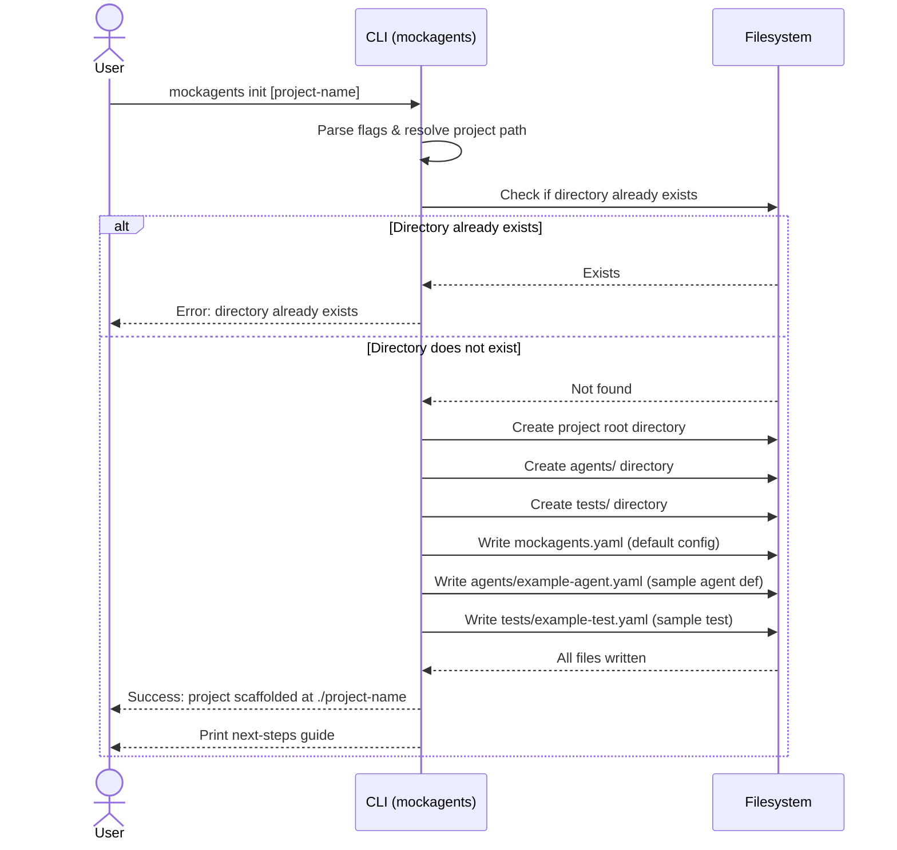

---

## 2. CLI: `mockagents start`

Loads the project configuration, validates all agent definitions, starts the HTTP mock server with protocol adapter routes, and prints the server URL.

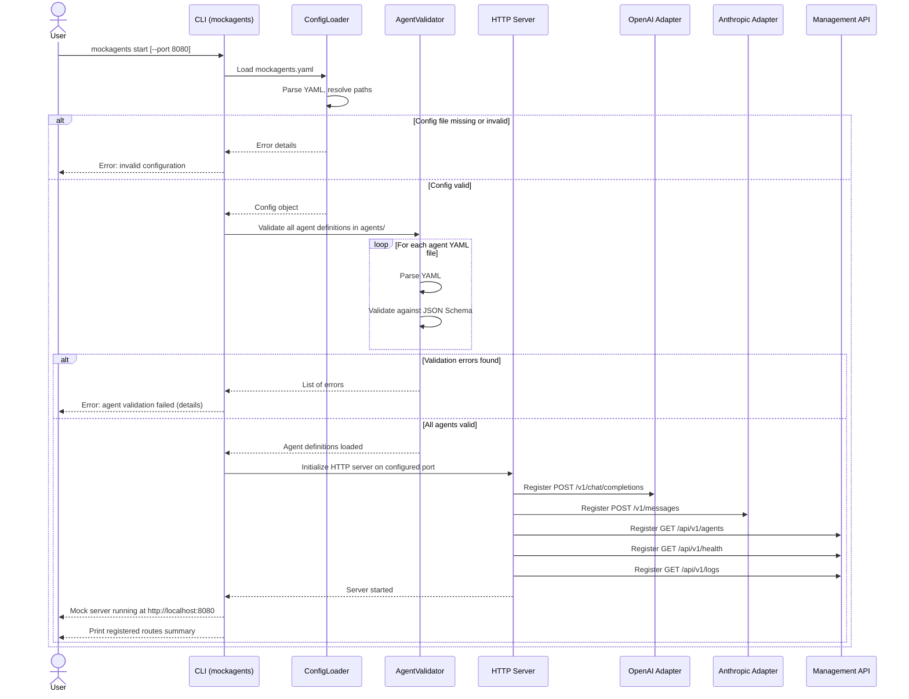

---

## 3. CLI: `mockagents validate`

Loads all agent YAML files from the project and validates them against the expected JSON Schema, reporting any errors or confirming success.

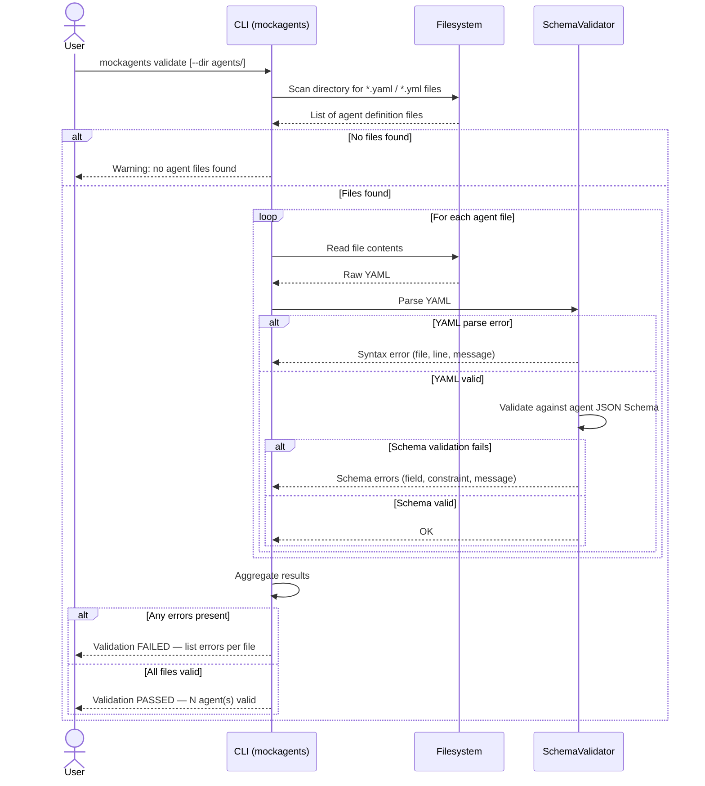

---

## 4. OpenAI Non-Streaming Request

A client application sends a standard (non-streaming) chat completion request. The mock engine matches a scenario, generates a response, optionally processes tool calls, and returns the OpenAI-format JSON.

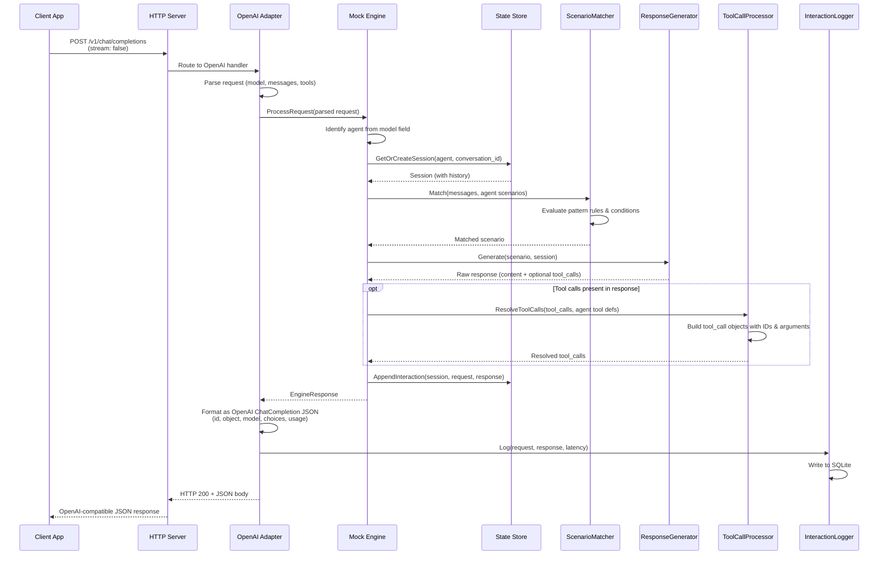

---

## 5. OpenAI Streaming Request

Same processing pipeline as non-streaming, but the response is delivered as Server-Sent Events (SSE) with chunked deltas.

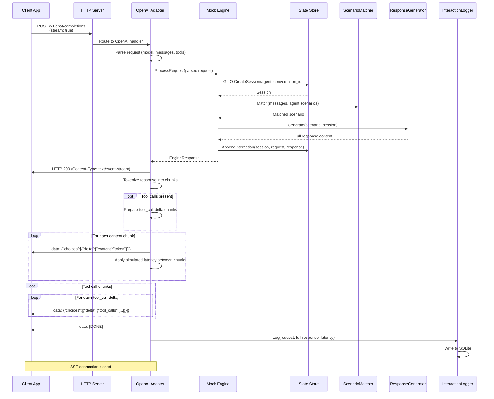

---

## 6. Anthropic Non-Streaming Request

A client sends a Messages API request. The Anthropic adapter translates between the Anthropic wire format (content blocks, tool_use blocks) and the internal engine representation.

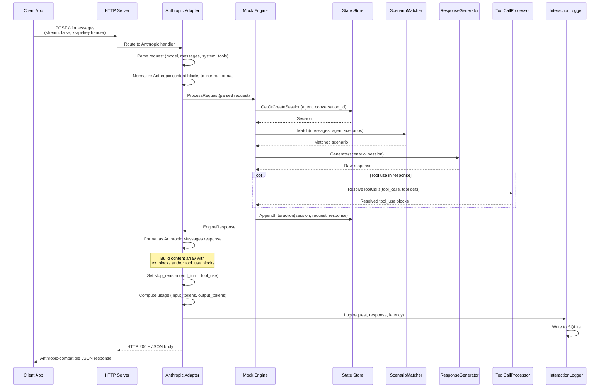

---

## 7. Anthropic Streaming Request

The Anthropic streaming protocol uses distinct SSE event types to delimit message structure, content blocks, and deltas.

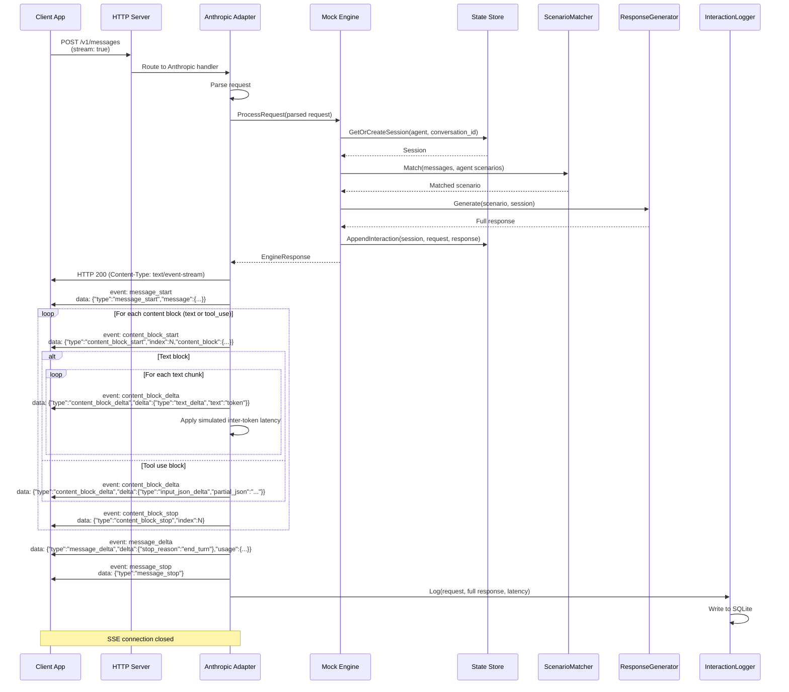

---

## 8. Tool Call Flow (Detailed)

A multi-turn conversation where the mock engine generates a tool call response, the client sends back tool results, and the engine matches a follow-up scenario to produce the final answer.

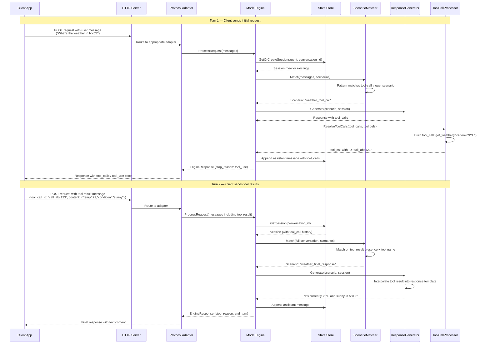

---

## 9. Python SDK: MockAgentServer Lifecycle

Test code uses the Python SDK context manager to start the Go mock server binary as a subprocess, run test scenarios, and tear down cleanly.

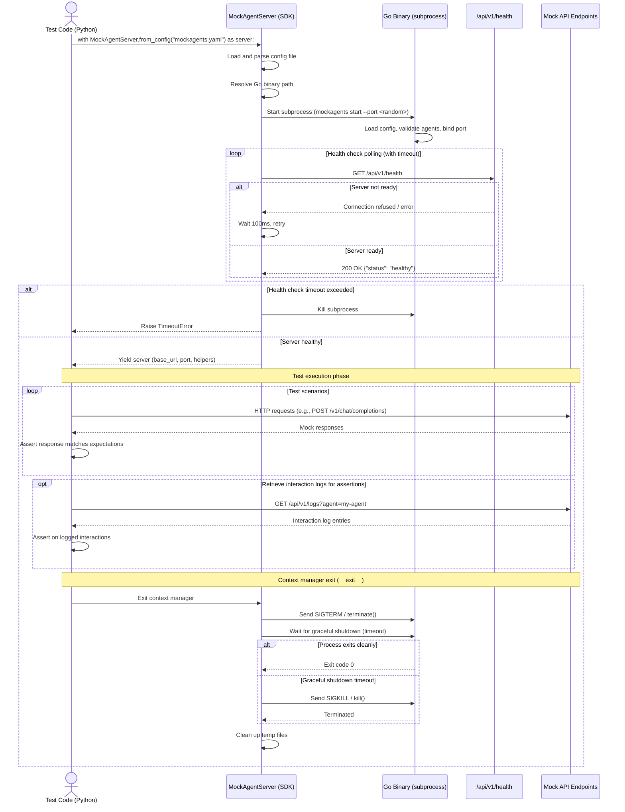

---

## 10. Management API: List Agents

A simple request to the management API that returns all currently loaded agent definitions.

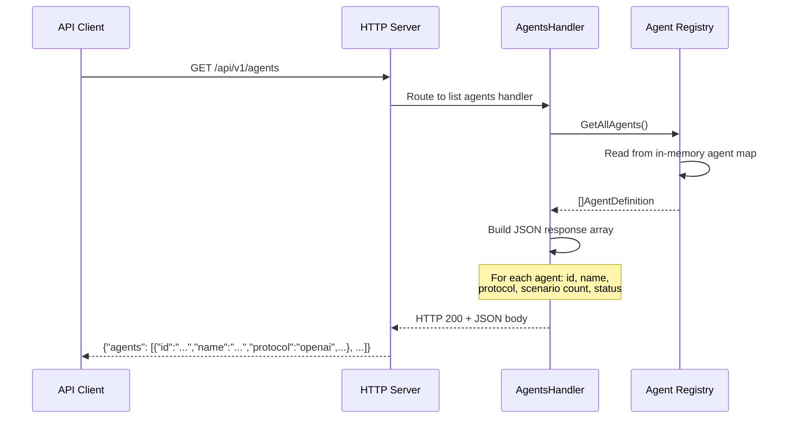

---

## 11. Management API: Get Interaction Logs

Query recorded interaction logs from the SQLite store, optionally filtered by agent name, with pagination support.

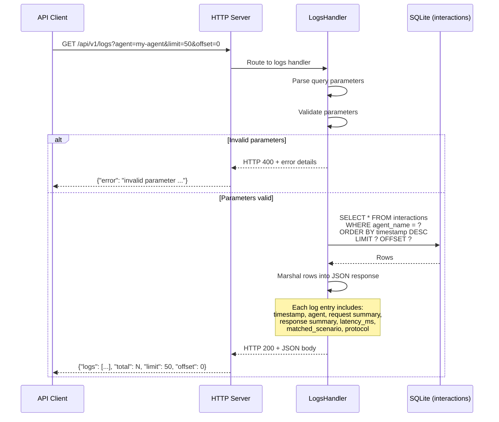

---

## 12. Multi-tenant Auth + RBAC (management route)

How an authenticated management request resolves its principal, derives a tenant
scope, and passes the role floor — with a bcrypt-skipping auth cache and an
audit `auth.denied` event on rejection.

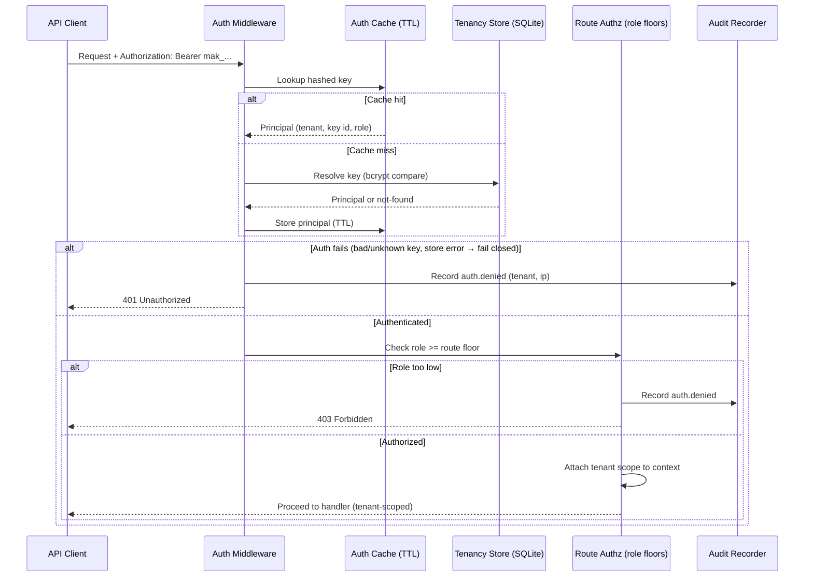

---

## 13. MCP Bidirectional — Server-initiated Sampling

A server-initiated `sampling/createMessage` request flows to a subscribed client
over SSE; the client POSTs its reply, which is routed back to the in-process
caller via `DeliverResponse`.

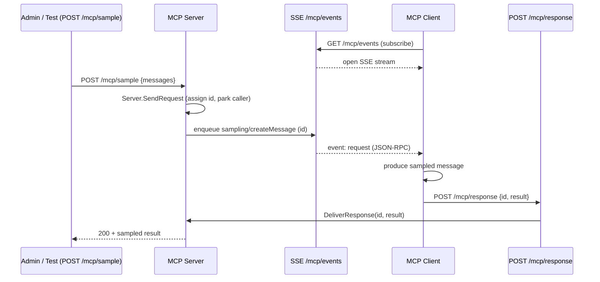

---

## 14. Real-time Log Feed (SSE)

The GUI live feed subscribes to the broadcaster; each new interaction written by
the async log worker is fanned out to all subscribers sub-second.

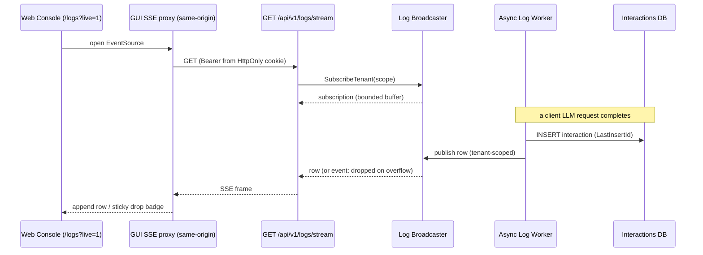

---

## 15. API-Key Rotation (in place)

`POST /api/v1/keys/{id}/rotate` regenerates a secret transactionally, preserving
id/name/role/tenant, flushing the auth cache, and emitting an audit event with
both prefixes.

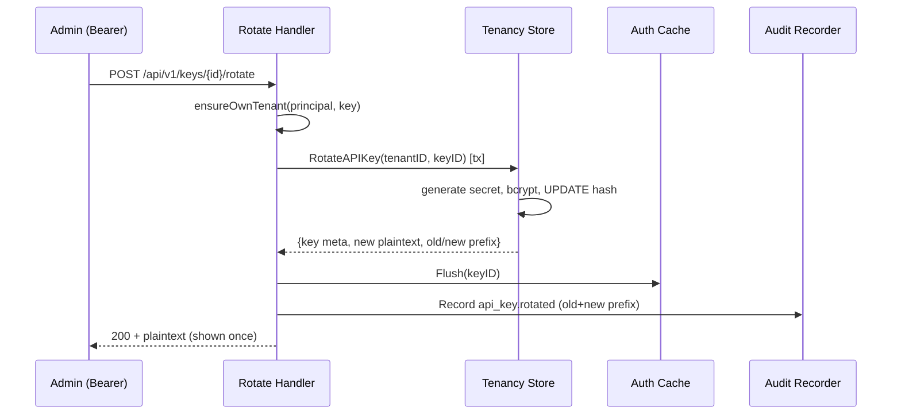
