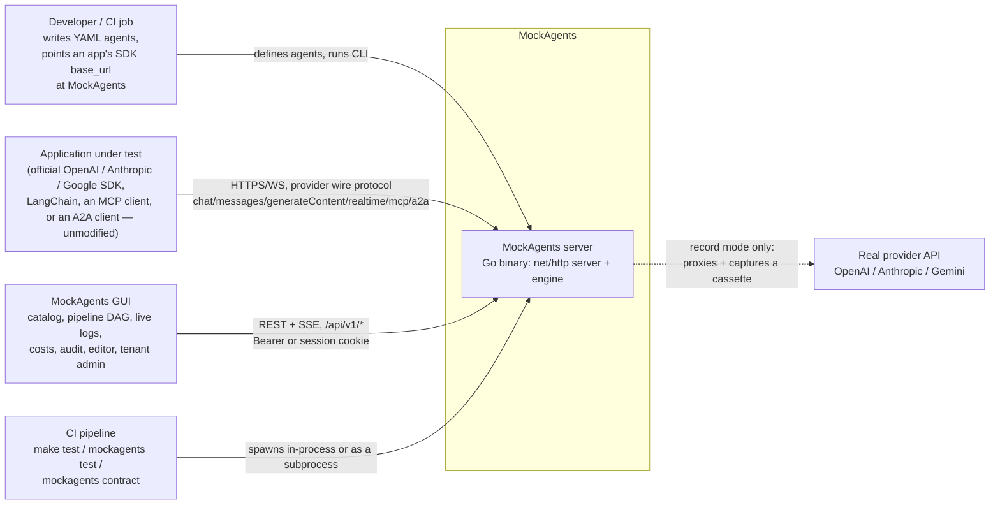
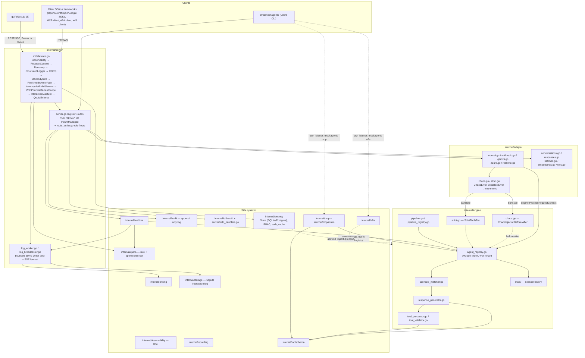
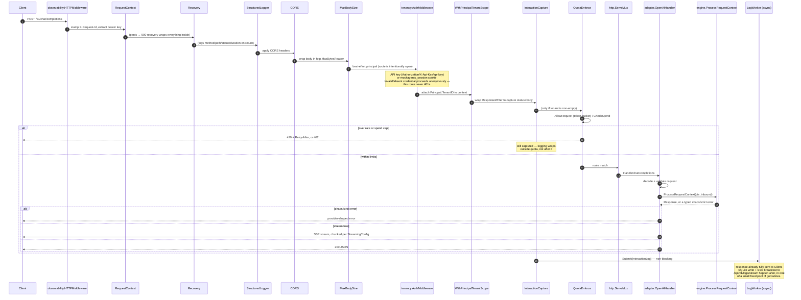
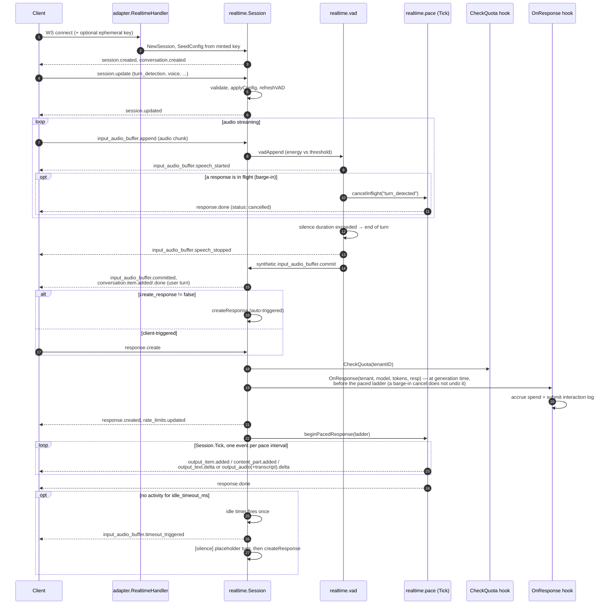
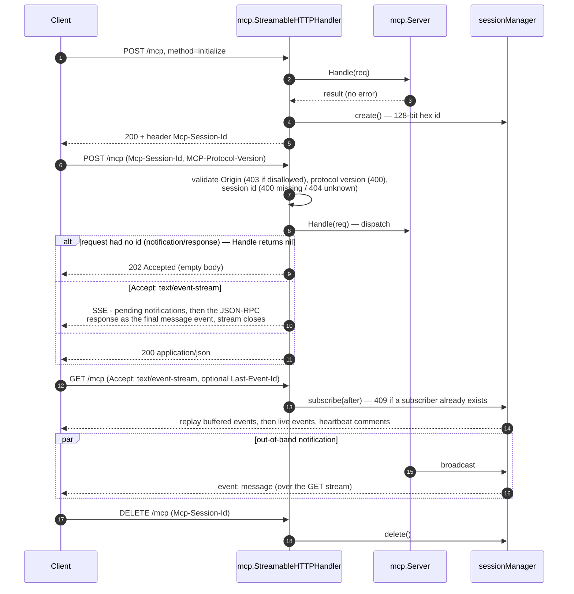
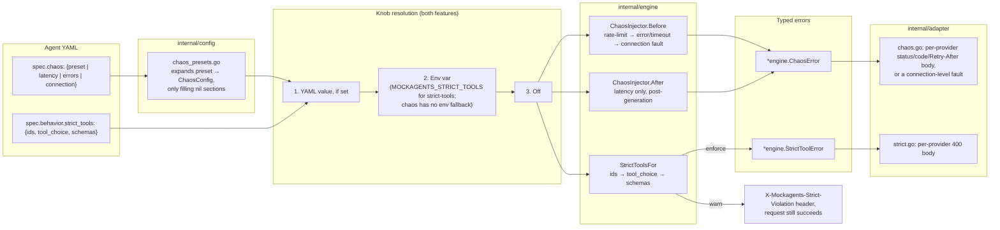
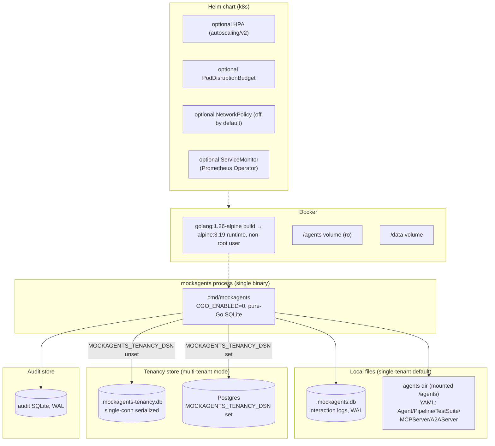

# Architecture

This page is the reference architecture for MockAgents: how the pieces fit
together, what each package owns, and the exact request path for the
features people ask about most (chat completions, Realtime, MCP). If you're
here to *use* MockAgents rather than contribute to it, the
[Quickstart](../getting-started/quickstart.md) and the [Guides](../guides/testing-agents.md)
are a better starting point — come back here when you want to understand
*why* something behaves the way it does, or when you're contributing code.

MockAgents is a Go server that impersonates several LLM-provider wire
protocols — OpenAI Chat Completions, Responses, Conversations, Embeddings,
Moderations, Files, Batches; Anthropic Messages (+ Batches); Gemini
`generateContent`; OpenAI Realtime over WebSocket; MCP (Streamable HTTP +
stdio); and A2A — in front of one protocol-neutral **engine** that matches a
request to a scenario declared in YAML and returns a canned response,
simulated tool call, or SSE stream. No network call ever reaches a real
provider unless you're using record/replay against one on purpose.

## Contents

- [System context](#system-context)
- [Containers and components](#containers-and-components)
- [Packages (`internal/`)](#packages-internal)
- [How a request becomes a response](#how-a-request-becomes-a-response)
- [Request-flow sequence: POST /v1/chat/completions](#request-flow-sequence-post-v1chatcompletions)
- [Realtime: WebSocket session with server VAD](#realtime-websocket-session-with-server-vad)
- [MCP: Streamable HTTP transport](#mcp-streamable-http-transport)
- [Cross-cutting: chaos and strict-tools](#cross-cutting-chaos-and-strict-tools)
- [Data and deployment view](#data-and-deployment-view)
- [Design rules](#design-rules)

## System context

Replay mode never contacts `realProvider` — a recorded cassette answers
instead.

The point of MockAgents is that `sdkApp` never knows it isn't talking to a
real provider: base URL and API key are the only things that change. The GUI,
CI runner, and record/replay proxy are auxiliary consumers of the same
server.

## Containers and components

**Import-direction constraints** (enforced by convention + code review, not a
linter rule):

- `tenancy` may import `engine`; `engine` never imports `tenancy`. The engine
  reads/writes the tenant id through `engine.WithTenantID` /
  `engine.TenantIDFromContext` (`internal/engine/reqmeta.go`) so it stays
  agnostic of how a caller authenticated.
- `audit.Recorder` takes a principal-extraction **function**
  (`principalToActor` in `internal/server/server.go`) instead of importing
  `tenancy` directly, for the same reason.
- `engine` never imports a wire-format package — `internal/adapter/*` and
  `internal/streaming/*` are the only packages that know what OpenAI/
  Anthropic/Gemini JSON looks like. `engine.Response` / `engine.InboundRequest`
  are the neutral boundary type.
- `internal/a2a` and `internal/mcp` are **not** registered through
  `adapter.DefaultRegistry` — they mount their own routes directly in
  `cmd/mockagents` (A2A) or run as their own process (MCP isn't wired into
  the main HTTP server; it's its own listener started by `mockagents mcp`).

## Packages (`internal/`)

| Package | Role |
|---|---|
| `adapter/` | Wire-format translators. `openai.go`, `anthropic.go`, `gemini.go`, `azure.go` convert provider JSON ↔ engine types; `conversations.go`/`responses.go`/`responses_stream.go` mock the OpenAI Conversations + Responses APIs; `batches.go`/`anthropic_batches.go` mock async batch endpoints; `embeddings.go`, `moderations.go`, `files.go`, `structured_output.go` cover the smaller surfaces; `realtime.go` bridges a WebSocket connection into `internal/realtime`. `registry.go` is the extension seam (`Adapter` interface + `DefaultRegistry`). `strict.go`/`chaos.go` translate `engine.StrictToolError`/`engine.ChaosError` into each provider's wire error shape. |
| `engine/` | The core, provider-agnostic. `engine.go`'s `ProcessRequestContext` orchestrates: chaos pre-check → strict-tools request validation → scenario match/generate/tool-loop inside a session turn → strict tool_choice forcing → tool processing → chaos post-latency (see [walkthrough](#how-a-request-becomes-a-response) below). `agent_registry.go` looks up an agent (by-model index + `*ForTenant` visibility). `scenario_matcher.go` picks a scenario, `response_generator.go` produces content. `tool_processor.go` handles simulated tool calls. `chaos.go` is the fault-injection seam. `strict.go` is the strict-tools seam. `pipeline.go`/`pipeline_registry.go` run a `kind: Pipeline` document (sequential/parallel/graph over multiple agents) as a distinct concept from a single `Agent`. |
| `toolschema/` | JSON-Schema-subset validator used to check simulated tool-call arguments against a tool's declared `inputSchema`, plus a stricter OpenAI-structured-outputs-subset checker used when an agent opts into `strict: true` function schemas. Consumed by the engine (strict-tools + tool validation) and by `internal/mcp` for `tools/call` argument validation. |
| `server/` | `net/http` server, middleware, and route handlers for the LLM + management APIs. `route_authz.go` is the single role-floor table + `mountManaged` chokepoint for every `/api/v1` route. `log_worker.go`/`log_broadcaster.go` own async logging + SSE fan-out. `quota_middleware.go` enforces per-tenant rate/spend limits. `realtime_wiring.go` wires quota + logging hooks into the Realtime adapter (which never passes through the HTTP middleware chain — see the [Realtime section](#realtime-websocket-session-with-server-vad)). |
| `tenancy/` | Multi-tenant store + bcrypt API keys + RBAC middleware. `Store` is an interface with two impls: `SQLiteStore` (default) and `PostgresStore`, selected at startup by `MOCKAGENTS_TENANCY_DSN`. `middleware.go`'s `AuthMiddleware` is dual-auth: API key (`Authorization`/`X-Api-Key`/Azure `api-key`) or session cookie (`mockagents_session`) resolve to the same `Principal`. RBAC roles are ordered `viewer < editor < admin < platform`; `platform` (cross-tenant operator) can only be minted by the CLI bootstrap path, never through the API. |
| `audit/` | Append-only audit log, SQLite-backed. Twelve event kinds covering tenant/key/agent/pipeline lifecycle plus `auth.denied`. |
| `quota/` | Per-tenant rate + monthly-spend enforcement. A token bucket handles rate (429 + `Retry-After`); spend is tracked in a shared ledger row so the monthly cap is accurate across replicas, with a 5-second local cache to avoid a store round trip per request. |
| `oidcauth/` | OIDC relying-party seam for SSO login, wrapping `coreos/go-oidc` behind a small interface so the callback handler is unit-testable with a fake provider. |
| `pricing/` | Per-model cost table + usage extractor, used for cost dashboards and quota spend accounting. |
| `mcp/` | JSON-RPC 2.0 dispatch for `kind: MCPServer` documents, with three transports: Streamable HTTP (session-scoped, POST dispatch in JSON or SSE mode, one resumable GET stream per session), stdio (line-delimited frames), and a bidirectional server-initiated channel for sampling/roots requests. See the [MCP sequence](#mcp-streamable-http-transport). |
| `mcpadmin/` | A separate concern from `mcp`'s bidirectional/sampling surface: it re-exposes the agent management write API (create/get/put/delete/validate/list agents) as MCP tools, so an MCP client can manage MockAgents' own agent catalog. |
| `realtime/` | Server-side state machine for the OpenAI Realtime mock: session/event handling, server voice-activity detection (an energy-threshold detector), and deadline-based response pacing with barge-in and idle-timeout. See the [Realtime sequence](#realtime-websocket-session-with-server-vad). |
| `a2a/` | Mocks the A2A (Agent-to-Agent) protocol for `kind: A2AServer` documents: agent-card discovery, a JSON-RPC surface (`message/send`, `message/stream`, `tasks/get`, `tasks/cancel`), and task lifecycle with real SSE streaming. |
| `recording/` | Cassette format + record/replay handlers, including SSE streams. |
| `streaming/` | SSE chunking used when a chat/messages request sets `stream: true`. Supports a deterministic fixed-seed pacing model (TTFT + tokens-per-sec + jitter) and, when an agent sets `ttft_p50_ms`/`itl_p50_ms`, a per-stream-seeded lognormal "load-target" sampler, plus mid-stream fault injection. |
| `storage/` | SQLite interaction logging (pure-Go, no cgo). Default DB file `.mockagents.db`. `MOCKAGENTS_LOG_BODIES` controls response-body capture depth; `MOCKAGENTS_LOG_MAX_ROWS` bounds the table via a background pruner. |
| `config/` | YAML/JSON loader + validator. Splits a directory's files by top-level `kind` into `Agent`, `Pipeline`, `TestSuite`, `MCPServer`, `A2AServer` documents. `chaos_presets.go` expands a named `chaos.preset` into a `ChaosConfig`. The schema lives at `schema/mockagents-v1-agent.json`. |
| `types/` | Domain types shared across packages. Changes here ripple widely. |

Outside `internal/`: `cmd/mockagents/` (Cobra CLI), `gui/` (Next.js console),
`sdk/{python,typescript,go}/`, `deploy/` (Helm chart + GitHub/GitLab CI
templates).

## How a request becomes a response

This is the real call order inside `engine.Engine.ProcessRequestContext`,
which every protocol adapter calls after translating its wire request into
an `engine.InboundRequest`:

1. Start a tracing span if enabled.
2. Resolve the agent for the caller's tenant (name → model → single-agent
   fallback for anonymous callers).
3. Cheap context-cancellation bail-out before doing any real work.
4. **Chaos pre-check**: rate-limit check, then HTTP-error/timeout injection,
   then a connection-layer fault, in that order — any of these can return
   early, before matching or generation ever run.
5. Extract the latest user message; reject an empty turn (tolerant of a turn
   that's purely a tool result).
6. **Strict-tools request validation**: round-trip tool-call-id validation,
   then `tool_choice` name validation, then per-function strict JSON-schema
   validation. In enforce mode, a violation returns an error immediately; in
   warn mode it's collected and the request proceeds.
7. The session runs the turn: scenario match → generate content → tool-loop
   convergence guard (drops an identical tool call re-issued after its
   result — this is what makes the simulated agent loop actually terminate)
   → `tool_choice: "none"` suppression → strict tool_choice forcing → tool
   call resolution.
8. Any collected strict-tools warnings are attached to the response.
9. **Chaos post-latency**: sleeps for the configured latency distribution —
   only *after* all real work, including tool processing, is done.

The adapter then translates the response (or a typed chaos/strict error)
back to the wire shape, decides JSON vs SSE from `stream: true`, and —
outside all of that — the server asynchronously logs the interaction.

## Request-flow sequence: POST /v1/chat/completions

Two things worth calling out because they contradict a plausible-sounding
assumption:

- **Management routes are gated differently than LLM routes.** `/api/v1/*`
  routes require a valid credential plus a per-route role floor. The LLM
  routes (`/v1/chat/completions`, `/v1/messages`, `/v1/realtime`, etc.) are
  intentionally open even in multi-tenant mode — the middleware still
  resolves a principal if a valid credential is present (so tenant-scoped
  agent resolution and quota still work), but it never rejects the request
  for lacking one, because these routes carry the caller's own (ignored)
  provider API key.
- **Middleware order is auth → tenant-scope → capture → quota**, not
  "auth → quota → logging → capture" — capture wraps *outside* quota
  deliberately, so a request rejected by quota (429/402) is still logged.

## Realtime: WebSocket session with server VAD

Notes worth knowing if you're building against this:

- The VAD is a **synchronous energy-threshold detector**, not a real
  acoustic model. `semantic_vad`'s `eagerness` is approximated by mapping to
  a fixed silence window rather than any semantic understanding of speech.
- **Barge-in** (the model gets interrupted mid-response) and **client-
  initiated cancel** both funnel through the same cancellation path, with a
  different reason that changes what happens to a queued auto-response.
- **Pacing here is a flat constant-interval drain**, not the TTFT/ITL
  lognormal model used by `streaming/pacing.go` for chat/messages SSE.
  Unifying the two is an open follow-on, not a hidden feature.
- **Ephemeral keys are cosmetic.** Minting one validates the session payload
  shape, but the WebSocket itself never actually requires a valid key to
  connect. Keep that in mind if you're testing auth-failure handling.
- Quota and logging integrate through **hooks on the adapter**, not the HTTP
  middleware chain — a long-lived WebSocket never passes back through the
  same per-message capture/quota path a normal request does.

## MCP: Streamable HTTP transport

Bidirectional (server → client) requests are a **separate mechanism** from
the notification stream above: the server can mint a numeric id, enqueue an
outbound request to the session's single SSE subscriber over `GET
/mcp/events`, and block until `POST /mcp/response` delivers a matching
reply. This backs sampling (`sampling/createMessage`) and roots
(`roots/list`) requests initiated by the mock server itself — it is
unrelated to the `internal/mcpadmin` package, which instead exposes
MockAgents' own agent-management CRUD as MCP tools. stdio is line-delimited
JSON-RPC over stdin/stdout with a frame size cap; by construction it writes
nothing but JSON-RPC response/notification frames to stdout.

## Cross-cutting: chaos and strict-tools

Chaos presets (`server-down`, `rate-limited`, `access-denied`,
`unauthorized`, `flaky`, `slow`, `connection-reset`) only fill config fields
the author left unset, so an explicit override in the YAML always wins over
the preset's defaults. `flaky` uses a fail-first-N-then-recover pattern —
useful for testing retry logic without randomness. Strict-tools has three
independently-togglable dimensions (round-trip tool IDs, `tool_choice`
enforcement, and per-function JSON-schema strictness); each can be forced
off in YAML even when the top-level knob is on.

## Data and deployment view

Single-tenant mode (the default) needs no external services: agent YAML is
read from disk, interaction logs go to `.mockagents.db`. Multi-tenant mode
adds the tenancy store — SQLite by default, or Postgres when configured —
plus, optionally, an audit store and a quota enforcer backed by the same
tenancy store. Nothing here requires cgo; that's what keeps the Alpine
multi-stage Docker image and cross-compiled release binaries simple.

## Design rules

- **No cgo.** SQLite is `modernc.org/sqlite` so cross-compilation stays
  simple. (Side effect: `go test -race` is unavailable on all platforms.)
- **Import direction.** `tenancy` may import `engine`, never the reverse.
  This keeps the engine cycle-free and provider/tenant-agnostic.
- **One authorization chokepoint.** Every `/api/v1` management route goes
  through a single role-floor table that panics at startup on a route with
  no entry — an ungated route can't slip in.
- **The LLM/engine surface is intentionally open**, even in multi-tenant
  mode — see the [request-flow notes](#request-flow-sequence-post-v1chatcompletions)
  above. That's a different gate from the management-API role floors.
- **The agent YAML schema is authoritative** — see the
  [YAML Schema guide](../guides/yaml-schema.md) and the
  [Agent Definition reference](agent-definition.md).
